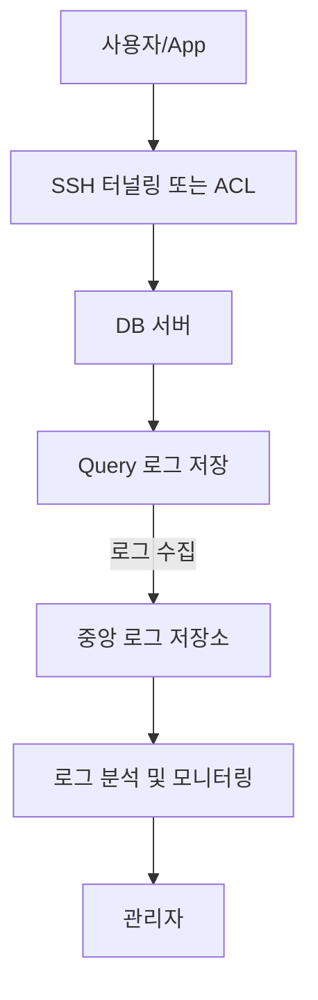

📖 자체적으로 Proxy 형 DB 접근 통제 솔루션과 유사한 기능을 간소화하여 직접 구현하는 방법 설명


<!--more-->

---

### 1. 목표

Proxy 솔루션을 도입하지 않고 자체적으로 다음과 같은 기능을 구현하여 Proxy 형 DB 접근 통제 솔루션과 유사한 보안 효과를 달성합니다.

- DB 접근 제어 및 인증
- DB Query 로깅
- 이상 징후 탐지 및 분석

---

### 2. 간소화된 구현 방안

다음 방법으로 간소화하여 구현할 수 있습니다.

#### 📌 (1) DB 접근 제어

- **SSH를 통한 접근 통제**

  - DB 접근을 허용된 사용자만 SSH 터널링으로 제한합니다.

- **IP 기반 접근 제어 (ACL)**

  - 방화벽(iptables, firewalld)을 통해 특정 IP만 DB 접근을 허용합니다.

```bash
# 방화벽 예시
iptables -A INPUT -p tcp -s 허용_IP --dport 3306 -j ACCEPT
iptables -A INPUT -p tcp --dport 3306 -j DROP
```

#### ✅ 효과

- DB 접근 자체를 엄격히 제한하여 보안을 높일 수 있습니다.

---

### 📌 (2) DB 자체의 Query 로깅

- DB 서버 자체 기능을 활용하여 Query 로깅을 활성화합니다.

#### MySQL 예시:

```ini
[mysqld]
general_log = ON
general_log_file = /var/log/mysql/query.log
log_output = FILE
```

- PostgreSQL의 경우:

```conf
log_statement = 'all'
logging_collector = on
log_directory = 'pg_log'
```

#### ✅ 효과

- 모든 SQL 쿼리 기록을 확보할 수 있습니다.

---

### 📌 (3) 로그 분석 및 이상 징후 탐지

수집된 Query 로그를 중앙 로그 저장소에 전송하여 이상 징후를 분석하고 관리자에게 알림을 보냅니다.

- 오픈소스 (ELK, OpenSearch 등)를 활용하여 구현 가능합니다.
  - Filebeat → Elasticsearch(OpenSearch) → Kibana를 이용한 분석 및 시각화
  - 위험 패턴(대량 조회, 위험 SQL 구문 등)을 탐지하여 알림 발송

#### ✅ 효과

- 공격이나 이상행위를 조기에 발견하고 대응할 수 있습니다.

---

### 📌 (4) 추천 구성도



---

### 📌 결론

Proxy 서버는 필수가 아닙니다. 위와 같은 방법으로 간소화된 형태의 DB 접근 제어 및 보안 관리 구성을 현실적으로 자체 구현할 수 있습니다. 또한 오픈소스 기반으로 경제적이고 효율적인 보안 시스템을 구축할 수 있습니다.
