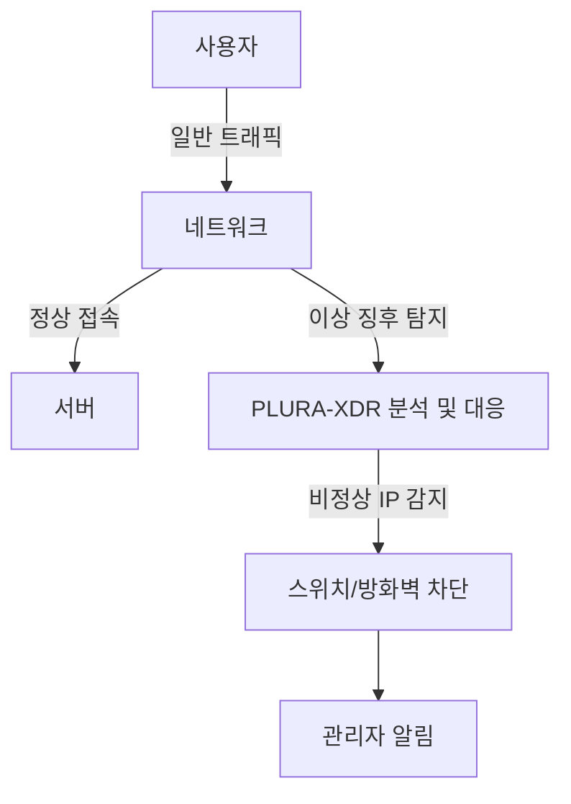

📖 **NAC(Network Access Control) 솔루션 도입이 필요한가? 현실적인 검토**

> 목표: "정보보안에서는 **선제적 대응이 필수적**입니다. 하지만 **과도한 선제적 대응이 오히려 중요한 보안 위협을 간과**하게 만들 수도 있습니다. 본 글에서는 NAC 도입을 통한 선제적 IP 관리 방식이 반드시 필요한지 검토하고, 보다 현실적이고 효율적인 대안적 접근 방안을 제시합니다."


<!--more-->

---

## 1. 기존 NAC 도입의 문제점

NAC(Network Access Control) 솔루션은 네트워크 접근을 사전에 제어하여 관리적인 용도로 제안된 시스템입니다. 하지만, 현실적으로 다음과 같은 문제점이 발생합니다: 

### ❌ **높은 초기 도입 비용 및 운영 부담**
- 전용 장비 및 라이선스 구매 비용 발생
- 지속적인 관리 및 유지보수 인력 필요
- 기업 환경 변화에 따라 지속적인 정책 업데이트 요구

### ❌ **불필요한 과잉 관리**
- 모든 IP 주소를 미리 관리해야 하는 부담
- 위험 가능성이 낮은 IP까지 사전 등록해야 하는 불필요한 절차 발생
- 정상적인 사용자도 인증 과정에서 불편을 겪을 수 있음

### ❌ **불확실한 보안 효과**
- IP 사전 등록만으로 보안이 완벽히 보장되지 않음
- 내부 사용자 또는 공격자가 우회할 가능성 존재
- 이상 징후 탐지 및 대응이 별도로 필요

### ❌ **추가 소프트웨어 설치 부담**
- NAC 솔루션을 사용하려면 각 호스트에 에이전트 소프트웨어를 설치해야 함
- 기존 시스템과의 충돌 가능성이 존재
- 사용자 디바이스에 추가적인 부담을 줄 수 있음

---

## 2. 현실적인 대안: NAC 없이 보안 최적화하기

### 📌 **(1) 필요할 때만 IP 관리 (사전 등록 방식 배제)**
NAC를 사용하면 모든 IP 주소를 미리 등록해야 하지만, 이는 불필요한 관리 부담을 초래합니다. 대신, 문제가 발생한 후 해당 IP 주소를 네트워크에서 격리하고 대응하는 방식이 보다 현실적입니다.

#### ✅ **대안: 이상 징후 탐지 후 대응하는 방식 적용**
- **EDR 기반 이상 행위 탐지**: 특정 IP에서 비정상적인 로그인 시도나 공격이 감지되면 자동 대응
- **스위치 기반 네트워크 차단**: 사전 등록 없이도 문제 발생 시 IP 차단
- **이벤트 기반 관리**: 문제가 발생하지 않았다면 굳이 사전 등록하지 않음

---

### 📌 **(2) 스위치 기반 IP 격리 및 차단**
NAC 대신 스위치 및 방화벽을 활용하여 보안을 강화하는 방법을 적용할 수 있습니다.

#### 🔹 **방법 1: 네트워크 스위치에서 직접 IP 차단**

```bash
# 특정 IP를 네트워크에서 차단 (Cisco 예제)
conf t
access-list 101 deny ip 192.168.1.100 0.0.0.255 any
```

#### 🔹 **방법 2: 방화벽(iptables)에서 이상 IP 차단**

```bash
# iptables를 사용한 특정 IP 차단
iptables -A INPUT -s 192.168.1.100 -j DROP
```

#### ✅ **효과**
- **불필요한 IP 사전 등록 없이도** 보안 유지 가능
- **NAC보다 비용 효율적이며 유사한 보안 효과 제공**
- 실시간 대응 가능 (공격 감지 시 즉시 격리)

---

### 📌 **(3) PLURA-XDR을 활용한 이상 징후 탐지 및 자동 차단**
PLURA-XDR을 이용하면 네트워크 이상 행위를 실시간으로 탐지하고, 이상 징후가 발생한 IP를 자동으로 차단할 수 있습니다.

#### 🔹 **PLURA-XDR을 활용한 자동 대응**
- **로그 데이터를 실시간으로 분석하여 비정상적인 로그인 시도 및 공격 탐지**
- **크리덴셜 스터핑, SQL 인젝션 등 다양한 공격 패턴을 실시간 감지하고 자동 차단**
- **위험한 IP를 즉시 격리하고 관리자에게 경고 알림 발송**

#### ✅ **효과**
- 별도의 NAC 솔루션 없이도 실시간 네트워크 보안 유지 가능
- 필요할 때만 IP 차단을 수행하여 관리 부담 최소화
- 네트워크 이상 행위, 비정상적인 인증 시도 및 공격을 자동 탐지 및 차단

---

## 3. 추천 구성도




---

## 📌 결론

NAC는 보안 강화보다는 시스템 관리 편의성을 위해 도입된 기술입니다. 하지만 현재의 정보보안 관리 체계에서는 **불필요한 요소로 작용할 가능성이 높으며, 제거하는 것이 더욱 바람직합니다.**

☑️ NAC는 높은 비용과 관리 부담이 따릅니다.  
☑️ 모든 IP를 사전 등록하는 방식은 비효율적입니다.  
☑️ PLURA-XDR을 활용하면 실시간 이상 징후 탐지 및 대응이 가능합니다.  
☑️ 추가 소프트웨어 설치 부담 없이 보안 운영 가능  

---

💡 **대안적 접근 방식:**
- **IP 기반 접근 제어를 최소화**하고 필요할 때만 차단
- **PLURA-XDR을 활용하여 네트워크 이상 행위 자동 탐지 및 차단**
- **스위치를 통한 격리 및 네트워크 차단** 방식 적용

🚀 **비싼 NAC 장비 없이도, PLURA-XDR을 활용해 보안 최적화는 가능합니다!**

### 📖 **함께 읽기**
- [정보보안 제품 선택 체크리스트](https://blog.plura.io/ko/column/security_product_checklist/)
- [NAC(Network Access Control) 도입 자가 진단하기](https://blog.plura.io/ko/tech/nac_evaluation_self_checklist/)
