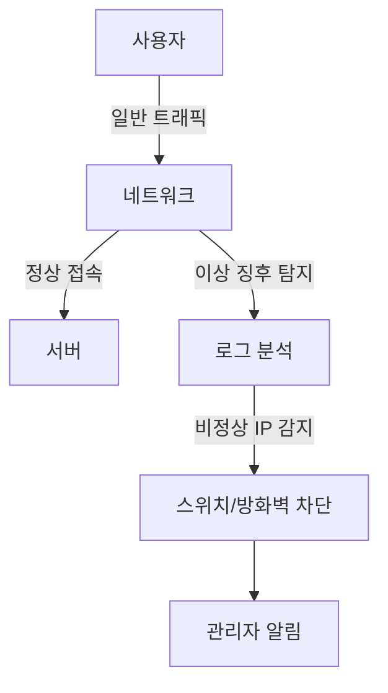

📖 **NAC(Network Access Control) 솔루션 도입이 필요한가? 현실적인 검토**

> 목표: "NAC 도입을 통한 선제적 IP 관리 방식이 반드시 필요한지, 대안적인 접근이 가능한지 검토한다."


<!--more-->

---

## 1. 기존 NAC 도입의 문제점

NAC(Network Access Control) 솔루션은 네트워크 접근을 사전에 제어하여 보안을 강화하는 시스템입니다. 하지만, 현실적으로 다음과 같은 문제점이 발생합니다:

### ❌ **높은 초기 도입 비용 및 운영 부담**
- 전용 장비 및 라이선스 구매 비용 발생
- 지속적인 관리 및 유지보수 인력 필요
- 기업 환경 변화에 따라 지속적인 정책 업데이트 요구

### ❌ **불필요한 과잉 관리**
- 모든 IP 주소를 미리 관리해야 하는 부담
- 문제 발생 가능성이 낮은 IP까지 사전 등록 필요
- 정상적인 사용자도 인증 과정에서 불편을 겪을 가능성

### ❌ **불확실한 보안 효과**
- IP 사전 등록만으로 보안이 완벽히 보장되지 않음
- 내부 사용자 또는 공격자가 우회할 가능성 존재
- 이상 징후 탐지 및 대응이 별도로 필요

---

## 2. 현실적인 대안: NAC 없이 보안 최적화하기

### 📌 **(1) 필요할 때만 IP 관리 (사전 등록 방식 배제)**
NAC를 사용하면 모든 IP 주소를 미리 등록해야 하지만, 이는 불필요한 관리 부담을 초래합니다. 대신, 문제가 발생한 후 해당 IP 주소를 네트워크에서 격리하고 대응하는 방식이 보다 현실적입니다.

#### ✅ **대안: 이상 징후 탐지 후 대응하는 방식 적용**
- **네트워크 이상 행위 탐지**: 특정 IP에서 비정상적인 트래픽이 감지되면 자동 대응
- **스위치 기반 네트워크 차단**: 사전 등록 없이도 문제 발생 시 IP 차단
- **이벤트 기반 관리**: 문제가 발생하지 않았다면 굳이 사전 등록하지 않음

---

### 📌 **(2) 스위치 기반 IP 격리 및 차단**
NAC 대신 스위치 및 방화벽을 활용하여 보안을 강화하는 방법을 적용할 수 있습니다.

#### 🔹 **방법 1: 네트워크 스위치에서 직접 IP 차단**

```bash
# 특정 IP를 네트워크에서 차단 (Cisco 예제)
conf t
access-list 101 deny ip 192.168.1.100 0.0.0.255 any
```

#### 🔹 **방법 2: 방화벽(iptables)에서 이상 IP 차단**

```bash
# iptables를 사용한 특정 IP 차단
iptables -A INPUT -s 192.168.1.100 -j DROP
```

#### ✅ **효과**
- 불필요한 IP 사전 등록 없이도 보안 유지 가능
- NAC 대비 낮은 비용으로 유사한 보안 효과 제공
- 실시간 대응 가능 (공격 감지 시 즉시 격리)

---

### 📌 **(3) 이상 징후 탐지를 통한 자동 차단**

#### 🔹 **방법 1: ELK/OpenSearch 기반 이상 탐지**
- 로그 데이터를 수집하여 특정 IP에서 이상 징후 탐지 시 네트워크 차단
- 예: 대량 인증 실패, 비정상적인 트래픽 증가 감지

#### 🔹 **방법 2: WAF/IDS와 연동하여 탐지 후 차단**
- WAF 또는 IDS에서 특정 IP의 이상 행위를 감지하면 차단 명령 실행
- 예: 크리덴셜 스터핑, SQL 인젝션 등의 패턴 탐지 후 네트워크 차단

#### ✅ **효과**
- 필요할 때만 IP 차단을 수행하여 관리 부담 최소화
- 실시간 이상 행위 감지 및 대응 가능
- NAC 대비 운영 비용 절감

---

## 3. 추천 구성도



---

## 📌 결론

**NAC 도입이 반드시 필요할까요?**

✔ NAC는 높은 비용과 관리 부담이 따릅니다.  
✔ 모든 IP를 사전 등록하는 방식은 비효율적입니다.  
✔ 실시간 이상 징후 탐지 및 대응 방식으로도 충분한 보안 효과를 달성할 수 있습니다.  

💡 **대안적 접근 방식:**
- **IP 기반 접근 제어를 최소화**하고 필요할 때만 차단
- **스위치를 통한 격리 및 네트워크 차단** 방식 적용
- **이상 징후 탐지 후 자동 차단**으로 효율적인 보안 유지

🚀 **비싼 NAC 장비 없이도, 보안 최적화는 가능합니다!**
