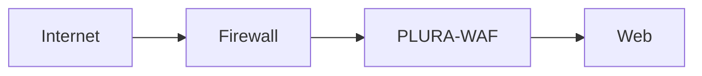
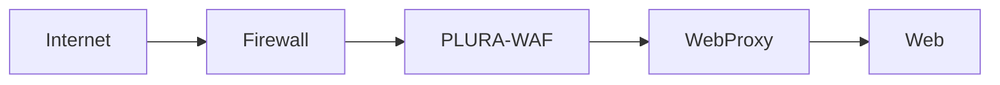
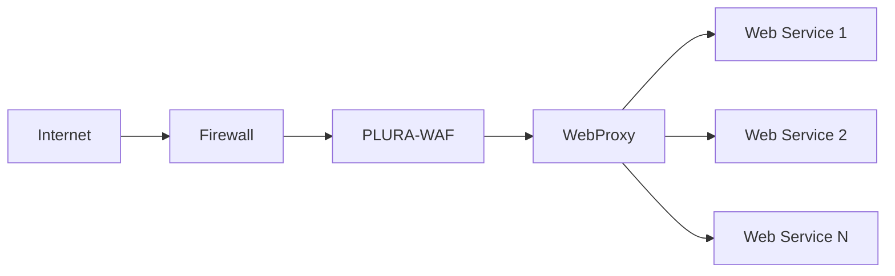
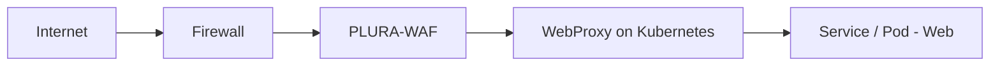
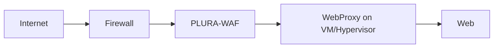

PLURA-WAF는 단순히 웹 요청을 차단하는 장비형 웹방화벽 관점에 머무르지 않습니다.

실제 운영 환경에서는 웹 서비스 앞단에서 공격을 탐지하고 차단하는 것만으로는 충분하지 않을 때가 많습니다.  
서비스 구조가 복잡해지고, 애플리케이션 배포 단위가 세분화되며, 멀티 서버·멀티 노드·클라우드 네이티브 환경으로 확장될수록 **트래픽을 어디서 받아서, 어떻게 넘기고, 어디에서 제어할 것인가**가 더 중요해집니다.

이때 유용한 방식이 바로 **PLURA-WAF 뒤에 WebProxy를 두고, 최종 Web 서비스가 반드시 그 경로를 거치도록 구성하는 방식**입니다.

이 글에서는 다음 두 가지 구성을 비교합니다.

1. 현재 일반적인 구성  
   **방화벽 → 웹방화벽 → Web**

2. WebProxy를 경유하는 확장 구성  
   **방화벽 → 웹방화벽 → WebProxy → Web**

핵심은 단순합니다.  
외부에서 들어오는 모든 웹 트래픽이 **PLURA-WAF를 통과한 뒤**, 내부에서 다시 **WebProxy를 경유하여 Web으로 전달되도록 강제**하는 것입니다.

---

## 1. 현재 구성: 방화벽 → 웹방화벽 → Web

가장 기본적인 형태는 다음과 같습니다.

이 구조는 이해하기 쉽고, 구성도 단순합니다.  
방화벽이 네트워크 레벨의 1차 통제를 담당하고, PLURA-WAF가 HTTP/HTTPS 트래픽에 대한 탐지·차단을 수행한 뒤, 최종적으로 Web 서버가 요청을 처리합니다.

이 방식은 다음과 같은 환경에서 널리 사용됩니다.

* 단일 웹 서버 또는 소수의 웹 서버를 운영하는 환경
* 비교적 단순한 온프레미스 서비스 구조
* 앞단 보안 장비와 뒤단 웹 서버의 역할이 명확히 분리된 환경

하지만 운영 환경이 커질수록 몇 가지 한계가 드러납니다.

### 현재 구성의 한계

첫째, **웹 서비스 전달 경로를 더 세밀하게 통제하기 어렵습니다.**  
PLURA-WAF 뒤에 바로 Web 서버가 위치하면, 애플리케이션 라우팅, 서비스 분리, 버전 전환, 트래픽 분산, 내부 서비스 연결 같은 운영 요구를 유연하게 수용하기 어려울 수 있습니다.

둘째, **애플리케이션 계층의 운영 정책을 별도로 분리하기 어렵습니다.**  
보안은 WAF가 맡고, 서비스 전달은 Web이 직접 처리하는 구조에서는 운영 정책과 보안 정책이 서로 긴밀히 얽히기 쉽습니다.

셋째, **클라우드 네이티브 환경과의 궁합이 떨어질 수 있습니다.**  
쿠버네티스나 가상화 환경에서는 서비스 엔드포인트가 유동적이고, 배포 단위도 더 세밀합니다. 이 경우 Web 앞단에 Proxy 계층을 두는 것이 일반적으로 더 유연합니다.

---

## 2. 확장 구성: 방화벽 → 웹방화벽 → WebProxy → Web

이제 PLURA-WAF 뒤에 WebProxy를 두는 구조를 보겠습니다.

이 구조의 핵심은 다음과 같습니다.

* 외부 트래픽은 먼저 **방화벽**을 통과합니다.
* 웹 공격에 대한 탐지·차단은 **PLURA-WAF**가 담당합니다.
* 정상 처리 대상 트래픽은 **WebProxy**로 전달됩니다.
* WebProxy가 실제 **Web 서비스**로 전달합니다.

즉, PLURA-WAF는 **보안 통제의 중심**이 되고, WebProxy는 **서비스 전달과 내부 라우팅의 중심**이 됩니다.

이렇게 역할을 나누면 구조가 훨씬 명확해집니다.

| 계층        | 역할                    |
| --------- | --------------------- |
| 방화벽       | 네트워크 단위 접근 통제         |
| PLURA-WAF | 웹 공격 탐지, 차단, 정책 집행    |
| WebProxy  | 내부 서비스 라우팅, 분산, 전달 제어 |
| Web       | 실제 애플리케이션 처리          |

---

## 3. 왜 WebProxy를 추가하는가

WebProxy를 추가하는 이유는 단순히 서버를 하나 더 넣기 위해서가 아닙니다.  
핵심은 **보안 계층과 서비스 전달 계층을 분리**하는 데 있습니다.

### 3-1. 서비스 경로를 더 명확하게 통제할 수 있습니다

PLURA-WAF 뒤에 WebProxy를 두면, 최종 Web 서비스는 외부와 직접 연결되지 않고 항상 Proxy를 통해서만 접근하게 할 수 있습니다.

이 구조는 다음과 같은 운영 원칙을 만들기 쉽습니다.

* 외부 공개 진입점은 PLURA-WAF로 일원화
* 내부 전달 경로는 WebProxy로 표준화
* 실제 Web 서비스는 직접 노출하지 않음

이렇게 하면 서비스 운영자는 WebProxy 계층에서 애플리케이션 전달 정책을 관리하고, 보안 운영자는 PLURA-WAF 계층에서 탐지·차단 정책을 관리할 수 있습니다.

### 3-2. 확장성과 운영 유연성이 좋아집니다

WebProxy는 다음과 같은 목적에 유용합니다.

* 여러 Web 서버 또는 여러 서비스로 분산
* URL 경로 기반 라우팅
* 버전 전환 및 점진적 배포
* 내부 서비스 구조 변경 시 외부 구조 유지
* TLS 종료 이후 내부 전달 정책 분리

즉, PLURA-WAF가 “막는 역할”에 집중하고, WebProxy가 “보내는 역할”에 집중하게 됩니다.

### 3-3. 클라우드 네이티브 환경에 더 적합합니다

오늘날 Web 서비스는 단일 서버보다 다음과 같은 형태가 더 많습니다.

* 컨테이너 기반 애플리케이션
* 쿠버네티스 Ingress/Service 기반 구조
* VM 단위의 가상화 운영
* 서비스별 독립 배포 구조

이런 환경에서는 Web 앞단에 Proxy 계층이 있는 편이 훨씬 자연스럽습니다.

---

## 4. 권장 구조: Web은 반드시 WebProxy를 거치도록

중요한 점은 단순히 WebProxy를 넣는 것이 아니라,  
**Web 서비스가 반드시 WebProxy를 통해서만 연결되도록 구성하는 것**입니다.

즉, 다음 원칙이 중요합니다.

* 외부 사용자는 Web에 직접 접근하지 않음
* PLURA-WAF 뒤에는 WebProxy만 위치
* Web 서버는 WebProxy만 신뢰
* 내부 네트워크 정책도 WebProxy 중심으로 정리

이를 그림으로 표현하면 다음과 같습니다.

이 구조는 특히 서비스가 여러 개로 나뉘는 경우 더 효과적입니다.

* 하나의 PLURA-WAF 뒤에서
* 하나의 WebProxy가
* 여러 Web 서비스를 일관된 방식으로 연결

이렇게 하면 외부 공개 구조는 단순하게 유지하면서, 내부 서비스 구조는 훨씬 유연하게 바꿀 수 있습니다.

---

## 5. WebProxy는 어떤 환경에서 동작하면 되는가

이 구성에서 WebProxy는 반드시 전용 물리 장비일 필요는 없습니다.  
실무적으로는 다음 두 환경에서 동작하면 충분합니다.

### 5-1. 쿠버네티스(Kubernetes) 환경

WebProxy는 쿠버네티스 환경에서 동작할 수 있습니다.

예를 들어 다음과 같은 방식이 가능합니다.

* Ingress Controller 형태
* 별도 Reverse Proxy Pod 형태
* Service 앞단 Proxy 계층 형태

이 경우 PLURA-WAF가 외부 공격을 통제하고, 그 뒤에서 쿠버네티스 기반 WebProxy가 실제 서비스 Pod로 전달하는 구조가 됩니다.

이 방식의 장점은 명확합니다.

* 애플리케이션 확장에 유연
* 서비스 변경 시 Proxy 정책으로 대응 가능
* 쿠버네티스의 배포 구조와 자연스럽게 결합 가능

### 5-2. Hypervisor 환경

WebProxy는 Hypervisor 기반의 가상화 환경에서도 충분히 동작할 수 있습니다.

예를 들어 다음과 같은 형태입니다.

* VMware
* KVM
* Hyper-V
* 기타 가상화 플랫폼 위의 VM

이 경우 WebProxy를 별도 가상 머신으로 두고, 뒤단 Web 서버 또는 애플리케이션 서버로 전달하는 구조를 만들 수 있습니다.

이 방식은 기존 온프레미스 환경이나 전통적인 기업 인프라와 잘 맞습니다.

* 물리 Web 서버를 직접 바꾸지 않고 단계적 도입 가능
* 기존 VM 기반 운영 체계를 유지 가능
* 보안 계층과 서비스 계층을 분리하기 쉬움

---

## 6. 어떤 환경에 적합한가

PLURA-WAF + WebProxy 구조는 특히 다음과 같은 환경에 적합합니다.

### 적합한 환경

* Web 서비스가 여러 대 또는 여러 애플리케이션으로 구성된 경우
* 쿠버네티스 기반으로 서비스가 운영되는 경우
* 가상화 환경에서 단계적 전환이 필요한 경우
* 보안 계층과 서비스 전달 계층을 분리하고 싶은 경우
* 향후 서비스 확장, 분리, 이전 가능성을 고려하는 경우

### 단순 구성도 가능한 환경

반대로 다음과 같은 경우에는  
기존의 **방화벽 → 웹방화벽 → Web** 구조도 여전히 유효할 수 있습니다.

* 단일 서버 기반의 단순한 홈페이지
* 내부 구조가 거의 변하지 않는 소규모 서비스
* 별도의 Proxy 계층이 없어도 운영상 문제가 없는 경우

즉, WebProxy는 무조건 추가해야 하는 것이 아니라,  
**운영 복잡성과 확장성 요구가 커질수록 더 큰 가치를 가지는 계층**입니다.

---

## 7. 운영 관점에서의 핵심 포인트

PLURA-WAF를 WebProxy 구조로 사용할 때 핵심은 다음과 같습니다.

### 첫째, 진입점은 PLURA-WAF로 고정합니다

외부 요청은 반드시 PLURA-WAF를 거치도록 해야 합니다.  
이 원칙이 흔들리면 우회 경로가 생기고, 웹방화벽 정책이 무력화될 수 있습니다.

### 둘째, 내부 전달은 WebProxy가 담당합니다

WebProxy는 실제 서비스 구조를 알고 있는 계층입니다.  
서비스 분산, 라우팅, 전달, 내부 정책은 이 계층에서 처리하는 것이 적합합니다.

### 셋째, Web은 직접 노출하지 않는 것이 좋습니다

최종 Web 서버나 애플리케이션은 직접 외부에 노출하기보다,  
WebProxy를 통해서만 접근 가능하도록 설계하는 편이 바람직합니다.

### 넷째, 쿠버네티스와 Hypervisor 모두 현실적인 선택지입니다

WebProxy는 반드시 특정 벤더 장비일 필요가 없습니다.  
운영 중인 인프라가 쿠버네티스 중심인지, Hypervisor 중심인지에 따라 자연스럽게 선택하면 됩니다.

---

## 8. 결론

PLURA-WAF를 WebProxy 형태로 활용하는 구조는 단순히 중간 계층을 하나 더 두는 이야기가 아닙니다.

그 본질은 다음과 같습니다.

* **보안 계층은 PLURA-WAF에 집중**
* **서비스 전달 계층은 WebProxy에 집중**
* **실제 Web은 반드시 그 경로를 통해서만 운영**

즉,
**방화벽 → 웹방화벽 → Web** 구조가 기본형이라면,  
**방화벽 → 웹방화벽 → WebProxy → Web** 구조는 더 확장 가능하고 운영 친화적인 실전형 구조라고 볼 수 있습니다.

특히 다음과 같은 환경에서는 이 구성이 매우 자연스럽습니다.

* 쿠버네티스 기반 서비스 운영
* Hypervisor 기반 가상화 운영
* 다중 서비스 또는 다중 서버 구조
* 향후 확장과 분리를 고려한 웹 아키텍처

웹 서비스가 커질수록 중요한 것은 단순 차단이 아닙니다.  
**어디서 막고, 어디서 전달하며, 어떤 경로만 허용할 것인지**가 더 중요합니다.

PLURA-WAF를 중심으로 WebProxy를 결합하면,  
보안과 운영을 함께 고려한 더 현실적인 웹 서비스 구조를 만들 수 있습니다.

---

## 함께 보면 좋은 글

* PLURA-WAF/xWAF 소개
* 웹방화벽 우회 공격 대응
* X-Forwarded-For 신뢰 경계 설계
* 크리덴셜 스터핑 대응 전략
* 제로데이 대응을 위한 전체 로그 분석 구조

---
