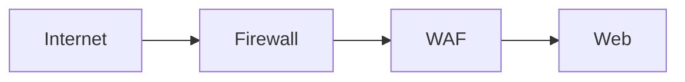
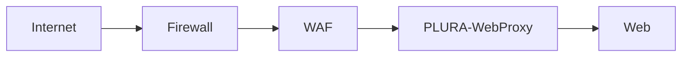
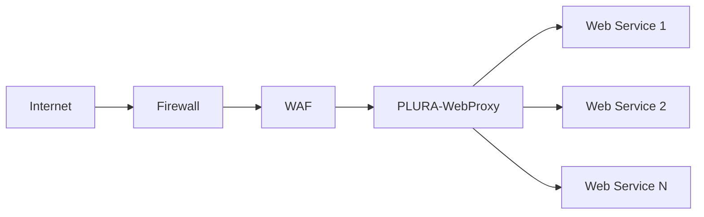
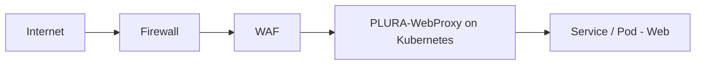
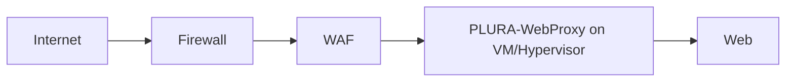

많은 기업이 이미 일반적인 웹방화벽(WAF)을 운영하고 있습니다.

방화벽과 WAF를 거쳐 Web 서버로 연결되는 구조는 흔하고,  
기본적인 접근 통제나 알려진 웹 공격 차단에는 충분히 유효합니다.  
하지만 실제 보안 운영에서는 여기서 한 가지 중요한 한계가 드러납니다.

바로 **Web Body 정보의 관리**입니다.

웹 보안에서 중요한 단서는 단순 URL, IP, User-Agent 같은 헤더 정보만이 아닙니다.  
실제 공격과 침해 흔적은 종종 **요청 Body** 또는 **응답 Body** 안에 들어 있습니다.

예를 들면 다음과 같습니다.

- 로그인, 인증, 권한 변경 요청의 실제 파라미터
- 파일 업로드 요청의 본문 데이터
- API 호출 시 JSON/XML Body
- 데이터 유출 정황이 담긴 응답 내용
- 웹쉘 업로드나 비정상 명령 전달 흔적
- 우회 공격 과정에서 변형된 실제 Payload

문제는 많은 일반 WAF 환경이 이 Body 정보를 **충분히 보관하거나 분석 가능한 형태로 관리하지 못한다**는 점입니다.

이때 현실적인 대안이 바로,  
**기존 WAF는 그대로 유지하면서 그 뒤에 PLURA-WebProxy를 두어 Web Body 정보를 관리하는 구조**입니다.

즉, 이 글의 핵심은 다음입니다.

> **일반 WAF를 교체하지 않고도, PLURA-WebProxy를 추가하여 Web 요청/응답 Body 정보를 관리할 수 있다.**

---

## 1. 현재 일반적인 구성

대부분의 환경은 다음과 같이 구성되어 있습니다.

이 구조에서는 방화벽이 네트워크 접근을 통제하고,  
WAF가 HTTP/HTTPS 트래픽에 대해 정책 기반 차단을 수행한 뒤,  
최종 Web 서버가 요청을 처리합니다.

이 방식은 단순하고 익숙합니다.  
또한 이미 많은 운영 환경에서 사용 중이기 때문에 쉽게 바꾸기 어렵습니다.

하지만 보안 관점에서는 다음과 같은 질문이 남습니다.

* 실제 요청 Body를 어디까지 볼 수 있는가
* 응답 Body를 운영적으로 관리할 수 있는가
* API 요청의 실제 JSON Payload를 추적할 수 있는가
* 파일 업로드나 데이터 유출 흔적을 나중에 다시 확인할 수 있는가
* “차단 여부”가 아니라 “무슨 내용이 오갔는가”를 설명할 수 있는가

바로 여기에서 일반 WAF만으로는 한계가 생깁니다.

---

## 2. 왜 Web Body 정보 관리가 중요한가

오늘의 웹 공격은 단순 URL 접근 차단만으로 설명되지 않습니다.

실제 공격은 점점 더 **정상적인 HTTP/HTTPS 요청의 형태**를 띱니다.  
겉보기에는 평범한 POST 요청이지만, 그 안의 Body에 공격 의도가 숨어 있는 경우가 많습니다.

예를 들어,

* 로그인 API에 대한 비정상 대입 시도
* 관리자 기능 호출 시 포함된 파라미터 변조
* JSON Body 내부의 악성 값 삽입
* 파일 업로드 multipart/form-data 내부의 비정상 스크립트
* 응답 본문을 통한 민감정보 노출
* 대량 조회 후 응답 데이터 축적을 통한 유출

이런 행위는 단순 헤더 정보만으로는 충분히 설명되지 않습니다.  
**실제 Body를 봐야만 의미가 드러나는 경우가 많습니다.**

즉, 웹 보안 운영에서 중요한 것은 단순히 “막았는가”만이 아니라,

* 어떤 요청이 들어왔는지
* 그 안에 어떤 Body가 있었는지
* 어떤 응답이 나갔는지
* 침해 정황을 나중에 다시 입증할 수 있는지

까지 포함합니다.

---

## 3. 일반 WAF 뒤에 PLURA-WebProxy를 두는 구조

이 문제를 해결하기 위한 현실적인 구성은 다음과 같습니다.

핵심은 단순합니다.

외부 요청은 기존과 동일하게 **방화벽**과 **일반 WAF**를 먼저 통과합니다.  
그 다음, 정상 전달 대상 트래픽을 **PLURA-WebProxy**가 받아서  
최종적으로 **Web 서버**에 전달합니다.

이 구조에서 일반 WAF는 계속 앞단 차단 장치 역할을 수행합니다.  
즉, 기존 투자와 운영 구조를 그대로 유지할 수 있습니다.

대신 PLURA-WebProxy가 그 뒤에서 다음 역할을 담당합니다.

* Web 요청 Body 관리
* Web 응답 Body 관리
* 애플리케이션 전달 경로의 표준화
* Web 서비스 앞단의 관찰 지점 확보
* 이후 분석과 포렌식을 위한 데이터 기반 확보

이 구조의 장점은 **기존 WAF를 버리지 않아도 된다**는 점입니다.  
즉, 교체가 아니라 확장입니다.

---

## 4. PLURA-WebProxy의 역할

PLURA-WebProxy는 일반적인 Reverse Proxy처럼 Web 앞단에 위치하지만,  
보안 운영 관점에서는 조금 더 중요한 의미를 가집니다.

그 핵심은 **Web Body 정보를 관리 가능한 위치에서 확보하는 것**입니다.

### 4-1. 요청 Body 관리

PLURA-WebProxy는 Web으로 전달되기 직전의 요청을 받습니다.  
따라서 POST, PUT, PATCH, API 호출, 파일 업로드 등에서  
실제 요청 Body를 관리 가능한 지점이 됩니다.

이것이 중요한 이유는 다음과 같습니다.

* 로그인 시도 패턴을 더 정확히 볼 수 있음
* API 오용 여부를 확인할 수 있음
* JSON/XML 기반 공격 흔적을 남길 수 있음
* 파일 업로드 요청의 내용을 추적할 수 있음
* 우회 공격의 실제 Payload를 나중에 다시 검토할 수 있음

### 4-2. 응답 Body 관리

실제 사고 대응에서는 응답 데이터도 매우 중요합니다.

예를 들어,

* 민감정보가 과다하게 노출되었는지
* 특정 API 응답이 비정상적으로 크거나 반복되는지
* 데이터 유출 정황이 응답 본문에 있었는지
* 정상 응답처럼 보이지만 실제로는 비정상 반환이 있었는지

이런 판단은 응답 Body를 관리해야 가능합니다.

PLURA-WebProxy는 Web과 사용자 사이에 위치하므로  
응답 Body 역시 관리 가능한 구조를 만들 수 있습니다.

### 4-3. 분석과 포렌식의 기준점

보안 사고는 대부분 “그때 무슨 요청이 오갔는가”를 나중에 다시 확인해야 합니다.

일반 WAF가 차단 여부나 일부 이벤트 중심이라면,  
PLURA-WebProxy는 **Web 요청/응답의 실제 내용에 더 가까운 기준점**이 될 수 있습니다.

이것은 단순 운영 로그가 아니라,  
사고 분석과 원인 추적을 위한 **증적성 있는 데이터 기반**이라는 점에서 의미가 큽니다.

---

## 5. 구조 비교

### 기존 구조

이 구조의 장점은 단순함입니다.  
하지만 Web Body 정보 관리는 제한적일 수 있습니다.

### 확장 구조

이 구조의 핵심은 다음과 같습니다.

* 일반 WAF는 그대로 유지
* PLURA-WebProxy를 뒤단에 추가
* Web 요청/응답 Body 관리 가능
* 이후 분석, 탐지, 포렌식 기반 강화

즉, 기존 WAF의 장점을 버리지 않으면서  
운영상 부족했던 Body 관리 영역을 보완하는 방식입니다.

---

## 6. 어떤 상황에서 특히 유용한가

이 구조는 다음과 같은 환경에서 특히 유용합니다.

### API 중심 서비스

요즘 Web 서비스는 HTML 페이지보다 API 호출 비중이 더 큰 경우가 많습니다.  
이 경우 핵심 정보는 URI보다 **JSON Body** 안에 들어 있습니다.

따라서 API 보안 운영에서는 Body 관리가 필수에 가깝습니다.

### 파일 업로드 기능이 있는 서비스

웹쉘 업로드, 비정상 첨부, 악성 스크립트 반입 등은  
Body를 보지 않으면 충분한 분석이 어려운 경우가 많습니다.

### 민감정보 응답 관리가 중요한 서비스

고객정보, 결제정보, 내부 조회 결과 등은  
응답 Body에 담겨 나가는 경우가 많습니다.  
데이터 유출이나 과다 노출 분석을 위해서는 응답 Body 관리가 중요합니다.

### 기존 WAF를 바꾸기 어려운 환경

이미 사용 중인 WAF를 바로 교체하기 어렵다면,  
PLURA-WebProxy를 뒤단에 두는 방식이 현실적인 대안입니다.

즉, “WAF 교체 프로젝트”가 아니라  
“Body 관리 기능 추가” 프로젝트로 접근할 수 있습니다.

---

## 7. Web은 반드시 PLURA-WebProxy를 거치도록 구성

이 구조에서 중요한 원칙이 하나 있습니다.

**최종 Web 서버는 반드시 PLURA-WebProxy를 통해서만 접근되도록 구성해야 합니다.**

그 이유는 분명합니다.

직접 Web으로 들어가는 우회 경로가 남아 있으면,  
PLURA-WebProxy를 통해 관리하려는 Web Body 정보가 누락될 수 있기 때문입니다.

권장 구조는 다음과 같습니다.

이 구조에서는

* 외부 진입점은 WAF로 고정되고
* Web 전달은 PLURA-WebProxy로 표준화되며
* 실제 Web 서비스는 직접 노출되지 않습니다

이렇게 해야 Web Body 관리가 빠지지 않고 일관되게 유지됩니다.

---

## 8. PLURA-WebProxy는 어떤 환경에서 동작하면 되는가

PLURA-WebProxy는 반드시 특정 전용 장비일 필요는 없습니다.  
핵심은 Web 앞단 Proxy 역할을 수행하면서 Body 정보를 관리할 수 있는 위치에 있으면 된다는 점입니다.

### 8-1. Kubernetes 환경

PLURA-WebProxy는 쿠버네티스 환경에서 동작할 수 있습니다.

예를 들면 다음과 같은 구조입니다.

이 구조는 다음과 같은 장점이 있습니다.

* 컨테이너 기반 Web 서비스와 자연스럽게 결합 가능
* Service/Pod 변경에도 Proxy 계층에서 유연하게 대응 가능
* API 중심 서비스 구조와 잘 맞음

### 8-2. Hypervisor 환경

PLURA-WebProxy는 Hypervisor 기반 가상화 환경에서도 동작할 수 있습니다.

예를 들면 다음과 같습니다.

이 구조는 기존 온프레미스나 VM 기반 운영 환경에 적합합니다.

* 물리 Web 서버를 바로 바꾸지 않아도 됨
* 기존 WAF는 그대로 유지 가능
* 가상 머신 형태로 단계적 도입 가능

즉, 쿠버네티스든 Hypervisor든  
핵심은 **PLURA-WebProxy가 WAF 뒤, Web 앞에 위치해 Body 정보를 관리하는 것**입니다.

---

## 9. 운영 관점에서의 핵심 메시지

이 구조의 핵심 메시지는 매우 분명합니다.

일반 WAF는 여전히 필요합니다.  
하지만 그것만으로는 실제 Web Body 정보를 충분히 관리하기 어려울 수 있습니다.

따라서 현실적인 방법은 다음과 같습니다.

* 기존 WAF는 그대로 유지하고
* 그 뒤에 PLURA-WebProxy를 추가하여
* Web 요청/응답 Body 정보를 관리하고
* 이후 분석, 탐지, 포렌식의 기반으로 활용하는 것

즉, 이 구조는 WAF를 대체하는 이야기가 아니라  
**WAF가 보지 못하거나 충분히 남기지 못하는 영역을 PLURA-WebProxy로 보완하는 이야기**입니다.

---

## 10. 결론

웹 보안 운영에서 중요한 것은 단순 차단 이벤트만이 아닙니다.

실제로는 다음이 더 중요해지고 있습니다.

* 어떤 요청이 들어왔는가
* 그 요청의 Body에는 무엇이 있었는가
* 어떤 응답이 반환되었는가
* 데이터 유출이나 우회 공격 흔적을 나중에 설명할 수 있는가

이 질문에 답하려면  
Web 앞단에서 **Body 정보를 관리할 수 있는 구조**가 필요합니다.

그래서 일반 WAF 환경에서도  
**방화벽 → WAF → PLURA-WebProxy → Web** 구조가 의미를 가집니다.

이 구조의 장점은 명확합니다.

* 기존 WAF를 그대로 유지할 수 있고
* Web Body 정보를 별도로 관리할 수 있으며
* API, 업로드, 응답 데이터, 유출 흔적까지 더 깊이 다룰 수 있고
* Kubernetes와 Hypervisor 환경 모두에 적용할 수 있습니다

결국 PLURA-WebProxy의 가치는  
일반 WAF를 대체하는 데 있는 것이 아니라,  
**일반 WAF만으로는 부족한 Web Body 관리 영역을 현실적으로 보완하는 데** 있습니다.

---

## 함께 보면 좋은 글

* 웹방화벽 우회 공격 대응
* 크리덴셜 스터핑 대응 전략
* 제로데이 대응을 위한 전체 로그 분석 구조
* X-Forwarded-For 신뢰 경계 설계
* API 보안과 요청/응답 데이터 관리

