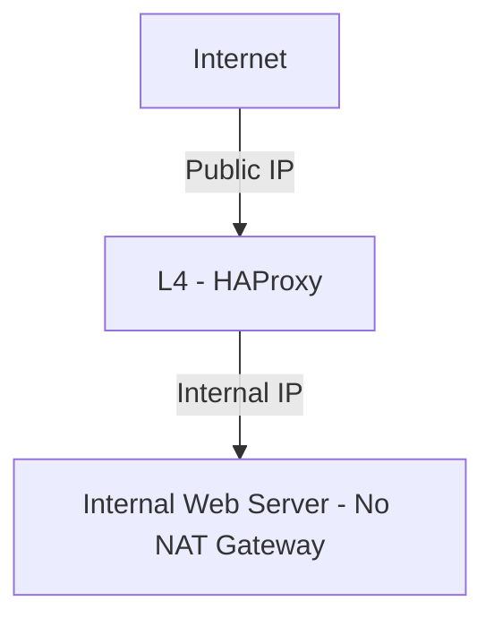

큐비트시큐리티는 홈페이지/블로그를 퍼블릭 클라우드 환경에서 호스팅하고 있습니다. 안정적이면서 보안이 뛰어난 환경을 구성하기 위해 NAT Gateway를 제거하고 내부-외부 네트워크 간 명확한 분리를 실현하였습니다.

<!--more-->

## NAT Gateway의 존재가 초래하는 보안 위험

퍼블릭 클라우드 환경에서 NAT Gateway가 존재하면, 내부 웹 서버가 외부 인터넷과 직접 연결됩니다. 이 경우 웹 서버에 웹쉘(Webshell)과 같은 악성 코드가 설치되었을 때 외부 인터넷으로의 역접속(Reverse Connection)이 가능해져 내부 시스템에 심각한 보안 위협이 될 수 있습니다.

## NAT Gateway 제거의 중요성

NAT Gateway를 제거하고 내부 네트워크와 외부 인터넷의 경계를 명확히 함으로써, 외부로의 불필요한 연결을 원천적으로 차단할 수 있습니다. 이를 통해 웹 서버가 공격을 당하더라도 공격자의 외부 연결을 차단하여 피해 확산을 예방할 수 있습니다.

## 안전한 네트워크 아키텍처 설계

안전한 네트워크 설계를 위해서는 외부와 내부 네트워크를 명확하게 분리하여 구성해야 합니다. 다음은 안전한 네트워크 구성의 예시입니다.

- 외부 요청은 HAProxy와 같은 L4 로드밸런서를 통해서만 내부 웹 서버로 접근 가능합니다.
- 웹 서버는 외부로 직접 연결할 수 없으며, 기본(Default) Gateway를 로드밸런서로 설정하여 추가적인 보안을 유지합니다.
- NAT Gateway를 사용하지 않으며, 내부 서버에서 외부 인터넷으로의 직접적인 통신이 원천적으로 차단됩니다.

## NAT Gateway 없는 환경의 보안적 효과

- 외부 인터넷과의 직접적인 통신 차단
- 웹쉘(Webshell) 공격 등 내부 침투 성공 시에도 외부 연결을 통한 공격자의 제어 차단
- 클라우드 서비스의 전반적인 보안성과 안정성 향상

클라우드 환경의 보안을 강화하기 위해 NAT Gateway를 제거하고 명확한 내부-외부 네트워크 아키텍처를 구성하는 것이 중요합니다. 이로써 서비스의 보안성과 안정성을 한층 높일 수 있습니다.

