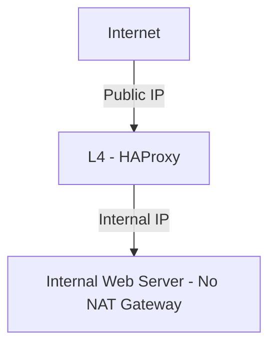

큐비트시큐리티는 홈페이지/블로그를 퍼블릭 클라우드에서 운영하며, NAT Gateway를 제거하고 내부-외부 네트워크를 명확히 분리하여 보안성을 강화하였습니다.

<!--more-->

## NAT Gateway의 존재가 초래하는 보안 위험

퍼블릭 클라우드 환경에서 NAT Gateway가 존재하면, 내부 웹 서버가 외부 인터넷과 직접 연결됩니다. 이 경우 웹 서버에 웹쉘(Webshell)과 같은 악성 코드가 업로드되었을 때, 공격자는 이를 통해 외부 인터넷과 직접 연결하여 추가 공격을 수행할 수 있습니다. 이는 보안 사고 확산 가능성을 높이는 주요 원인입니다.

## NAT Gateway 제거의 중요성

NAT Gateway를 제거하고 내부 네트워크와 외부 인터넷의 경계를 명확히 하면, 외부로의 불필요한 연결을 근본적으로 차단할 수 있습니다. 웹 서버가 공격을 당하더라도 공격자의 외부 연결을 방지하여 피해의 확산을 예방할 수 있습니다.

## 안전한 네트워크 구성 예시

- 외부 요청은 HAProxy와 같은 L4 로드밸런서를 통해서만 내부 웹 서버로 접근 가능합니다.
- 웹 서버는 반드시 내부 네트워크에 독립된 내부 Default Gateway로 설정되어 외부로 직접 연결되지 않도록 합니다.
- 웹 서버는 NAT Gateway를 사용하지 않아 외부와의 직접적인 연결이 원천적으로 차단됩니다.

## NAT Gateway 없는 환경의 보안적 효과

- 외부 인터넷과의 직접적인 통신 차단
- 웹쉘(Webshell) 공격 등 내부 침투 성공 시에도 외부 연결을 통한 공격자의 제어 차단
- 클라우드 서비스의 전반적인 보안성과 안정성 향상

클라우드 환경의 보안을 강화하기 위해 NAT Gateway를 제거하고 내부-외부를 명확히 구분한 네트워크 아키텍처를 설계하는 것이 매우 중요합니다.

