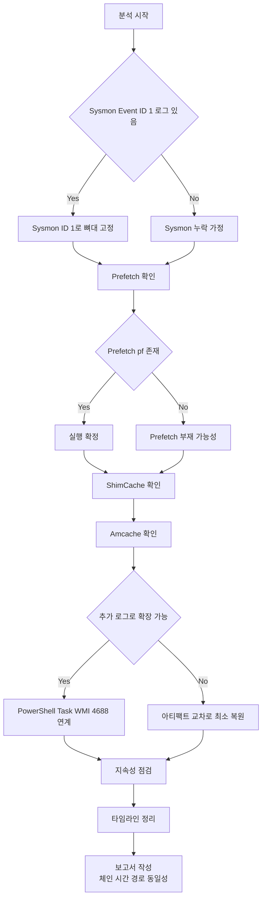

📌 **이 글의 목표는 하나입니다.**  
“악성 파일이 실행됐는가?”에서 끝내지 않고, 한 단계 더 들어가서  
✅ **“누가(부모) → 무엇을(자식) → 어떤 인자(CommandLine)로 → 언제 실행했고, 그 다음에 뭘 했나?”**  
즉 **실행 체인**(Execution Chain)을 **보고서로 흔들리지 않게** 복원하는 겁니다.

---

## 0) 왜 이 순서가 제일 친절한가요?

침해사고 분석은 보통 이렇게 시작합니다.

- “이상한 실행이 있었던 것 같은데요…”
- “이 파일이 악성 같은데 실행됐나요?”
- “EDR이 없거나 로그가 중간에 끊겼어요…”

이럴 때 **가장 덜 헤매는 순서**가 있습니다.

1) **Sysmon Event ID 1**: 실행 체인의 뼈대(부모-자식-커맨드라인-해시)  
2) **Prefetch**: “진짜 실행됨”을 가장 직관적으로 확증  
3) **ShimCache**: 실행이 애매해도 “그 파일이 그 경로에 있었다”를 고정  
4) **Amcache**: 파일명이 바뀌어도 “이게 그 파일”임을(메타/해시) 확정  
5) (있으면) **PowerShell/Task/WMI 로그**로 LOLBAS·지속성까지 연결  
6) 마지막에 **보고서**: 시간/경로/동일성/체인 근거를 세트로 제시

---

## 1) 실행 체인 복원 흐름도 (Sysmon 1번부터 보고서까지 쭉)

**Sysmon 1번 → 보고서**로 “끊기지 않게” 한 장으로 설명하겠습니다.

---

## 2) 1번(Sysmon Event ID 1)부터 보는 이유: “실행 체인의 척추”를 먼저 세우기

Sysmon **Event ID 1**(Process Create)는 말 그대로  
“**프로세스가 생성(실행)된 순간**”을 기록합니다.

여기서 중요한 건, Sysmon이 있으면 **실행 체인을 “사람 감”이 아니라 “근거”로** 묶을 수 있다는 점이에요.

### ✅ Sysmon ID 1에서 특히 중요한 필드

* **ParentImage**: “누가 이걸 실행시켰나?”
* **Image**: “무엇이 실행됐나(정확한 경로)?”
* **CommandLine**: “어떤 인자로 실행됐나?” (LOLBAS에서 거의 핵심)
* **Hashes**: “이 파일이 진짜 그 파일 맞나?” (동일성 확정)
* **Time**: 타임라인의 기준점

📌 한 줄 요약

> **Sysmon 1번은 ‘체인’을 만들고,  
> Prefetch/ShimCache/Amcache는 그 체인을 ‘흔들리지 않게’ 고정합니다.**

---

## 3) 2번(Prefetch)을 붙이는 이유: “실행됐다”를 가장 직관적으로 확증

Prefetch는 원래 **실행 속도 최적화** 기능이지만, 포렌식에서는 단순합니다.

> `.pf`가 남아있다면, **그 프로그램은 실행된 적이 있을 가능성이 매우 높습니다.**

### ✅ Prefetch가 주는 실무형 증거 3종

* **실행 시간(Last Run Time)**: “언제 실행됐나?”
* **실행 횟수(Run Count)**: “몇 번 실행됐나?”
* **참조 흔적(로드/접근 파일 경로)**: “실행하면서 무엇을 만졌나?”

### ❗ Prefetch 단독으로 끝내면 아쉬운 이유

Prefetch는 “실행”은 강하지만,

* “누가 실행했는지(부모 프로세스)”
* “정확한 커맨드라인”  
  을 **완벽하게 복원하기가 어렵습니다.**

그래서 **Sysmon(부모/커맨드) ↔ Prefetch(실행 확증/시간/횟수)** 조합이 제일 안정적입니다.

---

## 4) 3번(ShimCache)을 보는 이유: “그 파일이 그 경로에 있었던 건 확실”로 고정

공격자는 흔히 이런 걸 합니다.

* 실행 후 **self-delete**
* 파일 이동/이름 변경
* 흔적 삭제 시도

이때 ShimCache(AppCompatCache)는 “실행 여부”보다도 먼저,  
✅ “**그 파일이 시스템에 존재했었다**(경로 포함)”를 고정하는 데 강합니다.

### ❌ ShimCache에서 자주 하는 오해(중요)

* ShimCache의 타임스탬프는 보통 **‘실행 시각’이 아닐 수 있습니다.**  
  (환경에 따라 “파일 마지막 수정 시간 성격” 등으로 해석하는 것이 더 안전한 경우가 많습니다.)
* 따라서 ShimCache만으로 “이 시간에 실행됐다”라고 단정하면 **타임라인이 틀어질 수 있어요.**

📌 ShimCache는 이렇게 쓰면 딱 좋아요

> **Prefetch/Sysmon으로 실행을 잡고**,  
> **ShimCache로 존재/경로를 못 박는다**.

---

## 5) 4번(Amcache)을 마지막에 붙이는 이유: “이게 그 파일”임을 확정하기

Amcache는 경우에 따라 **결정타**가 됩니다.

* 파일명이 바뀌었어도
* 경로가 이동했어도
* 원본이 삭제됐어도

Amcache에 남는 **식별 정보**(메타/해시 등)로  
✅ “동일 파일” 여부를 훨씬 강하게 주장할 수 있어요.

### ✅ Amcache가 특히 빛나는 상황

* IOC(해시)로 **동일 파일 여부를 확정**해야 할 때
* 정상 파일로 위장했지만 메타/식별 정보로 **거짓말을 깨야** 할 때
* Prefetch가 없거나 애매할 때 **보강 근거**가 필요할 때

---

## 6) 한눈에 비교: Sysmon · Prefetch · ShimCache · Amcache

| 구분     | Sysmon (Event ID 1) | Prefetch        | ShimCache       | Amcache          |
| ------ | ------------------- | --------------- | --------------- | ---------------- |
| 한 줄 역할 | 실행 체인 “뼈대”          | 실행 “확증”         | 존재/경로 “고정”      | 파일 “정체 확정”       |
| 강점     | 부모/자식, 커맨드라인, 해시    | 실행 시간·횟수, 참조 흔적 | 삭제/이동 후에도 경로 흔적 | 메타/식별 정보로 동일성    |
| 약점     | 없을 수 있음(미설치/보관기간)   | 없다고 실행 안 한 건 아님 | 실행 시각으로 오해 위험   | 환경/상황에 따라 가용성 편차 |
| 실무 포지션 | 시작점(가능하면 1순위)       | 2순위 “실행 확인”     | 3순위 “존재 고정”     | 4순위 “동일성 확정”     |

---

## 7) 실전 시나리오로 이해하기: “실행 후 삭제” 대응

### 📌 시나리오: 공격자가 `malware.exe` 실행 후 삭제하고 도망감

1. **Sysmon ID 1**이 있으면

* 어떤 부모가 실행했는지(ParentImage)
* 어떤 인자였는지(CommandLine)
* 어떤 해시였는지(Hashes)  
  까지 뼈대를 바로 세웁니다.

2. **Prefetch**로 강화

* `MALWARE.EXE-****.pf`가 남아있으면 “실행”을 강하게 확증
* 실행 시간/횟수로 **반복 실행** 여부까지 잡습니다.

3. **ShimCache**로 못 박기

* `C:\Temp\malware.exe` 같은 경로가 남아 있으면  
  “그 경로에 실제로 존재했다”를 고정합니다.

4. **Amcache**로 동일성 확정

* 파일명이 바뀌거나 경로가 바뀐 흔적이 있어도  
  “그 파일이 맞다”를 식별 정보로 보강합니다.

---

## 8) (로그가 있다면 최강) LOLBAS/지속성까지 “체인 확장”하기

아티팩트는 강력하지만, **로그는 체인을 더 길고 선명하게** 만들어줍니다.  
특히 LOLBAS는 **CommandLine과 부모-자식 관계**가 핵심이라, 로그 연계가 효과가 큽니다.

### 8.1 아티팩트와 “바로 붙이기 좋은” 로그 5개 (채널 기준)

#### 1) Sysmon: Process Create

* **채널**: `Applications and Services Logs > Microsoft > Windows > Sysmon > Operational`
* **주요 Event ID**: **1 (Process creation)**
* **붙이는 방법**: `Image/CommandLine/Hashes` ↔ Prefetch/ShimCache/Amcache 교차

#### 2) 보안 로그: 프로세스 생성(4688)

* **채널**: `Windows Logs > Security`
* **주요 Event ID**: **4688**
* **포인트**: Sysmon이 없을 때 최소한의 “프로세스 생성” 근거 확보  
  (커맨드라인 로깅 정책 설정 여부가 품질을 좌우합니다.)

#### 3) PowerShell: Script Block Logging(4104)

* **채널**: `Microsoft > Windows > PowerShell > Operational`
* **주요 Event ID**: **4104**
* **포인트**: LOLBAS/다운로드/실행 경로가 스크립트에 그대로 남는 경우가 많아  
  → 그 경로를 ShimCache/Amcache에서 존재/유입으로 고정  
  → 실행 파일은 Prefetch로 실행 확증

#### 4) TaskScheduler: 작업 기반 실행

* **채널**: `Microsoft > Windows > TaskScheduler > Operational`
* **예시 Event ID**: **200/201** 등(환경에 따라 상이)
* **포인트**: 지속성(스케줄 작업)으로 “다시 실행되게 만든 트리거”를 잡기 좋음

#### 5) WMI Activity: WMI 기반 실행/지속성 단서

* **채널**: `Microsoft > Windows > WMI-Activity > Operational`
* **대표 Event ID 묶음**: **5857~5861** 등(환경에 따라 상이)
* **포인트**: WMI를 통한 실행/지속성은 흔적이 “로그 쪽”에 남는 편이라 연결 가치가 큼

---

## 9) 마지막 퍼즐: “누가 다시 살렸는가” (지속성 트리거)

최초 실행 파일과 **재실행(지속성) 트리거**는 다른 경우가 많습니다.  
그래서 실행 체인의 끝은 보통 여기로 갑니다.

* Scheduled Tasks (schtasks)
* Services (서비스 등록)
* WMI 이벤트 구독(영구 구독)

📌 실무 팁

> “최초 실행(초기 침투) 체인”과 “재실행(지속성) 체인”을 **분리**해서 그리면 보고서가 훨씬 명확해집니다.

---

## 10) Prefetch가 없거나 약할 때: “없다 = 실행 안 했다” 금지

Prefetch가 비어 있을 수 있는 이유는 꽤 많습니다.

* 정책/환경으로 Prefetch 비활성
* 저장 개수 제한으로 덮어쓰기
* 공격자 삭제
* 서버/특수 구성

그래서 Prefetch가 없으면,

* ShimCache/Amcache로 존재·정체를 보강하고
* (가능하면) 이벤트 로그로 실행을 보강하고
* 그래도 부족하면 MFT/USN 같은 파일시스템 레벨로 확장합니다.

---

## 11) 보고서에 이렇게 쓰면 흔들리지 않습니다 (근거 세트)

보고서에서 가장 흔들리는 순간은 이거예요.

* “실행된 것 같아요” → 근거가 약하면 바로 반박당함
* “악성 맞아요” → 동일성(해시/식별)이 없으면 논쟁으로 번짐

그래서 보고서 문장은 가능하면 **세트로** 씁니다.

* **체인**: Parent → Child
* **시간**: 실행 시간(로그/Prefetch)
* **경로**: Full Path(아티팩트 교차)
* **동일성**: Hash/식별(가능하면 Amcache/Sysmon)

예시 문장(템플릿)

> (시간) (부모 프로세스)가 (커맨드라인)으로 (자식 프로세스)를 실행했으며,  
> Prefetch에서 실행 흔적(횟수/시간)이 확인되고, ShimCache에서 해당 경로 존재가 확인되며,  
> Amcache/Sysmon 해시로 동일 파일임을 교차 검증했다.  

---

## 12) 현장에서 바로 쓰는 체크리스트 (10문 10답)

Q1. **지금 내가 잡은 단서는 “실행(로그)”인가 “파일(아티팩트)”인가?**  
→ 시작점을 정해야 삽질이 줄어듭니다. 로그면 Sysmon부터, 파일이면 Prefetch/ShimCache부터.

2️⃣ **누가 실행했나(부모 프로세스)?** → Sysmon ID 1의 `ParentImage`  
3️⃣ **무엇이 실행됐나(정확한 경로)?** → Sysmon `Image` ↔ Prefetch/ShimCache 경로 교차  
4️⃣ **정말 실행됐나(로그가 불완전해도)?** → Prefetch `.pf` 존재로 실행 근거 강화  
5️⃣ **언제 실행됐나?** → Prefetch 실행 시각 + Sysmon 이벤트 시간으로 타임라인 고정  
6️⃣ **몇 번 실행됐나(반복/지속 여부)?** → Prefetch `Run Count`  
7️⃣ **그 파일이 시스템에 ‘있었던 건’ 확실한가?** → ShimCache로 존재/경로 고정  
8️⃣ **이 파일, 이름만 바꾼 거 아냐? 동일 파일 맞아?** → Amcache(식별/해시)로 동일성 확정  
9️⃣ **LOLBAS/스크립트 우회 실행 흔적은?** → Sysmon CommandLine + PowerShell(4104)/Task/WMI 로그 연계  
🔟 **보고서에서 흔들리지 않는 근거 세트는?** → 체인(부모→자식) + 시간 + 경로 + 동일성(해시)

---

## 참고 링크

[1]: https://learn.microsoft.com/en-us/sysinternals/downloads/sysmon "Sysmon - Sysinternals (Microsoft Learn)"
[2]: https://learn.microsoft.com/en-us/previous-versions/windows/it-pro/windows-10/security/threat-protection/auditing/event-4688 "4688(S) A new process has been created (Microsoft Learn)"
[3]: https://learn.microsoft.com/en-us/windows-server/identity/ad-ds/manage/component-updates/command-line-process-auditing "Command line process auditing (Microsoft Learn)"
[4]: https://learn.microsoft.com/en-us/powershell/module/microsoft.powershell.core/about/about_logging_windows?view=powershell-7.5 "about_Logging_Windows - PowerShell (Microsoft Learn)"
[5]: https://research.splunk.com/endpoint/b3632472-310b-11ec-9aab-acde48001122/ "WinEvent Windows Task Scheduler Event Action Started (Splunk Research)"
[6]: https://docs.nxlog.co/integrate/wmi.html "Windows Management Instrumentation (WMI) (NXLog Documentation)"
[7]: https://redcanary.com/threat-detection-report/techniques/windows-management-instrumentation/ "Windows Management Instrumentation (Red Canary)"
[8]: https://lolbas-project.github.io/ "LOLBAS Project"

