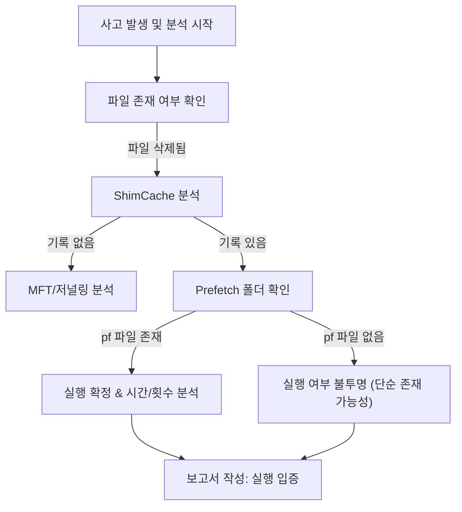

📖 **ShimCache와 Prefetch, 왜 ‘둘 다’ 봐야 할까? 그리고 어떻게 ‘연계 실행 체인’까지 복원할까**

> 목표: 침해 사고 분석(Incident Response)에서 가장 중요한 질문은 결국 이것입니다.  
> **“악성 파일이 실제로 실행되었는가?”**  
> 하지만 실무에서 더 중요한 질문은 한 단계 더 나아갑니다.  
> ✅ **“이 악성 파일을 실행·지원·은폐·전달한 프로그램 체인은 무엇인가?”**  
>
> 이 글은 기존 **ShimCache vs Prefetch 비교**를 기반으로, Prefetch/ShimCache를 시작점으로 **실행 체인(Execution Chain)을 복원**하는 확장 분석 흐름까지 정리합니다.

---

## 1. ShimCache (AppCompatCache): “존재”의 증명

ShimCache(Application Compatibility Cache)는 프로그램의 **호환성 유지**를 위해 설계된 기능입니다.  
포렌식 관점에서는 파일이 시스템에 ‘**존재했음**’을 증명하는 강력한 증거가 됩니다.

### ❌ 분석 시 주의할 점 (오해와 진실)

- **실행 시간이 아니다**: ShimCache의 타임스탬프는 보통 **실행 시각이 아니라 파일의 마지막 수정 시간(Last Modified Time)** 성격으로 해석해야 합니다. 이를 실행 시간으로 단정하면 타임라인이 크게 틀어질 수 있습니다.
- **실행 여부의 모호성**: Windows 버전/조건에 따라 “캐싱됨 = 실행됨”이 항상 성립하지 않습니다.
- **휘발성 특성**: 일반적으로 **정상 종료/재부팅 시점에 기록**되는 성격이 있어, 강제 종료/크래시 상황에서는 최신 흔적이 누락될 수 있습니다.

### ✅ ShimCache의 핵심 가치

- **파일 존재 입증**: 원본이 self-delete 되었어도 경로 흔적이 남을 수 있습니다.
- **이동 경로 추적**: 악성 파일이 어느 경로에 있었는지 전체 경로 기반 추적이 가능합니다.

---

## 2. Prefetch: “실행”의 확증

Prefetch는 윈도우의 **부팅 및 실행 속도 향상**을 위한 메커니즘이며, 분석가에게는 “**실행되었다**”를 가장 강하게 뒷받침합니다.

### 📌 Prefetch가 제공하는 결정적 증거

- **확실한 실행 단서**: Prefetch 파일(`.pf`)이 생성되었다면 해당 실행 파일은 **실제로 실행**되었을 가능성이 매우 높습니다.
- **정확한 실행 시각**: 마지막 실행 시각뿐 아니라(Windows 8+에서 흔히 관찰) **최근 여러 회(대개 8회)의 실행 시각**을 기록하는 구조가 일반적입니다.
- **실행 횟수(Run Count)**: 실행 빈도 추정에 유리합니다.

### ❌ 한계점

- **개수 제한/덮어쓰기**: 시스템에 따라 Prefetch 저장 개수 제한으로 오래된 기록이 덮일 수 있습니다.
- **환경에 따라 비활성/부재 가능**: 일부 서버/정책/저장장치 환경에서는 Prefetch가 기대대로 남지 않을 수 있어 “없다 = 실행 안 했다”로 단정하면 위험합니다.
- **단독으로는 ‘연계’가 약함**: Prefetch는 “실행”을 잘 말해주지만, **누가 실행했는지(부모 프로세스), 어떤 체인인지**는 Prefetch만으로 완전 복원이 어렵습니다.

---

## 3. 한눈에 보는 비교: ShimCache vs Prefetch

두 아티팩트는 상호 보완적입니다. 하나만으로는 전체 그림을 그리기 어렵습니다.

| 비교 항목 | 🔹 ShimCache (AppCompatCache) | 🔹 Prefetch |
| --- | --- | --- |
| 원래 목적 | 애플리케이션 호환성 유지 | 프로그램 실행 속도 향상 |
| 저장 위치 | 레지스트리 (`SYSTEM` Hive) | 파일 시스템 (`C:\Windows\Prefetch`) |
| 기록 시점 | 시스템 종료/재부팅 시 반영되는 성격 | 프로그램 실행 시 생성되는 성격 |
| 시간 정보 | 실행 시각이 아닌 값으로 오해 위험 | 실행 시간(Last Run Time) 중심 |
| 포렌식 의미 | 파일이 시스템에 **존재했음**을 입증 | 파일이 **실행되었음**을 뒷받침 |
| 삭제 시 | 원본 파일 삭제돼도 흔적이 남을 수 있음 | 원본 파일 삭제돼도 `.pf`가 남을 수 있음 |

---

## 4. 현실적인 분석 시나리오: “실행 후 삭제” 대응

### 📌 시나리오: 공격자가 `malware.exe` 실행 후 삭제하고 도망감

#### 1) ShimCache에서 흔적 포착

- **발견**: `C:\Temp\malware.exe`
- **의미**: “이 시스템에 해당 파일이 존재했었다.”

#### 2) Prefetch로 행위 확증/강화

- **발견**: `MALWARE.EXE-12A3B456.pf`
- **의미**: “정확히 언제, 몇 번 실행되었는지”에 대한 강한 단서 확보  
- **추가 단서**: 로드 DLL/참조 파일 목록에서 네트워크/암호화/스크립트 흔적 등 정황 확보 가능

---

## 5. 추천 기본 흐름도 (존재 → 실행 입증)



---

# 여기서부터가 “실무 확장”: Prefetch 단독을 넘어 실행 체인 복원하기

## 6. 관점 전환: Prefetch는 ‘결론’이 아니라 ‘시작점’

Prefetch는 **“이 실행 파일이 실행된 적이 있다”**를 말해주는 도구입니다.  
하지만 실무에서 우리가 복원해야 하는 것은 보통 이것입니다.

> ❌ “이 악성 파일이 실행됐나?”  
> ✅ **“이 악성 파일을 실행·지원·은폐·전달한 프로그램은 무엇인가?”**

즉, 중심을 **‘연계 흔적’**(Correlation)으로 옮기면 분석이 확장됩니다.

---

## 7. Prefetch 내부에서 바로 뽑을 수 있는 “연계 단서”

### 7.1 DLL 로드/참조 흔적: 인젝션·사이드로딩 정황

Prefetch에는 실행 시점에 **참조된 파일 경로(특히 DLL 포함)**가 남는 경우가 많습니다.  
아래 패턴은 실무에서 자주 “연계 단서”가 됩니다.

- 정상 앱에선 보기 힘든 DLL
- `Temp`, `AppData`, `ProgramData` 하위 DLL
- 파일명 위장 DLL (`version.dll`, `wininet.dll` 등)

➡️ **의미**

- 인젝션/사이드로딩 여부 판단
- 드로퍼·로더 구분에 도움

---

## 8. ShimCache와 Prefetch를 “시간 축”으로 결합하기

둘을 교차하면 단순히 “있다/없다”를 넘어 **상황을 분기**할 수 있습니다.

| 상황 | 해석(현장 관점) |
| --- | --- |
| ShimCache만 있음 | 드롭/유입만 됐을 가능성, 또는 실행 증거가 다른 곳에 존재 |
| Prefetch + ShimCache | 실행 + 반복 가능성(타임라인 강화) |
| Prefetch 없음 + ShimCache 있음 | 1회성/특수 환경/Prefetch 비활성/덮어쓰기 등 가능성(추가 증거 필요) |

➡️ **연계 포인트(실무 체크)**

- 동일 디렉터리에 존재했던 **다른 실행 파일/스크립트**(드로퍼/다운로더/로더)
- 시간 흐름상 “먼저 등장한 파일”과 “뒤이어 실행된 파일”의 관계

---

## 9. Amcache.hve: “설치형 악성코드/유입 경로” 추적의 핵심

ShimCache/Prefetch가 “존재/실행”을 다룬다면, Amcache는 경우에 따라 **유입(설치) 관점**에서 훨씬 강력해집니다.

확인 포인트(대표):

- File ID / SHA1(또는 식별 해시)
- Program Name
- First Install Time(환경/버전에 따라 상이)
- Parent Path / Source 경로 단서

➡️ **의미**

- 드로퍼 → 페이로드 구조 파악(“누가 무엇을 떨어뜨렸나”)
- 정상 프로그램 위장 여부 판단
- 실행이 불확실해도 **시스템 유입 사실**을 입증

---

## 10. (로그가 있다면 최강) Sysmon/보안 로그로 “프로세스 트리” 복원

Prefetch로는 절대 완전하게 보기 어려운 것이 **부모-자식 프로세스 관계**입니다.  
Sysmon(또는 EDR/XDR/보안로그)이 있다면, 실행 체인 복원이 급격히 쉬워집니다.

### ✔ Sysmon Event ID 1 (Process Create)에서 보는 핵심 필드

- `ParentImage`
- `CommandLine`
- `CurrentDirectory`
- `Hashes`
- `ProcessGUID`

예시(전형적인 체인 형태):

```text
powershell.exe
 └── rundll32.exe
      └── evil.dll
```

➡️ **핵심**  
Prefetch는 “rundll32가 실행됐다”를 말해줄 수 있어도,  
**“누가 rundll32를 불렀는지, 어떤 커맨드라인이었는지”**는 로그가 훨씬 강합니다.

---

### 10.1 LOLBAS 탐지 후, ShimCache / Amcache / Prefetch와 “바로” 붙이기 좋은 로그 5개 (채널 기준)

LOLBAS(“Living off the Land Binaries and Scripts”)는 **운영체제에 원래 포함된 정상 바이너리/스크립트**를 악용해 공격을 진행하는 패턴을 말합니다. ([LOLBAS Project][8])  
이 경우 탐지의 시작점이 이벤트 로그인 경우가 많기 때문에, 아래 5개 채널을 우선 보면 **아티팩트(ShimCache/Amcache/Prefetch)와 즉시 교차**하기가 좋습니다.

---

#### 1) Sysmon 로그: Process Create

- **채널**: `Applications and Services Logs > Microsoft > Windows > Sysmon > Operational`
- **주요 Event ID**: **1 (Process creation)**
- **왜 1순위인가**
  - 실행 파일 경로, **전체 CommandLine**, **ParentImage**, **Hashes**, **ProcessGUID** 등 “연동 키”가 가장 풍부합니다. ([Microsoft Learn][1])
- **아티팩트 연동 포인트**
  - `Image`(실행 파일 전체 경로) ↔ Prefetch/ShimCache/Amcache의 동일 경로/파일명 매칭
  - `Hashes` ↔ Amcache에 남는 식별정보(해시) 기반 교차검증
  - `ProcessGUID` ↔ 다른 Sysmon 이벤트(네트워크/파일 생성 등)와 체인 구성에 유리

---

#### 2) Windows 보안 로그: 프로세스 생성(기본 감사)

- **채널**: `Windows Logs > Security`
- **주요 Event ID**: **4688 (A new process has been created)**
- **왜 포함하나**
  - Sysmon이 없는 환경에서도 “최소한의 실행 증거(프로세스 생성)”를 가장 표준적으로 확보합니다. ([Microsoft Learn][2])
- **주의/권장 설정**
  - 4688을 보려면 **Audit Process Creation**이 필요하고,
  - 커맨드라인까지 남기려면 **“프로세스 생성 시 명령줄 포함(Include command line in process creation events)”** 정책 설정이 중요합니다. ([Microsoft Learn][3])
- **아티팩트 연동 포인트**
  - `NewProcessName`(실행 경로) + `CommandLine`(옵션) ↔ Prefetch(실행 사실/시간) + ShimCache(존재 경로) + Amcache(파일 메타)로 교차

---

#### 3) PowerShell 로그: Script Block Logging

- **채널**: `Applications and Services Logs > Microsoft > Windows > PowerShell > Operational`
- **주요 Event ID**: **4104 (Script Block Logging)**
- **왜 포함하나**
  - LOLBAS에서 가장 흔한 축이 PowerShell이고, 4104는 **실제 실행된 스크립트 블록 내용**을 남겨 “무엇을 했는지”까지 붙습니다. ([Microsoft Learn][4])
- **아티팩트 연동 포인트**
  - 4104 내용에서 드롭/다운로드/실행 경로가 나오면  
    ↔ 그 경로를 ShimCache/Amcache에서 “존재/유입” 확인  
    ↔ 해당 실행 파일은 Prefetch로 “실행” 확증

---

#### 4) 작업 스케줄러 로그: Task를 통한 실행(LOLBAS 호출 경로)

- **채널**: `Applications and Services Logs > Microsoft > Windows > TaskScheduler > Operational`
- **주요 Event ID(자주 쓰는 축)**: **200 (Action started), 201 (Action completed)** *(환경에 따라 100/102 등도 함께)*
- **왜 포함하나**
  - 공격자가 `schtasks`로 LOLBAS를 실행/지속화하는 경우가 흔하고, TaskScheduler Operational의 200/201은 **액션(실행 프로그램/인자)** 관찰에 유용합니다. ([Splunk Research][5])
- **아티팩트 연동 포인트**
  - Task action에 나온 실행 파일/인자 경로 ↔ Prefetch/ShimCache/Amcache로 동일 파일 교차
  - “누가(계정/권한)” + “무엇을(액션/인자)”로 실행 체인을 보강

---

#### 5) WMI Activity 로그: WMI 기반 실행/지속성 단서

- **채널**: `Applications and Services Logs > Microsoft > Windows > WMI-Activity > Operational`
- **주요 Event ID(대표 묶음)**: **5857, 5858, 5859, 5860, 5861**
  - 예: 5857(작업 시작), 5858(클라이언트 실패) 등 WMI 동작 단서를 남깁니다. ([NXLog][6])
  - 특히 **5861은 “영구 WMI 이벤트 구독(permanent subscription)”** 단서로 자주 활용됩니다. ([Red Canary][7])
- **아티팩트 연동 포인트**
  - WMI 이벤트에서 보이는 실행/커맨드/관련 프로세스 단서 ↔ Prefetch(실행) + ShimCache/Amcache(경로/유입)로 교차

---

#### (보너스) 위 5개 로그를 아티팩트와 “붙일 때” 최소 연동 키

- **실행 파일 Full Path**: `Image / NewProcessName / Task Action path`
- **CommandLine**: LOLBAS는 인자에 본체(페이로드/DLL/스크립트/URL)를 숨기는 경우가 많아 핵심 피벗
- **시간(UTC/로컬) + 호스트 식별자**
- (가능하면) **Hash**: Sysmon이 가장 강함 ([Microsoft Learn][1])

---

## 11. “누가 다시 살렸는가”: 지속성(Persistence) 트리거 추적

최초 실행 파일과 **재실행(지속성) 트리거**는 다른 경우가 많습니다.  
따라서 실행 체인의 마지막 퍼즐은 보통 **지속성 메커니즘**입니다.

대표 확인 대상:

- Scheduled Tasks (`schtasks /query /v`)
- Services (`HKLM\System\CurrentControlSet\Services`)
- WMI Event Subscription (Filter/Consumer/Binding)

➡️ **의미**

- “최초 실행 프로그램 ≠ 지속성 트리거”를 분리해서 봐야 합니다.
- 정상 프로그램 이름을 쓴 악성 서비스/작업이 숨어 있을 수 있습니다.

---

## 12. Prefetch가 없거나 약할 때: MFT / USN Journal로 “드롭 묶음” 찾기

Prefetch가 비활성/덮어쓰기/삭제 등으로 비어 있으면, 파일시스템 레벨이 특히 중요해집니다.

확인 포인트:

- 악성 파일 생성 직후 생성된 `.exe`, `.dll`, `.ps1`
- 동일 초 단위에 생성된 파일 묶음

➡️ **의미**

- 드롭 행위 입증
- 실행 파일 간 관계성 도출

---

## 13. 실무용 “연계 실행 분석(Execution Correlation)” 요약 흐름

```text
[악성 파일 발견]
      ↓
[Prefetch 존재 여부]
      ↓
[DLL / 실행 시간 확보]
      ↓
[ShimCache / Amcache 교차]
      ↓
[Sysmon / Event Log]
      ↓
[지속성 메커니즘]
      ↓
[실행 체인 재구성]
```

---

## 14. PLURA-Forensic 관점 제안: “Execution Correlation Analysis”로 격상

Prefetch를 **단일 결과 항목**으로 두는 순간, 분석은 “점”에서 멈춥니다.  
현장 대응은 **선(체인)**을 복원해야 합니다.

### ▶ 카테고리 제안: “연계 실행 분석(Execution Correlation Analysis)”

포함 요소(권장 묶음):

- Prefetch
- ShimCache
- Amcache
- Process Tree(로그 기반)
- Persistence Artifacts

➡️ 최종 목표는  
**“악성 파일 단독 입증” → “공격 시나리오 복원”** 입니다.

---

## 15. 현장에서 바로 쓰는 체크리스트 (10문 10답)

1) **이 파일은 실행됐나?** → Prefetch로 확인  
2) **몇 번 실행됐나?** → Run Count/최근 실행 기록  
3) **실행 시각은 언제였나?** → Prefetch 시간 기반 타임라인  
4) **실행 시 무엇을 로드/참조했나?** → Prefetch의 DLL/참조 파일  
5) **같은 폴더에 연계 파일(드로퍼/스크립트)이 있나?** → ShimCache/파일시스템  
6) **유입(설치) 흔적은 더 없나?** → Amcache로 강화  
7) **누가 실행시켰나(부모 프로세스)?** → Sysmon/보안로그  
8) **커맨드라인은 무엇이었나?** → PowerShell/rundll32/mshta 등 식별  
9) **다시 실행되게 만든 트리거는?** → 작업/서비스/WMI  
10) **Prefetch가 비어 있다면?** → MFT/USN으로 생성 군집 재구성  

---

## 📌 결론

- **ShimCache는 “존재”의 강한 단서**입니다.  
- **Prefetch는 “실행”을 뒷받침하는 강력한 증거**입니다.  
- 그러나 악성코드 분석의 핵심은 결국 이것입니다.

> **Prefetch는 시작점이지 결론이 아니다.**  
> 핵심은 **“누가 실행했는가, 무엇을 불렀는가, 어떻게 다시 살아났는가”**다.

---

## 참고 링크

[1]: https://learn.microsoft.com/en-us/sysinternals/downloads/sysmon "Sysmon - Sysinternals (Microsoft Learn)"
[2]: https://learn.microsoft.com/en-us/previous-versions/windows/it-pro/windows-10/security/threat-protection/auditing/event-4688 "4688(S) A new process has been created (Microsoft Learn)"
[3]: https://learn.microsoft.com/en-us/windows-server/identity/ad-ds/manage/component-updates/command-line-process-auditing "Command line process auditing (Microsoft Learn)"
[4]: https://learn.microsoft.com/en-us/powershell/module/microsoft.powershell.core/about/about_logging_windows?view=powershell-7.5 "about_Logging_Windows - PowerShell (Microsoft Learn)"
[5]: https://research.splunk.com/endpoint/b3632472-310b-11ec-9aab-acde48001122/ "WinEvent Windows Task Scheduler Event Action Started (Splunk Research)"
[6]: https://docs.nxlog.co/integrate/wmi.html "Windows Management Instrumentation (WMI) (NXLog Documentation)"
[7]: https://redcanary.com/threat-detection-report/techniques/windows-management-instrumentation/ "Windows Management Instrumentation (Red Canary)"
[8]: https://lolbas-project.github.io/ "LOLBAS Project"
