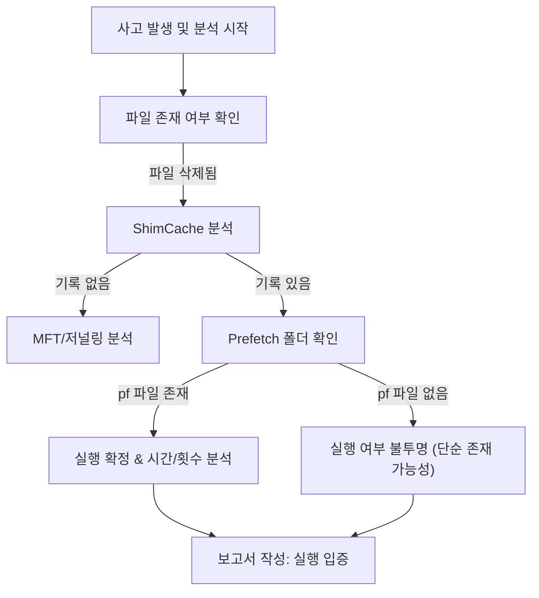

📖 **ShimCache와 Prefetch, 반드시 분석해야 하는가? 현실적인 비교**

> 목표: "침해 사고 분석(Incident Response)에서 가장 중요한 질문은 '**악성 파일이 실제로 실행되었는가?**'입니다.  
> 공격자가 파일을 삭제하고 로그를 지워도, 윈도우는 흔적을 남깁니다.  
> 본 글에서는 실행 흔적의 양대 산맥인 **ShimCache**와 **Prefetch**를 비교하고, 이를 통해 어떻게 사건의 재구성이 가능한지 현실적인 분석 방안을 제시합니다."

## 1. ShimCache (AppCompatCache): 존재의 증명

ShimCache(Application Compatibility Cache)는 프로그램의 **호환성 유지**를 위해 설계된 기능입니다. 포렌식 관점에서는 파일이 시스템에 '존재했음'을 증명하는 강력한 증거가 됩니다.

### ❌ **분석 시 주의할 점 (오해와 진실)**

* **실행 시간이 아니다**: ShimCache에 기록된 타임스탬프는 프로그램의 실행 시각이 아니라 **파일의 마지막 수정 시간(Last Modified Time)**입니다. 이를 실행 시간으로 착각하면 타임라인 분석에 치명적인 오류가 발생합니다.
* **실행 여부의 모호성**: 최신 윈도우(Win 10 이상)에서는 실행 플래그가 존재하지만, 구 버전에서는 단순히 탐색기에서 폴더를 열어본 것만으로도 캐싱될 수 있습니다. 즉, **"ShimCache에 있다 = 무조건 실행되었다"**는 공식은 항상 성립하지 않습니다.
* **휘발성 데이터**: 시스템이 **정상 종료(Shutdown) 또는 재부팅**될 때만 레지스트리(SYSTEM Hive)에 기록됩니다. 시스템이 강제 종료(Crash)되면 최근 데이터가 기록되지 않을 수 있습니다.

### ✅ **ShimCache의 핵심 가치**

* **파일 존재 입증**: 공격자가 악성 파일을 실행 후 삭제(Self-delete)하더라도, ShimCache에는 파일 경로와 크기, 수정 시간 정보가 남습니다.
* **이동 경로 추적**: 악성 파일이 어떤 폴더에 위치했었는지 전체 경로를 파악할 수 있습니다.

---

## 2. Prefetch: 실행의 확증

Prefetch는 윈도우의 **부팅 및 실행 속도 향상**을 위한 메모리 관리 기법입니다. 분석가에게는 **"실행되었다"는 가장 확실한 증거**를 제공합니다.

### 📌 **Prefetch가 제공하는 결정적 증거**

* **확실한 실행 보장**: Prefetch 파일(`.pf`)이 생성되었다는 것은 해당 프로그램이 **반드시 실행**되었다는 뜻입니다.
* **정확한 실행 시각**:
* 마지막 실행 시각뿐만 아니라, (Win 8 이상 기준) **최근 8회**의 실행 시각을 초 단위로 기록합니다.

* **실행 횟수(Run Count)**: 프로그램이 총 몇 번 실행되었는지 정확한 카운트를 제공하여, 공격의 빈도를 파악할 수 있습니다.

### ❌ **한계점**

* **개수 제한**: 윈도우 버전에 따라 최대 저장 개수(약 128~1024개)가 제한되어 있어, 오래된 기록은 덮어쓰기(Overwrite) 될 수 있습니다.
* **SSD 환경**: 일부 최신 SSD 환경이나 윈도우 서버군에서는 기본적으로 비활성화되어 있을 수 있어 확인이 필요합니다.

---

## 3. 한눈에 보는 비교: ShimCache vs Prefetch

두 아티팩트는 상호 보완적입니다. 하나만으로는 전체 그림을 그리기 어렵습니다.

| 비교 항목 | 🔹 ShimCache (AppCompatCache) | 🔹 Prefetch |
| --- | --- | --- |
| **원래 목적** | 애플리케이션 호환성 유지 | 프로그램 실행 속도 향상 |
| **저장 위치** | 레지스트리 (`SYSTEM` Hive) | 파일 시스템 (`C:\Windows\Prefetch`) |
| **기록 시점** | 시스템 종료 / 재부팅 시 | 프로그램 실행 직후 (즉시 생성) |
| **타임스탬프** | **파일의 수정 시간 ($MFT)** | **실행 시간 (Last Run Time)** |
| **포렌식 의미** | 파일이 시스템에 **존재했음**을 입증 | 파일이 **실행되었음**을 확증 |
| **삭제 시** | 원본 파일 삭제돼도 기록 유지 | 원본 파일 삭제돼도 `.pf` 파일 유지 |

---

## 4. 현실적인 분석 시나리오와 대응

### 📌 **시나리오: 공격자가 `malware.exe` 실행 후 삭제하고 도망감**

단순히 파일이 없다고 조사를 멈추면 안 됩니다. 두 아티팩트를 결합하면 다음과 같은 재구성이 가능합니다.

#### 🔹 **단계 1: ShimCache 분석 (흔적 발견)**

* **발견**: `C:\Temp\malware.exe` 경로 확인
* **정보**: 파일의 크기 및 파일 수정 시간(제작 시점) 확인
* **의미**: "이 시스템에 해당 악성 파일이 존재했었다."

#### 🔹 **단계 2: Prefetch 분석 (행위 확증)**

* **발견**: `MALWARE.EXE-12A3B456.pf` 파일 확인
* **정보**: 2025-03-12 14:30:01에 마지막으로 실행됨. 총 3회 실행됨.
* **참조**: 실행 시 `ws2_32.dll` (네트워크 라이브러리)을 로드함 → 네트워크 행위 의심
* **의미**: "공격자가 14시 30분에 정확히 실행했으며, 최소 3번 시도했다."

---

## 5. 추천 분석 흐름도

---

## 📌 결론

디지털 포렌식에서 **ShimCache와 Prefetch는 선택이 아닌 필수**입니다. 하지만 각각의 특성을 정확히 이해하고 교차 검증(Cross-Validation)하는 것이 무엇보다 중요합니다.

☑️ **ShimCache**는 삭제된 파일의 **존재와 경로**를 추적하는 데 최적화되어 있습니다.

☑️ **Prefetch**는 프로그램의 **실행 여부, 시점, 빈도**를 확정하는 결정적 증거입니다.

☑️ 두 아티팩트는 생성 시점과 기록되는 시간 정보가 다르므로 **반드시 함께 분석**해야 합니다.

☑️ **PLURA-XDR**과 같은 실시간 대응 솔루션을 도입하면, 사후 분석(Post-Mortem)에 의존하지 않고 **실행 시점에 즉각적인 탐지와 로그 확보**가 가능합니다.

---

💡 **분석가 팁 (Pro Tip):**

* **도구 활용**: `Eric Zimmerman's Tools` (AppCompatCacheParser, PECmd)를 사용하여 파싱하는 것이 가장 효율적입니다.
* **시간 오차 주의**: ShimCache의 시간은 '수정 시간', Prefetch는 '실행 시간'임을 항상 명심하십시오.
* **통합 관점**: 실시간 탐지 로그(EDR/XDR)가 있다면 이를 최우선으로 하되, 로그가 유실되었거나 침해 사고가 늦게 발견된 경우 위 아티팩트가 '블랙박스' 역할을 합니다.

### 📖 **함께 읽기**

* [침해 사고 분석 절차 가이드](https://www.google.com/search?q=https://blog.plura.io/ko/tech/ir_guide/)
* [윈도우 레지스트리 포렌식 기초](https://www.google.com/search?q=https://blog.plura.io/ko/tech/registry_forensics/)
