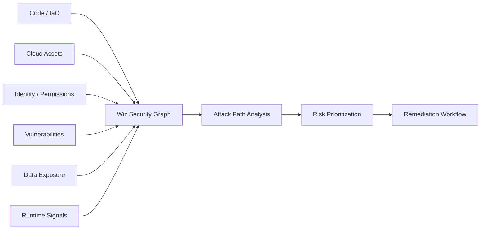

> **TL;DR**
>
> Wiz는 클라우드 자산, 권한, 취약점, 데이터, 코드, 런타임을 연결해
> 클라우드 위험 구조와 공격 경로를 줄이는 **Cloud Risk Graph / CNAPP 플랫폼**입니다.
>
> PLURA-XDR은 WAF를 최초 핵심 방어선으로 두고,
> EDR, SIEM, SOAR, Forensic을 자동 연결해
> **탐지·차단·분석·대응·증거화·재발 방지**까지 수행하는 **전주기 사이버보안 플랫폼**입니다.
>
> 두 제품은 우열 비교 대상이라기보다,
> **클라우드 위험 관리**와 **웹/API 중심 전주기 보안 운영**이라는 서로 다른 문제를 해결합니다.

---

## 이 글은 누구를 위한 글인가?

이 글은 특정 제품의 기능 목록을 단순 비교하려는 글이 아닙니다.

CISO, 보안 책임자, 보안 아키텍트, SOC 운영자, 클라우드 보안 담당자가
“우리 조직에 필요한 보안 플랫폼의 중심축이 무엇인가”를 판단할 수 있도록
Wiz와 PLURA-XDR의 설계 철학과 운영 목적을 비교하는 글입니다.

따라서 본문에서는
제품 이름보다 **보호 대상**,
기능 개수보다 **중심 데이터**,
마케팅 문구보다 **운영 흐름**을 기준으로 두 제품을 구분합니다.

---

📉 최근 보안 시장에서는  
CNAPP, XDR, CDR, CSPM, CWPP, SIEM, SOAR, WAF, EDR, AI 보안 같은 표현이 함께 쓰이면서  
서로 다른 제품이 마치 같은 범주의 제품처럼 보일 때가 많습니다.

Google Cloud 산하의 Wiz와 PLURA-XDR도  
둘 다 “보안 플랫폼”, “위협 탐지”, “대응”, “AI 보안” 같은 표현을 사용할 수 있습니다.

하지만 먼저 분명히 해야 할 점이 있습니다.

> **두 제품은 같은 문제를 같은 방식으로 풀기 위해 설계된 제품이 아닙니다.**

이 글의 목적은 Wiz를 낮게 평가하거나,  
반대로 PLURA-XDR을 과장하는 데 있지 않습니다.

오히려 반대로,  
**Wiz가 강한 영역을 먼저 인정하고**,  
그 위에서  
**PLURA-XDR이 다른 축에서 어떤 문제를 해결하는지**  
구분해 보려는 데 있습니다.

즉, 질문은 이것입니다.

> **Wiz와 PLURA-XDR 중 무엇이 더 좋은가?**  
> 가 아니라,  
> **두 제품은 애초에 무엇을 중심에 두고 설계되었는가?**

---

## 1. 먼저 결론부터 말하면

Google은 2026년 3월 Wiz 인수 완료를 발표했으며,  
Wiz 팀은 Google Cloud에 합류하고 Wiz 브랜드는 유지된다고 밝혔습니다.  
Google은 Wiz를 클라우드 및 AI 보안 플랫폼으로 설명하며,  
클라우드·하이브리드 환경 보호와 위협 예방·탐지·대응 가속을 강조합니다. [[1]](#ref-1)

참고로 2024년에는 Google 모회사 Alphabet과 Wiz의 약 230억 달러 규모 인수 논의가
한 차례 결렬된 것으로 보도된 바 있습니다. [[11]](#ref-11)
그러나 이후 Google은 2026년 3월 11일 Wiz 인수 완료를 공식 발표했습니다.
따라서 이 글에서는 **2026년 현재 Google Cloud 산하의 Wiz**를 기준으로 비교합니다.

Wiz의 핵심은  
클라우드 자산, 워크로드, 취약점, 설정 오류, 권한, 데이터, 코드, 런타임 신호를  
하나의 위험 맥락으로 연결해 보는 것입니다.  
Wiz는 코드, 클라우드, 런타임을 하나의 보안 그래프로 연결한다고 설명하고,  
CNAPP 관점에서는 CSPM, CWPP, CIEM, KSPM, DSPM, CDR 같은 클라우드 보안 영역을 통합적으로 다룹니다. [[2]](#ref-2) [[3]](#ref-3)

반면 PLURA-XDR은 공식 문서에서  
WAF, EDR, Forensic, SMS, SOAR, SIEM이 수직 통합된 Cloud SECaaS 플랫폼으로 설명됩니다.  
또 MITRE ATT&CK 기반 대응, 크리덴셜 스터핑과 APT 대응, 운영체제 감사 기능,  
웹 요청/응답 본문(Post-body, Resp-body) 로그 생성 및 분석을 핵심 요소로 제시합니다. [[6]](#ref-6)

아주 단순하게 정리하면 다음과 같습니다.

1. **Wiz는 클라우드 위험 구조와 공격 경로를 보는 Cloud Risk Graph / CNAPP 플랫폼**
2. **PLURA-XDR은 WAF부터 EDR, SIEM, SOAR, Forensic까지 자동화 흐름으로 연결하는 WAF-first 전주기 사이버보안 플랫폼**

더 짧게 표현하면 다음과 같습니다.

> **Wiz는 Cloud-to-Code Risk Graph 중심이고,  
> PLURA-XDR은 WAF-first Full-cycle Cybersecurity 중심입니다.**

이 표현에서 중요한 점은  
Wiz를 단순한 취약점 스캐너로 낮춰 보아도 안 되고,  
PLURA-XDR을 단순한 침해 추적 도구로 좁혀 보아도 안 된다는 것입니다.

Wiz는 클라우드 위험을 그래프로 연결해 우선순위화하는 데 강하고,  
PLURA-XDR은 웹 공격의 최초 접점인 WAF를 시작으로  
호스트 행위 분석, 실시간 로그 상관분석, 자동 대응, 포렌식 증거화까지 연결하는 데 강합니다.

---

## 2. 더 쉽게 말하면: 위험 지도 vs 전주기 방어 체계

Wiz와 PLURA-XDR의 차이는 보안 용어만으로 설명하면 어렵습니다.  
둘 다 “보안 플랫폼”이라는 표현을 사용할 수 있기 때문입니다.

일반 독자에게는 다음처럼 설명하는 편이 더 쉽습니다.

> **Wiz는 클라우드의 위험 지도를 그리는 제품이고,  
> PLURA-XDR은 정문 방어, 관제, 현장 대응, 증거 보존을 하나로 묶은 전주기 방어 체계입니다.**

### 2.1 Wiz는 “어디가 위험한가?”를 묻는다

Wiz는 클라우드 환경을 보면서 다음과 같은 질문을 합니다.

> “어느 서버가 인터넷에 노출되어 있는가?”  
> “누가 너무 많은 권한을 갖고 있는가?”  
> “취약한 워크로드가 민감 데이터에 접근할 수 있는가?”  
> “코드, 클라우드 설정, 런타임 상태가 결합되어 실제 공격 경로가 되는가?”

즉 Wiz는  
**사고가 나기 전에 클라우드의 위험한 구조를 찾아 우선순위를 정하는 제품**에 가깝습니다.

비유하면, 건물의 문, 창문, 열쇠, 금고 위치, 출입 권한을 점검하면서  
“이 건물은 어떤 경로로 침입당할 수 있는가?”를 미리 보는 방식입니다.

그래서 Wiz의 핵심 질문은 다음과 같습니다.

> **우리 클라우드 환경에서 어디가 위험한가?**

### 2.2 PLURA-XDR은 “어떻게 막고, 어떻게 연결하고, 어떻게 증거화할 것인가?”를 묻는다

PLURA-XDR은 웹/API 서비스와 서버, 계정, 호스트 행위, 포렌식 증거를 보면서 다음과 같은 질문을 합니다.

> “공격자의 최초 웹 요청을 WAF에서 탐지·차단할 수 있는가?”  
> “그 이벤트를 EDR과 감사 로그로 연결해 호스트 행위를 확인할 수 있는가?”  
> “SIEM이 WAF·EDR·계정·서버 로그를 하나의 사건으로 상관분석할 수 있는가?”  
> “SOAR가 차단, 격리, 알림, 티켓 발행 같은 대응을 자동화할 수 있는가?”  
> “Forensic이 변경 흔적과 증거를 자동으로 남길 수 있는가?”

즉 PLURA-XDR은  
**웹 공격의 최초 방어부터 호스트 행위 확인, 대응 자동화, 포렌식 증거화까지 연결하는 전주기 사이버보안 플랫폼**입니다.

비유하면,  
정문 보안요원(WAF), 관제실(SIEM), 현장 대응팀(EDR/SOAR), 증거 보관실(Forensic)이  
각각 따로 움직이는 것이 아니라 하나의 지휘 체계로 자동 연결되는 구조입니다.

그래서 PLURA-XDR의 핵심 질문은 다음과 같습니다.

> **공격을 최초 접점에서 막고, 이후 행위와 증거까지 자동으로 연결할 수 있는가?**

---

## 3. Wiz를 제대로 인정해야 비교가 공정해진다

Wiz는 단순한 클라우드 취약점 스캐너가 아닙니다.

Wiz의 강점은  
클라우드 자산, 취약점, 권한, 데이터, 노출 상태, 코드, 런타임 신호를 연결해  
실제 공격 경로가 될 수 있는 위험 조합을 우선순위화하는 데 있습니다.

Wiz는 공식적으로 코드, 클라우드, 런타임을 하나의 보안 그래프로 연결한다고 설명합니다.  
이 컨텍스트를 기반으로 위험 감소와 위협 대응을 자동화하고,  
AI 시대의 빠른 개발 속도에 맞춰 보안을 운영하도록 돕는다는 방향을 제시합니다. [[2]](#ref-2)

또 Google Cloud 문서는 Wiz Security Graph가 자산과 연결 관계를 노드와 엣지 그래프로 구성하고,  
“toxic risk combinations”, 즉 위험한 조합을 식별해 Wiz Issues로 표시하며  
알림과 자동화된 수정 워크플로우로 이어질 수 있다고 설명합니다. [[4]](#ref-4)

따라서 Wiz의 강점은 다음과 같습니다.

- 멀티클라우드 자산 가시성
- 클라우드 설정 오류와 취약점 우선순위화
- 과도한 권한과 사용되지 않는 권한 식별
- 인터넷 노출, 취약점, 민감 데이터 접근의 조합 분석
- Kubernetes, 컨테이너, 서버리스, IaC, DevSecOps 흐름과의 연결
- Security Graph 기반 공격 경로 분석
- 코드·클라우드·런타임을 연결한 위험 수정 워크플로우
- 선택적 런타임 센서와 클라우드 로그를 활용한 위협 탐지·대응 영역 확장
- Google Security Operations, Google Threat Intelligence 등 Google Cloud 보안 포트폴리오와의 결합 가능성 [[1]](#ref-1) [[5]](#ref-5)

즉 Wiz를 단순히 “예방 도구”라고만 표현하면 부족합니다.

더 정확히는 다음과 같습니다.

> **Wiz는 클라우드 환경에서 위험을 발견하고, 공격 경로를 줄이고,  
> 개발·보안·플랫폼 팀이 무엇을 먼저 고쳐야 하는지 판단하도록 돕는  
> Cloud Risk Graph / CNAPP 플랫폼입니다.**

Wiz가 특히 자연스러운 환경은  
멀티클라우드, Kubernetes, 컨테이너, 서버리스, IaC, 클라우드 권한 관리,  
클라우드 데이터 노출 관리가 복잡한 조직입니다.

이런 조직에서는 “공격이 실제로 들어왔을 때 무엇을 할 것인가”도 중요하지만,  
그 전에 “공격 경로가 될 수 있는 위험 조합을 어떻게 줄일 것인가”가 매우 중요합니다.

바로 이 지점에서 Wiz의 가치는 큽니다.

---

## 4. PLURA-XDR에서 WAF는 단순 부가 기능이 아니다

PLURA-XDR을 설명할 때 가장 먼저 강조해야 할 부분은  
**WAF가 공격자의 최초 핵심 방어 대응 지점**이라는 점입니다.

웹 서비스와 API를 운영하는 조직에서 공격자는 대개  
로그인 페이지, API 엔드포인트, 게시판, 파일 업로드, 관리자 페이지, 취약한 웹 애플리케이션을 먼저 두드립니다.

이때 WAF는 단순히 “차단 로그를 하나 만드는 장비”가 아닙니다.

PLURA-XDR 관점에서 WAF는 다음 역할을 합니다.

- 공격자의 최초 웹 요청을 탐지한다.
- SQL Injection, XSS, 명령 실행, 웹셸 업로드, 인증 우회, 크리덴셜 스터핑 같은 웹 공격을 차단한다.
- 웹 요청 본문(Post-body), 응답 본문(Resp-body), 헤더, 쿠키, 로그인 행위, 계정 정보를 분석한다.
- WAF에서 탐지한 IP, URL, 계정, 페이로드를 SIEM·EDR·Forensic으로 넘겨 후속 행위를 자동 상관한다.
- 미지 공격과 제로데이 징후에 대해서는 탐지 근거와 차단 정책, 가상패치, 재발 방지 근거를 남긴다.

PLURA-WAF는 웹 요청 헤더·본문, 응답 본문, 로그인 행위와 서버 이벤트를 함께 분석하고,  
SIEM·EDR·Forensic과 연결해  
탐지 → 차단 → 상관분석 → 증거화 → 재발 방지로 이어지는 웹 보안 체계라고 설명됩니다. [[7]](#ref-7)

따라서 PLURA-XDR에서 WAF는 부가 모듈이 아니라,  
**공격자가 처음 만나는 방어선이자 전체 자동화 흐름의 시작점**입니다.

> **PLURA-XDR의 출발점은 “공격이 끝난 뒤 찾아보자”가 아니라,  
> “웹 공격을 최초 지점에서 막고, 그 결과를 EDR·SIEM·SOAR·Forensic으로 자동 연결하자”입니다.**

---

## 5. PLURA-XDR은 전주기 사이버보안 플랫폼이다

PLURA-XDR을 단순히 “침해 추적·대응 플랫폼”이라고만 부르면 핵심이 약해집니다.

PLURA-XDR의 구조는 다음 흐름에 가깝습니다.

```text
WAF 탐지·차단
   ↓
SIEM 실시간 로그 수집·상관분석
   ↓
EDR 호스트 행위 분석
   ↓
SOAR 정책 기반 대응 자동화
   ↓
Forensic 증거 수집·변경 비교·보고
   ↓
재발 방지 정책 반영
```

이 흐름은 단순한 사후 분석이 아닙니다.  
공격이 웹에서 시작되는 순간부터, 시스템 내부 행위와 증거화까지 연결되는  
**전주기 보안 운영 흐름**입니다.

### 5.1 예방과 차단

PLURA-XDR의 첫 번째 축은 WAF입니다.

WAF는 웹/API 공격을 최초 접점에서 탐지하고 차단합니다.  
요청 본문, 응답 본문, 헤더, 쿠키, 계정 행위를 함께 분석함으로써  
단순 URL·상태 코드 중심의 웹 보안보다 더 많은 공격 근거를 확보합니다. [[7]](#ref-7)

### 5.2 탐지와 실시간 로그 분석

두 번째 축은 실시간 로그 분석입니다.

PLURA-SIEM은 웹방화벽, 호스트보안, 포렌식, SOAR, 리소스 모니터링, 원격보안관제를 연결하는  
AI-XDR 플랫폼의 중앙 분석 엔진으로 설명됩니다.  
또 웹 요청 → 서버 행위 → 계정 접근 → PC 이벤트 → 포렌식 증거까지 이어지는 공격 체인을  
맥락으로 분석한다고 설명합니다. [[8]](#ref-8)

여기서 중요한 점은  
PLURA-XDR의 로그 분석이 단순히 “나중에 검색하기 위해 저장하는 것”이 아니라는 점입니다.

- WAF 이벤트
- 웹 요청/응답 본문
- 계정 행위
- Windows 고급 감사 정책 로그
- Linux Audit 로그
- 서버·PC 이벤트
- 애플리케이션 로그
- 포렌식 아티팩트

이 데이터를 하나의 사건 흐름으로 연결해  
공격의 의미와 우선순위를 실시간으로 판단하는 것이 핵심입니다.

### 5.3 EDR 기반 호스트 행위 확인

세 번째 축은 EDR입니다.

WAF가 웹 공격을 탐지·차단하더라도,  
보안팀은 “실제로 서버 내부에서 어떤 일이 벌어졌는가?”를 확인해야 합니다.

예를 들어 다음과 같은 행위입니다.

- 서버 명령 실행
- 웹셸 생성
- 파일 생성 또는 변경
- 의심 프로세스 실행
- 권한 상승
- 계정 사용
- 내부 이동
- 외부 네트워크 접속

PLURA-XDR은 이 호스트 행위를 WAF 이벤트와 분리해서 보지 않고,  
웹 요청 → 서버 행위 → 계정 접근 → 포렌식 증거로 이어지는 공격 체인 안에서 해석합니다. [[8]](#ref-8)

### 5.4 SOAR 기반 대응 자동화

네 번째 축은 자동 대응입니다.

PLURA-XDR의 자동화는 단순히 알림을 보내는 수준이 아니라,  
정책 기반 또는 승인 기반으로 다음 조치를 연결하는 운영 흐름입니다.

- 공격 IP 차단
- 계정 보호
- 격리
- 티켓 발행
- 알림 전송
- 대응 이력 보존
- 분석 보고서 생성

PLURA-SIEM은 AI SecOps 자동화로  
트라이아지, 격리·차단, 재현, 증거화, 보고서 생성을 지원한다고 설명합니다. [[8]](#ref-8)

즉 PLURA-XDR의 목표는  
탐지에서 멈추지 않고,  
**정책 기반·승인 기반 자동화로 대응 시간을 줄이는 것**입니다.

### 5.5 Forensic 기반 증거화와 재발 방지

마지막 축은 포렌식입니다.

PLURA-Forensic은 최초 상태와 현재 상태를 자동 비교하여 변경 흔적을 증거로 보여주고,  
WAF·EDR·SIEM 탐지 이벤트와 포렌식 아티팩트를 연결해  
침해 확인, 원인 분석, 대응, 재발 방지까지 지원한다고 설명합니다. [[9]](#ref-9)

여기서 포렌식은 사후 보고용 부록이 아닙니다.

PLURA-XDR 전주기 흐름에서 포렌식은  
**탐지와 대응의 결과를 증거로 확정하고, 다음 방어 정책을 개선하는 마지막 연결 고리**입니다.

따라서 PLURA-XDR은 다음과 같이 정리하는 것이 더 정확합니다.

> **PLURA-XDR은 WAF로 최초 공격을 막고,  
> EDR로 호스트 행위를 확인하며,  
> SIEM으로 전체 로그를 상관분석하고,  
> SOAR로 대응을 자동화하며,  
> Forensic으로 증거화와 재발 방지까지 연결하는 전주기 사이버보안 플랫폼입니다.**

---

## 6. 감사 정책 기반 실시간 로그 분석은 왜 중요한가?

PLURA-XDR 설명에서 빼놓을 수 없는 또 하나의 축은  
**감사 정책 기반 실시간 로그 분석**입니다.

보안에서 로그는 CCTV와 같습니다.  
하지만 CCTV가 있어도 녹화가 꺼져 있으면 아무 장면도 남지 않습니다.  
녹화가 켜져 있어도 관제실에서 실시간으로 보지 않으면 대응이 늦어집니다.

감사 정책도 마찬가지입니다.

- **감사 정책**은 “무엇을 기록할지 정하는 설정”입니다.
- **로그 수집**은 “기록된 행위를 보안 플랫폼으로 가져오는 과정”입니다.
- **실시간 로그 분석**은 “이상 행위를 즉시 판단하는 과정”입니다.
- **상관분석**은 “단일 로그가 아니라 공격 흐름으로 해석하는 과정”입니다.
- **포렌식**은 “그 흐름을 증거로 남기는 과정”입니다.

감사 정책이 제대로 설정되어 있지 않으면  
로그인, 프로세스 실행, 권한 변경, 서비스 생성, 스케줄 작업, 파일 변경 같은  
핵심 행위가 남지 않을 수 있습니다.

반대로 감사 정책이 켜져 있더라도  
생성된 로그를 실시간으로 분석하지 못하면  
보안팀은 공격이 진행되는 동안 의미 있는 경보를 놓칠 수 있습니다.

따라서 PLURA-XDR의 차별점은  
**로그를 많이 모은다**가 아닙니다.

더 정확히는 다음입니다.

> **감사 정책으로 의미 있는 행위 로그가 남도록 하고,  
> 그 로그를 WAF·EDR·SIEM·SOAR·Forensic 흐름에서 실시간으로 분석·상관·대응·증거화한다.**

이 점 때문에 PLURA-XDR은  
단순 로그 저장소나 사후 검색 도구가 아니라,  
전주기 사이버보안 운영 플랫폼으로 보는 것이 적절합니다.

---

## 7. 구조도로 보면 더 쉽다

긴 설명보다 구조도로 보면 두 제품의 차이가 더 명확해집니다.

### 7.1 Wiz: Code → Cloud → Runtime을 연결하는 위험 그래프

Wiz는 코드, 클라우드 자산, 권한, 취약점, 데이터, 런타임 신호를 하나의 보안 맥락으로 연결하고,
그 관계를 바탕으로 공격 경로와 조치 우선순위를 도출하는 구조에 가깝습니다. [[2]](#ref-2) [[3]](#ref-3) [[4]](#ref-4)



이 흐름에서 중요한 것은 “경보를 많이 보여주는 것”이 아니라,
클라우드 환경에서 **실제 침해로 이어질 수 있는 위험 조합을 찾아 무엇부터 고칠지 정하는 것**입니다.

### 7.2 PLURA-XDR: WAF → SIEM → EDR → SOAR → Forensic 전주기 자동화

PLURA-XDR은 WAF를 공격자의 최초 핵심 방어선으로 두고,
웹 요청/응답 본문, 감사 정책 기반 로그, EDR 이벤트, SIEM 상관분석, SOAR 자동 대응, Forensic 증거화를
하나의 전주기 흐름으로 연결하는 구조에 가깝습니다. [[6]](#ref-6) [[7]](#ref-7) [[8]](#ref-8) [[9]](#ref-9)


이 흐름에서 중요한 것은 WAF가 단순한 부가 기능이 아니라는 점입니다.
PLURA-XDR에서 WAF는 웹/API 공격의 최초 접점을 방어하고,
이후 EDR·SIEM·SOAR·Forensic이 자동으로 연결되도록 만드는 시작점입니다.

---

## 8. 가장 중요한 차이: 중심 데이터와 방어 흐름이 다르다

두 제품의 차이는  
기능 이름을 나열하는 것보다  
**무엇을 중심 데이터로 삼고, 어떤 방어 흐름을 기본값으로 보는가**를 보면 더 명확해집니다.

### 8.1 Wiz의 중심 데이터

Wiz의 중심 데이터는 다음에 가깝습니다.

- 클라우드 자산
- 클라우드 설정
- 권한과 ID
- 취약점
- 컨테이너와 Kubernetes
- 데이터 노출
- 코드와 IaC
- 런타임 신호
- 공격 경로

Wiz의 관점은 다음과 같습니다.

> **클라우드 환경에서 어디가 위험한가?**  
> **어떤 조합이 실제 침해 경로가 되는가?**  
> **개발·클라우드 운영팀이 무엇을 먼저 고쳐야 하는가?**

### 8.2 PLURA-XDR의 중심 데이터

PLURA-XDR의 중심 데이터는 다음에 가깝습니다.

- 웹 요청 본문(Post-body)
- 웹 응답 본문(Resp-body)
- WAF 탐지·차단 이벤트
- 계정과 로그인 행위
- Windows 고급 감사 정책 로그
- Linux Audit 로그
- 서버·PC 이벤트
- 프로세스, 파일, 네트워크 행위
- SIEM 상관분석 결과
- SOAR 대응 이력
- 포렌식 스냅샷과 증거

PLURA-XDR의 관점은 다음과 같습니다.

> **공격자의 최초 웹 요청을 막을 수 있는가?**  
> **차단 전후의 로그와 호스트 행위를 실시간으로 연결할 수 있는가?**  
> **탐지·차단·상관분석·대응·증거화·재발 방지까지 자동화할 수 있는가?**

---

## 9. 기능 중심으로 비교하면

| 항목 | Google Cloud 산하 Wiz | PLURA-XDR |
|---|---|---|
| 제품의 기본 성격 | 클라우드·AI 보안 플랫폼, CNAPP 중심 | WAF·EDR·SIEM·SOAR·Forensic 수직 통합 전주기 사이버보안 플랫폼 |
| 핵심 출발점 | 클라우드 자산, 워크로드, 권한, 취약점, 데이터, 코드, 런타임, 공격 경로 | WAF 기반 최초 방어, 웹 요청/응답 본문, 감사 정책 기반 호스트 로그, 포렌식 증거 |
| 주된 질문 | “클라우드에서 어떤 위험 조합이 실제 공격 경로인가?” | “웹 공격을 최초 지점에서 막고, 이후 행위와 증거까지 자동 연결할 수 있는가?” |
| 중심 환경 | AWS, Azure, GCP, Oracle Cloud, Kubernetes, 컨테이너, 서버리스, IaC | 웹 서비스, API, 로그인 페이지, 서버, PC, 운영체제, 계정 |
| 수집 철학 | 클라우드 환경 가시성, 에이전트리스 스캐닝, 클라우드 로그, 선택적 런타임 센서 | WAF 본문 로그 + 감사 정책 로그 + EDR 행위 로그 + 포렌식 증거를 단일 흐름으로 연결 |
| 분석 방식 | Security Graph 기반 위험 관계 분석과 우선순위화 | 웹 요청 → WAF 차단 → EDR 행위 확인 → SIEM 상관분석 → SOAR 대응 → Forensic 증거화 |
| 강한 영역 | CSPM, CNAPP, 취약점 우선순위화, 클라우드 권한, Kubernetes, DevSecOps, AI 애플리케이션 보안 | WAF 최초 방어, 실시간 로그 분석, 크리덴셜 스터핑, 웹셸, 명령 실행, 계정 공격, 자동 대응, 포렌식 |
| 웹 요청/응답 본문 | 제품의 핵심 출발점은 아님 | 핵심 강점으로 제시 |
| WAF의 위치 | 기본 정체성은 WAF가 아님 | 공격자의 최초 핵심 방어 대응 지점 |
| EDR/호스트 행위 | 런타임 센서와 클라우드 워크로드 관점 | Windows 고급 감사 정책, Linux Audit 등 호스트 행위 로그를 WAF 이벤트와 연결 |
| 감사 정책 활용 | 직접 비교의 핵심 축은 아님 | 행위 로그가 남도록 감사 정책을 활용하고 실시간 분석 대상으로 삼음 |
| 자동화 | 클라우드 위험 우선순위화와 보안 워크플로우 지원 | WAF→SIEM→EDR→SOAR→Forensic으로 이어지는 정책 기반 자동화 흐름 |
| 포렌식 | 클라우드 리스크·자산 맥락 중심 | 스냅샷 비교, 변경 흔적, 탐지 이벤트, 원본 로그, 대응 이력의 증거화 |
| 운영팀 관점 | 클라우드 보안팀, DevSecOps, 플랫폼팀, 인프라팀 | 보안관제팀, 웹서비스 운영팀, 서버보안팀, 침해대응팀, 감사대응팀 |
| 한 줄 요약 | Cloud-to-Code Risk Graph | WAF-first Full-cycle Cybersecurity |

이 비교의 핵심은  
Wiz가 부족하다는 뜻도 아니고,  
PLURA-XDR이 Wiz를 단순 대체한다는 뜻도 아닙니다.

오히려 반대로,  
**Wiz는 클라우드 위험을 줄이는 데 목적이 분명한 제품**이고,  
**PLURA-XDR은 웹 공격의 최초 방어부터 EDR, SIEM, SOAR, 포렌식까지 전주기 보안 운영을 자동화하는 데 목적이 분명한 제품**이라는 뜻입니다.

---

## 10. 도입 검토 기준으로 다시 비교하면

기능 목록보다 더 중요한 것은  
“우리 조직이 어떤 문제를 먼저 해결해야 하는가”입니다.

| 검토 기준 | Wiz가 더 자연스러운 경우 | PLURA-XDR이 더 자연스러운 경우 |
|---|---|---|
| 주요 공격 표면 | 멀티클라우드, Kubernetes, 컨테이너, 서버리스, IaC | 웹 서비스, API, 로그인, 파일 업로드, 서버, 계정 |
| 1차 목표 | 클라우드 위험 구조 파악과 우선순위화 | 웹 공격 최초 차단과 전주기 보안 운영 자동화 |
| 핵심 데이터 | 클라우드 자산, 권한, 취약점, 데이터, 코드, 런타임 | WAF 이벤트, 웹 요청/응답 본문, 감사 로그, EDR 이벤트, 포렌식 증거 |
| 예방 방식 | 취약점·노출·권한·데이터 조합을 줄여 공격 경로 축소 | WAF에서 최초 공격을 탐지·차단하고 후속 대응 자동화 |
| 탐지 방식 | 클라우드 컨텍스트와 런타임 신호 기반 위험 탐지 | WAF·EDR·SIEM 로그 상관분석 기반 실시간 탐지 |
| 대응 방식 | 클라우드 위험 수정, 보안 워크플로우, 개발팀 연계 | SOAR 기반 차단·격리·알림·티켓·보고 자동화 |
| 증거화 | 클라우드 위험 맥락과 자산 관계 중심 | 원본 로그, 감사 로그, 포렌식 아티팩트, 대응 이력 중심 |
| 도입 전 확인 | 클라우드 범위, 권한 모델, 런타임 센서 범위, Google Cloud 연계, 비용 | WAF 정책, 감사 정책, 로그량, OS 지원 범위, 관제 프로세스, PoC 탐지 품질 |
| 함께 사용 가능성 | 클라우드 위험을 사전에 줄이는 역할 | 웹/API 공격과 호스트 침해 대응을 운영화하는 역할 |

이 표를 보면  
두 제품이 같은 “보안 플랫폼”이라는 이름 아래 있어도  
실제로는 다른 층위의 문제를 풀고 있다는 점이 더 분명해집니다.

---

## 11. Wiz가 더 자연스러운 경우

다음과 같은 조직에는 Wiz가 더 직접적으로 맞습니다.

- AWS, Azure, GCP, Oracle Cloud 등 멀티클라우드 사용 비중이 높은 경우
- Kubernetes, 컨테이너, 서버리스 사용이 많은 경우
- 클라우드 자산과 권한이 복잡한 경우
- 취약점이 너무 많아 무엇부터 고쳐야 할지 우선순위화가 필요한 경우
- DevSecOps, IaC, 코드-클라우드 연결 관리가 중요한 경우
- 클라우드 설정 오류, 과도한 권한, 인터넷 노출, 민감 데이터 접근의 조합을 줄이고 싶은 경우
- Google Security Operations, Google Threat Intelligence, Mandiant 기반 운영과의 결합을 검토하는 경우
- AI 애플리케이션, AI 개발 수명주기, AI 런타임 위험을 클라우드 보안 맥락에서 관리하려는 경우

즉,  
**클라우드 환경의 공격 경로를 줄이고, 개발·인프라 팀이 고쳐야 할 우선순위를 명확히 하려는 조직**에는 Wiz가 자연스럽습니다.

---

## 12. PLURA-XDR이 더 자연스러운 경우

반대로 다음과 같은 조직에는 PLURA-XDR이 더 직접적으로 맞습니다.

- 웹 서비스, API, 로그인 페이지가 주요 공격 표면인 경우
- WAF를 공격자의 최초 핵심 방어 대응 지점으로 운영하고 싶은 경우
- 웹 요청 본문과 응답 본문을 실제 분석 근거로 남기고 싶은 경우
- SQL Injection, XSS, RCE, 웹셸, 데이터 유출 징후 대응이 중요한 경우
- 크리덴셜 스터핑, 브루트포스, 계정 탈취 대응이 중요한 경우
- 웹 공격 이후 서버 명령 실행, 파일 생성, 권한 상승, 내부 이동을 확인해야 하는 경우
- Windows 고급 감사 정책, Linux Audit 등 감사 로그를 보안 분석에 적극 활용하고 싶은 경우
- 로그가 쌓인 뒤 검색하는 수준이 아니라 실시간 탐지·상관분석·자동 대응까지 연결하고 싶은 경우
- WAF, EDR, SIEM, SOAR, Forensic을 따로 운영하지 않고 하나의 자동화 흐름으로 보고 싶은 경우
- 탐지 근거, 원본 로그, 상관 이벤트, 포렌식 증거, 대응 이력을 감사와 보고서에 활용해야 하는 경우

즉,  
**웹 공격의 최초 방어부터 호스트 행위 분석, 자동 대응, 포렌식 증거화, 재발 방지까지 하나의 전주기 흐름으로 운영하고 싶은 조직**에는  
PLURA-XDR의 구조가 더 직접적으로 맞닿아 있습니다.

---

## 13. 두 제품은 함께 쓰일 수도 있다

Wiz와 PLURA-XDR은 반드시 하나만 선택해야 하는 관계는 아닙니다.

예를 들어 멀티클라우드와 Kubernetes를 대규모로 운영하는 조직이라면  
Wiz를 통해 클라우드 자산, 권한, 취약점, 노출 상태, 공격 경로를 지속적으로 줄일 수 있습니다.

동시에 대외 웹 서비스와 API가 주요 공격 표면이라면  
PLURA-XDR을 통해 WAF에서 최초 공격을 차단하고,  
EDR과 감사 로그로 호스트 행위를 확인하며,  
SIEM·SOAR·Forensic으로 탐지·대응·증거화·재발 방지까지 자동화할 수 있습니다.

이 경우 Wiz는 클라우드 위험을 줄이는 역할을 하고,  
PLURA-XDR은 웹 공격과 서버 침해 대응을 전주기로 운영하는 역할을 합니다.

즉 두 제품은 일부 영역에서 경쟁할 수 있지만,  
조직 환경에 따라 서로 보완적인 보안 계층이 될 수도 있습니다.

---

## 14. 도입 전 확인할 사항

공정한 비교라면 강점만 볼 것이 아니라  
도입 전 확인해야 할 조건도 함께 봐야 합니다.

### 14.1 Wiz 도입 전 확인할 사항

Wiz는 클라우드 위험 관리와 공격 경로 우선순위화에 강합니다.  
다만 조직이 기대하는 보안 운영 방식에 따라 다음 사항은 별도로 확인해야 합니다.

- 보호 대상이 클라우드 자산 중심인지, 웹/API 트래픽 중심인지
- WAF 기반 실시간 차단이 필요한지
- 웹 요청/응답 본문 수준의 증거 확보가 필요한지
- 호스트 감사 로그와 포렌식 증거를 어느 수준까지 요구하는지
- 런타임 센서 적용 범위와 운영 부담은 어느 정도인지
- Google Cloud 통합이 장점인지, 멀티클라우드 독립성이 더 중요한지
- 기존 SOC, SIEM, SOAR, 티켓 시스템과의 연동 방식은 무엇인지
- 가격 산정 기준과 PoC 검증 항목이 조직 예산과 맞는지

즉 Wiz는 클라우드 위험 관리와 공격 경로 우선순위화에 강하지만,  
웹 공격의 최초 접점 방어, WAF 중심 차단, 웹 본문 로그 기반 증거화가 핵심 요구사항이라면  
별도의 WAF/XDR 운영 체계와 함께 검토하는 것이 현실적입니다.

### 14.2 PLURA-XDR 도입 전 확인할 사항

PLURA-XDR은 WAF, EDR, SIEM, SOAR, Forensic을 하나의 흐름으로 연결하는  
전주기 사이버보안 플랫폼이라는 점에서 강점이 있습니다.

다만 모든 조직에 동일하게 적합한 것은 아닙니다.

도입 전에는 다음 사항을 확인해야 합니다.

- 웹/API가 실제 주요 공격 표면인지
- WAF 정책 운영과 오탐 대응 프로세스를 갖출 수 있는지
- Windows 고급 감사 정책과 Linux Audit 로그를 적절히 활성화할 수 있는지
- 로그 수집량, 보관 기간, 개인정보 처리 기준을 어떻게 설계할지
- EDR 에이전트 배포 범위와 지원 운영체제가 조직 환경에 맞는지
- 기존 SIEM, SOAR, 티켓 시스템, 관제 프로세스와 어떻게 연동할지
- 공개 고객 사례, 레퍼런스, 기술 지원 체계, 운영 지원 범위를 확인했는지
- PoC에서 탐지 정확도, 차단 정책, 대응 자동화, 보고서 품질을 검증할 수 있는지

즉 PLURA-XDR은 웹 공격과 호스트 행위, 포렌식 증거를 전주기로 연결하려는 조직에 강하지만,  
그 효과는 감사 정책 설정, 로그 품질, WAF 정책 운영, 대응 프로세스 성숙도에 따라 달라질 수 있습니다.

### 14.3 가격 비교는 단정하지 않는 것이 맞다

Wiz와 PLURA-XDR 모두 실제 비용은  
보호 대상 수, 워크로드 수, 로그량, 보관 기간, 모듈 구성, 계약 조건에 따라 달라질 수 있습니다.

따라서 공개 단가만으로 단순 비교하기보다  
PoC 단계에서 다음 기준을 함께 봐야 합니다.

- 보호 대상 범위
- 로그 수집량과 보관 기간
- 자동화 범위
- 운영 인력 절감 효과
- 탐지 정확도와 오탐 처리 비용
- 보고서와 감사 대응 효율
- 기존 시스템 연동 비용

---

## 15. “둘 다 XDR인가?”라는 질문에 대하여

이 부분은 조심해서 봐야 합니다.

Wiz는 Google Cloud 산하에서  
위협 예방, 탐지, 대응을 포함하는 더 넓은 보안 플랫폼의 일부로 설명될 수 있습니다.  
Google도 Wiz 인수 이후 클라우드·하이브리드 환경 보호와 위협 예방·탐지·대응 가속을 강조합니다. [[1]](#ref-1)

하지만 제품의 출발점만 놓고 보면  
Wiz의 본질은 전통적인 XDR이라기보다  
**CNAPP, 클라우드 보안 태세, 클라우드 워크로드, ID, 데이터, 코드, 런타임, 공격 경로 관리**에 더 가깝습니다.

반면 PLURA-XDR은  
제품 구성 자체가 WAF, EDR, SIEM, SOAR, Forensic을 수직 통합하는 구조이며,  
웹 요청/응답 본문, 계정 행위, 서버·PC 이벤트, 포렌식 증거를 하나의 플랫폼에서 연결한다고 설명됩니다. [[6]](#ref-6) [[10]](#ref-10)

따라서 더 정확한 표현은 다음과 같습니다.

> **Wiz는 클라우드 보안 플랫폼이 XDR 방향으로 확장되는 구조에 가깝고,  
> PLURA-XDR은 WAF-first 구조로 웹·호스트·로그·대응·포렌식을 처음부터 전주기 흐름으로 묶은 구조에 가깝습니다.**

---

## 16. 독자가 헷갈리지 않도록 피해야 할 표현

Wiz와 PLURA-XDR의 차이를 쉽게 설명하더라도,  
너무 단순하게 말하면 오해가 생길 수 있습니다.

예를 들어 다음과 같은 표현은 피하는 것이 좋습니다.

| 피해야 할 표현 | 이유 |
|---|---|
| “Wiz는 탐지를 못 한다” | Wiz도 탐지·대응 영역을 포함하므로 부정확하게 들릴 수 있음 |
| “PLURA-XDR은 클라우드 보안을 못 한다” | 서버와 클라우드 환경에서 운영될 수 있으므로 단정하면 안 됨 |
| “Wiz와 PLURA-XDR은 경쟁 제품이 아니다” | 일부 보안 예산과 운영 영역에서는 경쟁할 수 있음 |
| “PLURA-XDR이 Wiz보다 상위 제품이다” | 제품 범주와 출발점이 달라서 단순 우열 표현은 설득력이 약함 |
| “Wiz는 예방, PLURA-XDR은 대응만 한다” | 두 제품 모두 예방·탐지·대응 요소를 포함할 수 있으므로 단순화 위험이 있음 |
| “PLURA-XDR은 사후 분석 도구다” | WAF 최초 방어, EDR, SOAR, Forensic 자동화까지 포함한 전주기성을 약화시킴 |

대신 다음처럼 표현하는 것이 더 정확합니다.

> **두 제품은 일부 보안 영역에서 겹칠 수 있지만,  
> 제품의 출발점과 중심 데이터, 방어 흐름이 다릅니다.**

또는 더 쉽게는 이렇게 말할 수 있습니다.

> **Wiz는 클라우드 위험을 줄이는 데 강하고,  
> PLURA-XDR은 WAF 최초 방어부터 EDR·SOAR·Forensic까지 자동화하는 전주기 사이버보안에 강합니다.**

---

> **선택 기준 요약**
>
> 클라우드 자산, 권한, 취약점, 코드, 런타임 위험을 줄이는 것이 우선이면 Wiz가 자연스럽습니다.
>
> 웹/API 공격을 WAF에서 최초 탐지·차단하고,
> EDR·SIEM·SOAR·Forensic까지 자동 연결하는 운영 체계가 필요하면 PLURA-XDR이 자연스럽습니다.
>
> 대규모 클라우드와 대외 웹/API 서비스를 모두 운영한다면
> 두 제품은 경쟁 관계만이 아니라 보완 관계로도 검토할 수 있습니다.

---

## 17. 진짜 질문은 “누가 더 좋으냐”가 아니다

실무에서 더 중요한 질문은 이것입니다.

> **우리 조직이 지금 필요한 것은 클라우드 위험 조합과 공격 경로 관리인가?**  
> **아니면 웹 공격의 최초 방어부터 EDR·SOAR·포렌식까지 자동화되는 전주기 보안 운영인가?**

Wiz와 PLURA-XDR은  
이 질문에 대해 서로 다른 답을 내놓는 제품입니다.

Wiz는  
**클라우드 자산, 취약점, 권한, 데이터, 워크로드, 코드, 런타임을 연결해 공격 경로를 줄이는 것**에 더 가깝습니다.

PLURA-XDR은  
**WAF에서 시작해 EDR, SIEM, SOAR, Forensic으로 이어지는 전주기 보안 과정을 자동화하는 것**에 더 가깝습니다.

따라서 제품 비교의 기준도  
“누가 더 많은 기능명을 갖고 있느냐”  
“누가 더 AI스럽게 보이느냐”가 아니라,

> **무엇을 기본 데이터로 삼는가**  
> **어떤 환경을 기본 보호 대상으로 보는가**  
> **WAF가 최초 방어선으로 동작해야 하는가**  
> **탐지 이후 EDR·SIEM·SOAR·Forensic으로 자동 연결되어야 하는가**  
> **감사 정책 기반 로그를 실시간 분석에 활용해야 하는가**  
> **보안팀이 해결하려는 1차 문제가 무엇인가**

여기에 맞춰져야 합니다.

---

## 18. 결론

Google Cloud 산하 Wiz와 PLURA-XDR은  
같은 “보안 플랫폼”이라는 큰 시장 안에 있을 수 있지만,  
같은 출발점에서 설계된 제품은 아닙니다.

Wiz는  
멀티클라우드 환경에서 자산, 취약점, 설정 오류, 권한, 데이터, 워크로드, 코드, 런타임의 관계를 분석하고  
공격 경로와 위험 조합을 우선순위화하는 데 강합니다.

반면 PLURA-XDR은  
WAF, EDR, SIEM, SOAR, Forensic을 수직 통합하고,  
웹 요청/응답 본문, 감사 정책 기반 운영체제 로그, 서버·PC 이벤트, 계정 행위, 포렌식 증거를 연결해  
웹 공격의 최초 방어부터 호스트 행위 확인, 대응 자동화, 증거화, 재발 방지까지 하나의 흐름으로 운영하는 데 강합니다.

더 정확한 한 줄 결론은 이렇습니다.

> **Wiz는 클라우드 위험을 그래프로 줄이는 플랫폼이고,  
> PLURA-XDR은 WAF부터 EDR, SOAR, Forensic까지 자동화하는 전주기 사이버보안 플랫폼입니다.**

일반 독자에게는 다음 문장이 더 쉽습니다.

> **Wiz는 클라우드의 위험 지도를 그리는 제품이고,  
> PLURA-XDR은 공격자의 최초 접점부터 증거화와 재발 방지까지 이어지는 자동화 방어 체계입니다.**

따라서 “전혀 다른 제품”이라는 이해가 맞습니다.

다만 두 제품은 경쟁만 하는 관계라기보다  
조직 환경에 따라 보완적으로 볼 수도 있습니다.

- **클라우드 자산·권한·취약점·Kubernetes·코드-클라우드 위험 관리가 핵심이면 Wiz**
- **웹 공격·계정 공격·서버 침해·WAF 최초 방어·감사 정책 기반 실시간 로그 분석·자동 대응·포렌식 증거화가 핵심이면 PLURA-XDR**

제품 선택의 출발점은  
제품 이름이 아니라  
**우리 조직의 주 공격 표면이 클라우드인가, 웹/API와 서버인가**입니다.

---

## 참고 자료

<a id="ref-1"></a>[1] Google Cloud Blog, “Welcoming Wiz to Google Cloud: Redefining security for the AI era”, 2026-03-12  
https://cloud.google.com/blog/products/identity-security/google-completes-acquisition-of-wiz

<a id="ref-2"></a>[2] Wiz, “AI Cybersecurity for All Your Cloud and AI Applications”  
https://www.wiz.io/

<a id="ref-3"></a>[3] Wiz, “What is CNAPP? Cloud Native Application Protection Platform”  
https://www.wiz.io/academy/cloud-security/what-is-a-cloud-native-application-protection-platform-cnapp

<a id="ref-4"></a>[4] Google Cloud Architecture Center, “Identify and prioritize security risks with Wiz Security Graph and Google Cloud”  
https://docs.cloud.google.com/architecture/partners/id-prioritize-security-risks-with-wiz

<a id="ref-5"></a>[5] Google Cloud Blog, “Next '26: Redefining security for the AI era with Google Cloud and Wiz”, 2026-04-22  
https://cloud.google.com/blog/products/identity-security/next26-redefining-security-for-the-ai-era-with-google-cloud-and-wiz

<a id="ref-6"></a>[6] PLURA Docs, “제품 | PLURA-XDR Cloud SECaaS Platform”  
https://docs.plura.io/ko/video/company/product

<a id="ref-7"></a>[7] PLURA, “PLURA-WAF | AI-XDR Cloud SaaS Platform”  
https://www.plura.io/ko/platform_waf.html

<a id="ref-8"></a>[8] PLURA, “PLURA-SIEM | AI-XDR 기반 통합보안이벤트관리”  
https://www.plura.io/ko/platform_siem.html

<a id="ref-9"></a>[9] PLURA, “PLURA-Forensic | AI-XDR Cloud SaaS Platform”  
https://www.plura.io/ko/platform_forensic.html

<a id="ref-10"></a>[10] PLURA, “PLURA-AI-XDR Cloud SaaS Platform | AI 해킹 시대 통합 방어 플랫폼”  
https://www.plura.io/ko/platform_xdr.html

<a id="ref-11"></a>[11] Reuters, “Cybersecurity firm Wiz calls off $23 bln deal with Google, memo says”, 2024-07-23  
https://www.reuters.com/markets/deals/wiz-walks-away-23-billion-deal-with-google-memo-says-2024-07-23/
