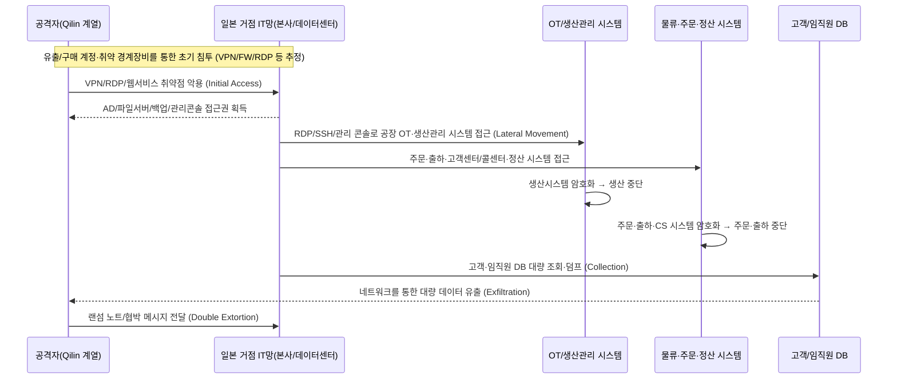

---

title: "아사히 맥주 랜섬웨어 공격 분석 – ‘맥주가 끊기고, 190만 명 정보가 새다’"
date: 2025-12-08
draft: false
description: "2025년 9월 29일 아사히 그룹(Asahi Group Holdings)을 강타한 Qilin 랜섬웨어 공격을 타임라인과 기술 TTP, OT 영향 관점에서 분석하고, 일본·한국 제조업이 무엇을 바로 바꿔야 하는지 정리합니다."
featured_image: "cdn/threats/case-asahi_brewery.png"
tags: ["Asahi", "랜섬웨어", "Qilin", "제조업 보안", "OT 보안", "침해사고", "보안운영"]
---

**요약 한 줄:**
아사히 그룹은 **2025년 9월 29일** ‘시스템 장애’ 공지로 시작해, 이후 **Qilin 랜섬웨어**에 의한 공격과 **약 190만 명 규모의 개인정보 유출 가능성**을 순차적으로 인정했습니다. 이 과정에서 **국내 생산 30여 개 공장의 맥주 생산·주문·출하 시스템이 중단**되고, 편의점·마트에서 ‘**아사히 맥주 품절**’이 현실로 나타났습니다. ([アサヒグループホールディングス][1])

> **핵심 맥락:** 이 사건은 단순한 “맥주 회사 해킹”이 아니라, **OT(공장·설비)와 IT(주문·물류·고객 DB)가 하나의 랜섬웨어 공격에 동시에 마비되는 전형적인 산업 기업 랜섬웨어 시나리오**입니다.  
> 특히, 공격자는 **데이터 유출(약 1.5M 고객 + 27.5만 임직원·가족 정보)** 을 병행한 **이중 갈취(Encryption + Exfiltration)** 패턴을 활용했습니다. ([Bitdefender][2])

※ 한국에서 종종 “**아사이 맥주**”로 잘못 표기되지만, 회사 공식 표기는 **아사히(Asahi) 그룹 홀딩스**입니다.

<!--more-->

---

## 🕒 타임라인(확정·공개된 사실 중심)

* **9월 29일(월)**:

  * 아사히 그룹, “**사이버 공격에 의한 시스템 장애**” 최초 공지(일본 및 글로벌 사이트 동시 공지). ([piyolog][3])
  * 일본 내 **주문·출하·고객센터 시스템 중단**, 생산도 대부분 멈추며 “맥주 생산 올스톱” 상태. ([Business Insider][4])

* **10월 2일(목)**:

  * 아사히 맥주 6개 국내 공장의 **맥주 생산 재개**(Super Dry 일부 라인). ([アサヒグループホールディングス][1])

* **10월 3일(금)**:

  * “시스템 장애에 대한 2차 공지” – 일본 국내 IT 자산에 국한된 장애, 해외 사업에는 영향 제한적이라고 설명. ([アサヒグループホールディングス][1])

* **10월 7일(화)**:

  * **Qilin 랜섬웨어 그룹**, 다크웹 사이트에서 **아사히 공격 책임을 주장**하고

    * 내부 문서로 보이는 이미지 29개 공개
    * **9,300개 이상 파일(약 27GB) 탈취 주장**. ([Reuters][5])

* **10월 8일(수)**:

  * 아사히, 3차 공지에서 **랜섬웨어 공격**임을 명시하고,

    * **무단 전송(Exfiltration)된 것으로 의심되는 데이터가 인터넷 상에서 확인**되었음을 발표.
    * 국내 공장 생산은 일부 재개, Super Dry·Draft Beer·Dry Zero 등 출하를 단계적 재개한다고 공지. ([アサヒグループホールディングス][1])

* **10월 14~15일**:

  * 4차 공지에서 **개인정보 유출 가능성** 공식 언급,
  * 사이버 공격 여파로 **3분기 실적 공시(결산발표) 연기** 발표. ([サイバートラスト株式会社][6])

* **10월~11월**:

  * 일본 편의점·마트(패밀리마트, 세븐일레븐, 로손 등)에서 **아사히 Super Dry 및 일부 제품 품절·공급 제한 안내**. ([Business Insider][4])
  * 일부 유통사, 평소 대비 **10~20% 수준**만 공급되는 상황을 호소. ([ElHuffPost][7])

* **11월 27~12월 2일**:

  * 아사히, 포렌식 결과를 토대로 **약 1.94M 명**의 개인정보 유출 가능성을 인정

    * 약 **152만 명**: 고객센터 문의·상담 이력 고객
    * 약 **27.5만 명**: 임직원·퇴직자·가족 및 외부 연락처 등
    * 포함 정보: 이름·주소·전화·이메일, 일부는 생년월일·성별 등. ([Bitdefender][2])

* **12월 현재**:

  * 일본 내 생산은 **부분 회복**, 그러나 주문·물류·정산 시스템 복구 지연으로 **실적 발표 지연·매출 타격**이 이어짐. ([SecurityBrief Asia][8])

---

## 🧪 Qilin 랜섬웨어 그룹과 아사히 공격 TTP (MITRE ATT&CK 매핑)

아사히 건은 **공식 포렌식 보고서 전체가 공개된 사건은 아닙니다.**
따라서, 여기서는

1. 아사히·언론·보안업체가 밝힌 범위
2. Qilin 그룹의 **일반적인 TTP**

를 조합해 **“가능성이 높은 공격 체인”** 형태로 정리합니다. (가설 부분은 명시)

### 1) 초기 침투(Initial Access)

Qilin은 보통 다음 경로를 이용하는 것으로 알려져 있습니다. ([サイバートラスト株式会社][6])

* **유출/구매한 계정 정보로 VPN·RDP·SaaS에 로그인**
* **취약한 경계장비 악용**

  * 예: **FortiGate/FortiProxy RCE 취약점(CVE-2024-21762, CVE-2024-55591)**
* **공개 웹 서비스·포털·OT 관리 콘솔 취약점**
* **피싱 메일 + Infostealer 연계** 후

  * 크롬 저장 비밀번호·세션 쿠키 탈취 → VPN/AD 우회 로그인

> **MITRE 매핑(가능성 높은 조합)**
>
> * Initial Access – **T1078 (Valid Accounts)**, **T1190 (Exploit Public-Facing Application)**
> * External Remote Services – **T1133**
> * Phishing – **T1566**, Credential Access – **T1555/T1556**

아사히의 경우,

* **일본 국내 IT 자산에 국한된 장애**,
* 공장 OT 및 주문·출하 시스템이 동시에 영향을 받았다는 점을 감안하면, ([アサヒグループホールディングス][1])

> “**본사 또는 일본 거점 네트워크(VPN/경계장비)를 통한 AD/ERP/생산관리망 침투**”  
> 시나리오가 높은 우선순위를 가집니다. (정확한 침투 지점은 비공개)

---

### 2) 내부 확산·권한 상승·OT 도달

Qilin의 **일반적인 내부 확산 패턴**은 다음과 같습니다. ([サイバートラスト株式会社][6])

1. AD/파일서버/백업서버 등 **‘핵심 서버’에 RDP·SMB·SSH로 수평 이동**
2. 원격 관리 도구(RMM)·OT 관리 콘솔·SCADA/PLC 게이트웨이로 확장
3. **백업·스냅샷 시스템 먼저 공격** 후,
4. 최종적으로 **파일/DB/VM/산업제어 시스템 암호화**

> **MITRE 매핑**
>
> * Lateral Movement – **T1021 (Remote Services: SMB/RDP/SSH)**
> * Privilege Escalation – **T1068, T1069 (Permission Groups Discovery)**
> * Discovery – **T1083 (File and Directory Discovery), T1046 (Network Service Scanning)**
> * Impair Defenses – **T1562 (Disable Security Tools, Tamper Backups)**

아사히 사건에서

* 주문·출하·콜센터·고객센터 시스템,
* 국내 30여 개 공장의 생산관리·물류 시스템이 동시 영향을 받은 점을 보면, ([TechRadar][9])

> **IT 코어(ERP/주문/물류)와 OT/제조망에 모두 접근 가능한 계정·네트워크 세그먼트가 손상**되었을 가능성이 높습니다.

---

### 3) 암호화(Encryption) + 데이터 유출(Exfiltration)

Qilin은 **RaaS(서비스형 랜섬웨어)** 그룹으로,
**암호화**와 **대규모 데이터 유출**을 동시에 수행하는 **이중 갈취(Double Extortion)** 전술을 사용합니다. ([Reuters][5])

이번 아사히 건에서 공개된 내용:

* Qilin의 주장

  * 내부 문서 이미지 29개 공개
  * **9,300개 파일(약 27GB) 탈취 주장** ([Reuters][5])
* 아사히 공식 발표 및 후속 분석

  * **약 1.52M 고객 + 27.5만 임직원·가족 등 총 190만 명 규모**의 개인정보가 공격 과정에서 접근되었을 가능성 인정 ([Bitdefender][2])
  * 이름·주소·전화번호·이메일·(일부) 생년월일·성별 포함
  * 아직 다크웹 유출 정황은 확인되지 않았다고 발표(2025-12-02 기준) ([Bitdefender][2])

> **MITRE 매핑**
>
> * Collection – **T1114 (Email), T1119 (Automated Collection)**
> * Exfiltration – **T1041 (Exfiltration Over C2 Channel), T1048 (Exfiltration Over Alternative Protocol)**
> * Impact – **T1486 (Data Encrypted for Impact)**

---

## 💥 영향: “맥주 품절”에서 “190만 명 정보 유출”까지

### 1) 운영(OT/IT) 영향

* 일본 내 30여 개 공장의 **맥주 및 음료 생산 대폭 축소 또는 중단** ([Business Insider][4])
* 주문·출하·고객센터·콜센터 시스템 중단 →

  * **수기 작성(종이·펜·팩스)로 임시 운영**하는 장면이 여러 매체에 보도. ([ElHuffPost][7])
* 전국 편의점·마트에서

  * “아사히 상품 공급 제한·품절 안내”
  * 평소 대비 **10~20% 수준 제품만 입고**되는 지점 다수. ([Business Insider][4])

### 2) 재무·레퓨테이션 영향

* 국내 음료·식품 부문 **10~40% 매출 감소(2025년 10월 기준)** 보도가 나왔으며,
* 랜섬웨어 여파로 **분기 실적 발표 지연**,
* 주가·투자자 신뢰 하락이 동반됐다는 분석이 다수 나옵니다. ([Bitdefender][2])

### 3) 개인정보·규제 리스크

* 최대 190만 명의 개인정보가 공격 과정에서 접근되었을 가능성
* 향후 **피싱·스미싱·맞춤형 스피어 피싱**에 악용될 잠재 위험
* 일본 내 개인정보 보호법(개인정보보호법, APPI) 및 기타 각국 규제 대응 비용 증가. ([Bitdefender][2])

---

## 🧭 공격 개념도 (정황 기반 시나리오)

*(※도식은 공개 정황을 바탕으로 한 개념도이며, 실제 네트워크 구조·로그와 다를 수 있습니다.)*

---

## 🧩 왜 이렇게까지 커졌나? — 구조적 실패 포인트

아사히 관련 일본 기사·분석을 종합하면, 사고의 본질은 **“기본은 했는데, 핵심이 비어 있었다”** 입니다. ([東洋経済オンライン][10])

### 1) IT-OT 네트워크 분리 미흡

* 생산망과 업무망이 **논리적으로는 분리되어 있지만, 운영 현실에서는 다수의 예외 경로**가 존재
* “관리 편의”를 이유로

  * OT 관리 콘솔, 생산계획 시스템, 품질 시스템이 **업무망 AD·계정·PC에서 직접 접근** 가능한 구조

### 2) 백업·DR이 “재해” 기준으로 설계됨

* 지진·정전·화재 등 **물리 재해** 중심 DR 설계
* 랜섬웨어를 가정해

  * **백업 시스템부터 선제 타격**당했을 때의 시나리오는 부족
* **오프라인/에어갭 백업, WORM 스토리지, 스냅샷 격리** 설계가 늦게 도입된 정황. ([cybermagazine.com][11])

### 3) 계정·권한·원격 관리 도구 통합 거버넌스 부재

* Qilin 일반 TTP에서도 드러나듯,

  * **유출 계정 + VPN/원격 관리 도구**가 가장 흔한 초입 통로 ([サイバートラスト株式会社][6])
* 그러나 대형 제조업 특유의

  * 계열사·협력사·외주 인력·설비 벤더 계정·RMM 도구가 **여러 부서에 분산 관리**

### 4) 관측(Observability) 부족

* 공격 초기, 회사 발표는 “시스템 장애” 수준에 머무름 ([アサヒグループホールディングス][1])
* **로그·텔레메트리 통합 뷰가 충분했다면**,

  * “내부에서 무슨 일이 일어나는지”를 더 빨리 파악하고,
  * OT 셧다운·공장 단위 ‘제로 트러스트 모드’ 전환도 더 빠르게 걸 수 있었을 가능성이 큼.

---

## 🛠 **즉시 이행** 체크리스트 (제조·식품·유통사 공통)

아래는 아사히 사건을 기준으로, **한국 제조/식품/유통 기업이 당장 점검해야 할 항목**입니다.

### A. IT-OT 네트워크·계정 구조 재설계

1. **IT ↔ OT 연결 경로 전수조사**

   * 생산관리·SCADA·PLC·공장 MES로 이어지는 **모든 경로(시리얼 게이트웨이, VPN, 점프 서버, RDP, 웹 콘솔)** 리스트화
2. **“한 방에 다 되는” 관리자 계정 제거**

   * IT·OT·클라우드를 모두 열 수 있는 **도메인 관리자/운영자 계정** 분리
3. **OT 접근 전용 Bastion·프록시 도입**

   * 공장 장비·콘솔 접근은 반드시 **중앙 OT Bastion**을 거치도록 강제
   * 세션 녹화·키로깅·명령 감사 필수

### B. 백업·DR의 랜섬웨어 내성 강화

1. **3-2-1+α 전략 구현**

   * 3개 이상 사본, 2개 매체, 1개 오프사이트 **+ 1개 에어갭/WORM**
2. **백업 계정·콘솔을 AD/SSO에서 분리**

   * 일반 업무 계정 탈취로 **백업 삭제가 불가능**하도록 설계
3. **정기 랜섬웨어 모의훈련**

   * “백업 시스템 선 점령”을 가정한 복구 훈련
   * RTO/RPO 실측치와 경영진 보고

### C. Qilin TTP 대응 탐지·차단 룰 (MITRE 기반)

Qilin 일반 TTP를 기준으로, SIEM/XDR에서 최소한 다음은 **사전 정의 룰**로 보유해야 합니다. ([サイバートラスト株式会社][6])

* **초기 침투 관련**

  * 동일 계정의

    * 해외 IP → VPN 로그인 시도
    * 짧은 시간 내 다수 지역에서 로그인(“MFA Fatigue” 포함)
  * FortiGate/FortiProxy, Citrix 등

    * 경계장비/게이트웨이 **RCE/CVE 악용 패턴**
* **내부 이동·권한 상승**

  * 신뢰되지 않은 단말 → 도메인 컨트롤러/백업서버·OT 관리망으로 **급격한 접근 증가**
  * 단기간에 만들어진 신규 계정이

    * 고권한 그룹(도메인 관리자·백업 관리자)에 편입되는 패턴
* **Exfiltration**

  * 고객·임직원 DB에서

    * 평소와 다른 시간대·용량·쿼리 패턴으로 덤프 수행
  * 대량 데이터가

    * 평소 사용하지 않던 프로토콜/목적지로 송출

---

## 🌟 PLURA-XDR 관점 대응 시나리오 (요약)

아사히 사건은 사실상 “**PLURA-XDR이 있어야 하는 이유를 한 번에 보여주는 교과서 사례**”로 볼 수 있습니다.

### 1) IT-OT 통합 로그 + AI 상관분석

* **VPN/경계장비/AD/EDR/서버 로그 + OT 게이트웨이 로그**를 하나의 타임라인으로 통합
* Qilin형 TTP에 맞춰

  * 초기 침투 징후(계정 오남용, 경계장비 RCE 시도)
  * 내부 이동(AD·백업·OT 접근 급증)
  * 대량 조회·덤프·송출
    를 **한 번의 AI/룰 상관분석으로 식별**

### 2) 계정·키·세션 단위 SOAR 자동화

* 탐지 즉시, **SOAR 플레이북**으로

  * 의심 계정 잠금·MFA 강제
  * VPN 세션 강제 종료
  * OT Bastion에서 해당 사용자의 세션 일괄 종료
  * 백업 콘솔 계정·토큰 회수, 신규 세션 차단

### 3) “공장 단위 제로 트러스트 모드” 스위치

* 공장망/생산망에서

  * 의심 행위 감지 시, **자동으로 공장 단위 ‘격리 모드’ 전환**
  * 지정된 안전 채널(예: OT Bastion 경유) 외 모든 신규 접속 차단
* PLURA-XDR 관제 화면에서

  * 공장/라인 상태(정상/주의/격리)를 한눈에 표시

---

## 📑 참고·교차검증 출처

* 아사히 공식 공지 (시스템 장애, 랜섬웨어, 생산 재개, 데이터 무단 전송 정황) ([アサヒグループホールディングス][1])
* Qilin 랜섬웨어 그룹 일반 TTP, 초기 접근·취약점·수평 이동 분석 ([サイバートラスト株式会社][6])
* Qilin, 아사히 공격 책임 주장 및 27GB 데이터 탈취 주장 (Reuters) ([Reuters][5])
* 사이버공격으로 인한 생산·출하·고객 서비스 중단, 일본 내 맥주 품절 보도 (AP, Business Insider, TechRadar, Cyber Magazine) ([AP News][12])
* 약 190만 명 규모의 개인정보 유출 가능성, 영향 분석 (Bitdefender, 기타 보도) ([Bitdefender][2])

---

### 마지막으로

아사히 사건은 “데이터 보호”를 넘어 “**물류·생산·매출·브랜드 전체가 동시에 인질로 잡힌 사건**”입니다.  
제조·식품·유통 기업 입장에서도,

> **“방화벽 + 백업 있으면 된다”는 사고방식에서,  
> “IT·OT 전체를 하나의 XDR·SOAR로 설계해야 한다”는 관점으로 전환**

하는 계기가 되어야 합니다.

* [TechRadar](https://www.techradar.com/pro/security/asahi-stops-pouring-after-cyberattack-stops-production?utm_source=chatgpt.com)
* [Business Insider](https://www.businessinsider.com/japan-asahi-super-dry-beer-stocks-lawson-family-mart-cyberattack-2025-10?utm_source=chatgpt.com)
* [Reuters](https://www.reuters.com/world/asia-pacific/cybercriminals-claim-hack-japans-asahi-group-2025-10-07/?utm_source=chatgpt.com)
* [AP News](https://apnews.com/article/e8854524dcd02eee4aa9e3d65464d019?utm_source=chatgpt.com)
* [ElHuffPost](https://www.huffingtonpost.es/sociedad/un-gigante-cervecero-volver-lapiz-papel-maquinas-fax-ataque-hackers-notando-facturacion.html?utm_source=chatgpt.com)

[1]: https://www.asahigroup-holdings.com/en/newsroom/detail/20251008-0201.html "Update on System Disruption Due to Cyberattack (3rd) | Newsroom｜ASAHI GROUP HOLDINGS"
[2]: https://www.bitdefender.com/en-us/blog/hotforsecurity/asahi-cyber-attack-spirals-into-massive-data-breach-impacting-almost-2-million-people "Asahi cyber attack spirals into massive data breach impacting almost 2 million people"
[3]: https://piyolog.hatenadiary.jp/entry/2025/10/04/023247?utm_source=chatgpt.com "アサヒグループホールディングスへのサイバー攻撃について ..."
[4]: https://www.businessinsider.com/japan-asahi-super-dry-beer-stocks-lawson-family-mart-cyberattack-2025-10?utm_source=chatgpt.com "Why Japan is about to run out of its favorite beer"
[5]: https://www.reuters.com/world/asia-pacific/cybercriminals-claim-hack-japans-asahi-group-2025-10-07/ "Japan's Asahi hack that halted beer production claimed by Qilin ransomware group | Reuters"
[6]: https://www.cybertrust.co.jp/blog/linux-oss/system-monitoring/vulnerability/security-threat-trends2509-02.html "アサヒ GHD を攻撃した Qilin ランサムウェアグループの一般的な TTP｜BLOG｜ サイバートラスト"
[7]: https://www.huffingtonpost.es/sociedad/un-gigante-cervecero-volver-lapiz-papel-maquinas-fax-ataque-hackers-notando-facturacion.html?utm_source=chatgpt.com "Un gigante cervecero tiene que volver al lápiz, papel y máquinas de fax por el ataque de unos hackers: lo están notando en su facturación"
[8]: https://securitybrief.asia/story/asahi-delays-results-as-ransomware-attack-disrupts-operations?utm_source=chatgpt.com "Asahi delays results as ransomware attack disrupts ..."
[9]: https://www.techradar.com/pro/security/asahi-stops-pouring-after-cyberattack-stops-production?utm_source=chatgpt.com "Asahi stops pouring after cyberattack stops production"
[10]: https://toyokeizai.net/articles/-/921207?display=b&utm_source=chatgpt.com "アサヒビール｢形だけのセキュリティ対策｣が招いた大混乱､\"基本 ..."
[11]: https://cybermagazine.com/news/how-asahis-breach-signals-rising-ot-security-risks?utm_source=chatgpt.com "Asahi Breach Exposes Brewing Industry OT Security Risks"
[12]: https://apnews.com/article/e8854524dcd02eee4aa9e3d65464d019?utm_source=chatgpt.com "Cyberattack hits major Japanese beverage producer, affecting its operations"
