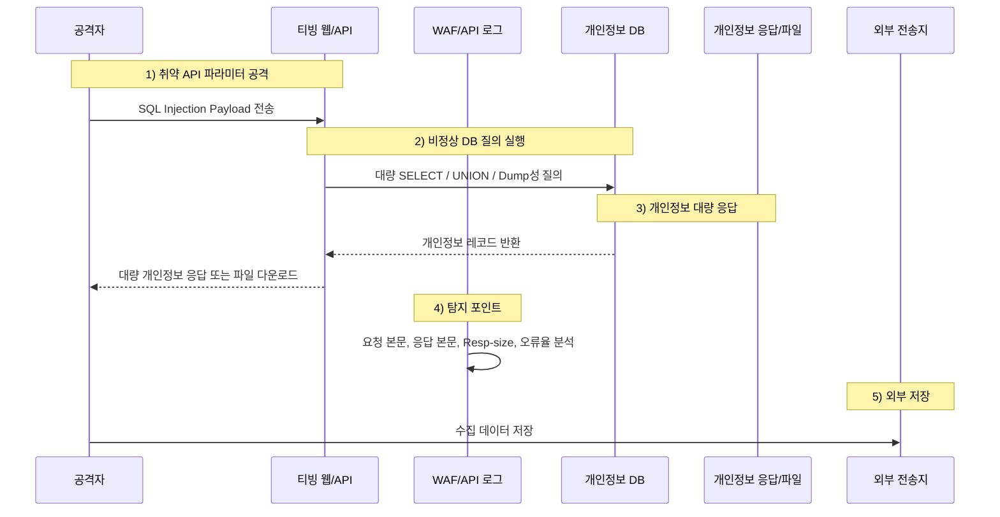
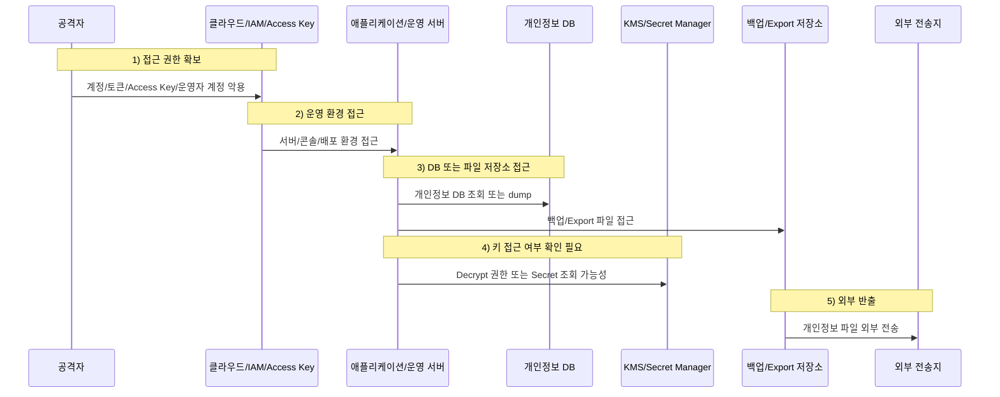

국내 대표 OTT 서비스인 **티빙(TVING)** 에서 개인정보 유출 사고가 공개됐습니다.  

이번 사고의 핵심은 단순한 “이용자 계정 탈취”가 아닙니다.  
티빙 공지와 언론 보도에 따르면, **이용자 개인정보를 저장하는 데이터베이스(DB)에 비인가 접근이 있었고, 개인정보 파일이 외부로 전송된 정황**이 확인됐습니다.

즉, 이번 사건은  
**플랫폼 측 개인정보 저장소에 대한 침해 사고**로 봐야 합니다.

특히 이번 사고에서 주목해야 할 지점은 두 가지입니다.

1. **SQL 인젝션 공격 가능성**
2. **클라우드/IAM/DB 계정 또는 접근 권한 탈취 가능성**

두 가능성은 모두 심각합니다.  
다만 피해 범위와 대응 우선순위는 서로 다릅니다.

SQL 인젝션이라면  
웹/API 요청을 통해 개인정보 DB가 대량 조회·추출됐을 가능성을 봐야 합니다.

반면 클라우드/IAM/DB 권한이 털렸다면  
단순 DB 유출이 아니라, **코드·시크릿·KMS·백업·Export 저장소까지 영향을 받았는지** 확인해야 합니다.  
이 경우 사고의 성격은 훨씬 더 심각해집니다.

<!--more-->

---

## 핵심 요약

- **사고 공개:** 티빙은 2026년 6월 3일 고객센터 공지를 통해 개인정보 유출 사고를 안내했습니다.
- **침해 시점:** 보도에 따르면 2026년 6월 2일, 이용자 개인정보를 저장하는 DB에 비인가 접근이 있었습니다.
- **사고 성격:** 공격자가 개인정보가 저장된 DB에 접속해 개인정보 파일을 외부로 전송한 것으로 설명됐습니다.
- **유출 항목:** 아이디, 이름, 생년월일, 성별, CI, DI, 휴대폰 번호 일부, 이메일 일부, 환불 계좌번호, 단방향 암호화된 비밀번호, 서비스 이용 관련 정보 등이 포함됐습니다.
- **현재 미확정:** 실제 유출 인원, 최초 침투 경로, 공격자가 접근한 DB·파일·키·코드 범위는 아직 명확히 공개되지 않았습니다.
- **중요 포인트:** 비밀번호는 단방향 해시라면 원칙적으로 “복호화”할 수 없습니다. 그러나 기존 다크웹 유출 정보와 결합하면 상당수 계정의 비밀번호 추정·크랙·재사용 공격이 가능할 수 있습니다.
- **가장 심각한 시나리오:** 클라우드/IAM/DB 권한까지 탈취됐다면, 암호화된 개인정보 필드의 키 접근 가능성, 코드·시크릿 노출, 백업·Export 파일 유출까지 조사해야 합니다.
- **핵심 대응:** 지금은 “SQL 인젝션이냐 아니냐”를 단정하는 것보다, **어떤 경로로 접근했고, 어떤 데이터가 실제로 외부로 나갔으며, 암호화 키와 시크릿까지 노출됐는지**를 규명하는 것이 중요합니다.

---

## 사실 관계 정리

### ✅ 공개적으로 확인된 내용

- 티빙은 홈페이지 고객센터 공지를 통해 개인정보 유출 사고를 안내했습니다.
- 언론 보도에 따르면, 티빙은 **2026년 6월 2일 이용자 개인정보를 저장하는 DB에 비인가 접근이 이루어져 개인정보 유출 정황을 확인했다**고 밝혔습니다.
- 티빙은 이번 사고가 **신원 미상의 해커가 개인정보가 저장된 DB에 접속해 개인정보 파일을 외부로 전송하여 발생한 것**이라고 설명했습니다.
- 티빙은 사고 인지 후 **공격자 IP 접근 차단**과 **클라우드 접근 통제 정책 변경** 등의 조치를 취했다고 안내했습니다.
- 티빙은 이용자에게 동일 계정 정보를 사용하는 티빙 및 기타 서비스의 비밀번호 변경을 권장했습니다.

### 🟨 공개됐지만 추가 확인이 필요한 내용

- 실제 피해 인원
- DB 접근 경로
- SQL 인젝션 여부
- 클라우드/IAM 계정 또는 키 탈취 여부
- DB 계정 탈취 여부
- 백업·Export 파일 저장소 접근 여부
- 비밀번호 해시 알고리즘
- 환불 계좌번호 등 암호화 필드의 키 노출 여부
- “서비스 이용 관련 정보”의 상세 범위

### 🗓️ 타임라인

- **2026-06-02:** 이용자 개인정보 DB에 비인가 접근 발생
- **2026-06-03:** 티빙이 고객센터 공지를 통해 개인정보 유출 사고 안내
- **2026-06-03:** 국내 언론에서 티빙 개인정보 유출 사고 보도
- **사고 인지 후:** 공격자 IP 차단, 클라우드 접근 통제 정책 변경, 이용자 비밀번호 변경 권고

---

## 1. 사고 개요

### 🎬 OTT 서비스 해킹은 단순 계정 탈취로 끝나지 않는다

OTT 서비스는 단순히 영상을 보는 서비스가 아닙니다.  
대형 OTT 플랫폼은 다음 데이터를 함께 보유합니다.

- 회원 계정 정보
- 본인 식별 정보
- 결제·환불 관련 정보
- 서비스 이용 이력
- 시청·구독·기기 정보
- 광고·추천·고객센터 관련 데이터
- 간편 로그인 또는 외부 계정 연동 정보

따라서 OTT 서비스의 개인정보 DB가 침해되면  
단순히 “비밀번호를 바꾸면 끝나는 사고”가 아닙니다.

이번 티빙 사고는  
**콘텐츠 서비스 해킹이 아니라 대형 개인정보 플랫폼 침해 사고**로 봐야 합니다.

---

## 2. 유출 항목이 왜 민감한가

이번 사고에서 언급된 유출 항목은 단순 연락처 수준이 아닙니다.

| 유출 항목 | 위험도 | 설명 |
|---|---:|---|
| 아이디 | 높음 | 다른 서비스 로그인 대입, 계정 매칭, 크리덴셜 스터핑에 활용 가능 |
| 이름 | 중간~높음 | 생년월일·성별·CI/DI와 결합 시 개인 식별 가능 |
| 생년월일 | 높음 | 본인확인, 계정 복구, 피싱에 악용 가능 |
| 성별 | 중간 | 단독 위험은 낮지만 프로파일링에 활용 가능 |
| CI / DI | 매우 높음 | 국내 서비스 간 개인 식별·연계에 사용되는 고유 식별 값 |
| 휴대폰 번호 일부 | 중간 | 마지막 4자리가 암호화됐더라도 다른 정보와 결합하면 추정 위험 존재 |
| 이메일 일부 | 중간 | 도메인 제외 ID 부분 암호화라도 아이디·이름과 결합 시 추정 가능 |
| 환불 계좌번호 | 높음 | 암호화 키 노출 여부에 따라 금융 사기 위험 증가 |
| 비밀번호 | 중간~높음 | 단방향 해시라면 복호화는 어렵지만 오프라인 크랙 가능성 존재 |
| 서비스 이용 관련 정보 | 높음 | 범위가 불명확함. 이용권, 기기, 시청, 결제 관련 정보 포함 여부 확인 필요 |

특히 **CI·DI**는 단순 개인정보보다 더 민감합니다.  
이 값은 여러 서비스에서 이용자를 식별·연계하는 데 사용될 수 있기 때문입니다.

또한 “서비스 이용 관련 정보”라는 표현이 넓습니다.  
시청 이력, 이용권 정보, 기기 정보, 접속 기록, 결제·환불 이력 중 어디까지 포함되는지 확인되어야 합니다.

---

## 3. SQL 인젝션 공격 가능성

### 💉 가능성은 있다. 그러나 단정하면 안 된다

SQL 인젝션 가능성은 충분히 있습니다.

OWASP는 SQL 인젝션을, 사용자가 입력한 데이터가 SQL 질의에 삽입되어 데이터베이스의 민감 정보를 읽거나 수정하거나 삭제할 수 있는 공격으로 설명합니다.  
성공한 SQL 인젝션은 DB의 민감 데이터 전체 노출로 이어질 수 있습니다.

이번 티빙 사고에서 SQL 인젝션 가능성을 보는 이유는 다음입니다.

1. 사고 대상이 **개인정보 DB**입니다.
2. 개인정보 파일이 외부로 전송됐다고 설명됐습니다.
3. 유출 항목이 회원 테이블성 데이터입니다.
4. 외부 웹/API 취약점을 통해 DB를 조회·추출했을 가능성을 배제할 수 없습니다.
5. 많은 정보가 나간 정황은 자동화된 DB 조회 또는 Export 흐름과도 맞습니다.

다만 현재 공개된 내용만으로  
**“SQL 인젝션 공격이었다”고 단정할 수는 없습니다.**

### SQL 인젝션이라면 보였어야 할 흔적

SQL 인젝션이라면 WAF, 웹로그, API 로그, DB 로그에 다음과 같은 흔적이 남아야 합니다.

```text
' OR '1'='1
UNION SELECT
information_schema
sleep()
benchmark()
--
/**/
%27
%2527
order by
group_concat
concat_ws
load_file
into outfile
```

또는 더 은밀한 경우 다음 패턴이 관찰될 수 있습니다.

```text
특정 API 파라미터에 비정상적으로 긴 문자열 반복
검색·필터·정렬 파라미터 변조
동일 URL에 대한 반복적인 400/500 오류
응답 시간이 비정상적으로 길어지는 Blind SQLi 패턴
응답 크기가 점점 커지는 데이터 추출 패턴
특정 IP·세션에서 대량 개인정보 응답 발생
정상 API처럼 보이지만 평소보다 훨씬 큰 Resp-size
```

### SQL 인젝션일 때 가장 중요한 질문

SQL 인젝션 가능성을 검증하려면 다음 질문에 답해야 합니다.

- 어느 URL 또는 API가 공격 대상이었는가?
- 어떤 파라미터가 조작됐는가?
- 공격 요청 본문 또는 쿼리 문자열이 남아 있는가?
- WAF가 공격 시도를 탐지했는가?
- 응답 본문에 개인정보가 포함됐는가?
- 응답 크기와 호출 빈도가 평소와 달랐는가?
- DB 로그에서 비정상 SELECT, UNION, information_schema 조회가 있었는가?
- 공격자가 파일로 Export할 수 있는 권한까지 얻었는가?

즉, SQL 인젝션 가능성은  
**요청 로그만이 아니라 응답 본문·응답 크기·DB 질의 로그를 함께 봐야 확인**할 수 있습니다.

---

## 4. 클라우드/IAM/DB 권한 침해 가능성

### ☁️ 더 심각한 가능성이다

이번 사고에서 가장 우려되는 표현은  
**“클라우드 접근 통제 정책 변경”**입니다.

SQL 인젝션 사고라면 일반적으로 다음 조치가 먼저 언급됩니다.

- 취약 URL 차단
- SQL 인젝션 취약점 패치
- 입력값 검증 강화
- Prepared Statement 적용
- WAF 룰 추가
- 취약 API 비활성화

그런데 공개된 대응 조치에는  
**공격자 IP 차단**과 **클라우드 접근 통제 정책 변경**이 포함되어 있습니다.

이는 다음 가능성을 열어둡니다.

- 클라우드 DB 접근 정책이 과도하게 열려 있었음
- 특정 IP 또는 네트워크에서 DB 접근이 가능했음
- IAM 계정 또는 Access Key가 악용됐음
- DB 계정 또는 운영자 계정이 탈취됐음
- 백업·Export 파일 저장소 접근 권한이 노출됐음
- 애플리케이션 서버 또는 운영 환경의 시크릿이 유출됐음

### 이 경우 사고 범위는 완전히 달라진다

클라우드/IAM/DB 권한이 털렸다면  
단순히 “DB 일부가 조회됐다”는 문제가 아닙니다.

다음까지 확인해야 합니다.

- 소스코드 저장소 접근 여부
- CI/CD 배포 계정 접근 여부
- 환경변수와 Secret Manager 접근 여부
- KMS Decrypt 권한 접근 여부
- DB 백업 저장소 접근 여부
- Object Storage 다운로드 여부
- 관리자 콘솔 로그인 여부
- 클라우드 보안그룹·방화벽 정책 변경 여부
- DB 계정 생성·권한 변경 여부
- API Key·Access Key 발급·사용 이력

이 중 하나라도 사실이라면  
이번 사고는 단순 개인정보 유출을 넘어  
**플랫폼 전체 신뢰 사고**가 됩니다.

---

## 5. 비밀번호는 복호화가 아니라 크랙의 문제다

### 🔐 단방향 해시는 원칙적으로 복호화되지 않는다

비밀번호가 실제로 **단방향 해시**로 저장됐다면  
공격자가 DB와 소스코드를 확보하더라도 원문 비밀번호를 바로 복호화할 수는 없습니다.

OWASP도 비밀번호는 평문 저장이나 양방향 암호화가 아니라, Argon2id, bcrypt, PBKDF2 같은 느린 해시 알고리즘으로 저장해야 한다고 설명합니다.  
해시는 단방향 함수이므로 원문으로 “복호화”하는 구조가 아닙니다.

하지만 이 말이 곧 안전하다는 뜻은 아닙니다.

공격자는 다음 방식으로 비밀번호를 알아내려 합니다.

```text
후보 비밀번호 입력
→ 동일한 해시 알고리즘으로 계산
→ 유출된 해시와 비교
→ 일치하면 원문 비밀번호 확인
```

이것이 **비밀번호 크랙**입니다.

### 기존 다크웹 유출 정보와 결합하면 위험이 커진다

이번 사고에서 아이디와 단방향 암호화된 비밀번호가 함께 유출됐다면,  
공격자는 이를 기존 다크웹 유출 데이터와 비교할 수 있습니다.

특히 쿠팡 등 국내외 대형 서비스에서 유출됐다고 주장되는 데이터셋,  
기존 다크웹 계정 목록, 이전 침해 사고에서 나온 ID/PW 조합,  
자주 사용되는 비밀번호 사전과 결합하면 위험은 커집니다.

공격자는 다음과 같은 방식으로 접근할 수 있습니다.

1. 티빙 유출 아이디 목록 확보
2. 기존 다크웹 ID/PW 목록과 매칭
3. 동일 아이디 또는 유사 이메일 계정 식별
4. 후보 비밀번호 목록 생성
5. 티빙 비밀번호 해시와 대조
6. 일치하는 계정의 원문 비밀번호 추정
7. 다른 서비스에 재사용 공격 수행

즉, 비밀번호 해시가 “복호화”되지 않더라도  
**기존 유출 정보와 결합하면 상당수 ID/패스워드 조합이 확보될 수 있는 상황**이 됩니다.

### 결국 비밀번호 변경 권고는 타당하다

따라서 티빙이 비밀번호 변경을 권고한 것은 타당합니다.

다만 이용자는 티빙 비밀번호만 바꾸면 안 됩니다.  
티빙과 같은 비밀번호를 사용한 모든 서비스의 비밀번호를 바꿔야 합니다.

---

## 6. 암호화된 개인정보는 안전한가

### 🧩 키가 없으면 복호화하기 어렵다. 그러나 키가 털렸다면 다르다

환불 계좌번호, 이메일, 휴대폰 번호 같은 정보는  
서비스 운영상 다시 보여주거나 처리해야 할 수 있습니다.

이 경우 비밀번호처럼 단방향 해시가 아니라,  
**복호화 가능한 암호화**로 저장됐을 가능성이 큽니다.

따라서 위험은 다음처럼 갈립니다.

| 침해 범위 | 비밀번호 위험 | 암호화 개인정보 위험 |
|---|---|---|
| **DB만 유출** | 해시는 복호화 불가. 약한 해시는 크랙 가능 | 키가 없으면 복호화 어려움 |
| **DB + 애플리케이션 코드 유출** | 해시 방식 파악 가능. 크랙 효율 증가 | 암호화 로직 파악 가능 |
| **DB + 코드 + 환경변수/시크릿 유출** | pepper 유출 시 위험 증가 | 복호화 키 접근 가능성 증가 |
| **DB + 코드 + KMS 권한/IAM 유출** | 비밀번호 해시는 여전히 복호화 불가 | 암호화 필드 복호화 가능성 매우 큼 |

핵심은 이것입니다.

> **암호화되어 있다는 사실만으로 안전하다고 볼 수 없습니다.  
> 공격자가 키 또는 KMS 권한까지 확보했는지가 중요합니다.**

반대로 키와 시크릿이 안전하게 분리되어 있고,  
공격자가 DB 파일만 확보했다면  
암호화된 필드의 복호화는 현실적으로 어렵습니다.

그래서 지금 가장 중요한 것은  
**암호화된 데이터가 복호화됐는지 단정하는 것이 아니라, 공격자가 키와 권한에 접근했는지 규명하는 것**입니다.

---

## 7. 피해 범위 규명이 핵심이다

이번 사고에서 가장 중요한 질문은  
“SQL 인젝션이냐 클라우드 권한 탈취냐” 하나만이 아닙니다.

핵심은 **피해 범위 규명**입니다.

다음 항목을 반드시 확인해야 합니다.

### 7-1. 데이터 범위

- 전체 회원 DB인지 일부 회원 DB인지
- 유출된 행(row) 수는 몇 개인지
- 어떤 테이블이 접근됐는지
- CI/DI 전체가 나갔는지
- 환불 계좌번호가 몇 건 포함됐는지
- 서비스 이용 관련 정보의 세부 항목은 무엇인지
- 시청 이력, 기기 정보, 결제 이력 포함 여부

### 7-2. 접근 경로

- SQL 인젝션인지
- 관리자 계정 탈취인지
- DB 계정 탈취인지
- 클라우드 IAM 키 탈취인지
- 애플리케이션 서버 침해인지
- 백업·Export 파일 저장소 접근인지
- 내부자 또는 협력사 계정 악용인지

### 7-3. 키와 시크릿 범위

- DB 접속 계정이 유출됐는지
- Secret Manager 접근이 있었는지
- 환경변수 접근이 있었는지
- KMS Decrypt 권한이 사용됐는지
- 암호화 키가 교체됐는지
- Access Key가 폐기·재발급됐는지
- CI/CD 배포 키가 노출됐는지

### 7-4. 공격자의 실제 행위

- 파일 생성이 있었는지
- SQL dump가 있었는지
- CSV/Excel Export가 있었는지
- Object Storage 다운로드가 있었는지
- 외부 전송 목적지는 어디였는지
- 동일 공격자가 재접속했는지
- 공격자 IP가 하나였는지, 다수였는지
- 공격자 IP 차단 이전에 얼마나 많은 데이터가 나갔는지

---

## 8. 두 가지 공격 시나리오

### 시나리오 A. SQL 인젝션 기반 대량 유출



이 경우 핵심 증거는  
**웹 요청, 파라미터, 응답 본문, 응답 크기, DB 질의 로그**입니다.

---

### 시나리오 B. 클라우드/IAM/DB 권한 탈취 기반 유출



이 경우 핵심 증거는  
**IAM 로그, 클라우드 콘솔 로그인, Access Key 사용 이력, DB 접속 로그, KMS Decrypt 로그, Object Storage 다운로드 로그**입니다.

---

## 9. 지금 가장 위험한 오해

### ❌ “비밀번호가 단방향 암호화됐으니 괜찮다”

아닙니다.  
복호화는 어렵지만, 기존 유출 정보와 결합한 크랙 가능성이 있습니다.

### ❌ “휴대폰 번호와 이메일 일부가 암호화됐으니 괜찮다”

아닙니다.  
아이디, 이름, 생년월일, 성별, CI/DI와 결합하면 개인 식별과 피싱에 충분히 악용될 수 있습니다.

### ❌ “공격자 IP를 차단했으니 끝났다”

아닙니다.  
계정·토큰·키가 유출됐다면 공격자는 다른 IP에서 다시 접근할 수 있습니다.

### ❌ “SQL 인젝션인지 아닌지만 확인하면 된다”

아닙니다.  
클라우드/IAM/DB 권한 침해라면 사고 범위는 훨씬 넓어집니다.

### ❌ “암호화된 데이터는 복구가 불가능하니 영향이 없다”

정확히는,  
**키가 유출되지 않았다면 복호화가 어렵다**가 맞습니다.  
하지만 키·시크릿·KMS 권한까지 노출됐다면 암호화된 개인정보도 위험합니다.

---

# PLURA 관점 정리

## 10. PLURA-WAF 관점: SQL 인젝션과 데이터 유출은 요청과 응답을 함께 봐야 한다

SQL 인젝션은 요청만 보면 놓칠 수 있습니다.  
공격자가 우회 문자열을 사용하거나 정상 API처럼 호출하면 더 그렇습니다.

PLURA-WAF 관점에서는 다음을 함께 봐야 합니다.

- 요청 본문(Request Body)
- 요청 파라미터
- 쿠키·헤더
- 응답 본문(Response Body)
- 응답 크기(Response Size)
- 동일 세션의 반복 호출
- 오류율 증가
- 대량 개인정보 응답 패턴

특히 이번 사고처럼 “많은 정보가 나간” 경우에는  
공격 문자열 탐지만으로는 부족합니다.

**개인정보가 포함된 응답이 얼마나 많이, 어떤 세션으로, 어떤 IP에 전달됐는지**를 봐야 합니다.

---

## 11. PLURA-EDR 관점: DB 파일 생성·압축·전송 흔적을 봐야 한다

DB 또는 운영 서버에서 개인정보 파일이 생성됐다면  
EDR 관점에서는 다음 행위가 중요합니다.

- SQL dump 파일 생성
- CSV/Excel Export 파일 생성
- ZIP/7z/RAR 압축
- DB 접속 도구 실행
- 클라우드 CLI 실행
- 외부 전송 도구 실행
- 대량 파일 읽기·쓰기
- 서버 내 임시 디렉터리 사용
- 운영자 계정의 비정상 명령 실행

즉, 핵심은  
**DB에 접근했는가**가 아니라  
**개인정보 파일이 언제 생성되고 어디로 전송됐는가**입니다.

---

## 12. PLURA-XDR 관점: 단일 이벤트가 아니라 공격 흐름을 연결해야 한다

이번 사고의 핵심 흐름은 다음과 같습니다.

```text
비인가 접근
→ 개인정보 DB 조회
→ 개인정보 파일 생성 또는 기존 파일 접근
→ 파일 외부 전송
→ 공격자 IP 차단
→ 클라우드 접근 통제 정책 변경
```

이 흐름을 연결해야 합니다.

단일 이벤트로 보면 각각은 정상처럼 보일 수 있습니다.

- DB 조회는 정상 운영일 수 있습니다.
- 파일 생성은 정상 백업일 수 있습니다.
- 클라우드 접근은 정상 배포일 수 있습니다.
- 외부 전송은 정상 업무 전송일 수 있습니다.

그러나 이들이 같은 시간대, 같은 계정, 같은 IP, 같은 세션, 같은 서버에서 연결되면 이야기가 달라집니다.

이것이 XDR 상관분석이 필요한 이유입니다.

---

## 13. 탐지 포인트 비교

| 구분 | 무엇을 보나 | 이번 사고에서의 핵심 포인트 |
|---|---|---|
| **PLURA-WAF** | 요청 본문, 파라미터, SQLi 패턴 | SQL 인젝션 여부 확인 |
| **PLURA-WAF** | 응답 본문, 응답 크기 | 개인정보 대량 응답 여부 확인 |
| **PLURA-WAF** | 세션·IP·User-Agent | 자동화된 대량 조회 여부 확인 |
| **PLURA-EDR** | 프로세스, 파일, 압축, 전송 | 개인정보 파일 생성·압축·외부 전송 확인 |
| **PLURA-EDR** | DB 접속 도구, 클라우드 CLI | 운영 서버에서 직접 추출했는지 확인 |
| **PLURA-XDR** | WAF + EDR + DB + Cloud 로그 상관 | SQLi, 계정 탈취, IAM 침해 중 실제 경로 규명 |

---

## 14. 이용자 관점의 대응

이용자는 다음 조치를 해야 합니다.

- 티빙 비밀번호 즉시 변경
- 티빙과 동일한 비밀번호를 쓰는 모든 서비스 비밀번호 변경
- 이메일 계정 비밀번호 변경
- 포털, 쇼핑, OTT, 금융 앱의 동일 ID 사용 여부 점검
- 티빙 사칭 문자·메일 주의
- “보상”, “환불”, “본인확인”, “비밀번호 변경”을 사칭한 피싱 주의
- 환불 계좌 관련 이상 거래 확인
- 개인정보 유출 조회 또는 피해구제 고객센터 확인

특히 다음과 같은 문구는 피싱에 악용될 가능성이 높습니다.

```text
티빙 개인정보 유출 보상 안내
티빙 환불 계좌 확인 요청
티빙 비밀번호 재설정 필요
티빙 이용권 보상 쿠폰 지급
티빙 고객센터 본인확인 요청
```

이런 메시지는 반드시 공식 앱 또는 공식 홈페이지에서 직접 확인해야 합니다.

---

## 15. 정리

이번 티빙 개인정보 유출 사고는  
단순한 “OTT 해킹”이 아닙니다.

핵심은 다음입니다.

1. **개인정보 DB에 비인가 접근이 있었다**
2. **개인정보 파일이 외부로 전송됐다**
3. **많은 정보가 나간 정황이 있다**
4. **SQL 인젝션 가능성은 배제할 수 없다**
5. **하지만 클라우드/IAM/DB 권한 침해 가능성이 있다면 훨씬 심각하다**
6. **비밀번호는 단방향 해시라 복호화는 어렵지만, 기존 다크웹 유출 정보와 결합하면 크랙·재사용 위험이 있다**
7. **암호화된 개인정보는 키가 안전해야만 보호된다**
8. **지금 가장 중요한 것은 피해 범위와 실제 접근 경로를 규명하는 것이다**

따라서 이번 사고를 설명하는 가장 정확한 문장은 다음입니다.

> 티빙 사고의 본질은 비밀번호 유출 하나가 아니다.  
> 개인정보 DB 접근 통제 실패, 대량 개인정보 파일 외부 전송, 그리고 클라우드 권한 침해 가능성까지 함께 봐야 하는 플랫폼 신뢰 사고다.

이제 중요한 것은  
“SQL 인젝션이냐 아니냐”를 성급히 단정하는 것이 아닙니다.

**어떤 경로로 들어왔는가.  
어떤 데이터가 나갔는가.  
키와 시크릿은 안전한가.  
동일 경로가 다시 열릴 수 있는가.**

이 네 가지를 규명해야 합니다.

그것이 이번 티빙 사고의 핵심입니다.

---

## 업데이트 예정

이 글은 2026년 6월 3일 공개된 티빙 공지와 언론 보도를 기준으로 작성했습니다.  
향후 다음 내용이 확인되면 업데이트가 필요합니다.

- 실제 유출 인원
- 최초 침투 경로
- SQL 인젝션 여부
- 클라우드/IAM/DB 계정 탈취 여부
- 비밀번호 해시 알고리즘
- 암호화 키·KMS·Secret Manager 접근 여부
- 환불 계좌번호 복호화 가능성
- 서비스 이용 관련 정보의 상세 범위
- 개인정보보호위원회 또는 KISA 조사 결과

---

### 📖 함께 읽기

* [현대엘리베이터 해킹 사건: 에베레스트(Everest) 랜섬웨어의 1.1TB 유출 주장과 제조 도면 노출 가능성](https://blog.plura.io/ko/threats/case-hyundaielevator/)
* [닛산 오세아니아 해킹 사건: Akira 랜섬웨어의 금융·신분증 정보 탈취와 10만 명 피해](https://blog.plura.io/ko/threats/case-nissan/)
* [SQL 인젝션 공격은 왜 여전히 위험한가](https://blog.plura.io/ko/)
* [PLURA-XDR을 활용한 개인정보 유출 탐지](https://blog.plura.io/ko/)

---

## 참고 자료(출처)

* TVING 공식 공지: https://www.tving.com/help/notice/143752
* 경향신문, `‘가입자 최소 500만’ 티빙도 털렸다···“이름·생년월일 등 개인정보유출, 비밀번호 변경 권장”` (2026-06-03): https://www.khan.co.kr/article/202606031039011
* News1, `티빙 해킹 관련 보도` (2026-06-03): https://www.news1.kr/it-science/security-hacking/6186312
* OWASP, `SQL Injection`: https://owasp.org/www-community/attacks/SQL_Injection
* OWASP Cheat Sheet Series, `Password Storage Cheat Sheet`: https://cheatsheetseries.owasp.org/cheatsheets/Password_Storage_Cheat_Sheet.html
* OWASP Cheat Sheet Series, `Secrets Management Cheat Sheet`: https://cheatsheetseries.owasp.org/cheatsheets/Secrets_Management_Cheat_Sheet.html
* OWASP Cheat Sheet Series, `Key Management Cheat Sheet`: https://cheatsheetseries.owasp.org/cheatsheets/Key_Management_Cheat_Sheet.html
