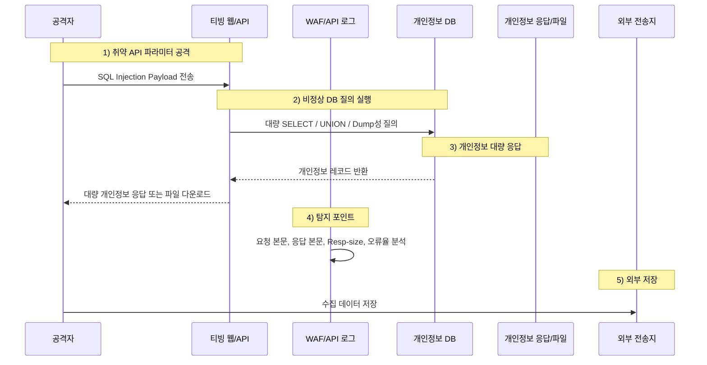
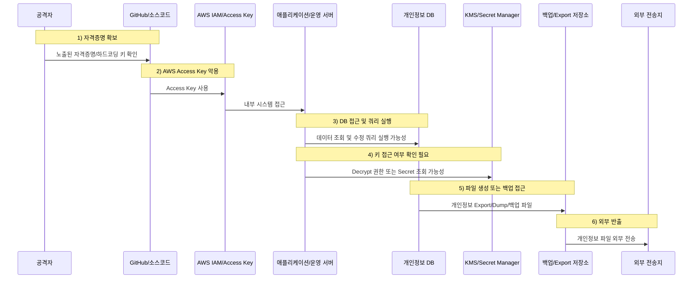

국내 대표 OTT 서비스인 **티빙(TVING)** 에서 개인정보 유출 사고가 공개됐습니다.  

1보 기준으로는  
**이용자 개인정보를 저장하는 데이터베이스(DB)에 비인가 접근이 있었고, 개인정보 파일이 외부로 전송된 사고**로 설명됐습니다.

그러나 이후 보도에서는 사고의 성격이 더 심각해졌습니다.  
국회 과학기술정보방송통신위원회 이해민 의원실이 입수한 티빙의 KISA 침해사고 신고서 내용을 인용한 보도에 따르면, 이번 사고는 단순 DB 유출에 그치지 않고 **비인가자가 내부 시스템에 직접 접근해 데이터 조회 및 수정 쿼리를 실행한 정황**까지 제기됐습니다. 또한 **GitHub에 노출된 자격증명**과 **AWS 핵심 액세스 키 관리 부실**이 주요 원인으로 추정된다는 내용도 보도됐습니다.

즉, 이번 사고는 단순히 “개인정보 DB가 털렸다”는 수준을 넘어,  
**클라우드 인프라 접근권한 관리가 무너졌을 가능성**까지 확인해야 하는 사건입니다.

<!--more-->

---

## 핵심 요약

- **사고 공개:** 티빙은 2026년 6월 3일 고객센터 공지를 통해 개인정보 유출 사고를 안내했습니다.
- **1보 기준 사고 성격:** 2026년 6월 2일, 이용자 개인정보를 저장하는 DB에 비인가 접근이 있었고 개인정보 파일이 외부로 전송된 것으로 설명됐습니다.
- **후속 보도 핵심:** GitHub에 노출된 자격증명, AWS 액세스 키 관리 부실, 내부 시스템 직접 접근, 데이터 조회·수정 쿼리 실행 정황이 제기됐습니다.
- **유출 항목:** 아이디, 이름, 생년월일, 성별, CI, DI, 휴대폰 번호 일부, 이메일 일부, 환불 계좌번호, 단방향 암호화된 비밀번호, 서비스 이용 관련 정보 등이 포함됐습니다.
- **SQL 인젝션 가능성:** 1보 기준으로는 가능성을 배제할 수 없었습니다. 다만 후속 보도 이후에는 SQL 인젝션보다 **클라우드/IAM/자격증명 노출 가능성**이 더 중심 이슈로 보입니다.
- **비밀번호 위험:** 비밀번호가 단방향 해시라면 원칙적으로 복호화할 수 없습니다. 그러나 기존 다크웹 유출 정보, 다른 서비스 유출 ID/PW 조합, 비밀번호 사전과 결합하면 상당수 계정의 비밀번호 추정·크랙·재사용 공격이 가능할 수 있습니다.
- **암호화 데이터 위험:** 환불 계좌번호, 휴대폰 번호, 이메일 일부가 암호화되어 있어도, 공격자가 KMS·Secret Manager·환경변수·코드·Access Key 권한까지 확보했다면 복호화 가능성을 배제할 수 없습니다.
- **탐지 실패 논란:** 후속 보도에서는 DB CPU 사용률이 100%까지 상승했으나, 이를 약 21시간 뒤 인지했다는 내용도 제기됐습니다.
- **컴플라이언스 리스크:** 개인정보보호위원회·KISA 조사, ISMS 사후관리, 과징금·손해배상·징벌적 손해 리스크까지 고려해야 합니다.
- **핵심 대응:** 지금 중요한 것은 공격명을 성급히 단정하는 것이 아니라, **어떤 계정·키·권한·경로로 접근했고, 어떤 데이터가 실제로 외부로 나갔으며, 키와 시크릿까지 노출됐는지 규명하는 것**입니다.

---

## 사실 관계 정리

### ✅ 1보에서 공개적으로 확인된 내용

- 티빙은 홈페이지 고객센터 공지를 통해 개인정보 유출 사고를 안내했습니다.
- 언론 보도에 따르면, 티빙은 **2026년 6월 2일 이용자 개인정보를 저장하는 DB에 비인가 접근이 이루어져 개인정보 유출 정황을 확인했다**고 밝혔습니다.
- 티빙은 이번 사고가 **신원 미상의 해커가 개인정보가 저장된 DB에 접속해 개인정보 파일을 외부로 전송하여 발생한 것**이라고 설명했습니다.
- 유출 항목으로는 아이디, 이름, 생년월일, 성별, CI, DI, 휴대폰 번호 일부, 이메일 일부, 환불 계좌번호, 단방향 암호화된 비밀번호, 서비스 이용 관련 정보 등이 언급됐습니다.
- 티빙은 사고 인지 후 **공격자 IP 접근 차단**과 **클라우드 접근 통제 정책 변경** 등의 조치를 취했다고 안내했습니다.
- 티빙은 이용자에게 동일 계정 정보를 사용하는 티빙 및 기타 서비스의 비밀번호 변경을 권장했습니다.

### 🆕 후속 보도에서 추가로 제기된 내용

후속 보도에서는 다음 내용이 추가로 제기됐습니다.

- 이번 사고는 단순 DB 유출에 그치지 않고, **비인가자가 내부 시스템에 직접 접근해 데이터 조회 및 수정 쿼리를 실행한 정황**이 있다는 내용
- **GitHub에 노출된 자격증명**과 **AWS 핵심 액세스 키 관리 부실**이 주요 원인으로 추정된다는 내용
- 개발 편의를 위해 소스코드에 자격증명을 직접 적어두는 **하드코딩 방식**이 문제로 지목됐다는 내용
- AWS 액세스 키는 서버, 저장소, DB 접근 권한을 가질 수 있어 **클라우드 인프라 전반의 통제권 노출**로 이어질 수 있다는 내용
- 사고 직후 해당 키를 교체했으나, 구조가 노출된 만큼 우회 침투 경로 또는 백도어 가능성을 배제할 수 없어 정밀 포렌식이 필요하다는 내용
- 사고 인지 후 KISA 신고까지 **23시간 59분**이 걸렸다는 내용
- 이용자 공지는 그보다 늦은 **이틀 뒤** 이뤄졌다는 내용
- DB 서버 CPU 사용률이 100%까지 치솟는 이상 징후가 있었으나, 티빙이 이를 인지한 것은 약 **21시간 뒤**였다는 내용
- ISMS 인증을 보유했음에도 클라우드 관리자 접속 키 등이 프로그램에 노출됐다는 비판
- 정보보호 투자액이 2022년 약 22억 원에서 2024년 약 17억 원으로 감소했고, 내부·외주 포함 전담 보안 인력이 7.5명 수준이라는 내용

이 내용은 후속 보도 기준이며, 최종 확정은 정부 합동조사단과 관계기관 조사 결과를 통해 확인되어야 합니다.

### 🟨 아직 추가 확인이 필요한 내용

- 실제 유출 인원
- 최초 침투 경로
- SQL 인젝션 여부
- GitHub 자격증명 노출의 정확한 범위
- AWS Access Key 권한 범위
- 내부 시스템 직접 접근 범위
- 데이터 조회 쿼리와 수정 쿼리의 구체적 내용
- DB 계정 또는 운영자 계정 탈취 여부
- 백업·Export 파일 저장소 접근 여부
- 비밀번호 해시 알고리즘
- 환불 계좌번호 등 암호화 필드의 키 노출 여부
- Secret Manager, KMS, 환경변수, CI/CD 배포 키 접근 여부
- “서비스 이용 관련 정보”의 상세 범위
- 백도어 또는 추가 우회 경로 존재 여부

### 🗓️ 타임라인

- **2026-05-30 18:01경:** 후속 보도 기준, 해커의 대량 회원정보 조회로 DB 서버 CPU 사용률이 100%까지 치솟는 이상 징후 발생
- **2026-05-31 15:09경:** 후속 보도 기준, 티빙이 이상 징후를 약 21시간 뒤 인지
- **2026-06-02:** 1보 기준, 이용자 개인정보 DB에 비인가 접근 발생
- **2026-06-03:** 티빙이 고객센터 공지를 통해 개인정보 유출 사고 안내
- **2026-06-03:** 국내 언론에서 티빙 개인정보 유출 사고 보도
- **2026-06-07:** 후속 보도를 통해 GitHub 자격증명 노출, AWS 액세스 키 관리 부실, 내부 시스템 직접 접근, 데이터 조회·수정 쿼리 실행 정황 등이 추가로 제기됨

---

## 1. 사고 개요

### 🎬 OTT 서비스 해킹은 단순 계정 탈취로 끝나지 않는다

OTT 서비스는 단순히 영상을 보는 서비스가 아닙니다.  
대형 OTT 플랫폼은 다음 데이터를 함께 보유합니다.

- 회원 계정 정보
- 본인 식별 정보
- 결제·환불 관련 정보
- 서비스 이용 이력
- 시청·구독·기기 정보
- 광고·추천·고객센터 관련 데이터
- 간편 로그인 또는 외부 계정 연동 정보
- 클라우드 기반 운영·분석·정산 데이터

따라서 OTT 서비스의 개인정보 DB가 침해되면  
단순히 “비밀번호를 바꾸면 끝나는 사고”가 아닙니다.

이번 티빙 사고는  
**콘텐츠 서비스 해킹이 아니라 대형 개인정보 플랫폼 침해 사고**로 봐야 합니다.

---

## 2. 후속 보도 이후, 사고의 중심은 바뀌었다

### 1보: DB 비인가 접근과 개인정보 파일 외부 전송

처음 공개된 핵심은 다음이었습니다.

```text
개인정보 DB 비인가 접근
→ 개인정보 파일 외부 전송
→ 공격자 IP 차단
→ 클라우드 접근 통제 정책 변경
```

이 단계에서는 SQL 인젝션, DB 계정 탈취, 운영자 계정 탈취, 클라우드 접근권한 문제를 모두 열어두고 봐야 했습니다.

### 2보: GitHub 자격증명 노출과 AWS 액세스 키 관리 논란

후속 보도 이후에는 무게중심이 바뀌었습니다.

```text
GitHub 자격증명 노출 의혹
→ 소스코드 내 하드코딩된 자격증명 가능성
→ AWS 핵심 액세스 키 관리 부실 의혹
→ 내부 시스템 직접 접근
→ 데이터 조회 및 수정 쿼리 실행 정황
→ 클라우드 인프라 전반 통제권 노출 가능성
```

이 내용이 사실이라면, 사고의 본질은 단순 SQL 인젝션이 아닙니다.

**클라우드 접근권한 관리 실패**입니다.

이 경우 피해 범위는 DB 유출 항목 확인만으로 끝나지 않습니다.  
공격자가 어떤 키를 사용했는지, 그 키가 어떤 서버·저장소·DB·로그·백업·KMS에 접근할 수 있었는지까지 확인해야 합니다.

---

## 3. 유출 항목이 왜 민감한가

이번 사고에서 언급된 유출 항목은 단순 연락처 수준이 아닙니다.

| 유출 항목 | 위험도 | 설명 |
|---|---:|---|
| 아이디 | 높음 | 다른 서비스 로그인 대입, 계정 매칭, 크리덴셜 스터핑에 활용 가능 |
| 이름 | 중간~높음 | 생년월일·성별·CI/DI와 결합 시 개인 식별 가능 |
| 생년월일 | 높음 | 본인확인, 계정 복구, 피싱에 악용 가능 |
| 성별 | 중간 | 단독 위험은 낮지만 프로파일링에 활용 가능 |
| CI / DI | 매우 높음 | 국내 서비스 간 개인 식별·연계에 사용되는 고유 식별 값 |
| 휴대폰 번호 일부 | 중간 | 마지막 4자리가 암호화됐더라도 다른 정보와 결합하면 추정 위험 존재 |
| 이메일 일부 | 중간 | 도메인 제외 ID 부분 암호화라도 아이디·이름과 결합 시 추정 가능 |
| 환불 계좌번호 | 높음 | 암호화 키 노출 여부에 따라 금융 사기 위험 증가 |
| 비밀번호 | 중간~높음 | 단방향 해시라면 복호화는 어렵지만 오프라인 크랙 가능성 존재 |
| 서비스 이용 관련 정보 | 높음 | 범위가 불명확함. 이용권, 기기, 시청, 결제 관련 정보 포함 여부 확인 필요 |

특히 **CI·DI**는 단순 개인정보보다 더 민감합니다.  
이 값은 여러 서비스에서 이용자를 식별·연계하는 데 사용될 수 있기 때문입니다.

또한 “서비스 이용 관련 정보”라는 표현이 넓습니다.  
시청 이력, 이용권 정보, 기기 정보, 접속 기록, 결제·환불 이력 중 어디까지 포함되는지 확인되어야 합니다.

---

## 4. SQL 인젝션 공격 가능성

### 💉 가능성은 있었다. 그러나 후속 보도 이후 중심 가설은 아니다

1보 기준으로는 SQL 인젝션 가능성이 충분히 있었습니다.

OWASP는 SQL 인젝션을, 사용자가 입력한 데이터가 SQL 질의에 삽입되어 데이터베이스의 민감 정보를 읽거나 수정하거나 삭제할 수 있는 공격으로 설명합니다.  
성공한 SQL 인젝션은 DB의 민감 데이터 전체 노출로 이어질 수 있습니다.

이번 티빙 사고에서 SQL 인젝션 가능성을 보았던 이유는 다음입니다.

1. 사고 대상이 **개인정보 DB**입니다.
2. 개인정보 파일이 외부로 전송됐다고 설명됐습니다.
3. 유출 항목이 회원 테이블성 데이터입니다.
4. 외부 웹/API 취약점을 통해 DB를 조회·추출했을 가능성을 배제할 수 없었습니다.
5. 많은 정보가 나간 정황은 자동화된 DB 조회 또는 Export 흐름과도 맞았습니다.

다만 후속 보도에서 GitHub 자격증명 노출, AWS 액세스 키 관리 부실, 내부 시스템 직접 접근이 언급되면서  
**SQL 인젝션은 더 이상 가장 강한 가설이 아닙니다.**

### 그래도 SQL 인젝션을 배제하면 안 되는 이유

SQL 인젝션 가능성을 완전히 배제할 수는 없습니다.

그 이유는 다음입니다.

- 공격자가 Access Key로 들어온 뒤 웹/API 취약점까지 추가로 활용했을 수 있음
- 내부 시스템 접근 후 취약 API를 이용해 데이터 추출을 자동화했을 수 있음
- SQL 인젝션이 아니라도 SQL 질의 조작과 유사한 대량 조회가 있었을 수 있음
- 보도에서 “조회 및 수정 쿼리 실행 정황”이 언급됐기 때문에 DB 질의 로그 분석은 반드시 필요함

즉, 지금 필요한 표현은 다음입니다.

> SQL 인젝션 가능성은 낮아졌지만, DB 질의 조작과 대량 조회·수정 행위는 반드시 조사해야 한다.

### SQL 인젝션이라면 보였어야 할 흔적

SQL 인젝션이라면 WAF, 웹로그, API 로그, DB 로그에 다음과 같은 흔적이 남아야 합니다.

```text
' OR '1'='1
UNION SELECT
information_schema
sleep()
benchmark()
--
/**/
%27
%2527
order by
group_concat
concat_ws
load_file
into outfile
```

또는 더 은밀한 경우 다음 패턴이 관찰될 수 있습니다.

```text
특정 API 파라미터에 비정상적으로 긴 문자열 반복
검색·필터·정렬 파라미터 변조
동일 URL에 대한 반복적인 400/500 오류
응답 시간이 비정상적으로 길어지는 Blind SQLi 패턴
응답 크기가 점점 커지는 데이터 추출 패턴
특정 IP·세션에서 대량 개인정보 응답 발생
정상 API처럼 보이지만 평소보다 훨씬 큰 Resp-size
```

### SQL 인젝션 검증 질문

SQL 인젝션 가능성을 검증하려면 다음 질문에 답해야 합니다.

- 어느 URL 또는 API가 공격 대상이었는가?
- 어떤 파라미터가 조작됐는가?
- 공격 요청 본문 또는 쿼리 문자열이 남아 있는가?
- WAF가 공격 시도를 탐지했는가?
- 응답 본문에 개인정보가 포함됐는가?
- 응답 크기와 호출 빈도가 평소와 달랐는가?
- DB 로그에서 비정상 SELECT, UNION, information_schema 조회가 있었는가?
- 공격자가 파일로 Export할 수 있는 권한까지 얻었는가?

즉, SQL 인젝션 가능성은  
**요청 로그만이 아니라 응답 본문·응답 크기·DB 질의 로그를 함께 봐야 확인**할 수 있습니다.

---

## 5. GitHub 자격증명 노출과 AWS 액세스 키 관리 논란

### ☁️ 이번 사고의 가장 심각한 지점

후속 보도에서 가장 중요한 부분은  
**GitHub에 노출된 자격증명**과 **AWS 핵심 액세스 키 관리 부실**입니다.

만약 이 내용이 사실이라면, 사고의 성격은 다음처럼 바뀝니다.

```text
웹 취약점 침해
```

가 아니라,

```text
소스코드 또는 개발 환경에 노출된 자격증명
→ AWS Access Key 악용
→ 클라우드 내부 시스템 접근
→ DB·스토리지·서버·백업 접근 가능성
→ 데이터 조회·수정 쿼리 실행
```

입니다.

### Access Key 유출은 왜 위험한가

AWS Access Key는 단순 비밀번호가 아닙니다.  
권한 설정에 따라 다음 자원에 접근할 수 있습니다.

- 서버
- 스토리지
- DB
- 로그
- 백업
- 배포 환경
- 메시지 큐
- 데이터 분석 환경
- KMS 또는 Secret Manager
- 내부 관리 API

따라서 Access Key가 유출되면  
공격자는 서비스 화면을 거치지 않고도 내부 인프라에 접근할 수 있습니다.

이 경우 사고 범위는  
**회원 DB 일부 유출**이 아니라  
**클라우드 인프라 접근권한 전체 점검**으로 확대됩니다.

---

## 6. 내부 시스템 직접 접근과 수정 쿼리 실행의 의미

### 🧨 기밀성만이 아니라 무결성 문제다

후속 보도에서 특히 눈여겨봐야 할 표현은  
“**데이터 조회 및 수정 명령(쿼리)을 실행한 정황**”입니다.

개인정보 유출 사고는 보통 기밀성 침해로 설명됩니다.

```text
개인정보가 외부로 나갔다
```

하지만 수정 쿼리가 실행됐다면 문제는 더 커집니다.

```text
개인정보가 외부로 나갔을 뿐 아니라,
DB 안의 데이터가 변경됐을 가능성도 있다
```

이 경우 확인해야 할 범위가 달라집니다.

- 어떤 테이블이 수정됐는가?
- 수정된 행(row)은 몇 개인가?
- 계정 권한이 변경됐는가?
- 관리자 계정이 생성됐는가?
- 로그 또는 상태값이 변경됐는가?
- 탈취 후 흔적을 지우기 위한 업데이트가 있었는가?
- 백도어 계정 또는 장기 토큰이 생성됐는가?
- 이용자 데이터의 무결성 검증이 필요한가?

즉, 이번 사고는  
**개인정보 유출 사고인 동시에 데이터 무결성 사고일 가능성**까지 열어두고 봐야 합니다.

---

## 7. 비밀번호는 복호화가 아니라 크랙의 문제다

### 🔐 단방향 해시는 원칙적으로 복호화되지 않는다

비밀번호가 실제로 **단방향 해시**로 저장됐다면  
공격자가 DB와 소스코드를 확보하더라도 원문 비밀번호를 바로 복호화할 수는 없습니다.

OWASP도 비밀번호는 평문 저장이나 양방향 암호화가 아니라, Argon2id, bcrypt, PBKDF2 같은 느린 해시 알고리즘으로 저장해야 한다고 설명합니다.  
해시는 단방향 함수이므로 원문으로 “복호화”하는 구조가 아닙니다.

하지만 이 말이 곧 안전하다는 뜻은 아닙니다.

공격자는 다음 방식으로 비밀번호를 알아내려 합니다.

```text
후보 비밀번호 입력
→ 동일한 해시 알고리즘으로 계산
→ 유출된 해시와 비교
→ 일치하면 원문 비밀번호 확인
```

이것이 **비밀번호 크랙**입니다.

### 기존 다크웹 유출 정보와 결합하면 위험이 커진다

이번 사고에서 아이디와 단방향 암호화된 비밀번호가 함께 유출됐다면,  
공격자는 이를 기존 다크웹 유출 데이터와 비교할 수 있습니다.

특히 쿠팡 등 국내외 대형 서비스에서 유출됐다고 주장되는 데이터셋,  
기존 다크웹 계정 목록, 이전 침해 사고에서 나온 ID/PW 조합,  
자주 사용되는 비밀번호 사전과 결합하면 위험은 커집니다.

공격자는 다음과 같은 방식으로 접근할 수 있습니다.

1. 티빙 유출 아이디 목록 확보
2. 기존 다크웹 ID/PW 목록과 매칭
3. 동일 아이디 또는 유사 이메일 계정 식별
4. 후보 비밀번호 목록 생성
5. 티빙 비밀번호 해시와 대조
6. 일치하는 계정의 원문 비밀번호 추정
7. 다른 서비스에 재사용 공격 수행

즉, 비밀번호 해시가 “복호화”되지 않더라도  
**기존 유출 정보와 결합하면 상당수 ID/패스워드 조합이 확보될 수 있는 상황**이 됩니다.

### 결국 비밀번호 변경 권고는 타당하다

따라서 티빙이 비밀번호 변경을 권고한 것은 타당합니다.

다만 이용자는 티빙 비밀번호만 바꾸면 안 됩니다.  
티빙과 같은 비밀번호를 사용한 모든 서비스의 비밀번호를 바꿔야 합니다.

---

## 8. 암호화된 개인정보는 안전한가

### 🧩 키가 없으면 복호화하기 어렵다. 그러나 키가 털렸다면 다르다

환불 계좌번호, 이메일, 휴대폰 번호 같은 정보는  
서비스 운영상 다시 보여주거나 처리해야 할 수 있습니다.

이 경우 비밀번호처럼 단방향 해시가 아니라,  
**복호화 가능한 암호화**로 저장됐을 가능성이 큽니다.

따라서 위험은 다음처럼 갈립니다.

| 침해 범위 | 비밀번호 위험 | 암호화 개인정보 위험 |
|---|---|---|
| **DB만 유출** | 해시는 복호화 불가. 약한 해시는 크랙 가능 | 키가 없으면 복호화 어려움 |
| **DB + 애플리케이션 코드 유출** | 해시 방식 파악 가능. 크랙 효율 증가 | 암호화 로직 파악 가능 |
| **DB + 코드 + 환경변수/시크릿 유출** | pepper 유출 시 위험 증가 | 복호화 키 접근 가능성 증가 |
| **DB + 코드 + KMS 권한/IAM 유출** | 비밀번호 해시는 여전히 복호화 불가 | 암호화 필드 복호화 가능성 매우 큼 |

핵심은 이것입니다.

> **암호화되어 있다는 사실만으로 안전하다고 볼 수 없습니다.  
> 공격자가 키 또는 KMS 권한까지 확보했는지가 중요합니다.**

반대로 키와 시크릿이 안전하게 분리되어 있고,  
공격자가 DB 파일만 확보했다면  
암호화된 필드의 복호화는 현실적으로 어렵습니다.

그래서 지금 가장 중요한 것은  
**암호화된 데이터가 복호화됐는지 단정하는 것이 아니라, 공격자가 키와 권한에 접근했는지 규명하는 것**입니다.

---

## 9. 탐지 실패와 보안 투자 축소 논란

### 🚨 DB CPU 100%는 보안 이벤트여야 했다

후속 보도에 따르면, 해커가 대량의 회원 정보를 조회하면서 DB 서버 CPU 사용률이 100%까지 치솟는 이상 징후가 발생했으나, 티빙이 이를 인지한 것은 약 21시간 뒤였다고 합니다.

이 내용이 사실이라면, 문제는 단순합니다.

```text
대량 조회가 있었다
→ DB 서버가 비정상 부하를 보였다
→ 그런데 보안 시스템이 공격으로 즉시 인지하지 못했다
```

이는 단순 성능 모니터링 문제가 아닙니다.

DB CPU 100%는 운영 장애 신호일 수 있지만,  
동시에 **대량 데이터 조회·추출 공격의 보안 신호**일 수도 있습니다.

따라서 다음과 같은 상관분석이 필요합니다.

- DB CPU 급증
- 특정 계정의 대량 SELECT
- 특정 IP 또는 Access Key의 비정상 사용
- 응답 크기 증가
- Object Storage 다운로드 증가
- 파일 Export 또는 Dump 생성
- 외부 전송량 증가
- 관리자 콘솔 로그인
- KMS Decrypt 요청 증가

이런 이벤트를 연결하지 못하면, 공격은 “시스템 부하”로만 보이고 침해는 늦게 확인됩니다.

---

## 10. 피해 범위 규명이 핵심이다

이번 사고에서 가장 중요한 질문은  
“SQL 인젝션이냐 클라우드 권한 탈취냐” 하나만이 아닙니다.

핵심은 **피해 범위 규명**입니다.

### 10-1. 데이터 범위

- 전체 회원 DB인지 일부 회원 DB인지
- 유출된 행(row) 수는 몇 개인지
- 어떤 테이블이 접근됐는지
- 어떤 테이블이 수정됐는지
- CI/DI 전체가 나갔는지
- 환불 계좌번호가 몇 건 포함됐는지
- 서비스 이용 관련 정보의 세부 항목은 무엇인지
- 시청 이력, 기기 정보, 결제 이력 포함 여부

### 10-2. 접근 경로

- SQL 인젝션인지
- GitHub 자격증명 노출인지
- AWS Access Key 유출인지
- 관리자 계정 탈취인지
- DB 계정 탈취인지
- 애플리케이션 서버 침해인지
- 백업·Export 파일 저장소 접근인지
- 내부자 또는 협력사 계정 악용인지

### 10-3. 키와 시크릿 범위

- DB 접속 계정이 유출됐는지
- Secret Manager 접근이 있었는지
- 환경변수 접근이 있었는지
- KMS Decrypt 권한이 사용됐는지
- 암호화 키가 교체됐는지
- Access Key가 폐기·재발급됐는지
- CI/CD 배포 키가 노출됐는지
- GitHub 토큰 또는 배포 토큰이 노출됐는지

### 10-4. 공격자의 실제 행위

- 파일 생성이 있었는지
- SQL dump가 있었는지
- CSV/Excel Export가 있었는지
- Object Storage 다운로드가 있었는지
- 수정 쿼리가 실제 어떤 데이터를 바꿨는지
- 외부 전송 목적지는 어디였는지
- 동일 공격자가 재접속했는지
- 공격자 IP가 하나였는지, 다수였는지
- 공격자 IP 차단 이전에 얼마나 많은 데이터가 나갔는지
- 백도어 계정 또는 장기 토큰이 생성됐는지

---

## 11. 컴플라이언스 및 법적 리스크: 조사·대응의 적극성이 리스크를 줄인다

개인정보 유출 사고는 기술 사고인 동시에 **규제·컴플라이언스 사고**입니다.

따라서 기업은 단순히 “공지했다” 또는 “공격자 IP를 차단했다”는 수준에서 멈추면 안 됩니다.  
개인정보보호위원회나 KISA의 조사, ISMS 사후관리 또는 갱신 심사, 과징금·과태료·시정명령, 민사상 손해배상 및 징벌적 손해배상 주장 가능성까지 함께 고려해야 합니다.

### 왜 적극적인 침해 조사와 보완이 중요한가

침해 사고 이후 기업의 법적 리스크는  
“사고가 발생했는가”만으로 결정되지 않습니다.

더 중요한 것은 다음입니다.

- 사고를 얼마나 빨리 인지했는가
- 어떤 경로로 공격이 발생했는지 규명했는가
- 실제로 어떤 개인정보가 외부로 나갔는지 확인했는가
- 공격자가 사용한 계정·IP·키·토큰·취약점을 차단했는가
- 동일 경로의 재침해 가능성을 제거했는가
- 암호화 키·KMS·Secret Manager·Access Key를 점검하고 교체했는가
- 이용자에게 피해 범위와 보호 조치를 충분히 안내했는가
- 피해구제 절차를 실질적으로 운영했는가
- 조사기관에 제출할 수 있는 로그와 증적을 보존했는가

즉, 법적 리스크를 줄이는 핵심은  
**사고를 축소해서 설명하는 것이 아니라, 공격을 정확히 인지하고 해당 공격을 차단하기 위한 적극적인 기술·관리적 보완 조치를 입증하는 것**입니다.

### 징벌적 손해와 신뢰 리스크를 줄이는 방향

개인정보 유출 사고에서는 피해자와 규제기관이 다음을 봅니다.

> 기업이 실제 공격을 이해했는가?  
> 같은 공격이 다시 발생하지 않도록 막았는가?  
> 피해자가 스스로 보호 조치를 할 수 있도록 충분히 알렸는가?  
> 사고 이후에도 로그와 증거를 기반으로 투명하게 대응했는가?

이 질문에 답하지 못하면  
기술 사고는 곧 **규제 리스크, 손해배상 리스크, 평판 리스크**로 확장됩니다.

반대로 기업이 다음을 명확히 수행하면  
징벌적 손해배상 주장 가능성과 규제상 불리한 판단을 줄이는 데 도움이 됩니다.

1. 침해 경로를 로그 기반으로 규명한다.
2. 공격에 사용된 계정·키·토큰·IP·취약점을 차단한다.
3. 암호화 키와 클라우드 접근 권한을 점검·교체한다.
4. 피해 범위를 정확히 산정한다.
5. 이용자에게 구체적인 보호 조치를 안내한다.
6. 같은 공격이 재발하지 않도록 탐지·차단 정책을 보완한다.
7. 조사기관에 객관적 증적을 제출할 수 있게 정리한다.

결국 침해 사고 대응의 목표는  
“비난을 피하는 것”이 아니라  
**공격을 정확히 이해하고, 같은 공격을 다시 막을 수 있는 상태로 전환하는 것**입니다.

그래야 국민 신뢰를 회복할 수 있고,  
기업의 법적·재무적 리스크도 최소화할 수 있습니다.

### ISMS 관점에서 봐야 할 아쉬움

후속 보도는 티빙이 ISMS 인증을 보유했음에도 클라우드 관리자 접속 키 등이 프로그램에 노출됐다는 비판을 제기했습니다.

이 내용이 사실이라면, ISMS 관점에서는 다음 항목을 다시 봐야 합니다.

- 개인정보처리시스템 접근 통제
- 관리자 계정 및 권한 관리
- 클라우드 접근 통제 정책
- 소스코드 내 비밀정보 하드코딩 금지
- GitHub 등 개발 플랫폼 접근 통제
- 개인정보 다운로드·Export 통제
- 대량 조회 및 대량 반출 탐지
- 암호화 키와 시크릿 관리
- 접속기록 보관 및 이상행위 모니터링
- 침해사고 대응 절차와 이용자 통지

특히 “클라우드 접근 통제 정책 변경”이 사후 조치로 언급됐다면,  
사고 전 접근 통제 정책이 충분했는지,  
과도한 권한이나 잘못된 허용 정책이 있었는지,  
접근 기록을 통해 어떤 계정과 경로가 사용됐는지 반드시 확인해야 합니다.

---

## 12. 두 가지 공격 시나리오

### 시나리오 A. SQL 인젝션 기반 대량 유출



이 경우 핵심 증거는  
**웹 요청, 파라미터, 응답 본문, 응답 크기, DB 질의 로그**입니다.

---

### 시나리오 B. GitHub 자격증명·AWS Access Key 기반 유출



이 경우 핵심 증거는  
**GitHub 접근 로그, 커밋 이력, Secret 노출 이력, AWS CloudTrail, Access Key 사용 이력, DB 접속 로그, KMS Decrypt 로그, Object Storage 다운로드 로그**입니다.

---

## 13. 지금 가장 위험한 오해

### ❌ “비밀번호가 단방향 암호화됐으니 괜찮다”

아닙니다.  
복호화는 어렵지만, 기존 유출 정보와 결합한 크랙 가능성이 있습니다.

### ❌ “휴대폰 번호와 이메일 일부가 암호화됐으니 괜찮다”

아닙니다.  
아이디, 이름, 생년월일, 성별, CI/DI와 결합하면 개인 식별과 피싱에 충분히 악용될 수 있습니다.

### ❌ “공격자 IP를 차단했으니 끝났다”

아닙니다.  
계정·토큰·키가 유출됐다면 공격자는 다른 IP에서 다시 접근할 수 있습니다.

### ❌ “해당 키를 교체했으니 끝났다”

아닙니다.  
키 교체는 시작일 뿐입니다. 이미 접근했던 범위, 생성된 백도어, 수정된 권한, 장기 토큰, 다운로드된 백업까지 조사해야 합니다.

### ❌ “SQL 인젝션인지 아닌지만 확인하면 된다”

아닙니다.  
후속 보도 기준으로는 클라우드/IAM/DB 권한 침해 가능성을 훨씬 더 깊게 봐야 합니다.

### ❌ “암호화된 데이터는 복구가 불가능하니 영향이 없다”

정확히는,  
**키가 유출되지 않았다면 복호화가 어렵다**가 맞습니다.  
하지만 키·시크릿·KMS 권한까지 노출됐다면 암호화된 개인정보도 위험합니다.

---

# PLURA 관점 정리

## 14. PLURA-WAF 관점: SQL 인젝션과 데이터 유출은 요청과 응답을 함께 봐야 한다

SQL 인젝션은 요청만 보면 놓칠 수 있습니다.  
공격자가 우회 문자열을 사용하거나 정상 API처럼 호출하면 더 그렇습니다.

PLURA-WAF 관점에서는 다음을 함께 봐야 합니다.

- 요청 본문(Request Body)
- 요청 파라미터
- 쿠키·헤더
- 응답 본문(Response Body)
- 응답 크기(Response Size)
- 동일 세션의 반복 호출
- 오류율 증가
- 대량 개인정보 응답 패턴

특히 이번 사고처럼 “많은 정보가 나간” 경우에는  
공격 문자열 탐지만으로는 부족합니다.

**개인정보가 포함된 응답이 얼마나 많이, 어떤 세션으로, 어떤 IP에 전달됐는지**를 봐야 합니다.

---

## 15. PLURA-EDR 관점: DB 파일 생성·압축·전송 흔적을 봐야 한다

DB 또는 운영 서버에서 개인정보 파일이 생성됐다면  
EDR 관점에서는 다음 행위가 중요합니다.

- SQL dump 파일 생성
- CSV/Excel Export 파일 생성
- ZIP/7z/RAR 압축
- DB 접속 도구 실행
- 클라우드 CLI 실행
- 외부 전송 도구 실행
- 대량 파일 읽기·쓰기
- 서버 내 임시 디렉터리 사용
- 운영자 계정의 비정상 명령 실행

즉, 핵심은  
**DB에 접근했는가**가 아니라  
**개인정보 파일이 언제 생성되고 어디로 전송됐는가**입니다.

---

## 16. PLURA-XDR 관점: 단일 이벤트가 아니라 공격 흐름을 연결해야 한다

이번 사고의 핵심 흐름은 다음과 같습니다.

```text
GitHub 자격증명 노출 가능성
→ AWS Access Key 사용 가능성
→ 내부 시스템 접근
→ DB 조회 및 수정 쿼리 실행
→ 개인정보 파일 생성 또는 Export
→ 외부 전송
→ DB CPU 100% 등 이상 징후
→ 탐지 지연
```

이 흐름을 연결해야 합니다.

단일 이벤트로 보면 각각은 정상처럼 보일 수 있습니다.

- GitHub 접근은 정상 개발 활동일 수 있습니다.
- AWS Access Key 사용은 정상 운영일 수 있습니다.
- DB 조회는 정상 업무일 수 있습니다.
- 파일 생성은 정상 백업일 수 있습니다.
- 외부 전송은 정상 업무 전송일 수 있습니다.
- CPU 급증은 단순 장애로 보일 수 있습니다.

그러나 이들이 같은 시간대, 같은 계정, 같은 키, 같은 IP, 같은 서버에서 연결되면 이야기가 달라집니다.

이것이 XDR 상관분석이 필요한 이유입니다.

---

## 17. 클라우드 로그 관점에서 반드시 봐야 할 것

후속 보도 기준으로 AWS Access Key 관리 문제가 제기된 만큼, 다음 로그는 반드시 확인되어야 합니다.

| 로그/증적 | 확인할 내용 |
|---|---|
| **CloudTrail** | Access Key 사용 시각, API 호출, 호출 원본 IP, 리전 |
| **IAM Access Analyzer** | 과도한 권한, 외부 접근 가능성 |
| **IAM Credential Report** | 오래된 키, 미사용 키, 회전 주기 |
| **KMS 로그** | Decrypt 호출 여부, 호출 주체, 호출 대상 키 |
| **Secret Manager 로그** | Secret 조회, 수정, 삭제 이력 |
| **S3/Object Storage 로그** | 백업·Export 파일 다운로드 여부 |
| **DB Audit 로그** | SELECT, UPDATE, DELETE, COPY, UNLOAD, EXPORT |
| **GitHub Audit 로그** | 소스코드 접근, 토큰 노출, 비정상 로그인 |
| **CI/CD 로그** | 배포 키·환경변수·시크릿 조회 여부 |
| **서버 EDR 로그** | CLI 실행, dump 생성, 압축, 외부 전송 |

이 조사가 끝나야만  
“DB만 유출됐는지”,  
“클라우드 전체 권한이 노출됐는지”,  
“암호화 키까지 노출됐는지”를 판단할 수 있습니다.

---

## 18. 탐지 포인트 비교

| 구분 | 무엇을 보나 | 이번 사고에서의 핵심 포인트 |
|---|---|---|
| **PLURA-WAF** | 요청 본문, 파라미터, SQLi 패턴 | SQL 인젝션 여부 확인 |
| **PLURA-WAF** | 응답 본문, 응답 크기 | 개인정보 대량 응답 여부 확인 |
| **PLURA-WAF** | 세션·IP·User-Agent | 자동화된 대량 조회 여부 확인 |
| **PLURA-EDR** | 프로세스, 파일, 압축, 전송 | 개인정보 파일 생성·압축·외부 전송 확인 |
| **PLURA-EDR** | DB 접속 도구, 클라우드 CLI | 운영 서버에서 직접 추출했는지 확인 |
| **PLURA-XDR** | WAF + EDR + DB + Cloud 로그 상관 | SQLi, 계정 탈취, IAM 침해 중 실제 경로 규명 |
| **PLURA-XDR** | 사용자·키·계정·파일 흐름 | “정상 운영처럼 보이는 침해”를 공격 체인으로 식별 |

---

## 19. 이용자 관점의 대응

이용자는 다음 조치를 해야 합니다.

- 티빙 비밀번호 즉시 변경
- 티빙과 동일한 비밀번호를 쓰는 모든 서비스 비밀번호 변경
- 이메일 계정 비밀번호 변경
- 포털, 쇼핑, OTT, 금융 앱의 동일 ID 사용 여부 점검
- 티빙 사칭 문자·메일 주의
- “보상”, “환불”, “본인확인”, “비밀번호 변경”을 사칭한 피싱 주의
- 환불 계좌 관련 이상 거래 확인
- 개인정보 유출 조회 또는 피해구제 고객센터 확인

특히 다음과 같은 문구는 피싱에 악용될 가능성이 높습니다.

```text
티빙 개인정보 유출 보상 안내
티빙 환불 계좌 확인 요청
티빙 비밀번호 재설정 필요
티빙 이용권 보상 쿠폰 지급
티빙 고객센터 본인확인 요청
```

이런 메시지는 반드시 공식 앱 또는 공식 홈페이지에서 직접 확인해야 합니다.

---

## 20. 정리

이번 티빙 개인정보 유출 사고는  
단순한 “OTT 해킹”이 아닙니다.

1보 기준으로는  
**개인정보 DB 비인가 접근과 개인정보 파일 외부 전송 사고**였습니다.

그러나 후속 보도 이후에는  
**GitHub 자격증명 노출, AWS Access Key 관리 부실, 내부 시스템 직접 접근, 데이터 조회·수정 쿼리 실행 정황**까지 함께 봐야 하는 사고가 됐습니다.

핵심은 다음입니다.

1. **개인정보 DB에 비인가 접근이 있었다**
2. **개인정보 파일이 외부로 전송됐다**
3. **많은 정보가 나간 정황이 있다**
4. **SQL 인젝션 가능성은 초기 가설로 배제할 수 없었다**
5. **그러나 최신 보도 기준으로는 클라우드/IAM/자격증명 노출 가능성이 훨씬 더 중요하다**
6. **비밀번호는 단방향 해시라 복호화는 어렵지만, 기존 다크웹 유출 정보와 결합하면 크랙·재사용 위험이 있다**
7. **암호화된 개인정보는 키가 안전해야만 보호된다**
8. **수정 쿼리 실행 정황이 사실이라면 데이터 무결성까지 조사해야 한다**
9. **DB CPU 100% 이상 징후를 보안 이벤트로 연결하지 못했다면 탐지 체계에도 문제가 있다**
10. **정확한 공격 인지와 적극적인 차단·보완 조치가 국민 신뢰와 법적 리스크 최소화의 핵심이다**

이 사고는 기술적으로는 DB 접근 통제 문제이지만,  
기업 경영 관점에서는 컴플라이언스와 법적 책임의 문제이기도 합니다.

피해 범위를 명확히 규명하고,  
공격 경로를 정확히 차단하며,  
재발 방지 조치를 증적으로 남겨야  
국민 신뢰를 회복하고 향후 과징금·손해배상·징벌적 손해배상 주장 리스크를 줄일 수 있습니다.

따라서 이번 사고를 설명하는 가장 정확한 문장은 다음입니다.

> 티빙 사고의 본질은 비밀번호 유출 하나가 아니다.  
> GitHub 자격증명 노출 가능성, AWS Access Key 관리 부실, 개인정보 DB 접근 통제 실패, 대량 개인정보 파일 외부 전송, 그리고 클라우드 권한 침해 가능성까지 함께 봐야 하는 플랫폼 신뢰 사고다.

이제 중요한 것은  
“SQL 인젝션이냐 아니냐”를 성급히 단정하는 것이 아닙니다.

**어떤 경로로 들어왔는가.  
어떤 키와 계정이 사용됐는가.  
어떤 데이터가 나갔는가.  
수정 쿼리로 무엇이 바뀌었는가.  
키와 시크릿은 안전한가.  
동일 경로가 다시 열릴 수 있는가.**

이 질문에 답해야 합니다.

그것이 이번 티빙 사고의 핵심입니다.

---

## 🆙 업데이트 예정

이 글은 2026년 6월 3일 공개된 티빙 공지와 2026년 6월 7일 후속 보도를 기준으로 작성했습니다.  
향후 다음 내용이 확인되면 업데이트가 필요합니다.

- 실제 유출 인원
- 최초 침투 경로
- SQL 인젝션 여부
- GitHub 자격증명 노출 범위
- AWS Access Key 권한 범위
- 내부 시스템 직접 접근 범위
- 데이터 조회 및 수정 쿼리의 실제 내용
- 비밀번호 해시 알고리즘
- 암호화 키·KMS·Secret Manager 접근 여부
- 환불 계좌번호 복호화 가능성
- 서비스 이용 관련 정보의 상세 범위
- 백도어 또는 장기 토큰 생성 여부
- 개인정보보호위원회 또는 KISA 조사 결과
- ISMS 사후관리 또는 인증 심사 영향
- 과징금·손해배상 등 법적 리스크 판단

---

### 📖 함께 읽기

* [현대엘리베이터 해킹 사건: 에베레스트(Everest) 랜섬웨어의 1.1TB 유출 주장과 제조 도면 노출 가능성](https://blog.plura.io/ko/threats/case-hyundaielevator/)
* [진학사 캐치(CATCH) 개인정보 유출 사고 사례](https://blog.plura.io/ko/threats/case_jinhaksa_catch/)
* [CJ올리브네트웍스 인증서 유출 사건: 김수키의 공급망 공격](https://blog.plura.io/ko/threats/case-cjolivenetworks_digitalsignature_mitre/)
* [웹의 전체 로그 분석은 왜 중요한가?](https://blog.plura.io/ko/respond/very_important_analyze_web_logs/)
* [[Demo]SQL 인젝션 공격](https://blog.plura.io/ko/respond/sql_injection/)

---

## 참고 자료(출처)

* TVING 공식 공지: https://www.tving.com/help/notice/143752
* 경향신문, `‘가입자 최소 500만’ 티빙도 털렸다···“이름·생년월일 등 개인정보유출, 비밀번호 변경 권장”` (2026-06-03): https://www.khan.co.kr/article/202606031039011
* 이데일리/다음뉴스, `티빙 해킹, 단순 정보유출 넘어 클라우드 계정 관리 논란으로 확산` (2026-06-07): https://v.daum.net/v/Y2xTjfMVDp
* News1, `티빙 해킹 관련 보도` (2026-06-03): https://www.news1.kr/it-science/security-hacking/6186312
* OWASP, `SQL Injection`: https://owasp.org/www-community/attacks/SQL_Injection
* OWASP Cheat Sheet Series, `Password Storage Cheat Sheet`: https://cheatsheetseries.owasp.org/cheatsheets/Password_Storage_Cheat_Sheet.html
* OWASP Cheat Sheet Series, `Secrets Management Cheat Sheet`: https://cheatsheetseries.owasp.org/cheatsheets/Secrets_Management_Cheat_Sheet.html
* OWASP Cheat Sheet Series, `Key Management Cheat Sheet`: https://cheatsheetseries.owasp.org/cheatsheets/Key_Management_Cheat_Sheet.html
* 개인정보보호위원회: https://www.pipc.go.kr/
* 국가법령정보센터, `개인정보 보호법`: https://www.law.go.kr/법령/개인정보보호법
* KISA ISMS-P 인증제도: https://isms.kisa.or.kr/
