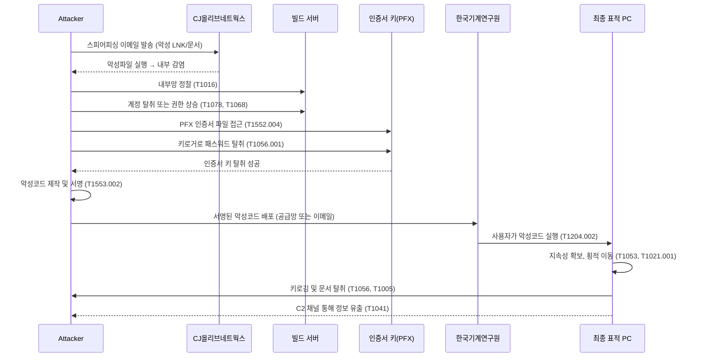

## 1. 공격 개요

김수키 조직은 **표적 기업**(이번 경우 CJ올리브네트웍스)에 먼저 침투하여, 내부 개발서버나 빌드서버에서 **코드서명 인증서를 확보**한 뒤, 이 **탈취된 인증서**를 사용해 악성코드를 정상 프로그램처럼 위장·서명합니다. 그 후 **기존 신뢰 체계**를 악용해 다른 기관(예: 한국기계연구원) 등 최종 표적 조직에 악성 파일을 배포·실행시킴으로써 탐지를 우회하고 침투 범위를 확장합니다.

<!--more-->

---

## 2. 김수키의 디지털 인증서 탈취 및 악용: MITRE ATT\&CK 매핑

아래는 공격 단계를 **전술(빨간색)** 중심으로 구분하고, 각 단계에서 사용된 대표적인 기법(Technique ID)을 정리한 것입니다.

### (1) 초기 침투 - **Initial Access (TA0001)**

| 기법(Technique)                         | ID        | 설명                                                                                           |
| ------------------------------------- | --------- | -------------------------------------------------------------------------------------------- |
| **Spearphishing Attachment**          | T1566.001 | 김수키 조직은 PDF·HWP·LNK 등 형태의 악성 첨부파일을 사용한 스피어피싱 메일로 초기 접근권을 확보합니다. 첨부 실행 시 악성코드가 설치되어 내부 접근 가능. |
| **Exploit Public-Facing Application** | T1190     | (가능성) 만약 표적 기업의 웹 서버·VPN 장비 등에 RCE 취약점이 있었다면 이를 악용하여 직접 내부 시스템에 진입할 수도 있음.                   |

### (2) 권한 획득 & 내부 정찰 - **Privilege Escalation (TA0004), Discovery (TA0007), Lateral Movement (TA0008)**

| 기법(Technique)                              | ID        | 설명                                                                                            |
| ------------------------------------------ | --------- | --------------------------------------------------------------------------------------------- |
| **Valid Accounts**                         | T1078     | 공격자가 이메일·VPN·도메인 계정 등 유효한 자격 증명을 탈취해 권한을 확대. 과거 김수키는 피싱으로 획득한 계정을 써서 내부망에 접근한 정황이 자주 포착됨.     |
| **System Network Configuration Discovery** | T1016     | 내부망에서 인증서나 빌드 서버 위치를 알아내기 위해 OS·네트워크·공유 폴더 정보 등을 수집.                                          |
| **Remote Services: RDP**                   | T1021.001 | 내부망 내 여러 서버로 횡적 이동할 때 RDP(원격 데스크톱)를 설치·확장(RDP Wrapper)해 지속적으로 접근 가능하도록 설정하는 김수키 특성이 자주 보고됨.   |
| **Privilege Escalation: Exploitation**     | T1068     | 윈도우 취약점, 레지스트리·권한오류(SUDO misconfig 등)를 활용해 높은 권한(관리자/시스템 권한)을 획득하여 코드서명 인증서가 있는 서버 접근 범위를 늘림. |

### (3) 코드서명 인증서 탈취 - **Credential Access (TA0006)**

| 기법(Technique)                       | ID        | 설명                                                                                       |
| ----------------------------------- | --------- | ---------------------------------------------------------------------------------------- |
| **Unsecured Private Keys**          | T1552.004 | 빌드 서버·개발자 PC 등에 저장된 `.p12`/`.pfx` 등 **코드서명 개인키** 파일을 직접 찾아내거나, 자동화된 스크립트로 디스크를 검색해 확보.   |
| **Keylogging** (또는 Input Capture)   | T1056.001 | 인증서 파일 자체가 암호로 보호되어 있으면, 키로거 등을 통해 패스프레이즈를 입력하는 순간 가로채어 탈취.                              |
| **OS Credential Dumping** (일부 시나리오) | T1003     | (가능성) 만약 인증서 관리자 계정 정보가 도메인 환경에 저장되어 있고, 이를 덤프(lsass 등)해서 인증서 관리 서버에 대한 접근 권한을 획득할 수 있음. |

### (4) 악성코드 서명 및 보안 우회 - **Defense Evasion (TA0005)**

| 기법(Technique)                       | ID        | 설명                                                                  |
| ----------------------------------- | --------- | ------------------------------------------------------------------- |
| **Code Signing**                    | T1553.002 | **탈취한 인증서**로 악성코드에 디지털 서명. Windows/백신에서 정상 개발사 소프트웨어로 인식해 탐지 우회 가능. |
| **Masquerading**                    | T1036     | 실행파일 이름/아이콘/버전 정보를 정상 프로그램처럼 위장. 서명도 CJ올리브네트웍스 명의라 보안 탐지가 한층 어려워짐.  |
| **Obfuscated Files or Information** | T1027     | 내부 악성 스크립트·페이로드를 난독화하거나, 시그니처 탐지를 회피하기 위해 XOR·Base64 등으로 암호화해 배포.   |
| **Disable or Modify Tools**         | T1562.001 | (가능성) EDR·백신 등 보안솔루션을 비활성화하거나 로깅 설정을 조작해 악성코드 설치를 은폐.               |

### (5) 추가 침투 & 최종 표적 공격 - **Execution (TA0002), Persistence (TA0003), Collection (TA0009), Exfiltration (TA0010)**

| 기법(Technique)                              | ID            | 설명                                                                                         |
| ------------------------------------------ | ------------- | ------------------------------------------------------------------------------------------ |
| **User Execution**                         | T1204.002     | CJ올리브네트웍스 서명 악성코드를 최종 표적(KIMM 연구원 등)이 “정상 업데이트 파일”로 오인하여 직접 실행하도록 유도(이메일 첨부·USB·협력사 경유 등). |
| **Scheduled Task/Job**                     | T1053         | 악성 DLL이나 스크립트를 예약 작업으로 등록해 지속성(Persistence)을 확보. 재부팅 후에도 자동 실행되도록 함.               |
| **Screen Capture / Keylogging**            | T1113 / T1056 | 김수키가 확보한 백도어를 통해 연구원 PC에서 화면·키보드를 수집, 내부 연구 문서·계정 등을 탈취.                                   |
| **Data from Local System / Network Share** | T1005         | 연구소나 기업 내부 파일서버를 뒤져 문서·소스코드·인프라 정보 등을 빼냄.                                                  |
| **Exfiltration Over C2 Channel**           | T1041         | 탈취 데이터(연구원 문서·시스템정보 등)를 C2 서버로 전송. 김수키는 종종 HTTP/HTTPS, WebDAV, DNS隧道 등을 사용해 유출하는 것으로 알려짐.  |

---

## 3. 요약 공격 흐름

아래는 김수키 조직이 **인증서 탈취** → **악성코드 서명** → **최종 표적 공격** 전 과정을 단계별로 재정리한 요약 흐름도입니다:

1. **스피어피싱 등으로 CJ올리브네트웍스 내부 침투**
   - (TA0001) 초기 침투: T1566.001
   - 내부 권한 확보, 빌드 서버 탐색: T1016 등

2. **코드서명 인증서(개인키) 탈취**
   - (TA0006) Credential Access: T1552.004
   - 키로거 통해 PFX 암호 수집: T1056.001

3. **탈취 인증서로 악성코드 서명**
   - (TA0005) Defense Evasion: T1553.002
   - 서명된 악성코드를 외부 표적에게 전파

4. **최종 표적(한국기계연구원 등) 악성코드 실행**
   - (TA0002) User Execution: T1204.002
   - (TA0003) 지속성 확보, (TA0008) 횡적 이동

5. **정보 수집 및 유출**
   - (TA0009) Collection: T1056, T1113
   - (TA0010) Exfiltration: T1041

---

### 📊 Sequence Diagram — 전체 흐름

---

## 4. 시사점 및 방어 권고사항

1. **코드서명 인증서 보호**

   * **개발·빌드 서버**에 저장된 인증서(개인키) 접근 권한을 최소화하고, 가능하다면 **HSM**(Hardware Security Module)을 도입해 물리적 분리·보호.
   * 인증서 사용 시 **다중 인증**(MFA) 요구, **로그 기록**(누가 언제 어떤 코드에 서명했는지) 철저 관리.

2. **서명 파일도 행위 기반 탐지 필수**

   * 코드서명 유무와 관계없이 **수상한 프로세스 행동**(권한 상승, 임의 파일 작성, C2 통신)은 보안솔루션(EDR/XDR)에서 즉시 경고·차단.
   * **서명=정상**이라는 과도한 신뢰에서 벗어나, 내부망에서도 정기적으로 “탈취된 인증서 목록(CRL)” 업데이트·검증.

3. **스피어피싱 방어 및 내부 정찰 탐지**

   * 김수키의 주공격 벡터인 **스피어피싱 메일**을 차단하기 위해 ATP 이메일 필터, URL/첨부 스캐닝 강화.
   * 초기 침투 후 **빌드 서버**나 **인증서 관리 서버**로의 불법 접근을 조기 발견하기 위해, SIEM·XDR에서 계정 탈취 징후(로그인 이력)·네트워크 스캔 이벤트를 모니터링.

4. **위협 인텔리전스 및 CRL(인증서 폐기 목록) 실시간 적용**

   * 탈취된 인증서의 **해시, 일련번호**를 위협 인텔리전스에 등록해 **서명된 악성코드**를 빠르게 식별.
   * 운영체제·백신·브라우저가 **폐기된 인증서**로 서명된 프로그램을 신뢰하지 않도록 **CRL/OCSP**를 주기적으로 강제 업데이트.

5. **협력사·공급망 보안**

   * 김수키가 **공급망**(하청업체, 협력사)을 거쳐 최종 표적에 접근하기 때문에, **공급망 파트너사**에게도 보안 정책·기준 준수 요구.
   * 협력사와의 연결 구간(예: VPN, 파일공유 서버)에 대해 Zero Trust 접근 통제, 평시 로그 모니터링 실시.

아래는 기존 김수키의 인증서 탈취 공격 시나리오에 **“CJ대한통운 배송관리 프로그램 위장”** 가능성을 추가하여, 공격 범위가 어떻게 확장될 수 있는지를 설명하는 시나리오입니다.

---

## 5. **가정(假定) 시나리오**: CJ대한통운 배송 관리 프로그램으로 위장한 광범위 공급망 공격

> **중요 안내**
> 본 문단은 **실제로 일어난 사건**을 서술한 것이 아니라, 만약 CJ올리브네트웍스 인증서가 탈취되었을 경우를 **가정**하여 작성한 **가능성 시나리오**입니다. 현재까지 이와 같은 대규모 공격이 실제로 일어났다는 **공식 발표나 확인된 사실**은 없습니다.

### 5.1 개요

만약 김수키 조직이 CJ올리브네트웍스의 코드서명 인증서를 탈취했고, 이를 **CJ대한통운 배송 관리 프로그램**(예: 운송장 출력기, 기사용 앱 설치 프로그램 등)처럼 위장하여 서명했다면, 그 파급 범위가 단일 조직을 넘어 **수많은 물류·택배 협력사와 중소기업, 소상공인**까지 확산될 가능성이 있습니다. 이 가상의 시나리오는, 기존에 김수키가 보여 왔던 **정상 인증서 악용** 전술에 비추어 “이런 형태로도 공격이 가능하다”는 점을 경고하는 목적으로 작성되었습니다.

### 5.2 가정된 공격 시나리오

1. **인증서 유출(가정)**

   * 김수키 조직이 CJ올리브네트웍스의 내부 개발·빌드망에 침투하고, 정식 코드서명 인증서를 탈취했다고 **가정**합니다.

2. **배송 프로그램 위장 악성코드 제작**

   * 공격자는 “CJ대한통운 운송장 출력 프로그램” 또는 “기사용 앱 업데이트 파일”처럼 보이는 **악성코드**를 제작합니다.
   * 예) `CJ_DeliverySetup.exe`, `운송장출력_최신버전.exe` 등 아이콘·버전 정보, 디지털 서명도 CJ올리브네트웍스 명의로 위장.

3. **정상 서명으로 신뢰 확보**

   * 탈취한 인증서로 서명된 악성 파일은 Windows나 백신이 **신뢰할 만한 소프트웨어**로 인식하기 쉽습니다.
   * 사용자 입장에서도 “CJ대한통운” 관련 파일이므로 의심 없이 실행할 수 있습니다.

4. **악성코드 배포 경로(가정)**

   * **택배 기사 대상 스피어피싱**: “업데이트 안내” 이메일에 악성 설치파일 첨부.
   * **광고/포털 배너 등**을 통해 “배송 프로그램 최신 버전 다운로드” 링크 위장.
   * **협력사 서버 침해 후** 정상 다운로드 링크를 공격자가 교체하는 방식 등.

5. **광범위 감염 및 내부망 확산 가능성**

   * 다수의 중소 택배 대리점·쇼핑몰 운영자가 “정상 업데이트”로 믿고 설치했다가 감염.
   * 악성코드는 키로깅, 계정·문서 탈취, 추가 페이로드 다운로드 등으로 **사내망 확산**을 노립니다.
   * 심각한 경우, 대형 온라인 플랫폼(쿠팡·네이버 쇼핑 등)과 연결된 시스템으로까지 **연쇄 침투** 가능성을 배제할 수 없습니다.

> 위 모든 단계는 \*\*“만약 인증서가 탈취되었다면”\*\*이라는 전제를 둔 **가정 시나리오**입니다.

---

### 5.3 확산 범위가 위험한 이유 (가정 근거)

| 항목                 | 설명                                                                              |
| ------------------ | ------------------------------------------------------------------------------- |
| **신뢰 기반 공급망**      | CJ대한통운은 수많은 대리점·협력사와 연동돼 있으므로, 단 하나의 위장 파일 감염만으로도 **광범위하게 감염이 확산**될 수 있음.       |
| **공용 PC 사용률 높음**   | 택배 현장에는 여러 사람이 함께 쓰는 **공용 윈도우 PC**가 많아, 키보드 입력·계정이탈 취약성이 크고, 한 번 감염되면 지속 전파 가능. |
| **정상 서명으로 인한 우회**  | CJ올리브네트웍스 명의의 디지털 서명을 악용하므로, 백신·EDR이 악성 여부를 탐지하기 어려워질 수 있음.                     |
| **이메일·택배정보 악용 가능** | 고객 이름·주소·전화번호 등이 유출되면, **2차 스미싱**이나 추가 표적 공격의 위험이 커짐.                           |

---

### 5.4 마이터 어택(MITRE ATT\&CK) 추가 매핑 (가정 예시)

| 전술(Tactic)                       | 기법(Technique)                                                | 설명                                              |
| -------------------------------- | ------------------------------------------------------------ | ----------------------------------------------- |
| **TA0001 (Initial Access)**      | T1566.002 – **Spearphishing Link**                           | CJ대한통운 업데이트 안내 메일을 사칭하여 **악성 링크** 배포.           |
| **TA0005 (Defense Evasion)**     | T1553.002 – **Code Signing**                                 | CJ 인증서로 서명된 악성코드를 통해 백신과 Windows 기본 보안 우회.      |
| **TA0009 (Collection)**          | T1056 – **Keylogging** T1005 – **Data from Local System** | 운송장 입력, 고객정보, 관리자 계정 등 **민감 데이터**를 탈취.          |
| **TA0010 (Exfiltration)**        | T1041 – **Exfiltration Over C2 Channel**                     | 탈취 정보를 외부 C2 서버로 전송(HTTPS/TCP 등).               |
| **TA0011 (Command and Control)** | T1071.001 – **Web Protocols**                                | C2 서버와 \*\*정상 포트(443)\*\*를 통해 암호화 통신, 장기 침투 유지. |

---

### 5.5 참고 사항: 김수키(Kimsuky)의 주요 특징

* 북한 측 지원을 받는 것으로 알려진 APT 그룹이며, **스피어피싱**과 **문서 기반 악성코드**, 그리고 **정상 인증서 탈취** 등을 통한 **공격 고도화**가 자주 발견됨.
* 다수 국내외 연구 기관, 방산 업체, 언론사 등이 표적이 된 정황이 보고되었으며, **RDP Wrapper, 백도어, 키로깅** 등 다양한 기법을 혼합하여 장기적으로 내부 시스템을 장악·수집하는 형태가 특징임.

---

### $정리: “가정 시나리오” 차원의 주의 환기$

이상은 “CJ올리브네트웍스 인증서 유출”이 **실제 확인되지 않은** 상황에서, 만약 그런 일이 발생했을 때 **공급망 공격이 어디까지 확대될 수 있는지**를 설명하기 위해 제시한 **가정 시나리오**입니다. 실제로 이렇게 공격이 발생했다는 **공식 확인**이나 **인증서 유출 확증**은 현재 공개되지 않았음을 다시 한 번 강조합니다.

그럼에도 불구하고, 과거 김수키 및 여러 APT 조직들이 **정상 인증서 탈취**를 통한 공격을 여러 차례 시도한 바 있기 때문에, **공급망 보안 및 인증서 관리**에 대한 철저한 대비가 필요하다는 점을 시사합니다.

---

## 결론

김수키 조직이 **탈취한 디지털 인증서**를 이용해 악성코드를 서명하고, 이를 통해 공급망 공격(Supply Chain Attack)을 전개한 사례는, 신뢰 기반 보안 체계를 정면으로 위협하는 **Defense Evasion**의 대표적 전술입니다.
**MITRE ATT\&CK 프레임워크**로 분석하면, 공격자는 **Initial Access** → **Credential Access**(인증서 탈취) → **Defense Evasion**(서명 우회) → **Execution/Persistence/Collection**에 이르기까지 **APT 공격 전 과정을 체계적으로 수행**한 것으로 보입니다.

특히 탈취된 인증서를 활용해 **CJ대한통운 배송 프로그램을 위장**할 경우, 공격 범위는 단일 조직을 넘어 **수만 개의 물류 협력사, 중소기업, 소상공인**에게까지 확산될 수 있으며, 이는 **전국적 공급망 교란 시나리오**로 이어질 수 있습니다. 해당 환경의 다수는 보안 인프라가 취약해 **2차 피해** 가능성도 매우 큽니다.

결국, 이번 사례는 **디지털 인증서가 단순한 보안 구성요소를 넘어, 전체 신뢰 체계의 중심축**임을 재확인시켜주며, 조직은 다음을 반드시 갖추어야 합니다:

* **정상 서명 파일도 의심하라**는 원칙에 기반한 **행위 기반 탐지(XDR, SIEM)**
* **정기적인 CRL/OCSP 확인 및 인증서 관리 보안 강화**
* **협력사까지 포함한 공급망 보안 통제 및 위협 인텔리전스 연계**

탈취된 인증서는 단순 내부 보안 사고가 아니라, **전방위적 사이버 작전의 기폭제**가 될 수 있습니다. 따라서 지금 이 순간부터라도, **예방 중심의 보안 전략**으로 전환하는 것이 필수적입니다.

---
