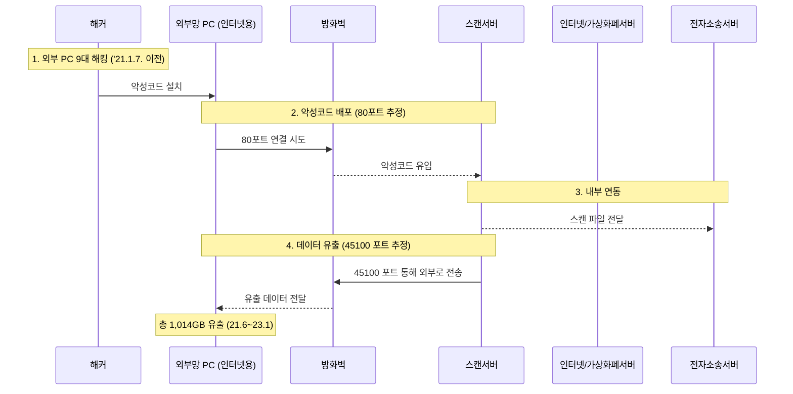

사법부 전산망이 **북한 해킹조직** ‘라자루스’로 추정되는 집단의 공격을 받아 **최소 1만7998명**의 개인정보가 유출되었습니다.  
**내부·외부망 간 ‘포트’(네트워크 통신 경로)의 개방**과 **미흡한 계정·암호 관리** 등의 보안 취약점을 악용하여 대규모 **1,014GB** 분량의 데이터가 외부로 유출된 것으로 파악됩니다.

<!--more-->
---

### 1. **정찰 (Reconnaissance)**
#### 🔍 **내·외부망 연결 확인 및 취약점 파악**
- 내부망과 외부망이 **포트를 통해 자유롭게 통신** 가능하도록 구성되어 있음을 확인.
- **내부망·외부망 관리 계정**이 쉽게 유추 가능한 기본 비밀번호(초기 비밀번호)로 설정되어 있음을 파악.

---

### 2. **최초 침투**
#### 🚨 **악성코드 유포와 침투**
- 외부망용 PC(인터넷용) **9대**를 사전에 해킹하여 **악성코드**를 설치.
- 해당 PC들을 **중간 경유지**로 삼아 내부 스캔 서버에 악성코드를 배포(추정 **80포트** 사용).

---

### 3. **정보 수집**
#### 🗄️ **전자소송 서버 접근 및 대량 데이터 확보**
- 해커는 내부 스캔서버와의 연동 과정을 악용하여 **전자소송 서버**로 접근.
- **PDF 파일**로 변환·보관 중이던 **주민등록번호, 진단서, 혼인관계증명서** 등 **소송 문서** 일체 확보.
- 암호화가 적용되지 않은 주민번호 등 민감정보가 포함된 **1,014GB** 분량의 데이터를 대량으로 수집.

---

### 4. **정보 유출**
#### 📤 **외부로 데이터 전송**
- 스캔서버가 **45100포트**를 통해 외부망으로 데이터를 전송하도록 조작.
- **8개월** 이상 해킹 사실을 인지하지 못해 **지연 신고**로 이어지고, 그동안 대규모 데이터 유출 발생.

---

### 5. **유출 방법 개념도**

### 📑 참고 자료
* [조선일보 기사](https://www.chosun.com/national/2024/05/13/VFMMY3PYINEL7IKHG4KNRAHTH4/)  
