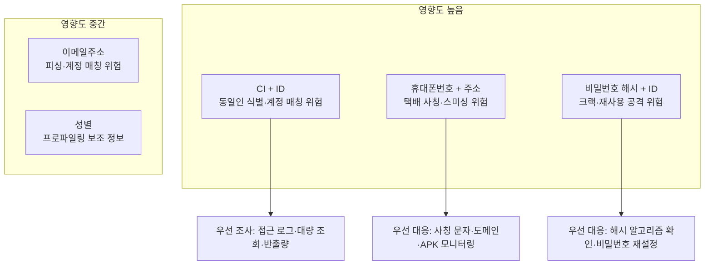
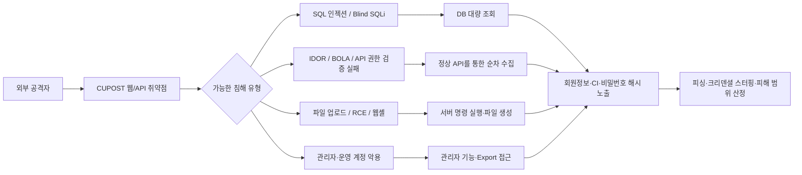
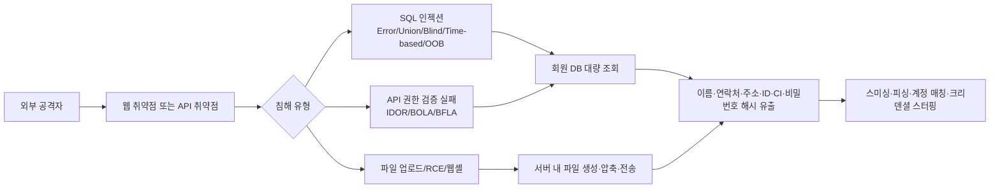
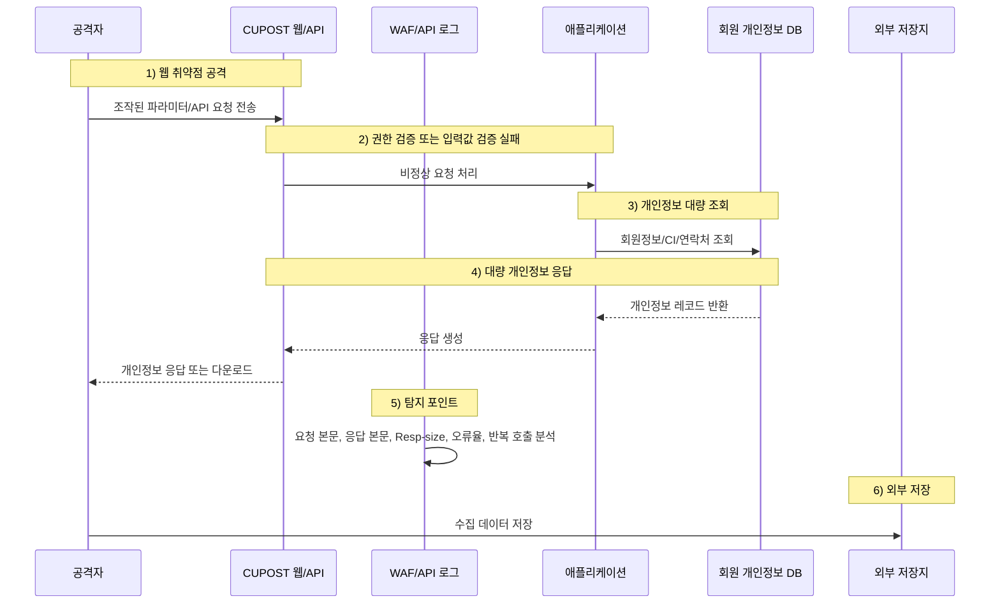
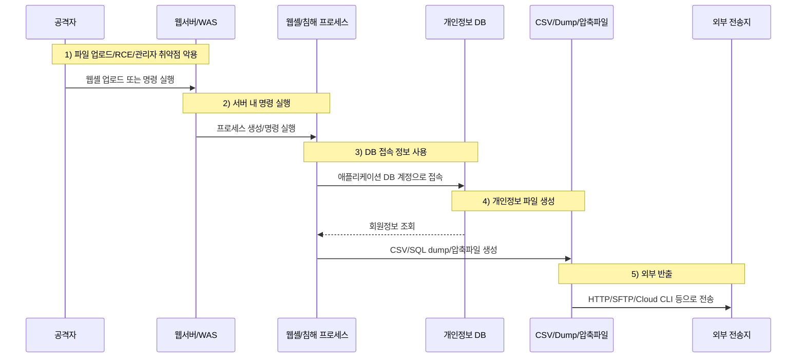

CU편의점택배 서비스인 **CUPOST** 에서 개인정보 유출 사고가 공개됐습니다.

이번 사고의 핵심은 단순한 “택배 조회 오류”나 “개별 이용자 계정 탈취”가 아닙니다.  
BGF네트웍스 공지와 언론 보도에 따르면, **신원 미상의 해커가 웹 취약점을 이용해 시스템에 비인가 접근했고, 온라인 회원 고객의 개인정보가 유출된 정황**이 확인됐습니다.

즉, 이번 사건은  
**생활 밀착형 택배 플랫폼의 개인정보 저장소 또는 회원 시스템에 대한 침해 사고**로 봐야 합니다.

특히 이번 사고에서 주목해야 할 지점은 세 가지입니다.

1. **웹 취약점을 이용한 외부 침입**
2. **연계정보(CI)와 계정 정보의 동시 유출**
3. **택배 서비스를 사칭한 피싱·스미싱 2차 피해 가능성**

세 가지 모두 중요합니다.  
웹 취약점이 단순 조회 취약점인지, SQL 인젝션인지, 인증 우회인지, 파일 업로드 또는 웹셸 침해인지에 따라 피해 범위와 대응 우선순위가 달라집니다.

CI가 유출됐다는 점도 심각합니다.  
CI는 국내 온라인 서비스에서 동일인을 식별·연계하는 데 활용되는 값이므로, 이름·휴대폰번호·이메일·ID와 결합되면 계정 매칭, 피싱, 크리덴셜 스터핑 공격의 정확도를 높일 수 있습니다.

그리고 택배 서비스 특성상 공격자는 “주소 오류”, “배송 실패”, “반값택배 수령”, “운송장 재등록”, “환불 확인” 같은 문구로 이용자를 속이기 쉽습니다.

<!--more-->

---

## 핵심만 보기 (30초 요약)

- 이번 사고는 현재 공개 정보 기준으로 **CU 전체 POS·결제 시스템 침해가 아니라 CU편의점택배(CUPOST) 회원 개인정보 유출 사고**입니다.
- 원인은 회사 공지와 보도상 **웹 취약점을 이용한 비인가 외부 침입**으로 설명됐지만, SQL 인젝션·API 권한 검증 실패·웹셸 등 구체 경로는 아직 확정되지 않았습니다.
- 유출 항목에는 **이름, 휴대폰번호, 이메일주소, 주소, 성별, ID, 단방향 암호화 처리된 비밀번호, CI**가 포함됐습니다.
- 가장 큰 위험은 **CI와 계정 정보, 주소·휴대폰번호가 함께 유출되어 계정 매칭·크리덴셜 스터핑·택배 사칭 스미싱의 정확도가 높아질 수 있다는 점**입니다.
- 기업은 공격 경로, 실제 반출량, **비밀번호 해시 알고리즘·salt·pepper·work factor**, CI 저장 방식, 웹셸·백도어 잔존 여부를 로그 기반으로 규명해야 합니다.
- 이용자는 CUPOST와 동일한 비밀번호를 쓴 모든 서비스의 비밀번호를 바꾸고, 배송 오류·QR 재발급·보상·환불 링크를 공식 경로가 아닌 문자·메일에서 누르지 않아야 합니다.

---

## 핵심 요약

- **사고 공개:** BGF네트웍스는 2026년 6월 5일 CUPOST 홈페이지 공지를 통해 개인정보 유출 사고를 안내했습니다.
- **침해 시점:** 공지에 따르면 2026년 6월 4일 15시 30분경 신원 미상의 해커가 시스템에 비인가 접근해 개인정보를 유출한 정황이 확인됐습니다.
- **사고 성격:** CU 전체 매장, POS, 포켓CU 결제 시스템 침해로 확인된 것이 아니라, 현재 공개 정보 기준으로는 **CU편의점택배(CUPOST)를 운영하는 BGF네트웍스의 회원 개인정보 유출 사고**입니다.
- **침입 경로:** 회사 공지와 보도 기준으로는 **웹 취약점을 이용한 외부 침입**입니다. 다만 SQL 인젝션, 인증 우회, 파일 업로드, 웹셸, API 권한 검증 실패 등 구체적인 취약점 유형은 아직 공개되지 않았습니다.
- **유출 항목:** 공식 공지 기준으로 이름, 휴대폰번호, 이메일주소, 주소, 성별, ID, 단방향 암호화 처리된 비밀번호, 연계정보(CI)가 포함됐습니다.
- **중요 포인트:** CI와 계정 정보가 함께 유출됐다는 점이 가장 민감합니다. 다른 사이트의 유출 계정 정보와 결합되면 크리덴셜 스터핑과 정교한 피싱에 활용될 수 있습니다.
- **현재 미확정:** 실제 피해 인원, 유출 건수, 취약점 유형, DB 접근 범위, 파일 생성·반출 여부, 비밀번호 해시 알고리즘, CI 저장·보호 방식은 아직 명확히 공개되지 않았습니다.
- **수하인 정보:** 회사가 고객에게 보낸 안내 문자 기준으로는 온라인 회원 고객 정보에 한정되고, 발송 시 입력한 수하인 등 제3자 정보는 포함되지 않은 것으로 설명됐습니다. 다만 최종 조사 결과로 재확인되어야 합니다.
- **핵심 대응:** 지금은 “비밀번호가 암호화됐으니 안전하다”가 아니라, **어떤 웹 취약점으로 들어왔고, 어떤 계정·서버·DB·파일에 접근했으며, 실제로 어떤 데이터가 외부로 나갔는지**를 규명하는 것이 중요합니다.


---

## 사실 관계 정리

### ✅ 공개적으로 확인된 내용

- CUPOST 공식 홈페이지에는 **2026년 6월 5일자 “개인정보 유출 사고 안내”** 공지가 게시됐습니다.
- BGF네트웍스는 CU편의점택배를 운영하는 사업자입니다.
- 회사 공지에 따르면, 2026년 6월 4일 15시 30분경 신원 미상의 해커가 시스템에 비인가 접근해 고객 개인정보를 유출한 정황이 확인됐습니다.
- 유출 경위는 **웹 취약점을 이용한 비인가 외부 침입**으로 설명됐습니다.
- 유출 항목에는 이름, 휴대폰번호, 이메일주소, 주소, 성별, ID, 단방향 암호화 처리된 비밀번호, 연계정보(CI)가 포함됐습니다.
- 회사는 인지 즉시 공격 IP를 차단하고 보완 조치를 완료했으며, 침해사고 대응팀을 가동하고 보안 정책을 재정비하고 있다고 안내했습니다.
- 회사는 개인정보보호위원회와 한국인터넷진흥원(KISA) 등 관계기관에 신고했다고 밝혔습니다.
- 회사는 이용자에게 동일 비밀번호 사용 서비스의 비밀번호 변경, 출처 불분명한 전화·문자·URL 주의, 금융정보 요구 사칭 행위 주의를 권고했습니다.

### 🟨 공개됐지만 추가 확인이 필요한 내용

- 실제 피해 인원
- 전체 유출 건수
- 유출된 데이터의 정확한 기준 시점
- 생년월일 포함 여부 등 일부 언론 보도와 공식 공지 간 세부 항목 차이
- 최초 침투에 사용된 정확한 웹 취약점 유형
- SQL 인젝션 여부
- 인증 우회 또는 IDOR/BOLA 등 API 권한 검증 실패 여부
- 파일 업로드 취약점 또는 웹셸 업로드 여부
- 관리자 계정·운영자 계정 탈취 여부
- DB 계정 또는 애플리케이션 계정 탈취 여부
- 개인정보 파일 생성 또는 Export 여부
- DB 백업·Object Storage 접근 여부
- 비밀번호 해시 알고리즘, salt, pepper 적용 여부
- CI 저장 방식과 접근 통제 수준
- 공격자가 접근한 서버·DB·테이블·파일의 범위
- 수하인 등 제3자 정보 미포함 여부의 최종 조사 확인

### 🗓️ 타임라인

- **2026-06-04 15:30경:** 신원 미상의 해커가 시스템에 비인가 접근하고 개인정보를 유출한 정황 확인
- **2026-06-05:** CUPOST 홈페이지에 개인정보 유출 사고 안내 공지 게시
- **사고 인지 직후:** 공격 IP 차단, 보완 조치 완료, 침해사고 대응팀 가동, 보안 정책 재정비
- **사고 인지 후:** 개인정보보호위원회와 KISA 등 관계기관 신고
- **2026-06-06:** 보안뉴스, 연합뉴스 등 주요 언론에서 사고 보도

---

## 1. 사고 개요

### 🚚 생활 밀착형 택배 플랫폼 침해는 단순 사이트 해킹이 아니다

CUPOST는 단순 안내 페이지가 아닙니다.  
회원 가입, 택배 예약, 배송 조회, 반값택배, 방문택배, 제휴·픽업 서비스 등 생활 밀착형 기능을 제공하는 플랫폼입니다.

이런 서비스는 다음과 같은 정보를 함께 보유할 수 있습니다.

- 회원 계정 정보
- 본인 식별 정보
- 연락처
- 주소 정보
- 택배 예약·접수 이력
- 배송 조회 정보
- 고객센터 문의 정보
- 제휴·픽업 서비스 관련 정보
- 본인확인 연계정보(CI)

따라서 CUPOST 회원 시스템이 침해되면  
단순히 “택배 사이트 비밀번호를 바꾸면 끝나는 사고”가 아닙니다.

이번 사고는  
**생활 물류 플랫폼의 개인정보 저장소가 외부 웹 취약점에 의해 침해된 사고**로 봐야 합니다.

특히 주소와 휴대폰번호가 포함됐기 때문에, 공격자는 실제 택배 이용 맥락에 맞춘 사칭 메시지를 만들 수 있습니다.  
이 점이 일반 커뮤니티 사이트 유출보다 더 위험합니다.

---

## 2. 유출 항목이 왜 민감한가

공식 공지 기준으로 확인된 유출 항목은 단순 연락처 수준이 아닙니다.

| 유출 항목 | 위험도 | 설명 |
|---|---:|---|
| 이름 | 중간~높음 | 휴대폰번호, 주소, CI와 결합하면 개인 식별과 사칭 가능성이 커짐 |
| 휴대폰번호 | 높음 | 스미싱, 보이스피싱, 계정 복구 공격에 직접 악용 가능 |
| 이메일주소 | 중간~높음 | 피싱 메일, 계정 매칭, 다른 서비스 로그인 대입에 활용 가능 |
| 주소 | 높음 | 택배 사칭, 배송 오류 사기, 거주지 기반 표적 피싱에 활용 가능 |
| 성별 | 중간 | 단독 위험은 낮지만 프로파일링에 활용 가능 |
| ID | 높음 | 다른 서비스 로그인 대입, 계정 매칭, 크리덴셜 스터핑에 활용 가능 |
| 비밀번호 | 중간~높음 | 단방향 암호화 처리됐더라도 해시 강도에 따라 크랙 가능성 존재 |
| CI | 매우 높음 | 여러 온라인 서비스에서 동일인을 식별·연계하는 데 사용될 수 있는 고위험 식별정보 |

### 유출 데이터 위험도 매트릭스



| 결합 데이터 | 위험도 | 우선 대응 |
|---|---:|---|
| CI + ID + 이메일 | 매우 높음 | 계정 매칭·크리덴셜 스터핑 탐지, CI 접근 로그 확인 |
| 휴대폰번호 + 주소 + 이름 | 매우 높음 | 택배 사칭 문자·보이스피싱·피싱 도메인 모니터링 |
| ID + 비밀번호 해시 | 높음 | 해시 알고리즘·salt·pepper 확인, 동일 비밀번호 변경 권고 |
| 이메일 + 이름 | 중간~높음 | 피싱 메일 탐지, 사칭 안내 문구 모니터링 |
| 성별 단독 | 낮음~중간 | 단독 위험은 제한적이나 다른 정보와 결합 시 프로파일링 가능 |

특히 **CI**가 중요합니다.

CI는 단순 연락처가 아니라 본인확인 과정에서 생성되는 연계정보입니다.  
서비스 간 동일인 식별에 활용될 수 있기 때문에, 이름·휴대폰번호·이메일·ID와 결합되면 공격자는 특정 이용자의 여러 온라인 계정을 더 쉽게 연결할 수 있습니다.

또한 주소와 휴대폰번호가 함께 유출되면 택배 사칭 시나리오가 매우 자연스러워집니다.

```text
[CUPOST] 고객님의 택배 주소 오류로 배송이 보류되었습니다.
아래 링크에서 주소를 재확인해 주세요.

[CU반값택배] 수령 QR 재발급이 필요합니다.
본인 인증 후 재발송받으세요.

[CU편의점택배] 운송장 정보가 만료되었습니다.
배송 재등록을 진행해 주세요.
```

이런 메시지는 실제 택배 이용 경험과 매우 유사하기 때문에 이용자가 속기 쉽습니다.

---

## 3. 웹 취약점 공격 가능성

### 🌐 “웹 취약점”은 시작점일 뿐이다

공개된 사고 설명에서 가장 중요한 표현은  
“**웹 취약점을 이용한 비인가 외부 침입**”입니다.

다만 현재 공개된 자료만으로는 구체적인 취약점 유형을 단정할 수 없습니다.

가능한 시나리오는 다음과 같습니다.

- SQL 인젝션
- 인증 우회
- 세션 검증 실패
- 관리자 페이지 노출
- 파일 업로드 취약점
- 웹셸 업로드
- 원격 코드 실행(RCE)
- 서버 사이드 요청 위조(SSRF)
- API 권한 검증 실패
- IDOR/BOLA 취약점
- 대량 조회 API의 접근 통제 실패
- 검색·조회 파라미터의 입력값 검증 실패

웹 취약점이 단순히 한 페이지의 오류인지,  
회원 DB에 직접 접근할 수 있는 구조적 취약점인지에 따라 사고의 심각도는 크게 달라집니다.

### 공격 경로 요약 다이어그램



이 다이어그램은 공격을 단정하기 위한 것이 아닙니다.  
조사 관점에서 **웹 요청, API 권한, 서버 침해, 관리자 기능 악용 가능성을 병렬로 확인해야 한다**는 의미입니다.

### 웹 취약점 사고에서 반드시 봐야 할 질문

- 공격 대상 URL 또는 API는 무엇이었는가?
- 공격자는 인증된 사용자였는가, 비인증 외부자였는가?
- 조작된 파라미터는 무엇인가?
- WAF 또는 웹서버 로그에 공격 요청 원문이 남아 있는가?
- DB 질의 로그에 비정상 SELECT, JOIN, UNION, Dump성 질의가 있는가?
- 특정 API에서 평소보다 큰 응답 크기가 반복됐는가?
- 개인정보가 응답 본문으로 내려갔는가, 파일로 생성돼 반출됐는가?
- 웹셸 또는 임시 파일 생성 흔적이 있는가?
- 공격자가 내부망 또는 DB 서버로 이동했는가?
- 단일 공격 IP만 있었는가, 프록시·VPN·클라우드 IP가 함께 쓰였는가?

즉, “웹 취약점”이라는 한 문장만으로는 부족합니다.  
**웹 요청, 응답 본문, DB 질의, 서버 파일, 계정 사용 이력, 외부 전송 로그를 함께 봐야 실제 침해 경로를 확인**할 수 있습니다.

### 공격 경로 한눈에 보기



이 다이어그램은 확정된 공격 경로가 아니라, 현재 공개된 “웹 취약점” 설명을 기준으로 조사해야 할 주요 분기입니다.  
따라서 실제 결론은 WAF·웹서버·애플리케이션·DB·EDR·네트워크 전송 로그를 연결해 확인해야 합니다.

---

## 4. SQL 인젝션과 API 권한 검증 실패 가능성

### 💉 SQL 인젝션 가능성은 있다. 그러나 단정하면 안 된다

웹 취약점을 통해 회원 개인정보가 유출됐다는 점에서 SQL 인젝션 가능성은 배제할 수 없습니다.

SQL 인젝션이라면 공격자는 웹/API 입력값을 조작해 DB 질의를 변조하고, 회원 테이블의 개인정보를 대량 조회했을 수 있습니다.

SQL 인젝션일 경우 다음 흔적이 남을 수 있습니다.

```text
' OR '1'='1
UNION SELECT
information_schema
order by
group_concat
concat_ws
load_file
into outfile
extractvalue
updatexml
@@version
--
/**/
%27
%2527
sleep()
benchmark()
pg_sleep()
waitfor delay
dbms_pipe.receive_message
utl_http
xp_dirtree
nslookup
```

여기서 중요한 것은 공격 문자열의 모양만 보는 것이 아닙니다.
Blind SQLi는 응답 본문이 거의 같아도 참/거짓에 따른 상태 코드·응답 길이 차이로 데이터를 추정할 수 있고, Time-based SQLi는 `sleep()`, `pg_sleep()`, `waitfor delay`처럼 지연 시간을 이용할 수 있습니다. Out-of-band SQLi는 DNS·HTTP 콜백을 이용해 DB 서버의 외부 통신 흔적으로 나타날 수 있습니다.

또는 더 은밀한 경우 다음 패턴이 관찰될 수 있습니다.

```text
특정 API 파라미터에 비정상적으로 긴 문자열 반복
검색·필터·정렬 파라미터 변조
동일 URL에 대한 반복적인 400/500 오류
응답 시간이 비정상적으로 길어지는 Blind SQLi 패턴
응답 크기가 점점 커지는 데이터 추출 패턴
정상 API처럼 보이지만 평소보다 훨씬 큰 Resp-size
특정 IP·세션에서 대량 회원정보 응답 발생
```

하지만 현재 공개 내용만으로  
**“SQL 인젝션 공격이었다”고 단정할 수는 없습니다.**

### Blind·Time-based·Out-of-band SQLi도 확인해야 한다

SQL 인젝션은 항상 `UNION SELECT`나 DB 오류 메시지처럼 노골적으로 드러나지 않습니다.  
공격자가 우회형 기법을 사용했다면 다음 흔적을 함께 확인해야 합니다.

| 유형 | 확인할 로그 신호 | 조사 포인트 |
|---|---|---|
| Boolean-based Blind SQLi | 참/거짓 조건에 따라 응답 크기, 상태 코드, 결과 건수 변화 | 동일 API에서 조건만 바꾼 반복 요청 여부 |
| Time-based Blind SQLi | `sleep()`, `benchmark()` 등으로 인한 응답 지연 | URL·파라미터별 응답 시간 분포와 p95/p99 급증 여부 |
| Error-based SQLi | DB 오류, 형변환 오류, XML/XPath 오류 등 비정상 오류 증가 | 400/500 오류와 DB 오류 로그의 시간대 매칭 |
| Out-of-band SQLi | DB 서버 또는 WAS에서 외부 DNS/HTTP 콜백 발생 | DB 서버의 비정상 외부 통신, DNS 질의, egress 허용 정책 |
| Stacked Query·파일 함수 악용 | 다중 질의, 파일 읽기·쓰기 시도 | DB 계정 권한, `FILE` 권한, 서버 임시 파일 생성 여부 |

따라서 SQL 인젝션 검증은 요청 문자열 탐지만으로 끝나면 안 됩니다.  
**응답 시간, 응답 크기, 오류율, DB 질의 로그, DNS/egress 로그, DB 계정 권한**을 함께 봐야 합니다.

### 🔓 API 권한 검증 실패 가능성도 봐야 한다

택배 서비스는 예약내역, 배송조회, 회원정보, QR 재발송, 고객센터, 제휴 서비스 등 다양한 API를 사용할 가능성이 큽니다.

이 경우 SQL 인젝션이 아니더라도 다음 취약점으로 대량 유출이 발생할 수 있습니다.

- 다른 회원의 예약내역을 조회할 수 있는 IDOR 취약점
- 객체 단위 권한 검증 실패(BOLA)
- 관리자 기능 API 접근 통제 실패
- 검색 API의 과도한 응답 정보 노출
- 페이지네이션·정렬 파라미터 조작을 통한 대량 수집
- 인증 토큰 검증 누락
- 내부용 API 외부 노출
- 다운로드/Export API 권한 검증 실패

SQL 인젝션은 DB 질의 변조가 핵심입니다.  
반면 API 권한 검증 실패는 **정상 API를 정상처럼 호출하지만, 권한이 없는 데이터가 응답으로 내려오는 것**이 핵심입니다.

이 둘은 로그에서 다르게 보입니다.

| 구분 | SQL 인젝션 | API 권한 검증 실패 |
|---|---|---|
| 공격 방식 | 입력값에 SQL 구문 삽입 | 정상 API 파라미터·객체 ID 조작 |
| 주요 흔적 | SQL 특수문자, UNION, 오류, 지연 응답 | 비정상적으로 많은 객체 ID 조회, 권한 없는 응답 |
| 핵심 로그 | WAF, 웹 요청, DB 질의 로그 | API Gateway, 애플리케이션 로그, 응답 본문 |
| 피해 양상 | DB 테이블 대량 조회·추출 | 회원별 데이터 순차 수집 또는 관리자 API 악용 |

따라서 이번 사고는 SQL 인젝션만 볼 것이 아니라,  
**웹/API 권한 검증 실패와 대량 조회 흐름까지 함께 확인**해야 합니다.

---

## 5. CI 유출이 더 위험한 이유

### 🧬 CI는 단순 연락처가 아니다

이번 사고에서 가장 민감한 항목은 **연계정보(CI)** 입니다.

CI는 본인확인기관을 통해 생성되는 동일인 식별 정보로, 여러 서비스에서 같은 사람을 식별하거나 연계하는 데 활용될 수 있습니다.

이 값이 유출되면 공격자는 다음과 같은 방식으로 악용할 수 있습니다.

1. CUPOST 유출 ID, 이메일, 휴대폰번호, CI 확보
2. 기존 다크웹 유출 계정 정보와 매칭
3. 동일 이메일·전화번호 기반으로 다른 서비스 계정 추정
4. 같은 비밀번호를 사용하는 계정에 로그인 시도
5. 피해자 이름과 주소를 이용해 택배 사칭 메시지 발송
6. 본인확인·보상·환불·주소 오류를 가장한 피싱 페이지 유도

CI는 그 자체로 로그인 비밀번호는 아닙니다.  
그러나 **다른 개인정보와 결합될 때 식별 정확도를 높이는 연결 고리**가 될 수 있습니다.

따라서 CI 유출 사고에서는 단순 “연락처 유출”보다 더 높은 수준의 위험 평가가 필요합니다.

### CI 보호에서 확인해야 할 것

- CI가 평문으로 저장됐는가?
- CI가 암호화 또는 토큰화되어 있었는가?
- CI 조회 권한이 최소화되어 있었는가?
- 대량 CI 조회 탐지가 있었는가?
- CI 접근 로그가 보존되어 있는가?
- CI를 포함한 테이블 접근이 어떤 계정으로 이루어졌는가?
- CI가 포함된 Export 파일이 생성됐는가?
- CI를 외부 전송한 로그가 있는가?

CI가 유출된 이상,  
**CI를 누가, 언제, 어떤 경로로, 몇 건 조회했는지**를 로그 기반으로 규명해야 합니다.

---

## 6. 비밀번호는 복호화가 아니라 크랙의 문제다

### 🔐 단방향 암호화는 원칙적으로 복호화되지 않는다

회사 공지에 따르면 유출된 비밀번호는 **단방향 암호화 처리**됐습니다.

비밀번호가 실제로 안전한 단방향 해시로 저장됐다면, 공격자가 DB를 확보하더라도 원문 비밀번호를 바로 “복호화”할 수는 없습니다.

하지만 이 말이 곧 안전하다는 뜻은 아닙니다.

공격자는 다음 방식으로 비밀번호를 알아내려 합니다.

```text
후보 비밀번호 입력
→ 동일한 해시 알고리즘으로 계산
→ 유출된 해시와 비교
→ 일치하면 원문 비밀번호 확인
```

이것이 **비밀번호 크랙**입니다.

### 해시 강도에 따라 위험이 달라진다

위험도는 다음에 따라 달라집니다.

- Argon2id, scrypt, bcrypt, PBKDF2 등 느린 해시 알고리즘 사용 여부
- salt 적용 여부
- pepper 적용 여부
- work factor 또는 반복 횟수
- 단순 SHA-256, SHA-1, MD5 같은 빠른 해시 사용 여부
- 해시 알고리즘과 salt가 함께 유출됐는지 여부
- 기존 다크웹 유출 비밀번호와 매칭 가능한지 여부

| 구분 | 예시 | 평가 포인트 |
|---|---|---|
| 권장되는 느린 해시 | Argon2id, scrypt, bcrypt, PBKDF2 | 충분한 메모리·반복 횟수·work factor가 적용됐는지 확인 필요 |
| 주의가 필요한 빠른 해시 | MD5, SHA-1, 단순 SHA-256, NTLM | GPU 기반 대입 공격에 취약할 수 있어 위험도가 높음 |
| salt | 사용자별 무작위 salt | 동일 비밀번호의 동일 해시화를 방지. salt가 없으면 대량 크랙이 쉬워짐 |
| pepper | 애플리케이션 또는 별도 Secret에 저장되는 추가 비밀값 | DB와 분리 보관됐는지, Secret Manager·환경변수 접근이 없었는지 확인 필요 |
| work factor | bcrypt cost, PBKDF2 iteration, Argon2 memory/time cost | 현재 하드웨어 기준으로 충분히 느리게 설정됐는지 확인 필요 |

단방향 해시라도, 빠른 해시 알고리즘을 사용했거나 salt가 없거나 work factor가 낮으면 공격자는 GPU와 사전 대입 공격으로 상당수 비밀번호를 알아낼 수 있습니다.

특히 pepper를 사용했다면, 이번 사고에서 DB뿐 아니라 애플리케이션 서버·환경변수·Secret 저장소까지 접근됐는지가 비밀번호 위험도를 가르는 핵심입니다.

### 기존 유출 정보와 결합하면 위험이 커진다

공격자는 CUPOST 유출 데이터만 보는 것이 아닙니다.

다음과 같은 데이터와 결합할 수 있습니다.

- 기존 다크웹 ID/PW 목록
- 인포스틸러 로그
- 쇼핑몰·커뮤니티·게임 사이트 유출 데이터
- 동일 이메일 또는 동일 ID 기반 계정 목록
- 자주 쓰이는 비밀번호 사전

공격자는 다음 순서로 움직일 수 있습니다.

1. CUPOST 유출 ID·이메일 목록 확보
2. 기존 다크웹 ID/PW 목록과 매칭
3. 후보 비밀번호 목록 생성
4. CUPOST 해시와 대조
5. 일치하는 계정의 원문 비밀번호 추정
6. 다른 서비스에 동일 ID/PW 대입

따라서 회사가 비밀번호 변경을 권고한 것은 타당합니다.

중요한 점은 이용자가 CUPOST 비밀번호만 바꾸면 안 된다는 것입니다.  
**CUPOST와 같은 비밀번호를 사용한 모든 서비스의 비밀번호를 바꿔야 합니다.**

---

## 7. 택배 사칭 피싱·스미싱 위험

### 📦 주소와 휴대폰번호가 결합된 유출은 피싱 품질을 높인다

이번 사고는 일반 계정 정보 유출보다 피싱 위험이 큽니다.

이유는 택배 서비스가 실제 생활과 밀접하기 때문입니다.

공격자는 다음 정보를 활용할 수 있습니다.

- 이름
- 휴대폰번호
- 이메일주소
- 주소
- CUPOST 이용 가능성
- ID
- CI

이 정보가 결합되면 다음과 같은 사칭 시나리오가 가능합니다.

```text
CU편의점택배 주소 오류 안내
CU반값택배 QR코드 재발송 안내
CUPOST 개인정보 유출 보상 신청
배송 실패로 인한 재접수 요청
택배비 환불 계좌 확인
본인확인 실패로 인한 계정 잠금 안내
운송장 번호 재등록 요청
```

특히 택배 피싱은 메시지가 매우 짧아도 자연스럽습니다.

```text
[CUPOST] 고객님의 배송지 확인이 필요합니다.
확인하지 않을 경우 반송될 수 있습니다.
```

이런 메시지는 실제 이용자 입장에서 충분히 그럴듯하게 보입니다.

### 이용자에게 필요한 안내는 구체적이어야 한다

단순히 “출처 불명 링크를 클릭하지 마세요”만으로는 부족합니다.

이용자에게는 다음과 같이 안내해야 합니다.

- 문자 링크를 누르지 말고 공식 앱 또는 공식 홈페이지에 직접 접속
- 운송장 번호는 포털 검색이나 공식 배송조회에서 직접 확인
- CUPOST 보상·환불·본인확인 안내는 고객센터에서 직접 확인
- 전화로 비밀번호, 인증번호, 계좌번호, 카드번호를 요구하면 응답 금지
- QR코드 재발송은 공식 앱 경로에서만 진행
- 유출 사고 안내를 사칭한 APK 설치 유도 주의

택배 사칭 피싱은 사고 직후 급증할 수 있으므로,  
**사칭 도메인, 문자 발송 패턴, 가짜 고객센터 번호, 피싱 APK 유포 여부를 함께 모니터링**해야 합니다.

---

## 8. 피해 범위 규명이 핵심이다

이번 사고에서 가장 중요한 질문은  
“웹 취약점이 있었는가” 하나가 아닙니다.

핵심은 **피해 범위 규명**입니다.

다음 항목을 반드시 확인해야 합니다.

### 8-1. 데이터 범위

- 전체 회원 DB인지 일부 회원 DB인지
- 유출된 회원 수는 몇 명인지
- 유출된 레코드 수는 몇 건인지
- 어떤 테이블이 조회됐는지
- CI가 전체 유출됐는지 일부 유출됐는지
- 생년월일 등 추가 항목 포함 여부
- 수하인 등 제3자 정보가 실제로 제외됐는지
- 예약·배송·접수 이력 정보가 포함됐는지
- 고객센터 문의 정보가 포함됐는지

### 8-2. 접근 경로

- SQL 인젝션인지
- API 권한 검증 실패인지
- 인증 우회인지
- 관리자 페이지 노출인지
- 파일 업로드 또는 웹셸인지
- 서버 취약점을 통한 RCE인지
- 관리자 계정 탈취인지
- DB 계정 탈취인지
- 협력사 또는 외부 운영 계정 악용인지

### 8-3. 시스템 범위

- 웹서버만 침해됐는지
- WAS 또는 애플리케이션 서버까지 침해됐는지
- DB 서버에 직접 접속했는지
- 내부망 이동이 있었는지
- 백업 저장소 접근이 있었는지
- Object Storage 다운로드가 있었는지
- 소스코드, 환경변수, Secret 접근이 있었는지
- CI/CD 계정이나 배포 키가 노출됐는지

### 8-4. 공격자의 실제 행위

- 대량 조회가 있었는지
- 파일 생성이 있었는지
- CSV/Excel Export가 있었는지
- SQL dump가 있었는지
- 압축 파일 생성이 있었는지
- 외부 전송 목적지는 어디였는지
- 공격 IP가 단일인지 다수인지
- 동일 공격자가 재접속했는지
- 차단 이전에 얼마나 많은 데이터가 나갔는지

피해 범위 규명은 공지 문구보다 로그가 중요합니다.

**요청 로그, 응답 로그, DB 로그, 파일 생성 로그, 프로세스 로그, 네트워크 전송 로그, 계정 사용 이력**을 연결해야 합니다.

---

## 9. 컴플라이언스 및 법적 리스크: 조사·대응의 적극성이 리스크를 줄인다

개인정보 유출 사고는 기술 사고인 동시에 **규제·컴플라이언스 사고**입니다.

따라서 기업은 단순히 “공지했다” 또는 “공격 IP를 차단했다”는 수준에서 멈추면 안 됩니다.

개인정보보호위원회와 KISA 조사, ISMS-P 사후관리, 과징금·과태료·시정명령, 손해배상 및 징벌적 손해배상 주장 가능성까지 함께 고려해야 합니다.

### 왜 적극적인 침해 조사와 보완이 중요한가

침해 사고 이후 기업의 법적 리스크는  
“사고가 발생했는가”만으로 결정되지 않습니다.

더 중요한 것은 다음입니다.

- 사고를 얼마나 빨리 인지했는가
- 어떤 경로로 공격이 발생했는지 규명했는가
- 실제로 어떤 개인정보가 외부로 나갔는지 확인했는가
- 공격자가 사용한 계정·IP·세션·토큰·취약점을 차단했는가
- 동일 경로의 재침해 가능성을 제거했는가
- 암호화 키·시크릿·DB 계정·관리자 계정을 점검하고 교체했는가
- 이용자에게 피해 범위와 보호 조치를 충분히 안내했는가
- 피해구제 절차를 실질적으로 운영했는가
- 조사기관에 제출할 수 있는 객관적 증적을 확보했는가

즉, 법적 리스크를 줄이는 핵심은  
**사고를 축소해서 설명하는 것이 아니라, 공격을 정확히 인지하고 해당 공격을 차단하기 위한 적극적인 기술·관리적 보완 조치를 입증하는 것**입니다.

### ISMS-P 관점에서 봐야 할 아쉬움

이번 사고가 웹 취약점 기반의 개인정보 유출 사고라면,  
ISMS-P 관점에서는 다음 항목을 다시 봐야 합니다.

- 개인정보처리시스템 접근 통제
- 관리자 계정 및 권한 관리
- 웹/API 개발보안
- 취약점 진단 및 조치 관리
- 개인정보 다운로드·Export 통제
- 대량 조회 및 대량 반출 탐지
- 암호화 키와 시크릿 관리
- DB 접속 계정 최소 권한
- 접속기록 보관 및 이상행위 모니터링
- 침해사고 대응 절차와 이용자 통지
- 외부자·협력사 접근 통제

특히 “웹 취약점”이 원인으로 설명됐다면,  
사고 전 웹 취약점 점검, 소스코드 보안검토, WAF 정책, API 권한 검증, 대량 조회 탐지가 충분했는지 반드시 확인해야 합니다.

---

## 10. 두 가지 공격 시나리오

### 시나리오 A. 웹/API 취약점 기반 대량 유출



이 경우 핵심 증거는  
**웹 요청, 파라미터, 응답 본문, 응답 크기, API 호출 패턴, DB 질의 로그**입니다.

---

### 시나리오 B. 웹서버 침해 후 DB·파일 반출



이 경우 핵심 증거는  
**웹셸 파일, 프로세스 실행 로그, DB 접속 로그, 파일 생성·압축 흔적, 외부 전송 로그**입니다.

---

## 11. 지금 가장 위험한 오해

### ❌ “CU 전체가 해킹됐다”

현재 공개 정보 기준으로는 CU 매장 전체, POS, 포켓CU 결제 시스템 침해로 확인된 것이 아닙니다.  
이번 사고는 **CU편의점택배(CUPOST)를 운영하는 BGF네트웍스의 개인정보 유출 사고**로 구분해 봐야 합니다.

### ❌ “비밀번호가 단방향 암호화됐으니 괜찮다”

아닙니다.  
복호화는 어렵더라도, 해시 알고리즘이 약하거나 기존 유출 비밀번호와 결합되면 크랙 가능성이 있습니다.

### ❌ “CI는 비밀번호가 아니니 위험하지 않다”

아닙니다.  
CI는 여러 서비스에서 동일인을 식별·연계하는 데 활용될 수 있는 고위험 식별정보입니다.

### ❌ “공격 IP를 차단했으니 끝났다”

아닙니다.  
웹 취약점이 남아 있거나 계정·세션·토큰·웹셸이 남아 있다면 다른 IP로 재침입할 수 있습니다.

### ❌ “웹 취약점이라고 했으니 SQL 인젝션만 보면 된다”

아닙니다.  
API 권한 검증 실패, 인증 우회, 파일 업로드, 웹셸, 관리자 페이지 노출, RCE까지 함께 확인해야 합니다.

### ❌ “택배 수하인 정보가 포함되지 않았으니 2차 피해는 작다”

아닙니다.  
회원 이름, 휴대폰번호, 이메일주소, 주소, ID, CI만으로도 충분히 정교한 택배 사칭 피싱이 가능합니다.

---

# PLURA 관점 정리

## 12. PLURA-WAF 관점: 웹 취약점과 데이터 유출은 요청과 응답을 함께 봐야 한다

웹 취약점 공격은 요청만 보면 놓칠 수 있습니다.

공격자가 우회 문자열을 사용하거나 정상 API처럼 호출하면 더 그렇습니다.

PLURA-WAF 관점에서는 다음을 함께 봐야 합니다.

- 요청 본문(Request Body)
- 요청 파라미터
- 쿠키·헤더
- 인증 토큰
- 응답 본문(Response Body)
- 응답 크기(Response Size)
- 동일 세션의 반복 호출
- 동일 API의 비정상 호출 빈도
- 오류율 증가
- 대량 개인정보 응답 패턴
- CI, 휴대폰번호, 이메일, 주소 등 개인정보 포함 응답 여부

특히 이번 사고처럼 “웹 취약점”과 “개인정보 유출”이 함께 언급된 경우에는  
공격 문자열 탐지만으로는 부족합니다.

**개인정보가 포함된 응답이 얼마나 많이, 어떤 세션으로, 어떤 IP에 전달됐는지**를 봐야 합니다.

---

## 13. PLURA-EDR 관점: 웹셸·파일 생성·외부 전송 흔적을 봐야 한다

웹 취약점이 서버 침해로 이어졌다면 EDR 관점의 조사가 필수입니다.

EDR 관점에서는 다음 행위가 중요합니다.

- 웹셸 파일 생성
- 비정상 스크립트 실행
- 웹서버 권한으로 셸 실행
- DB 접속 도구 실행
- SQL dump 파일 생성
- CSV/Excel Export 파일 생성
- ZIP/7z/RAR 압축
- curl, wget, scp, sftp 등 외부 전송 도구 실행
- 클라우드 CLI 실행
- 서버 내 임시 디렉터리 사용
- 대량 파일 읽기·쓰기
- 운영자 계정의 비정상 명령 실행

즉, 핵심은  
**DB에 접근했는가**가 아니라  
**개인정보 파일이 언제 생성되고 어디로 전송됐는가**입니다.

---

## 14. PLURA-XDR 관점: 단일 이벤트가 아니라 공격 흐름을 연결해야 한다

이번 사고의 핵심 흐름은 다음과 같이 정리할 수 있습니다.

```text
웹 취약점 악용
→ 시스템 비인가 접근
→ 회원 개인정보 조회 또는 파일 생성
→ 개인정보 외부 반출
→ 공격 IP 차단
→ 보완 조치 및 모니터링 강화
```

이 흐름을 연결해야 합니다.

단일 이벤트로 보면 각각은 정상처럼 보일 수 있습니다.

- DB 조회는 정상 운영일 수 있습니다.
- 파일 생성은 정상 백업일 수 있습니다.
- 택배 예약 정보 조회는 정상 고객 응대일 수 있습니다.
- 외부 전송은 정상 업무 전송일 수 있습니다.
- 관리자 로그인은 정상 운영일 수 있습니다.

그러나 이들이 같은 시간대, 같은 계정, 같은 IP, 같은 세션, 같은 서버에서 연결되면 이야기가 달라집니다.

이것이 XDR 상관분석이 필요한 이유입니다.

---

## 15. 이용자 관점의 대응

CUPOST를 사용한 적이 있는 이용자는 다음 조치를 해야 합니다.

- CUPOST 비밀번호 즉시 변경
- CUPOST와 동일한 비밀번호를 쓰는 모든 서비스 비밀번호 변경
- 이메일 계정 비밀번호 변경
- 포털, 쇼핑, 택배, 금융 앱의 동일 ID 사용 여부 점검
- CUPOST 또는 CU편의점택배 사칭 문자·메일 주의
- “주소 오류”, “배송 실패”, “QR 재발송”, “환불”, “보상”, “본인확인” 문구 주의
- 문자나 이메일의 링크를 누르지 말고 공식 앱 또는 공식 홈페이지 직접 접속
- 금융정보, 카드번호, 계좌번호, 인증번호 요구 시 응답 금지
- 의심 문자는 삭제하고 고객센터에 직접 확인
- 피해 의심 시 KISA 118 또는 개인정보침해 신고센터 이용

특히 다음과 같은 문구는 피싱에 악용될 가능성이 높습니다.

```text
CUPOST 개인정보 유출 보상 안내
CU편의점택배 배송 주소 오류 안내
CU반값택배 QR코드 재발송 필요
CUPOST 계정 보호를 위한 본인확인 요청
CU편의점택배 환불 계좌 확인 요청
운송장 정보가 만료되어 재등록이 필요합니다
배송 실패로 보관료가 부과될 예정입니다
```

이런 메시지는 반드시 공식 앱 또는 공식 홈페이지에서 직접 확인해야 합니다.

---

## 16. 정리

이번 CUPOST 개인정보 유출 사고는  
단순한 “택배 사이트 해킹”이 아닙니다.

핵심은 다음입니다.

1. **웹 취약점을 이용한 비인가 외부 침입이 있었다**
2. **온라인 회원 고객의 개인정보가 유출된 정황이 확인됐다**
3. **이름, 휴대폰번호, 이메일주소, 주소, 성별, ID, 단방향 암호화 비밀번호, CI가 포함됐다**
4. **CI와 계정 정보가 함께 유출됐다는 점이 가장 민감하다**
5. **비밀번호는 단방향 해시라 복호화는 어렵지만, 해시 강도와 기존 유출 정보 결합에 따라 크랙·재사용 위험이 있다**
6. **주소와 휴대폰번호가 포함돼 택배 사칭 피싱·스미싱 위험이 크다**
7. **SQL 인젝션 가능성은 배제할 수 없지만, API 권한 검증 실패·인증 우회·웹셸 등 다른 웹 취약점도 함께 봐야 한다**
8. **지금 가장 중요한 것은 피해 범위와 실제 접근 경로를 로그 기반으로 규명하는 것이다**
9. **PLURA-XDR 관점에서는 웹 요청, API 응답, DB 질의, 파일 생성, 외부 전송을 하나의 시간축으로 연결해야 한다**
10. **정확한 공격 인지와 적극적인 차단·보완 조치가 이용자 신뢰와 법적 리스크 최소화의 핵심이다**

이 사고는 기술적으로는 웹 취약점과 개인정보 접근 통제 문제이지만,  
기업 경영 관점에서는 컴플라이언스와 법적 책임의 문제이기도 합니다.

피해 범위를 명확히 규명하고, 공격 경로를 정확히 차단하며, 재발 방지 조치를 증적으로 남겨야 이용자 신뢰를 회복하고 향후 과징금·손해배상·징벌적 손해배상 주장 리스크를 줄일 수 있습니다.

따라서 이번 사고를 설명하는 가장 정확한 문장은 다음입니다.

> CUPOST 사고의 본질은 비밀번호 유출 하나가 아니다.  
> 웹 취약점으로 인한 개인정보 시스템 침해, CI 유출, 그리고 택배 사칭 2차 피해까지 함께 봐야 하는 생활 물류 플랫폼 신뢰 사고다.

이제 중요한 것은  
“웹 취약점이었다”는 설명에서 멈추는 것이 아닙니다.

**어떤 취약점으로 들어왔는가.  
어떤 데이터가 실제로 나갔는가.  
CI와 비밀번호 해시는 어떻게 보호되어 있었는가.  
동일 경로가 다시 열릴 수 있는가.**

이 네 가지를 규명해야 합니다.

그것이 이번 CUPOST 사고의 핵심입니다.

---

## 업데이트 예정

이 글은 2026년 6월 5일 공개된 CUPOST 공지와 2026년 6월 6일 언론 보도를 기준으로 작성했습니다.  
향후 다음 내용이 확인되면 업데이트가 필요합니다.

- 실제 유출 인원
- 전체 유출 건수
- 최초 침투 경로
- 정확한 웹 취약점 유형
- SQL 인젝션 여부
- API 권한 검증 실패 또는 IDOR/BOLA 여부
- 파일 업로드·웹셸·RCE 여부
- 관리자 계정 또는 DB 계정 탈취 여부
- 개인정보 파일 생성·Export·반출 여부
- DB 백업 또는 Object Storage 접근 여부
- 생년월일 등 추가 유출 항목 포함 여부
- 수하인 등 제3자 정보 미포함 여부의 최종 확인
- 비밀번호 해시 알고리즘, salt, pepper, work factor
- CI 저장 방식과 암호화·토큰화 여부
- 암호화 키·Secret Manager·환경변수 접근 여부
- 개인정보보호위원회 또는 KISA 조사 결과
- ISMS-P 사후관리 또는 인증 심사 영향
- 과징금·손해배상 등 법적 리스크 판단
- 사고 이후 CUPOST 사칭 피싱·스미싱 발생 여부
- PLURA-XDR 탐지 룰·헌팅 쿼리의 실제 로그 필드 반영 여부
- PLURA-XDR 탐지 룰 고도화를 위한 공격 IOC·URL·API·IP·User-Agent 공개 여부
- PLURA-WAF/EDR/XDR 탐지 룰 튜닝 결과
- 실제 로그 기반 Hunting Query 검증 결과

---

### 📖 함께 읽기

* [티빙 개인정보 유출 사고: SQL 인젝션 가능성과 클라우드/IAM 권한 침해의 위험](https://blog.plura.io/ko/threats/case-cj-tving/)
* [웹의 전체 로그 분석은 왜 중요한가?](https://blog.plura.io/ko/respond/very_important_analyze_web_logs/)
* [[Demo]SQL 인젝션 공격](https://blog.plura.io/ko/respond/sql_injection/)

---

## 참고 자료(출처)

* CUPOST 공식 공지, `개인정보 유출 사고 안내` (2026-06-05): https://www.cupost.co.kr/postbox/cs/noticeView.cupost?seq=165372
* 보안뉴스, `CU 택배 전산망 뚫렸다... BGF네트웍스, 웹 취약점 해킹으로 CI 등 유출` (2026-06-06): https://m.boannews.com/html/detail.html?idx=143985&skind=5
* 연합뉴스, `CU편의점 택배, 개인정보 유출…"깊이 사과"` (2026-06-06): https://www.yna.co.kr/amp/view/AKR20260606029800030
* 뉴스웨이, `BGF네트웍스 해킹 사태로 휴대폰번호 등 고객정보 대량 유출` (2026-06-06): https://www.newsway.co.kr/news/view?ud=2026060601333777660
* OWASP, `SQL Injection`: https://owasp.org/www-community/attacks/SQL_Injection
* OWASP, `Blind SQL Injection`: https://owasp.org/www-community/attacks/Blind_SQL_Injection
* OWASP Cheat Sheet Series, `SQL Injection Prevention Cheat Sheet`: https://cheatsheetseries.owasp.org/cheatsheets/SQL_Injection_Prevention_Cheat_Sheet.html
* OWASP Cheat Sheet Series, `Password Storage Cheat Sheet`: https://cheatsheetseries.owasp.org/cheatsheets/Password_Storage_Cheat_Sheet.html
* OWASP API Security Top 10 2023: https://owasp.org/API-Security/editions/2023/en/0x11-t10/
* OWASP API1:2023, `Broken Object Level Authorization`: https://owasp.org/API-Security/editions/2023/en/0xa1-broken-object-level-authorization/
* 개인정보보호위원회: https://www.pipc.go.kr/
* KISA ISMS-P 인증제도: https://isms.kisa.or.kr/
* KISA 개인정보침해 신고센터: https://privacy.kisa.or.kr/
