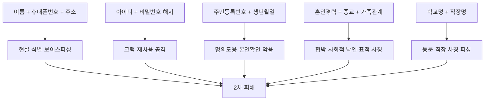
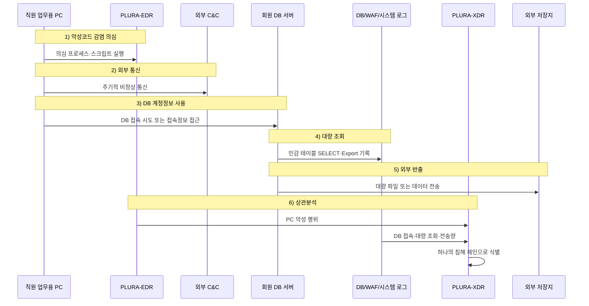

결혼정보회사 **듀오정보**에서 정회원 42만 7,464명의 개인정보가 유출된 사실이 개인정보보호위원회 조사·처분을 통해 확인됐습니다.

이번 사고는 단순한 “회원 ID 몇 개가 털린 사고”가 아닙니다.  
결혼정보회사 특성상 회원 DB에는 이름, 연락처, 주소 같은 일반 개인정보뿐 아니라 **신체정보, 종교, 취미, 혼인경력, 가족관계, 학력, 직장명**처럼 한 사람의 삶과 성향을 드러내는 민감한 프로필 정보가 함께 저장되어 있었습니다.

개인정보보호위원회는 2026년 4월 22일 제7회 전체회의에서 듀오정보에 **과징금 11억 9,700만 원, 과태료 1,320만 원** 부과와 시정명령·공표명령을 의결했습니다. 보도자료에 따르면 해커는 2025년 1월 인터넷망에 접속한 듀오정보 직원의 업무용 PC를 악성코드에 감염시킨 뒤 DB 서버 계정 정보를 확보했고, 회원 DB 서버에 접속해 전체 정회원 427,464명의 개인정보를 내려받아 외부로 유출했습니다. ([개인정보보호위원회](https://www.pipc.go.kr/np/cop/bbs/selectBoardArticle.do?bbsId=BS074&mCode=C020010000&nttId=12010))

즉, 이번 사건의 본질은  
**직원 PC 악성코드 감염 → DB 계정 정보 탈취 → 회원 DB 직접 접속 → 대량 개인정보 다운로드 → 외부 유출**로 이어진 개인정보처리시스템 침해 사고입니다.

<!--more-->

---

## 핵심만 보기

- 이번 사고는 공개 자료 기준으로 **듀오정보 정회원 전체 427,464명의 개인정보가 외부로 유출된 사고**입니다.
- 공격자는 2025년 1월 인터넷망에 접속한 개인정보취급자의 업무용 PC를 악성코드에 감염시킨 뒤, DB 서버 계정 정보를 확보하고 회원 DB 서버에 접속했습니다. ([개인정보보호위원회](https://www.pipc.go.kr/np/cop/bbs/selectBoardArticle.do?bbsId=BS074&mCode=C020010000&nttId=12010))
- 유출 항목에는 아이디, 암호화된 비밀번호, 이름, 생년월일, 암호화된 주민등록번호, 성별, 이메일주소, 휴대폰번호, 주소, 신장, 체중, 혈액형, 종교, 취미, 혼인경력, 형제관계, 학교명, 전공, 입학·졸업년도, 학교소재지, 입사년월, 직장명 등이 포함됐습니다. ([개인정보보호위원회](https://www.pipc.go.kr/np/cop/bbs/selectBoardArticle.do?bbsId=BS074&mCode=C020010000&nttId=12010))
- 개인정보위는 듀오정보가 회원 DB 접속 시 **일정 횟수 이상 인증 실패 시 접근제한 조치**를 설정하지 않았고, 주민등록번호와 비밀번호에 **안전하지 않은 암호화 알고리즘**을 적용했다고 밝혔습니다. ([개인정보보호위원회](https://www.pipc.go.kr/np/cop/bbs/selectBoardArticle.do?bbsId=BS074&mCode=C020010000&nttId=12010))
- 듀오정보는 정회원 가입 시 주민등록번호를 별도 법적 근거 없이 수집·저장했고, 개인정보처리방침상 보유기간 5년이 지난 정회원 정보 298,566건을 파기하지 않은 사실도 확인됐습니다. ([개인정보보호위원회](https://www.pipc.go.kr/np/cop/bbs/selectBoardArticle.do?bbsId=BS074&mCode=C020010000&nttId=12010))
- 유출을 확인하고도 정당한 사유 없이 72시간을 넘겨 신고했고, 정보주체에게 유출 사실을 통지하지 않아 2차 피해 방지 대응에 소홀했다는 판단도 내려졌습니다. ([개인정보보호위원회](https://www.pipc.go.kr/np/cop/bbs/selectBoardArticle.do?bbsId=BS074&mCode=C020010000&nttId=12010))
- 이번 사고는 **SQL 인젝션 중심 사고라기보다, 직원 PC 침해와 DB 계정 정보 탈취를 통한 DB 직접 접근 사고**로 보는 것이 공개 자료상 더 정확합니다.
- PLURA-XDR 관점에서는 직원 PC의 악성코드 행위, C&C 통신, 계정정보 접근, DB 로그인, 대량 조회, 파일 생성, 외부 전송을 하나의 공격 체인으로 연결해 탐지해야 합니다.

---

## 사실 관계 정리

### 공개적으로 확인된 내용

개인정보보호위원회 보도자료 기준으로 확인된 내용은 다음과 같습니다.

- **사고 시점:** 2025년 1월
- **침해 시작점:** 인터넷망에 접속한 듀오정보 직원, 즉 개인정보취급자의 업무용 PC
- **초기 침해 방식:** 악성코드 감염
- **계정 탈취:** DB 서버 계정 정보 확보
- **침해 대상:** 회원 데이터베이스 서버
- **유출 규모:** 전체 정회원 427,464명
- **유출 방식:** 회원 DB 서버에 접속해 개인정보를 내려받아 외부로 유출
- **행정처분:** 과징금 11억 9,700만 원, 과태료 1,320만 원, 시정명령, 공표명령
- **주요 위반:** 접근제한 조치 미흡, 안전하지 않은 암호화 알고리즘 적용, 주민등록번호 법적 근거 없는 수집·저장, 보유기간 경과 개인정보 미파기, 유출 신고 지연, 정보주체 통지 미흡 ([개인정보보호위원회](https://www.pipc.go.kr/np/cop/bbs/selectBoardArticle.do?bbsId=BS074&mCode=C020010000&nttId=12010))

연합뉴스도 개인정보위 발표를 인용해, 듀오정보에서 회원 43만 명의 신체조건, 혼인경력, 직업, 학력, 자산 등 민감한 프로필 정보가 대거 유출됐고, 개인정보위가 즉각 유출 통지와 홈페이지 공표를 명령했다고 보도했습니다. ([연합뉴스](https://www.yna.co.kr/view/AKR20260422162200530))

### 공개자료상 단정하면 안 되는 내용

아래 항목은 보안적으로 가능한 해석이지만, 공개자료만으로는 확정 표현을 피해야 합니다.

| 항목 | 공개자료상 판단 |
|---|---|
| 피싱 메일, 드라이브 바이 다운로드 | “직원 PC 악성코드 감염”은 확인됐지만 감염 유도 방식은 공개되지 않음 |
| RAT, 키로깅 | 가능성은 있으나 악성코드 종류와 기능은 공개되지 않음 |
| 브루트포스 성공 | 인증 실패 접근제한 부재는 확인됐지만 실제 무차별 대입으로 로그인했는지는 공개되지 않음 |
| SQL 인젝션 | 공개자료상 핵심 경로는 DB 계정 정보 탈취 후 DB 서버 접속이며, SQL 인젝션은 확인되지 않음 |
| 웹 기반 DB 관리 콘솔 침해 | “회원 DB 서버 접속”은 확인됐지만 구체 접속 도구나 웹 콘솔 여부는 공개되지 않음 |
| 주민등록번호·비밀번호 복호화 | 안전하지 않은 암호화 알고리즘 적용은 확인됐지만, 공격자가 실제 복호화했는지 여부는 별도 확인 필요 |

따라서 이 글에서는 **확정 사실**과 **조사·탐지 관점의 가능성**을 분리해 설명합니다.

---

## 1. 사고 개요

### 💍 결혼정보회사 해킹은 일반 회원정보 유출보다 더 민감하다

결혼정보회사는 일반 커뮤니티나 쇼핑몰과 다릅니다.

회원이 결혼 상대를 찾기 위해 제공하는 정보에는 단순 인적사항을 넘어 다음과 같은 정보가 포함될 수 있습니다.

- 신체 조건
- 혈액형
- 종교
- 취미
- 혼인경력
- 가족관계
- 학력
- 직장명
- 입사 시기
- 생년월일
- 주소
- 연락처
- 주민등록번호
- 계정 정보

개인정보위가 듀오정보의 유출 항목으로 열거한 정보에도 아이디, 암호화된 비밀번호, 이름, 생년월일, 암호화된 주민등록번호, 성별, 이메일주소, 휴대폰번호, 본인주소, 신장, 체중, 혈액형, 종교, 취미, 혼인경력, 형제관계, 장남·장녀 여부, 학교명, 전공, 입학년도, 졸업년도, 학교소재지, 입사년월, 직장명 등이 포함됐습니다. ([개인정보보호위원회](https://www.pipc.go.kr/np/cop/bbs/selectBoardArticle.do?bbsId=BS074&mCode=C020010000&nttId=12010))

이 정보들은 각각 따로 보면 단순 프로필처럼 보일 수 있습니다.

하지만 결합되면 전혀 다릅니다.

```text
이름 + 휴대폰번호 + 주소
→ 현실 세계의 직접 식별 가능

생년월일 + 성별 + 주민등록번호
→ 본인확인·명의도용 위험 증가

신장 + 체중 + 혈액형 + 종교 + 혼인경력
→ 사생활 침해와 낙인 위험

학교명 + 전공 + 직장명 + 입사년월
→ 사회적 관계망 추적 가능

아이디 + 비밀번호 해시
→ 비밀번호 크랙 및 다른 서비스 재사용 공격 가능
```

따라서 이번 사고는 단순한 “결혼정보회사 사이트 해킹”이 아닙니다.

**한 사람의 인생 프로필이 통째로 외부로 나간 개인정보 신뢰 사고**입니다.

---

## 2. 공격 흐름 재구성

공개자료를 기준으로 이번 사고의 핵심 흐름은 다음과 같습니다.


이 경로에서 가장 중요한 지점은 두 가지입니다.

첫째, **직원 PC가 공격자의 최초 발판이 됐다**는 점입니다.

둘째, 공격자가 단순히 PC를 감염시키는 데서 멈추지 않고 **DB 서버 계정 정보**까지 확보했다는 점입니다.

즉, 이번 사고는 “직원 PC 한 대가 감염됐다”로 끝나는 사고가 아닙니다.  
직원 PC에 남아 있던 인증정보, 접속 도구, 브라우저 저장정보, 업무용 클라이언트, 원격접속 정보, DB 접속 정보가 개인정보처리시스템으로 가는 통로가 된 사고로 봐야 합니다.

---

## 3. 단계별 공격 메커니즘

### 3-1. 초기 침투: 인터넷망에 연결된 업무용 PC 감염

개인정보위는 해커가 인터넷망에 접속한 듀오정보 직원의 업무용 PC를 악성코드에 감염시켰다고 밝혔습니다. ([개인정보보호위원회](https://www.pipc.go.kr/np/cop/bbs/selectBoardArticle.do?bbsId=BS074&mCode=C020010000&nttId=12010))

구체적인 감염 방식은 공개되지 않았습니다.

가능한 경로는 다음과 같습니다.

- 피싱 메일 첨부파일 실행
- 악성 링크 클릭
- 드라이브 바이 다운로드
- 업무 관련 문서로 위장한 악성 파일
- 원격지원 도구 악용
- 취약한 브라우저·플러그인·문서 뷰어 악용

다만 공식적으로 확인된 표현은 “악성코드 감염”입니다.  
따라서 블로그나 분석 보고서에서는 “피싱이 사용됐다”, “RAT가 설치됐다”, “키로깅이 있었다”처럼 단정하기보다, **악성코드 감염 후 계정 정보 탈취가 이루어진 것으로 조사됐다**고 정리하는 편이 정확합니다.

---

### 3-2. 계정 정보 탈취: DB 서버 계정 정보 확보

공격자는 감염된 업무용 PC에서 DB 서버 계정 정보를 확보했습니다.

여기서 중요한 질문은 이것입니다.

> 왜 직원 PC에서 DB 서버 계정 정보까지 확보될 수 있었는가?

가능한 원인은 여러 가지입니다.

- DB 접속 정보가 PC에 평문 또는 약한 방식으로 저장
- 업무용 클라이언트에 접속 계정 저장
- 브라우저 자동완성 또는 비밀번호 저장 기능 사용
- 스크립트, 설정파일, 배치파일에 계정정보 포함
- 원격접속 도구에 접속 정보 저장
- 계정 입력 시 악성코드가 키 입력 또는 메모리 정보를 수집
- DB 접속 권한이 사용자 단말에 과도하게 부여
- DB 접근 경로가 별도 통제망, 점프서버, MFA, PAM 없이 열려 있음

이 단계는 단순한 “PC 감염” 문제가 아닙니다.

**PC 침해가 곧 DB 계정 탈취로 이어질 수 있는 운영 구조**가 문제입니다.

---

### 3-3. DB 접속: 인증 실패 접근제한 부재

개인정보위 조사 결과, 듀오정보는 정회원의 개인정보가 저장된 회원 DB에 접속하는 경우 **일정 횟수 이상 인증 실패 시 접근제한 등의 조치**를 설정하지 않았습니다. ([개인정보보호위원회](https://www.pipc.go.kr/np/cop/bbs/selectBoardArticle.do?bbsId=BS074&mCode=C020010000&nttId=12010))

이 의미는 큽니다.

일반적으로 개인정보처리시스템 또는 DB 관리 시스템에는 다음과 같은 방어 장치가 있어야 합니다.

- 로그인 실패 횟수 제한
- 계정 잠금
- IP 기반 접근제어
- VPN 또는 전용망 접근
- MFA
- 관리자 계정 분리
- DB 계정 최소 권한
- 접속 시간·위치·단말 이상징후 탐지
- 대량 조회 및 다운로드 탐지
- 장기 미사용 계정 비활성화
- 접속기록 보관과 주기적 점검

접근제한 조치가 없으면 공격자는 탈취한 계정정보를 이용해 여러 차례 인증을 시도하거나, 비밀번호 후보를 반복적으로 대입하거나, 실패 후에도 계속 접속을 시도할 수 있습니다.

다만 여기서 주의할 점이 있습니다.

**공개자료는 “브루트포스 공격으로 성공했다”고 단정하지 않습니다.**  
확정된 내용은 “인증 실패 시 접근제한 조치가 설정되지 않았다”입니다.

따라서 이 부분은 다음처럼 표현하는 것이 정확합니다.

> 듀오정보는 회원 DB 접속 과정에서 반복 인증 실패를 제한하는 기본 통제 장치를 충분히 설정하지 않았고, 이는 탈취 계정 악용이나 무차별 대입 시도를 막기 어려운 구조적 취약점으로 평가된다.

---

### 3-4. 대량 다운로드: 전체 정회원 DB 유출

공격자는 회원 DB 서버에 접속한 뒤 전체 정회원 427,464명의 개인정보를 내려받아 외부로 유출했습니다. ([개인정보보호위원회](https://www.pipc.go.kr/np/cop/bbs/selectBoardArticle.do?bbsId=BS074&mCode=C020010000&nttId=12010))

이 단계에서 봐야 할 핵심은 단순히 “DB에 접속했다”가 아닙니다.

정상 운영에서도 DB 접속은 발생합니다.  
문제는 다음입니다.

- 누가 접속했는가?
- 어느 단말에서 접속했는가?
- 어떤 계정으로 접속했는가?
- 평소 접속하던 시간대였는가?
- 몇 건을 조회했는가?
- 어떤 테이블을 조회했는가?
- 어떤 컬럼을 조회했는가?
- 파일로 Export했는가?
- 압축했는가?
- 외부로 전송했는가?
- 대량 다운로드 직후 통신량이 증가했는가?

개인정보 유출 사고에서 진짜 중요한 것은  
**접속 여부가 아니라 대량 조회와 반출의 흐름**입니다.

---

## 4. 유출 항목 위험도

이번 사고에서 유출된 정보는 단순 연락처 수준이 아닙니다.

| 유출 항목 | 위험도 | 설명 |
|---|---:|---|
| 아이디 | 높음 | 다른 서비스 로그인 대입, 계정 매칭에 활용 가능 |
| 암호화된 비밀번호 | 중간~높음 | 알고리즘이 약하면 오프라인 크랙 위험 |
| 이름 | 중간~높음 | 연락처, 주소, 생년월일과 결합 시 직접 식별 |
| 생년월일 | 높음 | 본인확인, 계정 복구, 피싱에 악용 가능 |
| 암호화된 주민등록번호 | 매우 높음 | 법적 고유식별정보. 키·알고리즘 노출 시 위험 급증 |
| 성별 | 중간 | 단독 위험은 낮지만 프로파일링에 활용 |
| 이메일주소 | 중간~높음 | 피싱, 계정 매칭, 다른 서비스 로그인 대입에 활용 |
| 휴대폰번호 | 높음 | 스미싱, 보이스피싱, 계정 복구 공격에 활용 |
| 주소 | 높음 | 현실 세계 사칭, 우편·방문 사기, 표적 피싱 위험 |
| 신장·체중·혈액형 | 높음 | 사생활 침해와 민감 프로파일링 위험 |
| 종교·취미 | 높음 | 성향 기반 사칭·협박·사회공학 공격 가능 |
| 혼인경력 | 매우 높음 | 개인의 사생활과 사회적 평판에 직접 영향 |
| 형제관계·장남/장녀 여부 | 높음 | 가족관계 기반 사칭과 보이스피싱 정교화 |
| 학교명·전공·입학·졸업년도 | 높음 | 동문·학력 기반 사칭 가능 |
| 직장명·입사년월 | 매우 높음 | 직장 사칭, 업무 메일 피싱, 사회적 피해 가능 |

### 유출 데이터 결합 위험도



이번 사고에서 특히 민감한 부분은 **혼인경력, 종교, 가족관계, 신체정보, 직장명**입니다.

이 정보들은 단순한 보안 위험을 넘어, 피해자의 사생활과 사회적 평판에 직접적인 피해를 줄 수 있습니다.

---

## 5. 비밀번호와 주민등록번호: “암호화됐으니 안전하다”는 말은 부족하다

개인정보위는 듀오정보가 주민등록번호와 비밀번호에 **안전하지 않은 암호화 알고리즘**을 적용하는 등 안전성 확보조치 의무를 위반했다고 밝혔습니다. ([개인정보보호위원회](https://www.pipc.go.kr/np/cop/bbs/selectBoardArticle.do?bbsId=BS074&mCode=C020010000&nttId=12010))

여기서 구분이 필요합니다.

### 비밀번호는 복호화가 아니라 크랙의 문제

비밀번호가 단방향 해시로 저장됐다면 원칙적으로 “복호화”하는 구조가 아닙니다.  
공격자는 다음 방식으로 원문을 추정합니다.

```text
후보 비밀번호 입력
→ 동일한 해시 알고리즘으로 계산
→ 유출된 해시와 비교
→ 일치하면 원문 비밀번호 추정
```

이것이 비밀번호 크랙입니다.

위험도는 다음 요소에 따라 달라집니다.

- bcrypt, Argon2id, scrypt, PBKDF2 같은 느린 해시 사용 여부
- 사용자별 salt 적용 여부
- pepper 적용 여부
- work factor 또는 반복 횟수
- 단순 MD5, SHA-1, SHA-256 같은 빠른 해시 사용 여부
- 해시 알고리즘과 salt가 함께 유출됐는지 여부
- 기존 다크웹 유출 비밀번호와 매칭되는지 여부

따라서 “암호화됐다”는 표현만으로는 충분하지 않습니다.

**어떤 알고리즘으로, 어떤 방식으로, 어떤 키·salt·pepper 관리 체계로 보호됐는지**가 중요합니다.

---

### 주민등록번호는 더 엄격하게 봐야 한다

주민등록번호는 고유식별정보입니다.

개인정보위는 듀오정보가 정회원 가입 시 주민등록번호를 별도 법적 근거 없이 수집·저장했다고 밝혔습니다. 또한 보유기간 5년이 지난 정회원 정보 298,566건을 파기하지 않은 사실도 확인했습니다. ([개인정보보호위원회](https://www.pipc.go.kr/np/cop/bbs/selectBoardArticle.do?bbsId=BS074&mCode=C020010000&nttId=12010))

이 지점은 이번 사고의 피해 규모를 키운 핵심입니다.

```text
수집하지 않았어야 할 정보
+ 오래전에 파기했어야 할 정보
+ 안전하지 않은 암호화 알고리즘
+ DB 계정 탈취
= 피해 규모와 법적 책임 확대
```

개인정보 유출 사고에서는 공격자만 문제가 아닙니다.

**왜 그 정보가 그 시점까지 그 시스템에 남아 있었는가**가 더 큰 질문입니다.

---

## 6. 왜 방어하지 못했을까

이번 사고에서 드러난 방어 실패는 크게 여섯 가지로 정리할 수 있습니다.

### 6-1. 개인정보취급자 PC가 DB 접근의 발판이 됐다

직원 PC는 업무상 필요에 따라 여러 내부 시스템에 접근할 수 있습니다.  
하지만 그 PC가 인터넷망 악성코드 공격에 노출되어 있고, 동시에 DB 접속 정보까지 보유하고 있다면 매우 위험합니다.

이 경우 공격자는 내부망을 직접 뚫지 않아도 됩니다.

직원 PC 하나를 장악하면, 그 PC가 가진 접속 권한과 저장된 인증정보를 이용해 개인정보처리시스템으로 이동할 수 있습니다.

---

### 6-2. DB 계정 정보 관리가 취약했다

공개자료상 공격자는 DB 서버 계정 정보를 확보했습니다.  
이는 DB 접속 자격증명이 단말 또는 업무 환경 어딘가에서 탈취 가능했다는 뜻입니다.

기업은 다음을 점검해야 합니다.

- DB 계정정보가 PC에 저장되어 있었는가?
- 설정파일, 배치파일, 스크립트에 계정정보가 있었는가?
- 브라우저 또는 DB 클라이언트에 비밀번호가 저장되어 있었는가?
- 공용 DB 계정을 사용했는가?
- 계정별 권한이 과도했는가?
- 접속 단말·IP·시간대 제한이 있었는가?
- MFA 또는 PAM이 적용됐는가?
- DB 접속 로그를 주기적으로 점검했는가?

---

### 6-3. 반복 인증 실패 접근제한이 없었다

회원 DB 접속 과정에서 일정 횟수 이상 인증 실패 시 접근제한을 설정하지 않았다는 점은 매우 기본적인 통제 미흡입니다. ([개인정보보호위원회](https://www.pipc.go.kr/np/cop/bbs/selectBoardArticle.do?bbsId=BS074&mCode=C020010000&nttId=12010))

이런 환경에서는 다음 공격을 막기 어렵습니다.

- 탈취 계정으로 반복 로그인
- 비밀번호 후보 대입
- 비활성 계정 재사용
- 오래된 계정 공격
- 자동화된 접속 시도
- 계정 잠금 없는 무제한 재시도

개인정보처리시스템에서는 단순 로그인 성공·실패만 보면 안 됩니다.

**실패 횟수, 실패 후 성공 여부, 접속 위치 변화, 접속 단말 변화, 성공 직후 대량 조회 여부**를 함께 봐야 합니다.

---

### 6-4. 암호화 알고리즘이 안전하지 않았다

주민등록번호와 비밀번호에 안전하지 않은 암호화 알고리즘을 적용한 점도 확인됐습니다. ([개인정보보호위원회](https://www.pipc.go.kr/np/cop/bbs/selectBoardArticle.do?bbsId=BS074&mCode=C020010000&nttId=12010))

이는 “암호화”라는 단어가 곧 안전을 의미하지 않는다는 점을 보여줍니다.

안전하지 않은 암호화는 다음과 같은 문제를 만듭니다.

- 빠른 해시 사용으로 비밀번호 크랙 가능
- salt 미적용 또는 재사용으로 대량 대입 공격 가능
- 오래된 암호 알고리즘 사용
- 키 관리 부실
- DB와 암호화 키 동시 노출
- 암호화 대상과 보관 위치의 분리 실패

---

### 6-5. 보유기간이 지난 개인정보를 파기하지 않았다

개인정보위는 듀오정보가 개인정보처리방침에 기재한 보유기간 5년이 지난 정회원 정보 298,566건을 파기하지 않았다고 밝혔습니다. ([개인정보보호위원회](https://www.pipc.go.kr/np/cop/bbs/selectBoardArticle.do?bbsId=BS074&mCode=C020010000&nttId=12010))

이 부분은 매우 중요합니다.

공격자가 가져간 정보 중 상당 부분은 이미 없어야 했던 정보였을 수 있습니다.

개인정보 보호에서 파기는 보안 기능입니다.

```text
수집 최소화
→ 이용 목적 달성
→ 보유기간 만료
→ 즉시 파기
→ 침해 시 피해 규모 축소
```

파기하지 않은 데이터는 공격자에게는 보너스 데이터입니다.

---

### 6-6. 신고와 통지가 지연됐다

듀오정보는 유출을 확인했음에도 정당한 사유 없이 72시간을 넘겨 유출 신고를 지연했고, 정보주체에게 유출 사실을 통지하지 않는 등 2차 피해 방지 대응에 소홀한 것으로 확인됐습니다. ([개인정보보호위원회](https://www.pipc.go.kr/np/cop/bbs/selectBoardArticle.do?bbsId=BS074&mCode=C020010000&nttId=12010))

개인정보 유출 사고에서 통지는 단순 행정 절차가 아닙니다.

피해자가 스스로 방어할 수 있는 시간을 주는 조치입니다.

- 비밀번호 변경
- 동일 비밀번호 사용 서비스 점검
- 스미싱·피싱 주의
- 명의도용 방지
- 금융·통신 계정 점검
- 신용정보 알림 설정
- 피해 신고와 분쟁조정 준비

통지가 늦어지면 피해자는 자신이 위험에 노출됐는지도 모른 채 2차 공격을 받을 수 있습니다.

---

## 7. 이번 사고에서 가장 위험한 오해

### ❌ “직원 PC 한 대가 감염된 사고다”

아닙니다.  
직원 PC 침해가 DB 계정 탈취와 전체 정회원 DB 유출로 이어졌습니다.

### ❌ “비밀번호와 주민등록번호가 암호화됐으니 괜찮다”

아닙니다.  
개인정보위는 안전하지 않은 암호화 알고리즘 적용을 지적했습니다. 암호화 여부보다 알고리즘, 키 관리, salt, pepper, 접근권한 분리가 중요합니다. ([개인정보보호위원회](https://www.pipc.go.kr/np/cop/bbs/selectBoardArticle.do?bbsId=BS074&mCode=C020010000&nttId=12010))

### ❌ “브루트포스로 털린 사고다”

공개자료상 확정 표현은 아닙니다.  
확인된 것은 회원 DB 접속 시 반복 인증 실패에 대한 접근제한 조치가 없었다는 점입니다.

### ❌ “SQL 인젝션 사고다”

공개자료상 핵심 경로는 SQL 인젝션이 아니라 **악성코드 감염 → DB 계정정보 확보 → 회원 DB 서버 접속**입니다. SQL 인젝션 여부는 확인된 사실로 쓰면 안 됩니다.

### ❌ “오래된 회원 정보는 의미가 작다”

아닙니다.  
오래된 정보라도 주민등록번호, 혼인경력, 학력, 직장, 가족관계가 포함되어 있으면 매우 위험합니다. 오히려 파기했어야 할 정보가 남아 있었기 때문에 피해 규모가 커졌습니다.

### ❌ “행정처분이 끝났으니 사건도 끝났다”

개인정보위 처분은 중요한 행정적 결론입니다.  
하지만 피해자 통지, 분쟁조정, 민사상 손해배상, 형사 수사, 2차 피해 모니터링은 별도 이슈로 남을 수 있습니다.

---

## 8. PLURA-EDR 관점: 직원 PC 침해를 먼저 봐야 한다

이번 사고의 시작점은 웹 서버가 아니라 **개인정보취급자 업무용 PC**입니다.

따라서 PLURA-EDR 관점에서는 다음 행위를 중점적으로 탐지해야 합니다.

| 탐지 영역 | 확인할 행위 |
|---|---|
| 악성코드 실행 | 의심 프로세스 생성, 스크립트 실행, 매크로 실행, 압축해제 후 실행 |
| C&C 통신 | 주기적 외부 접속, 비정상 도메인, 신규 등록 도메인, 해외 VPS 통신 |
| 자격증명 탈취 | 브라우저 저장 비밀번호 접근, Credential Store 접근, DB 클라이언트 설정파일 접근 |
| 키로깅·정보수집 | 키보드 후킹, 클립보드 접근, 화면 캡처, 문서·설정파일 수집 |
| 내부 접속 도구 악용 | DB 클라이언트, 원격접속 도구, VPN 클라이언트 실행 |
| 파일 수집 | 계정정보 파일, 접속 설정파일, 업무 문서 대량 읽기 |
| 권한 상승 | 관리자 권한 요청, UAC 우회, 서비스 등록 |
| 지속성 확보 | 시작프로그램 등록, 예약작업 생성, 서비스 생성 |
| 외부 전송 | 압축파일 생성 후 외부 업로드, curl/wget/scp/sftp 사용 |

EDR에서 중요한 것은 악성코드 파일 하나를 잡는 것이 아닙니다.

**직원 PC에서 DB 계정 정보에 접근한 행위**를 잡아야 합니다.

예를 들어 다음과 같은 흐름은 강한 경보가 되어야 합니다.

```text
업무용 PC에서 의심 스크립트 실행
→ 브라우저 Credential Store 접근
→ DB 클라이언트 설정파일 접근
→ 외부 C&C 통신
→ 평소 사용하지 않던 시간대 DB 접속
→ 대량 조회 발생
```

이 흐름을 분리해서 보면 각각은 작아 보입니다.  
하지만 연결하면 명확한 침해 체인입니다.

---

## 9. PLURA-DB/로그 관점: DB 접속과 대량 조회를 봐야 한다

이번 사고의 핵심 피해는 DB에서 발생했습니다.

따라서 DB 로그와 개인정보처리시스템 접속기록에서는 다음 항목을 반드시 봐야 합니다.

| 로그/증적 | 확인할 내용 |
|---|---|
| DB 인증 로그 | 실패 횟수, 실패 후 성공, 접속 계정, 접속 원본 IP·호스트 |
| DB 세션 로그 | 접속 시간, 유지 시간, 접속 도구, 비정상 세션 |
| 쿼리 로그 | 대량 SELECT, 전체 테이블 조회, 민감 컬럼 조회 |
| Export 로그 | CSV, dump, unload, outfile, backup, report 다운로드 |
| 권한 로그 | 관리자 권한 사용, 권한 변경, 신규 계정 생성 |
| 테이블 접근 로그 | 회원 테이블, 주민등록번호 필드, 비밀번호 필드 접근 |
| 응답량·전송량 | 평소 대비 응답 크기 증가, 대량 데이터 반환 |
| 파일 생성 로그 | dump 파일, 압축파일, 임시 파일 생성 |
| 외부 전송 로그 | DB 서버 또는 중간 서버의 외부 업로드 |

특히 “전체 정회원 427,464명”이 유출됐다면, 정상적인 단건 조회와는 다른 흔적이 남아야 합니다.

- 조회 건수 급증
- 특정 계정의 민감 테이블 연속 접근
- 평소보다 긴 세션
- 대량 결과셋 반환
- Export 기능 사용
- 압축 파일 생성
- 외부 전송량 증가
- 근무시간 외 접속
- 기존 접속지와 다른 원본 IP

즉, DB 보안은 단순한 접근 허용·차단이 아니라 **접속 후 행위 분석**이 핵심입니다.

---

## 10. PLURA-WAF 관점: 이번 사고의 1차 방어선은 아니지만, 관리 콘솔과 응답 유출은 봐야 한다

이번 사고는 공개자료상 웹 취약점보다는 직원 PC 악성코드와 DB 계정 탈취가 중심입니다.

따라서 WAF가 모든 것을 막을 수 있는 사고는 아닙니다.

하지만 다음 조건이 있었다면 WAF와 웹 로그도 중요한 증거가 됩니다.

- DB 관리 콘솔이 웹 기반으로 운영됨
- 개인정보 조회·Export 기능이 웹 애플리케이션에 존재
- 관리자 페이지가 외부에서 접근 가능
- 웹/API를 통해 대량 개인정보 조회가 가능
- 공격자가 탈취 계정으로 웹 관리자 기능을 사용
- 다운로드 응답에 대량 개인정보가 포함

첨부 CUPOST 글에서도 웹 취약점 사고는 요청만 볼 것이 아니라 응답 본문, 응답 크기, 동일 세션 반복 호출, 대량 개인정보 응답 패턴을 함께 봐야 한다고 정리하고 있습니다.

듀오 사고에서도 웹 기반 관리 콘솔이 사용됐다면 다음을 확인해야 합니다.

- 관리자 로그인 실패 반복 여부
- 로그인 성공 직후 대량 검색 여부
- 개인정보 Export 메뉴 접근 여부
- 검색 조건 없이 전체 조회 요청 여부
- 응답 크기 급증
- 동일 세션의 연속 다운로드
- 개인정보 포함 응답 본문
- 관리자 기능 접근 원본 IP 변경
- User-Agent 변화
- 프록시·VPN·해외 IP 사용 여부

다만 공개자료상 듀오 사고를 SQL 인젝션이나 웹 취약점으로 단정할 근거는 없습니다.  
WAF 관점은 **보조 조사 영역**으로 두는 것이 맞습니다.

---

## 11. PLURA-XDR 관점: 단일 이벤트가 아니라 공격 체인으로 봐야 한다

이번 사고는 XDR 상관분석이 필요한 전형적인 사례입니다.

단일 이벤트로 보면 각각은 정상처럼 보일 수 있습니다.

- 직원 PC의 외부 통신은 정상 웹 접속처럼 보일 수 있습니다.
- DB 클라이언트 실행은 정상 업무처럼 보일 수 있습니다.
- DB 로그인은 정상 운영처럼 보일 수 있습니다.
- 회원정보 조회는 정상 고객관리 업무처럼 보일 수 있습니다.
- CSV 생성은 정상 보고서 출력처럼 보일 수 있습니다.
- 외부 전송은 정상 업무 파일 전송처럼 보일 수 있습니다.

하지만 같은 시간대, 같은 계정, 같은 단말, 같은 서버, 같은 데이터 흐름으로 연결하면 전혀 다른 의미가 됩니다.



XDR에서 봐야 할 핵심 질문은 다음입니다.

- 감염된 직원 PC와 DB 접속 계정이 연결되는가?
- DB 접속 직전에 계정정보 파일 또는 브라우저 저장정보 접근이 있었는가?
- DB 로그인 실패 후 성공 흐름이 있었는가?
- 성공 직후 대량 조회가 발생했는가?
- 대량 조회 이후 파일 생성 또는 외부 전송이 있었는가?
- 해당 행위가 평소 업무 패턴과 다른가?
- 동일 계정이 다른 단말·다른 IP에서도 사용됐는가?
- 공격 이후 계정·권한·로그 삭제 시도가 있었는가?

이 질문에 답해야 실제 침해 경로를 설명할 수 있습니다.

---

## 12. 탐지 룰과 헌팅 아이디어

### 12-1. 직원 PC 악성코드·자격증명 탈취 탐지

```text
조건:
- 개인정보취급자 PC에서 의심 스크립트 또는 비정상 프로세스 실행
- 이후 브라우저 Credential Store, DB 클라이언트 설정파일, 원격접속 설정파일 접근
- 이어서 외부 C&C 의심 도메인 또는 비정상 IP로 통신

위험:
- DB 계정정보 탈취 가능성
```

### 12-2. DB 인증 실패 접근제한 부재 탐지

```text
조건:
- 동일 계정 또는 동일 원본에서 DB 로그인 실패가 임계치 이상 반복
- 실패 이후 동일 계정으로 로그인 성공
- 성공 후 민감 테이블 조회 또는 Export 발생

위험:
- 탈취 계정 재시도 또는 무차별 대입 가능성
```

### 12-3. 민감 테이블 대량 조회 탐지

```text
조건:
- 회원 테이블 또는 주민등록번호/비밀번호 포함 테이블 접근
- 평소 평균 대비 조회 건수 급증
- SELECT 결과 건수 또는 응답 크기 급증
- 업무시간 외 또는 비정상 단말에서 실행

위험:
- 개인정보 대량 유출 가능성
```

### 12-4. 개인정보 Export·Dump 탐지

```text
조건:
- CSV, XLSX, SQL dump, backup, zip, 7z 파일 생성
- 파일명에 member, user, profile, personal, rrn, backup 등 포함
- 생성 직후 외부 전송 도구 실행 또는 네트워크 업로드 증가

위험:
- 개인정보 파일 생성 및 반출 가능성
```

### 12-5. 파기 대상 데이터 접근 탐지

```text
조건:
- 보유기간이 지난 회원 데이터 테이블 접근
- 휴면·탈퇴·계약 종료 회원 데이터 대량 조회
- 파기 예정 또는 아카이브 테이블 접근

위험:
- 불필요 보유 개인정보의 추가 유출 가능성
```

---

## 13. 컴플라이언스 관점: 기술 사고이자 관리체계 사고다

이번 사고는 기술 침해 사고이면서 동시에 개인정보 관리체계 사고입니다.

개인정보위는 듀오정보에 대해 다음을 문제 삼았습니다.

- 개인정보처리시스템 안전조치 미흡
- DB 접속 시 인증 실패 접근제한 조치 부재
- 주민등록번호와 비밀번호에 안전하지 않은 암호화 알고리즘 적용
- 주민등록번호 법적 근거 없는 수집·저장
- 보유기간 5년 경과 정회원 정보 298,566건 미파기
- 72시간을 넘긴 유출 신고 지연
- 정보주체 유출 통지 미흡
- 2차 피해 방지 대응 소홀 ([개인정보보호위원회](https://www.pipc.go.kr/np/cop/bbs/selectBoardArticle.do?bbsId=BS074&mCode=C020010000&nttId=12010))

이는 단순히 “해커가 나쁘다”로 끝낼 수 없는 문제입니다.

기업이 입증해야 하는 것은 다음입니다.

```text
우리는 필요한 정보만 수집했는가?
수집한 정보를 안전하게 저장했는가?
접근 권한을 최소화했는가?
계정정보를 안전하게 관리했는가?
대량 조회를 탐지했는가?
보유기간이 지난 정보를 파기했는가?
사고를 인지한 뒤 즉시 신고·통지했는가?
같은 공격이 다시 발생하지 않도록 조치했는가?
```

개인정보위는 듀오정보에 개별 정보주체에 대한 즉각 유출 통지, 유출사고 재발 방지를 위한 안전조치 강화, 필요 최소한의 개인정보 수집을 위한 처리 방식 점검, 명확한 파기 지침 수립, 홈페이지 공표를 명령했습니다. ([개인정보보호위원회](https://www.pipc.go.kr/np/cop/bbs/selectBoardArticle.do?bbsId=BS074&mCode=C020010000&nttId=12010))

---

## 14. 이용자 관점의 대응

듀오 정회원이었거나 과거 듀오 서비스를 이용한 적이 있다면 다음 조치를 권장합니다.

- 듀오와 동일하거나 유사한 비밀번호를 사용한 모든 서비스의 비밀번호 변경
- 이메일, 포털, 금융, 쇼핑, 통신사 계정의 로그인 기록 확인
- 주민등록번호와 휴대폰번호를 이용한 명의도용 가능성 점검
- 신용정보 변동 알림 설정
- 휴대폰 개통, 대출, 카드 발급 등 본인 명의 거래 알림 확인
- 듀오·결혼정보회사·매칭매니저를 사칭한 문자·전화·메일 주의
- 유출 보상, 환불, 재가입, 정보 확인, 프로필 삭제를 가장한 링크 클릭 금지
- 의심 문자는 링크를 누르지 말고 공식 홈페이지 또는 고객센터로 직접 확인
- 피해가 의심되면 개인정보침해 신고센터, KISA 118, 개인정보분쟁조정위원회 등 공식 경로 이용

특히 다음과 같은 문구는 피싱에 악용될 수 있습니다.

```text
[듀오] 개인정보 유출 보상 신청 대상입니다.
[듀오멤버스] 프로필 정보 보호를 위해 본인확인이 필요합니다.
[매칭매니저] 기존 회원정보 삭제 신청을 위해 인증번호를 입력해 주세요.
[듀오] 환불 계좌 확인이 필요합니다.
[듀오] 유출 피해 확인서를 발급하려면 아래 링크를 눌러 주세요.
[결혼정보센터] 회원님의 혼인정보가 외부 노출되어 긴급 조치가 필요합니다.
```

이런 메시지는 반드시 공식 경로에서 직접 확인해야 합니다.

---

## 15. 기업이 반드시 고쳐야 할 것

이번 사고를 계기로 결혼중개, 채용, 교육, 의료, 상담, 금융 등 민감한 프로필 정보를 대량으로 다루는 기업은 다음을 점검해야 합니다.

### 계정·접근 통제

- 개인정보처리시스템 MFA 적용
- DB 접속 계정 최소 권한
- 공용 계정 제거
- 관리자 계정 분리
- 인증 실패 횟수 제한
- 계정 잠금 정책
- 접속 IP·단말 제한
- PAM 또는 점프서버 적용
- 장기 미사용 계정 비활성화

### 단말 보안

- 개인정보취급자 PC EDR 적용
- 악성코드 행위 기반 탐지
- 브라우저 비밀번호 저장 제한
- DB 접속정보 로컬 저장 금지
- 업무용 PC와 인터넷 접속 경로 통제
- C&C 통신 탐지
- 원격접속 도구 사용 통제

### DB 보안

- DB Audit 로그 활성화
- 민감 테이블 접근 로깅
- 대량 SELECT 탐지
- Export·Dump 탐지
- 파일 생성·압축·외부 전송 탐지
- DB 계정 권한 정기 검토
- 주민등록번호·비밀번호 필드 접근 통제
- 마스킹·토큰화 적용

### 암호화·키 관리

- 비밀번호는 Argon2id, bcrypt, scrypt, PBKDF2 등 적절한 느린 해시 사용
- 사용자별 salt 적용
- pepper 별도 보관
- 주민등록번호 등 고유식별정보는 안전한 암호화와 키 분리
- 오래된 알고리즘 제거
- 키 접근 로그 점검
- DB와 키 동시 노출 방지

### 개인정보 라이프사이클

- 수집 최소화
- 주민등록번호 법적 근거 점검
- 보유기간 자동 관리
- 파기 대상 자동 식별
- 파기 증적 보관
- 휴면·탈퇴·계약 종료 회원정보 분리 또는 삭제
- 개인정보처리방침과 실제 DB 보유 현황 일치 여부 점검

### 사고 대응

- 유출 인지 기준 명확화
- 72시간 신고 체계
- 정보주체 통지 템플릿 준비
- 침해사고 대응 훈련
- 포렌식 증거 보존
- 관계기관 신고 절차
- 2차 피해 모니터링
- 피싱 도메인·사칭 문자 모니터링

---

## 16. 정리

이번 듀오 개인정보 유출 사고는  
단순한 “결혼정보회사 해킹”이 아닙니다.

핵심은 다음입니다.

1. **공격자는 인터넷망에 접속한 개인정보취급자 업무용 PC를 악성코드에 감염시켰다.**
2. **감염된 PC를 통해 DB 서버 계정 정보를 확보했다.**
3. **회원 DB 서버에 접속해 전체 정회원 427,464명의 개인정보를 내려받아 외부로 유출했다.**
4. **유출 항목에는 신체정보, 종교, 취미, 혼인경력, 가족관계, 학력, 직장명 등 매우 민감한 프로필 정보가 포함됐다.**
5. **회원 DB 접속 시 인증 실패 접근제한 조치가 없었다.**
6. **주민등록번호와 비밀번호에 안전하지 않은 암호화 알고리즘이 적용됐다.**
7. **법적 근거 없는 주민등록번호 수집·저장과 보유기간 5년 경과 정보 298,566건 미파기가 확인됐다.**
8. **유출 신고와 정보주체 통지가 지연되어 2차 피해 방지 대응도 미흡했다.**
9. **SQL 인젝션이 아니라 직원 PC 침해와 DB 계정 탈취 기반의 DB 직접 접근 사고로 보는 것이 공개자료상 더 정확하다.**
10. **PLURA-XDR 관점에서는 직원 PC 악성행위, 계정정보 접근, DB 로그인, 대량 조회, 파일 생성, 외부 전송을 하나의 시간축으로 연결해야 한다.**

이 사고를 설명하는 가장 정확한 문장은 다음입니다.

> 듀오 사고의 본질은 “회원정보 유출” 하나가 아니다.  
> 개인정보취급자 PC 침해, DB 계정정보 탈취, 개인정보처리시스템 접근통제 실패, 안전하지 않은 암호화, 보유기간 초과 개인정보 미파기, 신고·통지 지연이 결합된 개인정보 관리체계 붕괴 사고다.

개인정보 보안의 핵심은 침해 이후의 수습만이 아닙니다.

**처음부터 덜 모으고, 필요한 기간만 보관하고, 강하게 암호화하고, 계정 접근을 제한하고, 대량 조회를 탐지하고, 사고를 즉시 알리는 것**입니다.

그 기본이 무너지면, 직원 PC 한 대의 악성코드 감염이 42만 명의 인생 프로필 유출로 이어질 수 있습니다.

---

## 참고 자료

- 개인정보보호위원회, `개인정보위, 안전조치 의무 위반 3개 사업자 제재` (2026-04-23): https://www.pipc.go.kr/np/cop/bbs/selectBoardArticle.do?bbsId=BS074&mCode=C020010000&nttId=12010
- 연합뉴스, `결정사 듀오 회원 43만명 프로필 정보 통째 유출…과징금 12억` (2026-04-23): https://www.yna.co.kr/view/AKR20260422162200530
- 주간경향, `듀오, 종교·직장·키·학교 등 42만명 개인 정보 다 털렸다…회원들에게 통지도 안해` (2026-04-23): https://weekly.khan.co.kr/article/202604231412011
- 첨부 문서, `CU편의점택배(CUPOST) 개인정보 유출 사고: 웹 취약점 침해와 CI 유출의 위험`
- 첨부 문서, `티빙 개인정보 유출 사고: GitHub 자격증명 노출과 AWS 액세스 키 관리 논란`
