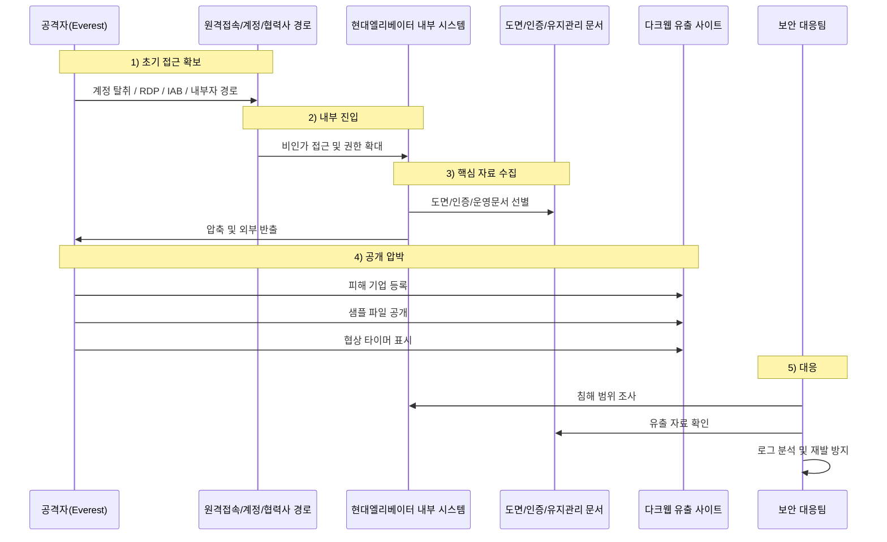

최근 제조업 분야에서도 랜섬웨어는 단순한 시스템 마비를 넘어,  
**도면·설계자료·인증 문서·유지관리 정보 같은 핵심 운영 자산을 탈취해 협박하는 방식**으로 빠르게 바뀌고 있습니다.

이번 **현대엘리베이터 해킹 사건**도 그 전형적인 사례입니다.  
2026년 3월 초, 국제 랜섬웨어 그룹 **에베레스트(Everest)** 가 다크웹 유출 전용 사이트에 현대엘리베이터를 피해 기업으로 등록했고,  
**약 1.1TB 규모 데이터와 제조 도면·승강기 안전 인증서 샘플**을 공개하며 협상을 압박한 정황이 확인됐습니다.

이 사건이 중요한 이유는 단순히 “랜섬웨어에 감염됐다”는 차원이 아니라,  
**제조 도면과 유지관리·인증 관련 자료가 실제로 외부에 노출될 수 있다는 점**에 있습니다.

<!--more-->

---

## 핵심 요약

- **공개 시점:** 에베레스트의 다크웹 유출 사이트 등록은 2026년 3월 6~7일경 공개적으로 포착됐습니다.
- **공격 주체:** 국제 랜섬웨어·데이터 갈취 조직 **에베레스트(Everest)** 입니다. 최근 이 조직은 암호화보다 **데이터 탈취 후 협박** 비중이 더 큰 것으로 평가됩니다.
- **유출 주장 규모:** 해커 측은 **1,116GB**, **115,282개 파일** 탈취를 주장했고, 일부 **2D 제조 도면**과 **승강기 안전 인증서** 샘플도 공개했다고 보도됐습니다.
- **협박 방식:** 현대엘리베이터가 협상에 응하지 않으면 데이터를 외부에 공개하거나 판매하겠다는 **이중 협박(Double Extortion)** 방식입니다.
- **핵심 해석:** 현재 공개된 내용은 주로 **해커 측 주장과 이를 인용한 보도**를 중심으로 알려져 있으므로, 실제 침해 범위와 내부 피해 규모는 별도 조사 결과로 확정돼야 합니다.
- **중요 포인트:** 다만 샘플 자료가 공개됐다는 점에서, **내부 데이터가 실질적으로 반출됐을 가능성은 매우 높게 봐야 합니다.**

---

## 사실 관계 정리

### ✅ 공개적으로 확인된 내용

- 랜섬웨어 그룹 **에베레스트(Everest)** 는 2026년 3월 7일경 자신들의 다크웹 유출 전용 사이트(DLS)에 현대엘리베이터를 피해 기업으로 등록했습니다. 일부 추적 사이트는 이를 3월 6일 발견으로 기록하고 있습니다.
- 국내 보도에 따르면 해커 측은 현대엘리베이터 내부 자료로 보이는 샘플을 공개했고, 여기에 **2D 제조 도면**과 **승강기 안전 인증 관련 문서**가 포함된 것으로 전해졌습니다.
- 안랩 ASEC도 2026년 3월 둘째 주 동향에서, 한국의 한 **엘리베이터 제조사**를 노린 에베레스트 공격 사례를 언급했습니다.

### 🟨 해커 측 주장에 기반한 내용

- **탈취 데이터 용량:** 총 **1,116GB**
- **파일 수:** **115,282개**
- **협상 마감 시한:** **2026년 3월 16일**
- **협박 내용:** 협상 실패 시 제조 도면과 내부 기밀을 공개 또는 판매하겠다는 위협

위 수치는 해커 측 유출 사이트와 이를 인용한 보도에서 나온 것으로,  
피해 기업 또는 수사기관이 공식 확정한 수치와는 구분해 볼 필요가 있습니다.

### 🗓️ 타임라인

- **2026-03-06 ~ 2026-03-07:** 현대엘리베이터가 에베레스트 유출 사이트 피해 기업 목록에 등장한 정황이 공개적으로 포착됨
- **2026-03-07:** 국내 언론 보도로 사건이 본격적으로 알려짐. 해커 측은 2D 제조 도면과 인증 관련 샘플을 공개했다고 전해짐
- **2026-03-12:** 안랩 ASEC가 3월 둘째 주 다크웹·랜섬웨어 동향에서 한국 엘리베이터 제조사 대상 에베레스트 공격을 언급
- **2026-03-16:** 해커 측이 표시한 협상 시한

---

## 1. 공격 개요

### 🏭 제조업 랜섬웨어는 왜 더 위험한가

제조업 대상 랜섬웨어는 단순히 서버 몇 대를 멈추는 문제가 아닙니다.

공격자가 노리는 것은 다음과 같습니다.

- 생산·설계 관련 문서
- 내부 기술 자료
- 도면, 사양서, 프로젝트 문서
- 유지관리 및 서비스 운영 자료
- 안전 인증 및 규제 대응 문서
- 협력사·고객 대응 자료
- 경영·계약 관련 내부 문서

즉, 제조업 랜섬웨어는  
**“운영 중단”과 “기술 자산 유출”이 동시에 발생할 수 있다는 점**에서 피해 강도가 훨씬 큽니다.  
이번 현대엘리베이터 사례에서 **제조 도면과 안전 인증서**가 언급된 것도 이 때문입니다.

---

## 2. 초기 침투는 어떻게 이뤄졌을까

### 🔓 이 사건의 정확한 최초 침투 경로는 아직 공개되지 않았다

이번 현대엘리베이터 사건에서  
**정확한 최초 침투 경로는 현재 공개되지 않았습니다.**

따라서 아래 내용은  
“이번 사건에서 확인된 사실”이 아니라,  
**에베레스트 그룹에서 반복적으로 관찰되는 전형적 초기 접근 방식(TTP)** 으로 이해해야 합니다.

### 에베레스트에서 자주 거론되는 초기 접근 방식

- **노출된 RDP 악용**
- **초기 접근 브로커(IAB)로부터 구매한 계정·접속권 사용**
- **유효한 계정(Valid Accounts) 기반 접근**
- **내부자 모집 또는 협조자 활용**
- 경우에 따라 **원격 접속 인프라나 관리 계정 악용**

이 점이 중요한 이유는,  
제조업 환경에서는 외부 협력사, 유지보수 계정, 원격 접속 인프라, 공장·현장 운영용 단말이 혼재하는 경우가 많아  
**“한 번의 계정 탈취”가 여러 업무망으로 확산될 가능성**이 높기 때문입니다.

---

## 3. 공격 방식

### 🚨 에베레스트의 전형적인 이중 협박(Double Extortion)

에베레스트는 전통적인 랜섬웨어처럼 파일 암호화만 하는 조직으로 보기 어렵습니다.  
최근에는 **데이터를 먼저 빼내고, 이를 공개하겠다고 협박하는 방식**이 더 두드러집니다.

이 사건도 같은 구조로 해석할 수 있습니다.

1. 기업 내부망 또는 내부 시스템에 침투  
2. 핵심 데이터를 선별해 외부로 탈취  
3. 다크웹 유출 사이트에 피해 기업 등록  
4. 샘플 자료 공개  
5. 협상 시한을 제시하며 금전 요구  
6. 미협상 시 전체 공개 또는 판매 위협

즉, 랜섬웨어라기보다  
**“데이터 탈취 + 공개 협박” 중심의 갈취 공격**으로 보는 것이 더 정확합니다.

---

## 4. 어떤 데이터가 문제인가

### 📐 제조 도면 유출은 단순 문서 유출이 아니다

이번 사건에서 가장 민감한 부분은 **2D 제조 도면**과 **승강기 안전 인증 관련 문서**가 언급됐다는 점입니다.

제조 도면 유출은 다음 위험으로 이어질 수 있습니다.

- 제품 구조와 설계 정보 노출
- 부품 사양과 인터페이스 정보 노출
- 인증 대응 문서 및 시험 정보 노출
- 협력사·하청망 연계 자료 노출
- 향후 프로젝트 일정 및 내부 운영 자료 노출
- 기술 모방 및 산업 스파이 리스크 증가
- 랜섬 협상 실패 시 평판 및 거래 신뢰 훼손

즉, 이 사건은 개인정보 유출만의 문제가 아니라  
**산업기밀과 제조 운영정보 유출 가능성**까지 포함된 사건으로 봐야 합니다.

---

## 5. 현대엘리베이터라서 더 민감한 이유

현대엘리베이터는 단순 제조사가 아닙니다.  
공식 자료상 현대엘리베이터는 **원격 유지관리 시스템(HRTS)**, **고장·수명 예측**, **AI 기반 유지관리 서비스**,  
그리고 **스마트빌딩 연계**를 강조하고 있습니다.

이 점을 고려하면,  
이번 사건에서 만약 단순 설계 도면을 넘어 다음 정보까지 함께 노출됐다면  
리스크는 더 커집니다.

### 가능한 2차 리스크 시나리오

- **유지관리 문서 유출**
  - 점검 절차, 부품 교체 기준, 장애 대응 흐름 등이 노출될 수 있음
- **인증·안전 관련 문서 유출**
  - 시험 기준, 승인 문서, 설계 변경 이력 등이 노출될 수 있음
- **원격 유지관리 구조 노출**
  - 운영 방식이나 서비스 흐름이 노출되면 후속 사회공학 공격에 악용될 수 있음
- **협력사·공급망 공격 확장**
  - 관련 문서와 연락 체계가 유출되면 협력사 사칭 공격으로 이어질 수 있음
- **스마트빌딩 연계 정보 악용**
  - 건물·운영 시스템과 연결된 구조적 정보가 노출되면, 직접 침해가 아니더라도 정찰 가치가 커짐

여기서 핵심은  
**지금 당장 승강기 제어 시스템이 해킹됐다고 단정하는 것이 아니라**,  
제조·유지보수·인증·공급망 정보가 유출될 경우  
**후속 공격과 사회공학의 정밀도가 훨씬 높아질 수 있다**는 점입니다.

---

## 6. 공격 주체: 에베레스트(Everest)란 누구인가

에베레스트는 2020년 말부터 활동한 것으로 알려진 랜섬웨어·갈취 조직입니다.  
최근 위협 인텔리전스 자료에서는 이들이 **암호화보다 데이터 탈취, 갈취, 접근권 거래**에 더 무게를 두는 조직으로 설명됩니다.

공개 자료 기준으로도 에베레스트는 다음과 같은 공격 주장과 연결돼 왔습니다.

- **Under Armour** 관련 데이터 유출 주장
- **ASUS** 관련 대규모 데이터 탈취 주장
- **스웨덴 전력망 운영사** 대상 데이터 탈취 주장
- **중요 인프라와 제조업** 대상 활동 확대 정황

따라서 현대엘리베이터 사건도  
단발성 해프닝이 아니라,  
**제조·인프라·글로벌 기업을 상대로 반복돼 온 에베레스트식 갈취 운영의 연장선**에서 볼 필요가 있습니다.

---

## 7. 이 사건에서 중요한 해석 포인트

### 🔎 아직 확정되지 않은 것과 이미 무거운 신호인 것을 구분해야 한다

이 사건에서 조심해야 할 점은  
해커가 공개한 내용을 곧바로 100% 확정 사실로 받아들이지 않는 것입니다.

랜섬웨어 조직은 협상력을 높이기 위해

- 유출 규모를 부풀리거나
- 자료의 민감도를 과장하거나
- 일부 자료만으로 전체 침해처럼 보이게 하는 경우가 있습니다

하지만 반대로,  
**샘플 자료와 도면이 실제로 공개됐다는 정황 자체는 매우 무거운 경고 신호**입니다.  
이는 최소한 일부 내부 데이터가 외부로 반출됐을 가능성을 강하게 시사합니다.

즉, 지금 필요한 태도는 두 가지를 동시에 지키는 것입니다.

1. **해커의 주장을 그대로 확정 사실처럼 쓰지 않는다**
2. **샘플이 공개됐다는 사실의 무게를 과소평가하지 않는다**

---

## 8. 공격 흐름 개념도

---

# PLURA 관점 정리

## 9. PLURA-EDR 관점: 제조업 랜섬웨어는 결국 “행위”와 “증거”로 봐야 합니다

이런 사건은 악성코드 샘플 하나만 확보한다고 끝나지 않습니다.

핵심은 다음입니다.

1. **어느 계정이**
2. **어느 시스템에 접근했고**
3. **어떤 파일을 열고, 복사하고, 압축하고, 반출했는지**
4. **그 시점에 어떤 프로세스와 네트워크 행위가 있었는지**

PLURA-EDR 관점에서는 감사 정책과 행위 로그를 통해 다음을 추적하는 것이 중요합니다.

* 대량 파일 접근 및 압축 흔적
* 설계도면·문서 파일의 비정상 조회 및 이동
* 관리자 권한 상승 또는 원격 실행 흔적
* 외부 반출 직전의 파일 생성·복사·아카이브 행위
* 침해 구간 전후의 사용자·프로세스·네트워크 상관 분석
* 협력사 계정 또는 유지보수 계정의 이례적 사용 패턴
* 평소와 다른 시간대·호스트·경로에서의 대량 접근

즉, 제조업 해킹 대응의 핵심은  
**“악성코드 이름”이 아니라 “어떤 데이터가 어떻게 빠져나갔는지”를 증거로 남기는 것**입니다.

---

## 10. PLURA-WAF / XDR 관점: 데이터 유출은 ‘나간 뒤’가 아니라 ‘나가는 순간’을 봐야 합니다

랜섬웨어가 실제로 무서운 이유는  
암호화 때문이 아니라,  
대부분 **먼저 훔치고 나중에 협박한다**는 데 있습니다.

따라서 대응 포인트는 분명합니다.

* 웹 기반 업무 시스템이라면 **응답 본문(Resp-body)** 분석
* 대량 다운로드라면 **응답 크기(Resp-size)** 기반 이상 탐지
* 설계자료·문서·압축파일 반출이라면 **파일/프로세스/전송 행위 상관 분석**
* 정상 계정처럼 보이는 접근도 **행위량과 패턴 변화**로 탐지
* 외부 공개 이전 단계인 **수집·압축·내보내기** 구간을 실시간 상관 분석

결국 이런 사건은  
**로그를 남기고, 전수 분석하고, 유출 징후를 실시간으로 연결해서 보는 체계**가 없으면 늦게 알 수밖에 없습니다.

---

## 11. 탐지 포인트 비교: EDR vs WAF/XDR

| 구분                | 무엇을 보나                         | 이 사건에서의 핵심 포인트                |
| ----------------- | ------------------------------ | ----------------------------- |
| **PLURA-EDR**     | 계정, 프로세스, 파일, 압축, 원격 실행, 감사 로그 | 누가 어떤 도면/문서를 열고 복사하고 압축했는지 확인 |
| **PLURA-EDR**     | 관리자 권한 상승, 서비스 생성, 스크립트 실행     | 침투 후 내부 확산과 자료 수집 행위 확인       |
| **PLURA-EDR**     | 다운로드 파일, ZIP/7z/RAR 생성 흔적      | 외부 반출 직전의 준비 단계 포착            |
| **PLURA-WAF/XDR** | 웹 요청/응답 본문                     | 문서 조회·다운로드 자체를 데이터 유출 관점에서 탐지 |
| **PLURA-WAF/XDR** | 응답 크기, 빈도, 세션 패턴               | 정상 사용자처럼 보이는 대량 추출 행위 탐지      |
| **PLURA-WAF/XDR** | 전수 분석 기반 이상 징후 상관              | “정상 계정 + 비정상 유출” 구조를 실시간으로 식별 |

---

## 12. 정리

현대엘리베이터 사건은  
단순한 “랜섬웨어 감염” 사건으로만 보기 어렵습니다.

핵심은 다음 세 가지입니다.

1. **국제 랜섬웨어 조직이 제조업 핵심 데이터를 노렸다는 점**
2. **제조 도면과 인증 관련 자료가 언급될 정도로 산업기밀 유출 가능성이 제기됐다는 점**
3. **공격의 본질이 암호화보다 데이터 탈취와 공개 협박에 있다는 점**

이제 제조업 보안은  
서버가 멈췄는지만 보는 수준으로는 부족합니다.

무엇이 실행됐는지,  
무엇이 열렸는지,  
무엇이 압축됐는지,  
무엇이 외부로 나갔는지,

그 전 과정을 **기록하고 분석하고 대응할 수 있어야** 합니다.

그것이 바로  
랜섬웨어 이후 시대의 현실적인 보안 기준입니다.

---

## 업데이트 예정

이 사건은 2026년 3월 중 공개된 직후의 자료를 바탕으로 정리한 것입니다.  
향후 다음 내용이 추가로 확인되면 본 글도 업데이트할 필요가 있습니다.

* 현대엘리베이터의 공식 입장
* 실제 협상 여부 및 추가 공개 여부
* 유출 자료의 범위 확정
* 수사기관 또는 보안업계의 TTP 추가 분석
* 협력사·공급망 영향 여부

즉, 이 글은 **현재 시점의 가장 신중한 정리본**이며,  
후속 사실이 나오면 반드시 보완되어야 합니다.

---

### 📖 함께 읽기

* [제조업, 랜섬웨어 감염 ‘속출’](https://blog.plura.io/ko/threats/ransomware-manufacturing/)
* [지금 랜섬웨어가 진행 중이라면, 당신은 알 수 있습니까?](https://blog.plura.io/ko/column/why-plura-xdr-merit-ransomware/)
* [PLURA-XDR을 활용한 공급망 보안 강화 방안](https://blog.plura.io/ko/column/campaign_supplychain_security/)

---

## 참고 자료(출처)

* ZDNet Korea, `[단독] 국제 랜섬웨어 "현대엘리베이터 해킹 성공" 주장` (2026-03-08) ([ZDNet Korea][2])
* Ransomware.live, `Victim: Hyundai Elevator` (discovered 2026-03-06) ([Ransomware.Live][3])
* AhnLab ASEC, `Ransom & Dark Web Issues Week 2, March 2026` ([ASEC][4])
* Breachsense, `Hyundai Elevator Data Breach in 2026` ([Breachsense][5])
* Halcyon, `Everest Group Targeting Critical Infrastructure` ([Halcyon][1])
* Ransomlook, `Everest details` ([RansomLook][6])
* SC Media, `Everest ransomware group claims ASUS data breach` ([SC Media][7])
* The Register, `Under Armour ransomware breach / Everest background` ([더레지스터][8])
* The Record, `Sweden's power grid operator confirms data breach` ([The Record from Recorded Future][9])

---

[1]: https://www.halcyon.ai/ransomware-alerts/alert-everest-group-targeting-critical-infrastructure?utm_source=chatgpt.com "Everest Group Targeting Critical Infrastructure"
[2]: https://zdnet.co.kr/view/?no=20260307210627&utm_source=chatgpt.com "[단독] 국제 랜섬웨어 \"현대엘리베이터 해킹 성공\" 주장"
[3]: https://www.ransomware.live/id/SHl1bmRhaSBFbGV2YXRvckBldmVyZXN0?utm_source=chatgpt.com "Victim: Hyundai Elevator"
[4]: https://asec.ahnlab.com/en/92888/?utm_source=chatgpt.com "Ransom & Dark Web Issues Week 2, March 2026"
[5]: https://www.breachsense.com/breaches/hyundai-elevator-data-breach/?utm_source=chatgpt.com "Hyundai Elevator Data Breach in 2026"
[6]: https://www.ransomlook.io/group/everest?utm_source=chatgpt.com "everest details"
[7]: https://www.scworld.com/brief/everest-ransomware-group-claims-asus-data-breach-demands-response?utm_source=chatgpt.com "Everest ransomware group claims ASUS data breach ..."
[8]: https://www.theregister.com/2026/01/21/under_armour_everest/?utm_source=chatgpt.com "72.7M Under Armour accounts hit in alleged ransomware ..."
[9]: https://therecord.media/sweden-power-grid-operator-data?utm_source=chatgpt.com "Sweden's power grid operator confirms data breach ..."
