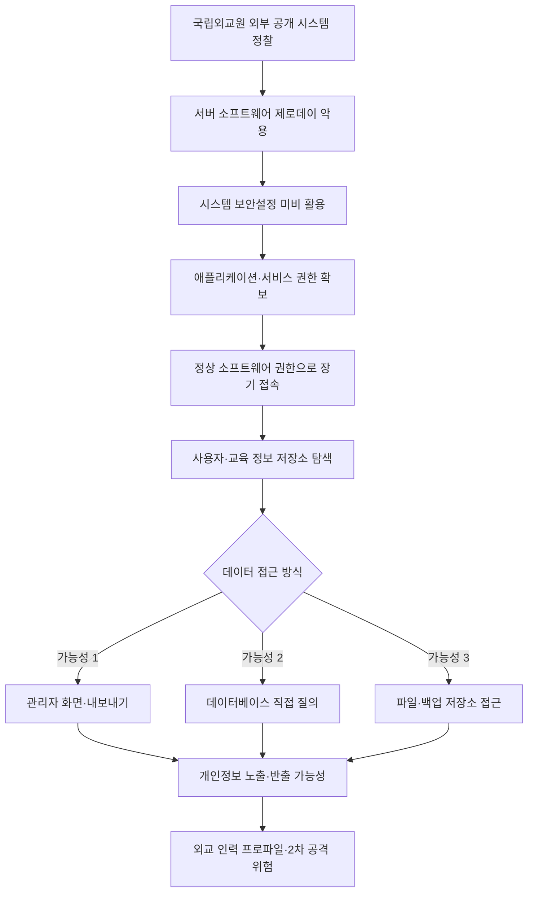
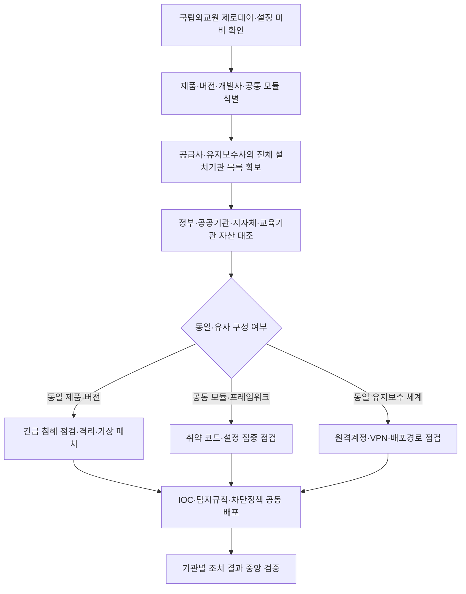

2026년 7월 20일, 외교부는 산하 **국립외교원 온라인교육시스템**이 장기간 사이버 공격을 받았으며 전·현직 외교부 본부와 재외공관 근무자 등의 개인정보가 유출됐을 정황이 있다고 공개했습니다.

외교부 조사에 따르면 공격자는 **2025년 4~5월경 서버 소프트웨어의 제로데이 취약점과 시스템 보안설정 미비를 이용해 시스템을 장악**했고, 이후 **2026년 2월까지 약 9~10개월 동안 접속**했습니다. 사건은 내부 보안시스템의 자체 탐지가 아니라 2026년 2월 초 관계기관의 이상 접속 통보로 확인됐습니다.

유출 정황이 확인된 정보는 사용자 아이디, 이름, 이메일 주소, 암호화된 비밀번호 등입니다. 초기 보도에서는 약 **6000명**이 언급됐지만, 외교부는 시스템에 약 **1만 건**의 자료가 저장돼 있었고 중복이 포함될 수 있으며 실제 반출 규모와 고유 피해 인원은 아직 특정하기 어렵다고 설명했습니다.

따라서 현재 가장 신중한 표현은 다음과 같습니다.

```text
국립외교원 온라인교육시스템에 보관된 최대 약 1만 건의 개인정보가
공격자에게 노출됐을 가능성이 있으며,
실제 반출 건수와 고유 피해 인원은 아직 확인되지 않았다.
```

이번 사건은 단순한 교육 사이트 개인정보 유출로만 볼 수 없습니다. 이름·이메일·소속·직위·근무 이력을 조합하면 공격자는 외교 업무 종사자의 관계망을 재구성하고 특정 인물을 사칭하거나 표적형 피싱 공격을 준비할 수 있습니다.

또한 국립외교원 한 곳만 조사해서는 안 됩니다. 취약점이 여러 고객에게 공급되는 서버 소프트웨어·웹 플랫폼·공통 모듈에 존재했다면, 동일 개발사·제품·버전·프레임워크·관리자 모듈·유지보수 체계를 사용하는 다른 정부기관·공공기관·지방자치단체에도 같은 위험이 남아 있을 수 있습니다.

> 국립외교원에서 발견된 취약점과 보안설정이 다른 정부·공공기관·지자체 시스템에도 존재하지 않는다는 사실이 전수 점검으로 확인될 때까지 사건은 끝난 것이 아닙니다.

다만 외교부는 취약한 제품명·공급사·CVE·최초 공격 요청·침해 계정·지속성 방법·실제 반출 데이터·공격자 귀속을 공개하지 않았습니다.

이 글은 다음을 구분합니다.

1. 외교부와 관계기관이 **공식 확인한 사실**
2. 언론 보도와 공개자료로 재구성한 **가능성이 높은 공격 흐름**
3. 상세 포렌식 보고서가 없어 **단정할 수 없는 내용**

<!--more-->

---

## 핵심 요약

- **공격 대상:** 외교부 산하 국립외교원 온라인교육시스템입니다.
- **침해 기간:** 2025년 4~5월경부터 2026년 2월까지 약 9~10개월입니다.
- **인지 경위:** 관계기관이 이상 접속을 통보하면서 확인됐습니다.
- **초기 침투 원인:** 서버 소프트웨어의 제로데이 취약점과 시스템 보안설정 미비입니다.
- **공격 특징:** 취약점 악용 이후 정상 소프트웨어 권한을 이용해 장기간 접근한 것으로 설명됐습니다.
- **유출 정황 정보:** 아이디, 이름, 이메일, 암호화된 비밀번호 등입니다. 고유식별정보·민감정보·휴대전화번호·자택 주소·사진은 포함되지 않았다고 외교부가 공지했습니다.
- **피해 규모:** 약 6000명은 초기 보도 수치이고, 약 1만 건은 시스템에 저장된 최대 가능 자료 규모입니다. 실제 반출 건수와 고유 피해 인원은 미확정입니다.
- **국가안보 위험:** 외교 인력의 신원·소속·직위·근무 이력은 스피어피싱과 정보수집에 활용될 수 있습니다.
- **핵심 문제:** 제로데이는 최초 침투를 설명하지만, 정상 권한을 이용한 접근을 9~10개월 동안 내부에서 식별하지 못한 이유까지 설명하지는 못합니다.
- **전수 점검:** 동일 개발사·제품·버전·공통 모듈·유지보수 체계를 사용하는 정부·공공기관·지자체를 즉시 식별하고 현재 침해 여부부터 확인해야 합니다.

---

## 사실 관계 정리

### ✅ 외교부가 공식적으로 확인한 내용

- 2026년 2월 초 관계기관이 국립외교원 온라인교육시스템의 이상 접속 사실을 통보했습니다.
- 외교부는 시스템을 긴급 차단하고 관계기관과 합동 조사에 착수했습니다.
- 공격자는 서버 소프트웨어의 제로데이 취약점과 시스템 보안설정 미비를 이용했습니다.
- 시스템 장악 시점은 2025년 4~5월경이며 접속은 2026년 2월까지 이어졌습니다.
- 공격자는 취약점 악용 이후 해당 소프트웨어의 정상 권한을 이용해 접근했습니다.
- 공격 당시 제로데이 취약점의 보안 패치는 존재하지 않았습니다.
- 시스템에는 교육 영상, 교육 대상자의 이름·아이디와 운영 관련 정보가 저장돼 있었습니다.
- 전·현직 외교부 본부와 재외공관 근무 직원 및 그 밖의 인력의 개인정보 유출 정황이 확인됐습니다.
- 유출 정황 항목은 아이디, 이름, 이메일, 암호화된 비밀번호 등입니다.
- 고유식별정보, 민감정보, 휴대전화번호, 자택 주소, 사진은 포함되지 않았다고 공지했습니다.
- 실제 유출 내역은 현재 공개자료만으로 특정하기 어렵다는 입장입니다.

### 🟦 언론 보도로 알려졌지만 범위를 구분해야 하는 내용

- 동아일보는 약 6000명의 개인정보가 유출됐을 가능성을 보도했습니다.
- 외교부 후속 설명에서는 시스템에 약 1만 건의 자료가 있었고 중복이 포함될 수 있다고 밝혔습니다.
- 보도에 따르면 자료에는 직위·소속 정보가 포함됐을 가능성이 있으며, 이용자는 외교관뿐 아니라 행정직원과 다른 기관 파견인력 등을 포함합니다.
- 일부 보도는 해당 서버가 다른 외교부 시스템과 분리돼 있어 확산이 확인되지 않았다고 전했습니다.
- 정기 보안점검과 관련해 동아일보는 점검 대상 누락을 보도했지만 외교부는 주기적으로 점검했다고 설명했습니다.
- 북한 또는 다른 국가 배후 공격 가능성이 거론되지만 최종 귀속은 공개되지 않았습니다.

### 🟨 아직 공개되지 않은 내용

- 취약한 서버 소프트웨어의 제품명·공급사·버전
- CVE 등록 여부와 정확한 취약점 유형
- 최초 공격 IP·도메인·요청 원문·악성 페이로드
- 공격자가 확보한 운영체제·애플리케이션·서비스 계정과 권한
- 웹셸·백도어·예약 작업·토큰 등 지속성 방법
- 데이터베이스 질의와 실제 열람·다운로드·반출 자료
- 외부 전송량·목적지·경로와 로그 삭제·변조 여부
- 다른 외교부 시스템으로의 측면 이동 여부
- 암호화된 비밀번호의 알고리즘·솔트·반복 횟수와 실제 크래킹 여부
- 피해자별 통지·비밀번호 초기화·다중인증 조치 범위
- 북한·중국 또는 다른 국가 조직의 최종 귀속
- 독립적인 침해사고 분석 보고서 공개 여부

### 공개자료에서 서로 다르게 설명된 부분

| 쟁점 | 공개된 설명 | 현재 해석 |
|---|---|---|
| 피해 규모 | 초기 보도 약 6000명, 외교부 후속 설명 약 1만 건 저장 | 실제 반출 건수와 고유 피해 인원 미확정 |
| 침투 기간 | 약 10개월 또는 2025년 4~5월부터 2026년 2월 | 시작일에 따라 약 9~10개월 |
| 취약 소프트웨어 | 일부 보도는 보안 소프트웨어, 공식 발표는 서버 소프트웨어 | 보안 제품 침해로 단정하면 안 됨 |
| 정기 보안점검 | 점검 대상 누락 보도와 주기적 점검 설명이 공존 | 점검 범위·방식·결과 공개 전까지 미해결 |
| 다른 시스템 확산 | 별도 서버라 확산이 없었다는 보도 | 상세 포렌식 결과로 재확인 필요 |
| 유출 데이터 | 개인정보 유출 정황 확인, 실제 반출 목록은 특정 곤란 | 저장·노출 가능 데이터와 실제 반출 데이터 구분 필요 |

---

## 🗓️ 타임라인

| 일시 | 내용 | 확인 수준 |
|---|---|---|
| **2022년경** | 국립외교원 온라인교육시스템 구축·운영 시작으로 보도 | 언론 보도 |
| **2025년 4~5월경** | 제로데이와 보안설정 미비를 이용해 시스템 장악 | 외교부 공식 확인 |
| **2025년 4~5월~2026년 2월** | 정상 소프트웨어 권한으로 장기간 접속 | 외교부 공식 확인 |
| **2026년 2월 초** | 관계기관이 이상 접속 사실 통보 | 외교부 공식 확인 |
| **2026년 2월 초** | 시스템 긴급 차단, 관계기관 합동 조사 착수 | 외교부 공식 확인 |
| **2026년 2~7월** | 침해 범위와 개인정보 유출 정황 조사 | 외교부 설명 |
| **2026년 7월 20일** | 사이버 공격 보도자료와 개인정보 유출 정황 공지 | 외교부 공식 발표 |
| **2026년 7월 21일** | 약 1만 건 저장, 중복 가능, 실제 반출 규모 미확정 설명 | 언론 브리핑 보도 |
| **2026년 7월 22일 현재** | 취약점 상세·공격자 귀속·실제 반출 자료·독립 기술 보고서 미공개 | 공개자료 기준 |

---

## 1. 단순한 교육 사이트 해킹이 아니다

국립외교원 온라인교육시스템은 외교부 본부와 재외공관 근무자가 직무교육을 받기 위해 사용하는 업무 시스템입니다.

시스템의 정보는 각각만 보면 고도 기밀이 아닐 수 있습니다.

- 이름과 업무용 이메일
- 사용자 아이디
- 소속·직위·근무 이력
- 재외공관 근무 여부
- 교육 이수 대상과 과정
- 다른 기관에서 외교부로 파견된 인력

그러나 공격자가 이를 결합하면 외교 업무 종사자의 인적 관계망과 조직 구조를 구성할 수 있습니다.

```text
이름
+ 이메일
+ 소속·직위
+ 재외공관 근무 이력
+ 교육 과정
= 표적형 공격을 위한 외교 인력 프로파일
```

이를 이용하면 상급자·동료·인사·교육 담당자·재외공관을 사칭한 스피어피싱, 비밀번호 변경 안내 위장, 특정 국가·지역 담당자 표적화가 가능해집니다.

다만 현재 확인된 침해 대상은 온라인교육시스템입니다. 외교전문망이나 외교 기밀문서에 접근했다는 사실은 공개적으로 확인되지 않았습니다.

---

## 2. 피해 규모는 6000명인가, 1만 명인가

동아일보는 전·현직 외교부와 재외공관 인력 등 약 **6000명**의 개인정보가 유출됐을 가능성을 보도했습니다. 그러나 이는 외교부가 최종 확정한 고유 피해 인원이 아닙니다.

외교부 후속 설명은 온라인교육시스템에 약 **1만 건**의 자료가 보관돼 있었다는 것입니다. 이 수치에는 다음 한계가 있습니다.

- 같은 사람이 여러 교육 과정에 등록돼 중복됐을 수 있습니다.
- 전직자와 재교육 대상자의 과거 자료가 함께 있을 수 있습니다.
- 계정 수와 개인정보 행 수가 일치하지 않을 수 있습니다.
- 시스템에 저장된 자료와 실제 공격자가 반출한 자료는 다릅니다.

현재 공개자료상 확정 가능한 내용은 다음입니다.

```text
시스템 내 약 1만 건의 개인정보 자료가 존재했다.
공격자가 장기간 시스템에 접근했다.
개인정보 유출 정황이 확인됐다.
실제 반출 건수와 고유 피해 인원은 특정되지 않았다.
```

정확한 피해 규모를 산정하려면 공격자의 데이터베이스 질의, 관리자 내보내기, 파일 다운로드, 웹 응답 전송량, 외부 통신 세션과 업로드 크기를 확인해야 합니다.

### 유출 정황이 있는 정보

| 구분 | 항목 | 공개 상태 |
|---|---|---|
| 계정 | 사용자 아이디 | 유출 정황 |
| 기본정보 | 이름 | 유출 정황 |
| 연락·업무 | 이메일 주소 | 유출 정황 |
| 인증정보 | 암호화된 비밀번호 | 유출 정황 |
| 조직정보 | 소속·직위 | 보도상 포함 가능성 |
| 운영정보 | 교육 대상·운영 관련 정보 | 외교부 발표상 저장 |
| 고유식별정보 | 주민등록번호 등 | 포함되지 않았다고 공지 |
| 민감정보 | 법률상 민감정보 | 포함되지 않았다고 공지 |
| 연락정보 | 휴대전화번호 | 포함되지 않았다고 공지 |
| 주소·이미지 | 자택 주소·사진 | 포함되지 않았다고 공지 |

---

## 3. “암호화된 비밀번호”는 안전한가

외교부는 유출 정황 항목에 **암호화된 비밀번호**를 포함했습니다. 그러나 이 표현만으로 안전 여부를 판단할 수 없습니다.

비밀번호는 일반적으로 복호화할 수 없는 단방향 해시로 저장해야 합니다.

```text
비밀번호
→ 사용자별 고유 솔트 추가
→ 느린 비밀번호 해시 함수 적용
→ 해시값 저장
```

외교부는 단방향 해시인지 복호화 가능한 암호화인지, bcrypt·scrypt·Argon2·PBKDF2 같은 알고리즘을 사용했는지, 솔트와 반복 횟수가 적절했는지 공개하지 않았습니다.

해시값이라도 공격자는 시스템 밖에서 비밀번호 후보를 반복 시험할 수 있습니다. 짧은 비밀번호, 기관명·이름과 관련된 비밀번호, 다른 서비스와 같은 비밀번호를 사용했다면 위험이 커집니다.

따라서 다음 조치가 필요합니다.

1. 영향 계정 비밀번호 강제 초기화
2. 같은 비밀번호를 사용하는 다른 업무시스템 변경
3. 다중인증 적용
4. 세션·토큰·API 키 무효화
5. 비정상 로그인 이력 재검토
6. 유출된 비밀번호 값의 저장 강도와 크래킹 가능성 검증

다음 표현은 공개자료가 뒷받침하지 않습니다.

```text
외교관의 비밀번호 원문이 유출됐다.
```

보다 정확한 표현은 다음과 같습니다.

```text
암호화된 비밀번호 값이 유출됐을 정황이 있으며,
저장 방식과 알고리즘이 공개되지 않아 실제 계정 탈취 위험을 평가하기 어렵다.
```

---

## 4. 제로데이와 보안설정 미비가 만든 장기 침투

외교부는 공격 원인을 다음 두 가지로 설명했습니다.

```text
서버 소프트웨어 제로데이 취약점
+
시스템 보안설정 미비
```

### 4-1. 제로데이는 최초 침투를 설명한다

이번 공격 당시에는 해당 취약점의 패치가 존재하지 않았습니다. 이는 최초 공격 요청을 알려진 시그니처나 패치로 막기 어려웠던 이유가 될 수 있습니다.

그러나 다음 두 문장은 같지 않습니다.

```text
패치가 없어 최초 요청을 막지 못할 수 있다.
```

```text
침투 이후 9~10개월의 비정상 행위도 탐지할 수 없다.
```

### 4-2. 보안설정 미비는 공격 범위를 키웠을 수 있다

구체적인 설정 문제는 공개되지 않았습니다. 다만 일반적으로 다음과 같은 문제는 공격자의 권한과 접근 범위를 확대할 수 있습니다.

- 서비스 계정의 과도한 데이터베이스 권한
- 인터넷에 노출된 관리자 기능
- 파일·디렉터리 권한 과다
- 애플리케이션과 데이터베이스의 분리 미흡
- 서버 외부 통신 제한 부재
- 기본 계정·장기 미사용 계정 유지
- 로그 수집·보존 설정 부족

이는 가능한 예시이며 이번 사건에서 실제 확인된 설정 항목은 아닙니다.

### 4-3. 정상 권한은 정상 행위의 증거가 아니다

외교부는 공격자가 취약점 악용 이후 **정상적인 소프트웨어 권한**으로 접근했다고 설명했습니다.

이는 애플리케이션 또는 서비스 계정의 정상 요청처럼 보였을 가능성을 의미합니다. 그러나 정상 권한으로도 다음과 같은 비정상 행위는 식별할 수 있습니다.

- 평소와 다른 국가·IP·시간대 접속
- 사용하지 않던 관리자 기능 호출
- 사용자 목록 대량 조회
- 오래된 계정의 재활성화
- 서비스 계정의 대화형 로그인
- 교육 운영과 무관한 파일 생성·압축
- 신규 외부 목적지로 지속적인 업로드
- 교육 운영시간과 무관한 반복 접근

### 4-4. 공개자료로 재구성한 공격 흐름

아래는 공개자료에 근거한 가능성 높은 흐름입니다.

1. **외부 공개 시스템 식별**  
   공격자가 도메인·IP·로그인 화면·응답 헤더·정적 파일 등으로 시스템과 소프트웨어 특성을 확인했을 가능성이 높습니다.

2. **제로데이 악용**  
   외교부가 공식 확인한 단계입니다. MITRE ATT&CK의 **T1190 Exploit Public-Facing Application**에 해당할 가능성이 높습니다.

3. **보안설정 미비를 이용한 권한 확보**  
   애플리케이션·서비스·데이터베이스 권한 중 일부를 확보했을 가능성이 있지만 정확한 계정과 권한은 미공개입니다.

4. **정상 소프트웨어 권한으로 장기 접근**  
   공격자는 2025년 4~5월부터 2026년 2월까지 접속했습니다. 세션·토큰·서비스 계정·웹셸·예약 작업 중 무엇을 사용했는지는 공개되지 않았습니다.

5. **사용자·교육 정보 저장소 탐색**  
   개인정보 유출 정황을 고려하면 사용자 데이터베이스나 관련 저장소에 접근했을 가능성이 높습니다. MITRE ATT&CK의 **T1213 Data from Information Repositories**, 데이터베이스라면 **T1213.006 Databases**와 연결될 수 있습니다.

6. **데이터 열람 또는 반출**  
   관리자 내보내기, 데이터베이스 질의, 파일 다운로드, 웹 응답을 통한 분할 반출 등이 가능한 경로지만 실제 방식은 미확정입니다.



B·C·D·E는 외교부가 밝힌 공격 개요에 근거합니다. F 이후의 구체적인 접근·반출 방식은 상세 포렌식 결과가 없어 가능한 시나리오로 표시했습니다.

---

## 5. 왜 9~10개월 동안 탐지하지 못했는가

이 사건의 가장 중요한 질문은 다음입니다.

> 패치가 없던 제로데이를 처음 막지 못한 것과 공격자가 약 9~10개월 동안 접속한 사실을 내부에서 발견하지 못한 것은 서로 다른 문제입니다.

외교부 발표에 따르면 사건은 자체 경보가 아니라 관계기관의 이상 접속 통보로 확인됐습니다. 공개자료상 국립외교원 또는 외교부의 자체 관제만으로 장기 접근을 먼저 식별하지 못한 셈입니다.

제로데이의 정확한 이름을 몰라도 침투 이후에는 흔적이 남습니다.

```text
비정상 웹 요청
→ 웹 서버 프로세스 변화
→ 계정·권한 사용
→ 데이터베이스 조회
→ 파일 생성·압축
→ 외부 통신
```

공격자가 정상 기능을 사용했다면 단일 로그에서는 정상처럼 보일 수 있습니다. 그래서 웹·애플리케이션·호스트·데이터베이스·인증·네트워크를 같은 시간축으로 연결해야 합니다.

### 점검과 상시 탐지는 다르다

외교부는 시스템을 주기적으로 점검했다고 설명한 것으로 보도됐지만, 동아일보는 정기 보안점검 대상에서 빠졌다고 보도했습니다.

두 설명을 검증하려면 다음이 공개돼야 합니다.

- 점검 주기·범위·수행기관
- 애플리케이션·서버·DB·계정 포함 여부
- 발견된 취약점과 미조치 항목
- 로그 수집·관제 대상 여부
- 경보 발생 여부와 처리 이력
- 시스템 소유자와 보안 책임자

취약점 점검을 했다는 사실만으로 장기 침투 탐지체계가 작동했다고 볼 수는 없습니다.

---

## 6. 공급망 공격은 미확정이지만 공통 플랫폼 전수 점검은 필요하다

현재 공개자료만으로 이번 사건을 **공급망 공격으로 확정**할 수는 없습니다.

공급사 개발망 침해, 악성 업데이트, 빌드·배포 시스템 변조, 코드서명 인증서 탈취, 유지보수 계정을 통한 다수 고객 침해는 확인되지 않았습니다.

공식적으로 확인된 것은 다음입니다.

```text
외교부가 운영한 서버 소프트웨어에 제로데이 취약점이 있었고,
공격자가 이를 국립외교원 온라인교육시스템에 악용했다.
```

그러나 공급망 공격으로 확정되지 않았다고 해서 동일 제품·공통 모듈을 사용하는 다른 기관을 조사하지 않아도 된다는 뜻은 아닙니다.

### 6-1. 같은 플랫폼은 하나의 공동 공격 표면이다

공공 웹 시스템은 기관마다 화면과 도메인이 달라도 내부적으로 다음 구성요소를 반복 사용할 수 있습니다.

- 로그인·회원관리·비밀번호 찾기 모듈
- 관리자 페이지와 사용자 검색·내보내기 기능
- 온라인교육·학사관리 패키지
- 전자정부 표준프레임워크 기반 공통 코드
- 동일 WAS·미들웨어·라이브러리 조합
- 동일 컨테이너·가상머신 배포 이미지
- 유지보수사가 재사용한 계정·VPN·보안설정

한 구성요소에 제로데이나 설계 결함이 있으면 기관별 IP와 도메인이 달라도 공격 코드를 재사용할 수 있습니다.

```text
한 기관에서 성공한 공격 코드
+ 같은 제품·버전·공통 모듈
= 다른 기관에서도 반복될 수 있는 공격 경로
```

### 6-2. IITP 반복 사고가 보여주는 문제

정보통신기획평가원(IITP)은 2025년 12월 직원 개인정보 일부 유출 사고 이후 약 7개월 만인 2026년 7월 개인정보접속기록관리 시스템이 다시 해킹된 것으로 보도됐습니다.

두 사고가 같은 시스템이나 취약점에서 발생했다고 단정할 수는 없습니다. 그러나 짧은 기간에 다른 중요 시스템이 다시 침해됐다는 사실은 사고 서버 하나의 복구와 기관 전체의 외부 공개 자산·공통 계정·설정·유지보수 구조 개선이 다르다는 점을 보여줍니다.

### 6-3. 전북대학교와 이화여자대학교 사례

전북대학교와 이화여자대학교는 2024년 학사·통합행정 시스템의 웹 취약점을 악용한 공격으로 대규모 개인정보 유출을 겪었습니다.

개인정보보호위원회 조사에서는 두 대학 모두 **시스템 구축 당시부터 취약점이 존재**했고 야간·주말 비정상 접근 탐지와 차단이 충분하지 않았다는 공통점이 확인됐습니다.

공개자료만으로 두 대학이 정확히 동일한 제품이나 개발사를 사용했다고 확정할 수는 없습니다. 다만 개인정보보호위원회가 교육부에 전국 대학 학사정보관리시스템의 관리 강화를 확산하도록 요청한 것은 개별 기관의 처분만으로 동일 유형 위험을 막기 어렵기 때문입니다.

이 원칙은 국립외교원 사건에도 적용돼야 합니다.

### 6-4. 전수 점검 범위

| 점검 기준 | 확인 대상 |
|---|---|
| 개발사 | 같은 업체가 구축·유지보수한 정부·공공기관·지자체 시스템 |
| 제품·버전 | 같은 온라인교육·회원관리·업무지원 패키지와 패치 수준 |
| 공통 모듈 | 로그인·관리자·파일·검색·내보내기 모듈 |
| 프레임워크 | 동일 프레임워크·라이브러리·미들웨어 조합 |
| 배포 구조 | 같은 컨테이너 이미지·가상머신 템플릿·설정 파일 |
| 유지보수 | 같은 원격관리 계정·VPN·점검 도구·협력업체 |
| 보안설정 | 같은 방화벽 정책·서비스 계정 권한·관리자 노출 설정 |
| 침해지표 | 같은 공격 IP·도메인·웹셸·파일 해시·요청 패턴 |

대상은 중앙정부와 산하기관뿐 아니라 공공기관·출연연구기관·지방자치단체·지방공기업·교육기관·연수기관·재외공관 외부 웹 시스템까지 포함해야 합니다.

### 6-5. 패치보다 먼저 현재 침해 여부를 확인해야 한다

전수 점검의 우선순위는 다음과 같아야 합니다.

```text
1. 동일 제품·버전의 인터넷 노출 인스턴스 식별
2. 현재 공격 세션·웹셸·비정상 계정·외부 통신 확인
3. 침해 의심 시스템 격리와 세션·계정·키 폐기
4. WAF 가상 패치와 서버 외부 통신 제한
5. 안전한 버전 업데이트 또는 시스템 교체
6. 전체 설치기관의 조치 완료 여부 중앙 검증
```

기관별 자율점검 공문만으로는 제품명·모듈·설치현황을 모르는 시스템과 비정규·소규모 자산이 누락될 수 있습니다. 공급사와 유지보수사의 설치기관 목록을 확보하고 관계기관이 **제품-개발사-설치기관 단위의 중앙 점검표**를 운영해야 합니다.



---

## 7. 실제 유출 내역을 특정하려면 원본 로그가 필요하다

외교부는 개인정보 유출 정황을 확인했지만 실제 유출 내역을 특정하기 어렵다고 밝혔습니다.

시스템이 침해됐다는 사실과 실제 반출 자료를 입증하는 것은 별개의 작업입니다. 공격자가 관리자 화면이나 정상 API를 이용해 소량씩 열람했다면 악성 파일이나 대량 다운로드 경보 없이 자료를 가져갔을 수 있습니다.

정확한 사고 원인과 반출 범위를 설명하려면 다음 원본 자료가 필요합니다.

### 7-1. 웹·WAF·애플리케이션

- 최초 공격 요청의 URL·메서드·헤더·쿠키·POST 본문
- 업로드 파일과 해시, 서버 응답 본문·상태·크기
- 로그인·세션·관리자 기능·사용자 검색·내보내기 기록
- 호출자 IP·사용자·세션과 이후 요청의 연결

### 7-2. 서버·EDR·운영체제

- 웹 서버 프로세스 트리와 명령행
- 셸·스크립트·DB 도구·압축 도구 실행
- 신규·변조 파일, 계정·권한·서비스·예약 작업 변화
- 로그 삭제·보안 에이전트 중지·비정상 외부 연결

### 7-3. 데이터베이스·파일·백업

- 접속 계정·호스트·시간과 SELECT 질의 원문
- 조회 테이블·행 수·전체 테이블 스캔·내보내기
- 사용자 명단·백업·압축 파일 생성과 다운로드
- 파일·첨부·교육영상 접근과 삭제 파일 복구

### 7-4. IAM·인증·계정

- 관리자·서비스 계정 로그인과 토큰 발급
- 비정상 IP·국가·장치, 다중인증 우회·실패
- 장기 미사용 계정 재활성화와 권한 상승
- 세션 지속시간, 비밀번호 변경, 퇴직자 계정 상태

### 7-5. 네트워크·DNS·프록시

- 외부 통신 목적지와 DNS 질의
- TLS SNI·인증서·프록시 업로드·다운로드 용량
- 주기적 비콘·신규 호스팅 사업자·저속 장기 전송
- 다른 외교부 서버와 관리망·DB망 접근

### 7-6. 소프트웨어·구성·침해대응 기록

- 제품명·버전·공급사·SBOM·업데이트 이력
- 보안설정 기준선·예외 승인·서비스 계정 권한
- 관계기관 최초 통보 내용과 시스템 차단 시각
- 메모리·디스크 이미지와 포렌식 체인 오브 커스터디
- 피해자 통지·비밀번호 초기화·유사 시스템 점검 결과

단순히 “공격 IP가 접속했다”는 정보만으로는 제로데이의 작동 방식과 데이터 반출 범위를 설명할 수 없습니다.

---

## 8. AI에게 IP·시간·트래픽 방향만 주면 공격을 설명할 수 있는가

불가능합니다.

IP 주소와 접속 시간은 어느 주소가 언제 접속했고 통신량이 얼마나 됐는지를 보여줄 수 있습니다. 그러나 다음은 설명하지 못합니다.

- 어떤 요청이 취약점을 작동시켰는가
- 어느 계정과 권한을 확보했는가
- 어떤 명령과 프로세스를 실행했는가
- 어떤 테이블·파일을 조회했는가
- 어떤 개인정보를 외부로 반출했는가
- 장기 접근을 어떻게 유지했는가

AI에게 패킷 크기·방향·순서만 제공하고 공격의 전체 맥락을 설명하라고 요구하는 것은 분석이 아니라 마술을 기대하는 것과 같습니다.

```text
웹 요청·응답 원문
+ 애플리케이션 세션
+ 서버 프로세스·명령행
+ 데이터베이스 질의
+ 계정·권한 사용
+ DNS·프록시·외부 통신
+ 파일 접근·다운로드
= 설명 가능한 공격 맥락
```

모호한 데이터는 AI에게 사실을 알려주지 않습니다. 오히려 확인되지 않은 공격 방법과 피해 범위를 그럴듯하게 만들어내는 **환각(Hallucination)** 을 유발할 수 있습니다.

AI 분석에서는 확인된 사실과 가설을 분리하고, 저장 데이터와 실제 반출 데이터를 구분하며, 원본 로그가 없는 구간은 미확정으로 표시해야 합니다.

---

## 9. 사건 인지 후 공개까지 약 5개월

외교부는 2026년 2월 초 관계기관 통보로 이상 접속을 인지했지만, 사이버 공격과 개인정보 유출 정황을 외부에 공개한 시점은 2026년 7월 20일입니다.

공개자료만으로 외교부가 사건을 의도적으로 은폐했다고 단정할 수는 없습니다. 외교부는 국가안보와 관련된 전례가 드문 사건이어서 침해 범위와 내용을 신중하게 조사했다는 취지로 설명한 것으로 보도됐습니다.

그러나 다음 시점은 구분해 공개할 필요가 있습니다.

- 최초 침해 인지
- 개인정보 유출 가능성 확인
- 피해 가능 대상자 개별 통지
- 비밀번호 초기화·세션 폐기
- 관계기관 보고
- 대외 발표

원인과 피해 규모의 최종 확정에는 시간이 걸리더라도 피해 가능 대상자에게는 단계적으로 안내할 수 있습니다.

```text
1차: 이상 접속 확인과 시스템 차단
2차: 영향을 받을 수 있는 사용자 범위
3차: 비밀번호 변경·피싱 주의·세션 폐기
4차: 잠정 유출 항목과 조사 진행 상황
5차: 최종 원인·피해 범위·재발 방지
```

특히 암호화된 비밀번호가 노출됐을 가능성이 있다면 크래킹 여부가 확인되기 전이라도 비밀번호 재사용 방지와 다중인증 조치가 우선돼야 합니다.

---

## 10. 공격자 귀속은 아직 미확정이다

외교 인력 정보의 가치, 장기간 조용한 접근, 제로데이 사용 가능성 때문에 북한·중국 등 국가 배후 공격 가능성이 거론되고 있습니다.

그러나 이러한 특징은 여러 국가 배후 조직과 고도화된 범죄조직이 공유할 수 있습니다. 특정 국가나 조직을 확정하려면 다음 증거가 필요합니다.

- 최초 공격 IP와 중계 인프라
- 악성코드·웹셸·명령제어 도메인
- 암호화 방식·프로토콜·컴파일 흔적
- 공격 명령과 운영 시간대
- 기존 캠페인과 도구·인프라 재사용
- 해외 수사·정보기관 자료
- 서버 메모리·디스크 포렌식

따라서 현재 정확한 표현은 다음입니다.

```text
국가 배후 공격 가능성이 검토되고 있으나,
북한·중국 또는 특정 조직의 소행으로 최종 확인되지는 않았다.
```

### 공개자료상 단정하면 안 되는 표현

| 단정하면 안 되는 표현 | 현재 가능한 표현 |
|---|---|
| 외교관 1만 명의 개인정보가 확정 유출됐다 | 약 1만 건이 저장돼 있었으며 실제 반출 규모와 고유 피해 인원은 미확정 |
| 피해자는 정확히 6000명이다 | 6000명은 초기 보도 수치이며 최종 확정 통계가 아님 |
| 북한 또는 중국이 공격했다 | 국가 배후 가능성이 거론되지만 최종 귀속은 미확정 |
| 보안 소프트웨어 공급망이 해킹됐다 | 서버 소프트웨어 제로데이 악용까지만 공식 확인 |
| 비밀번호 원문이 유출됐다 | 암호화된 비밀번호 값의 유출 정황이 확인됨 |
| 외교 기밀문서가 유출됐다 | 온라인교육시스템의 개인정보와 운영정보 침해 정황만 확인 |
| 다른 외교부 시스템에는 피해가 전혀 없다 | 확산이 없었다는 보도가 있으나 상세 포렌식 결과는 미공개 |
| 제로데이라 탐지할 방법이 없었다 | 최초 요청은 어려워도 침투 이후 행위는 탐지 대상 |

---

# PLURA 관점 정리

## 11. PLURA-WAF 관점: 제로데이의 이름을 몰라도 요청과 행위를 봐야 한다

패치와 탐지 시그니처가 없는 제로데이라면 전통적인 룰 기반 웹방화벽이 최초 요청을 즉시 차단하지 못할 수 있습니다.

따라서 다음처럼 과장하면 안 됩니다.

```text
WAF만 설치했으면 국립외교원 해킹을 완전히 막을 수 있었다.
```

그러나 비정상 요청·응답과 이후 웹 행위를 전체 로그로 분석하면 공격을 더 빠르게 탐지하고 차단할 가능성을 높일 수 있습니다.

확인해야 할 웹 행위는 다음과 같습니다.

- 알려지지 않은 엔드포인트와 관리자 기능 접근
- 비정상적으로 긴 파라미터·인코딩·파일 업로드
- 오류 응답 이후 권한 변화와 사용자 목록 대량 조회
- CSV·엑셀 내보내기와 평소보다 큰 응답 크기
- 비정상 국가·호스팅 IP와 장기간 반복되는 저속 요청

제로데이 분석에는 시간·IP·URL·상태코드만이 아니라 **원본 요청 헤더·본문, 응답 본문, 사용자·세션, 이후 서버 행위**가 필요합니다.

WAF의 역할은 최초 요청 탐지·차단, 의심 세션 보존, 대량 조회·내보내기 탐지, 공격 IP·세션 차단, EDR·DB 로그와 연결할 이벤트 제공입니다.

---

## 12. PLURA-EDR 관점: 정상 권한으로 실행된 비정상 행위를 찾아야 한다

공격자가 정상 소프트웨어 권한을 사용했다면 서버에서 실행된 행위가 핵심 증거가 됩니다.

### 주요 탐지 대상

- 웹 서버 프로세스의 셸·PowerShell·Python·bash 실행
- 웹 루트·임시 디렉터리의 신규 스크립트·실행파일
- 데이터베이스 클라이언트와 압축 도구 실행
- 사용자 목록 파일 생성과 외부 업로드
- 예약 작업·서비스·자동실행·계정·권한 변경
- 로그 삭제·보안 에이전트 중지·메모리 덤프
- 인증서·토큰·설정 파일 접근

정상 실행파일도 공격 도구가 될 수 있습니다.

```text
웹 서버
→ 데이터베이스 연결
→ 사용자 조회
→ CSV 생성
→ HTTPS 업로드
```

실행파일 자체가 정상이어도 교육 운영과 무관한 시각·계정·목적지라면 비정상입니다. EDR은 악성 파일 해시만이 아니라 누가 어느 프로세스로 어떤 명령을 실행하고 어떤 파일과 데이터에 접근했는지를 기록해야 합니다.

---

## 13. PLURA-XDR 관점: 하나의 사건 타임라인으로 연결해야 한다

단일 로그에서는 웹 요청, 애플리케이션 로그인, 데이터베이스 연결, 파일 압축, TLS 통신이 모두 정상처럼 보일 수 있습니다.

그러나 같은 시간대에 연결하면 의미가 달라집니다.

```text
비정상 외부 요청
→ 웹 서버 프로세스에서 셸 실행
→ 서비스 계정으로 DB 접속
→ 사용자 테이블 대량 조회
→ CSV·압축 파일 생성
→ 신규 외부 목적지로 HTTPS 업로드
```

| 영역 | 필요한 데이터 |
|---|---|
| 웹 | 요청·응답 원문, 세션, 사용자, IP |
| 애플리케이션 | 로그인, 관리자 기능, 내보내기, 교육 운영 기록 |
| 호스트 | 프로세스, 명령행, 파일, 계정, 네트워크 |
| 데이터베이스 | 질의, 테이블, 행 수, 내보내기 |
| 인증 | 계정·토큰·MFA·권한 변경 |
| 네트워크 | DNS, 프록시, 목적지, 전송량 |
| 개인정보 | 사용자·소속·보유기간·퇴직 여부 |
| 위협정보 | 공격 IP·도메인·도구·캠페인 |

### 상관분석 예시

```text
외부 공개 시스템에 비정상 요청
AND 웹 서버 프로세스의 셸 실행
= 제로데이 또는 웹 침해 의심
```

```text
서비스 계정의 사용자 테이블 대량 조회
AND 관리자 내보내기 업무 기록 없음
= 개인정보 대량 수집 의심
```

```text
사용자 데이터 조회 급증
AND 압축 파일 생성
AND 신규 외부 목적지 업로드
= 개인정보 반출 의심, 즉시 차단
```

제로데이 시대에는 알려진 취약점 이름보다 공격이 진행되는 현재 시점에 웹·호스트·DB·인증·네트워크의 이상을 연결해 **실시간으로 차단하는 것**이 중요합니다.

---

## 14. 국립외교원과 정부기관이 갖춰야 할 방어 체계

### 14-1. 외부 공개 자산의 책임자와 관제 범위 지정

- 도메인·IP·서버·애플리케이션 자산 목록
- 시스템 소유부서와 보안 책임자
- 정기 점검·24시간 관제 대상 여부
- 로그 수집 상태와 개인정보 보유 수준
- 폐기·전환 예정 시스템 관리

### 14-2. 제로데이 대비 보완통제

- 외부 공개 기능 최소화와 관리자 페이지 VPN 제한
- 서비스 계정 최소 권한과 애플리케이션·DB 분리
- 서버 외부 통신 화이트리스트
- WAF 가상 패치와 EDR 행위 탐지
- 파일 무결성 감시와 대량 조회·다운로드 차단

### 14-3. 보안설정·인증·데이터베이스 통제

- 운영체제·웹서버·DB 보안설정 기준선
- 기본 계정 비활성화와 장기 미사용 계정 삭제
- 강한 비밀번호 해시·다중인증·짧은 세션 수명
- 개인정보 테이블 감사와 대량 내보내기 승인
- 서비스 계정의 대화형 로그인 금지

### 14-4. 개인정보 최소 보유와 자동 파기

- 교육 종료 후 보유기간 정의
- 퇴직·전출 시 계정 비활성화
- 목적이 끝난 개인정보와 중복 자료 삭제
- 장기 미사용 계정과 과거 백업 파기
- 파기 결과 감사

### 14-5. 동일 개발사·공통 플랫폼 전수 점검

- 외부 공개 웹 시스템의 제품·개발사·버전 목록화
- 공급사별 고객기관과 설치 버전 관리
- 공통 로그인·관리자·파일·내보내기 모듈 식별
- 제로데이 발생 시 영향 인스턴스 자동 검색
- WAF 가상 패치와 EDR·XDR 규칙 일괄 배포
- 패치 여부뿐 아니라 현재 웹셸·비정상 계정·외부 통신 확인
- 기관 자체점검 결과에 대한 중앙 검증

### 14-6. 장기 침투 대응 훈련

- 외부기관 이상통보 수신과 즉시 서버 격리
- 메모리·디스크 증거 보존
- 계정·토큰·키 일괄 폐기
- 유사 시스템 전수점검과 공격 인프라 공유
- 피해자 단계별 통지
- 독립 포렌식과 30일·90일 재검증

---

## 15. 외교부가 공개한 조치와 추가로 필요한 공개

외교부는 다음 조치를 공개했습니다.

- 관계기관 통보 후 온라인교육시스템 긴급 차단
- 관계기관과 합동 조사
- 개인정보 유출 정황 공지
- 시스템 전면 차단과 보안 강화
- 피해 가능 대상자에게 의심 메일 주의 안내
- 내부 사이버보안과 관리체계 강화 방침

사고 수습과 재발 방지 검증을 위해 다음 내용이 추가로 공개돼야 합니다.

- 제품명·공급사·버전과 취약점 유형
- 제로데이 악용 재현 결과와 보안설정 미비 항목
- 최초 침해일·침해 계정·권한·지속성 방법
- 실제 열람·반출 데이터와 고유 피해 인원
- 비밀번호 저장 알고리즘과 초기화·MFA 적용 범위
- 다른 외교부 시스템 측면 이동 조사 결과
- 동일 개발사·제품·버전·공통 모듈 사용기관 목록
- 다른 정부·공공기관·지자체의 긴급 점검 결과
- 공급사의 임시조치·패치·IOC·고객 통지 내역
- 정기 보안점검 범위 논란에 대한 설명
- 독립 전문기관 검증과 시스템 재개 조건

---

## 16. 조사기관이 답해야 할 핵심 질문

### 침투와 장기 체류

1. 취약한 제품·버전·개발사와 제로데이 유형은 무엇인가?
2. 최초 악용 요청과 공격 시각은 언제인가?
3. 보안설정 미비는 구체적으로 무엇이었는가?
4. 공격자가 확보한 계정·권한은 무엇인가?
5. 9~10개월 동안 접근을 유지한 방법은 무엇인가?
6. 웹셸·백도어·예약 작업·토큰이 존재했는가?
7. 내부 관제에서 경보가 발생했으며 어떻게 처리됐는가?

### 데이터와 피해자 보호

8. 어떤 테이블·파일·화면에 접근했는가?
9. 실제 조회·다운로드·반출된 자료는 무엇인가?
10. 약 1만 건 중 고유 피해 인원은 몇 명인가?
11. 약 6000명이라는 초기 수치의 산정 근거는 무엇인가?
12. 비밀번호는 어떤 알고리즘으로 저장됐고 크래킹 또는 재사용 공격이 확인됐는가?
13. 피해자 통지·비밀번호 초기화·세션 폐기·MFA 조치는 언제 시행됐는가?

### 범위와 수평 확산

14. 다른 외교부 서버·계정·망으로 이동했는가?
15. 취약한 제품·버전·공통 모듈을 사용하는 다른 기관은 몇 곳인가?
16. 공급사와 유지보수사는 전체 설치기관 목록을 제출했는가?
17. 다른 기관에서 같은 공격 요청·웹셸·계정·외부 통신이 발견됐는가?
18. 중앙에서 기관별 조치 완료와 현재 침해 여부를 검증했는가?

### 책임과 귀속

19. 시스템은 어떤 정기 점검과 24시간 관제 대상이었는가?
20. 공격 IP·도메인·도구와 기존 국가 배후 캠페인의 연관성은 무엇인가?
21. 최종 기술보고서와 전수 점검 결과를 어느 범위까지 공개할 것인가?

---

## 17. 이번 사건의 핵심 교훈

### 1. 교육시스템도 국가 핵심 공격 표면이다

외교문서가 없더라도 외교 인력의 신원과 관계망은 정보기관에 가치가 있습니다. 시스템 이름이 “교육”이라는 이유로 낮은 중요도로 분류하면 안 됩니다.

### 2. 제로데이는 최초 침투만 설명한다

패치가 없었다는 사실은 첫 요청을 막기 어려웠던 이유입니다. 9~10개월 장기 접근과 데이터 조회를 탐지하지 못한 이유는 별도로 설명돼야 합니다.

### 3. 정상 권한은 정상 행위의 증거가 아니다

정상 계정·API·DB 연결도 시간·범위·목적·데이터량이 업무와 다르면 공격일 수 있습니다.

### 4. 같은 플랫폼은 하나의 공동 공격 표면이다

한 기관에서 취약점이 확인되면 동일 개발사·제품·버전·공통 모듈을 사용하는 전체 설치기관을 찾아 현재 침해 여부부터 점검해야 합니다.

### 5. 저장 데이터와 실제 반출 데이터를 구분해야 한다

시스템에 약 1만 건이 있었다는 사실과 약 1만 건이 유출됐다는 주장은 다릅니다. 피해 규모는 원본 로그와 포렌식 증거로 산정해야 합니다.

### 6. 개인정보 최소화와 피해자 보호가 필요하다

목적이 끝난 전직자·과거 이용자 정보를 삭제하고, 인증정보 노출 가능성이 있으면 원인 확정 전이라도 비밀번호 초기화·세션 폐기·MFA를 시행해야 합니다.

### 7. AI에는 최상의 원본 데이터가 필요하다

IP·크기·방향만으로 공격 맥락을 설명할 수 없습니다. 모호한 데이터는 정확한 분석보다 환각을 키울 수 있습니다.

---

## 18. 정리

국립외교원 해킹 사건은 외교부 산하 온라인교육시스템이 서버 소프트웨어의 제로데이 취약점과 보안설정 미비로 장기간 장악된 사건입니다.

공격자는 2025년 4~5월경 시스템을 장악한 뒤 2026년 2월까지 약 9~10개월 동안 정상 소프트웨어 권한을 이용해 접근했습니다. 사건은 내부 자체 탐지보다 관계기관의 이상 접속 통보를 통해 확인됐습니다.

시스템에는 전·현직 외교부 본부와 재외공관 직원, 행정인력, 파견인력 등의 이름·아이디·이메일·암호화된 비밀번호와 교육 운영정보가 저장돼 있었습니다. 약 6000명은 초기 보도 수치이고, 약 1만 건은 중복 가능성이 있는 시스템 내 저장 자료 규모입니다. 실제 반출 범위와 고유 피해 인원은 아직 미확정입니다.

현재 가장 정확한 사건 흐름은 다음과 같습니다.

```text
국립외교원 외부 공개 시스템 정찰
→ 서버 소프트웨어 제로데이 악용
→ 보안설정 미비를 이용한 권한 확보
→ 정상 소프트웨어 권한으로 장기간 반복 접속
→ 사용자·교육 정보 저장소 접근
→ 개인정보 유출 정황
→ 관계기관 이상 접속 탐지·통보
→ 시스템 차단과 합동 조사
→ 실제 반출 범위·공격자 귀속은 미확정
```

이번 사건의 본질을 “패치가 없던 제로데이 때문에 어쩔 수 없었다”로 끝내면 안 됩니다.

> 국립외교원 해킹의 본질은 서버 소프트웨어 제로데이 하나에만 있지 않습니다. 제로데이와 보안설정 미비로 확보된 정상 권한을 공격자가 약 9~10개월 동안 사용했음에도 이를 내부에서 조기에 탐지하지 못했고, 실제 개인정보 접근·반출 범위를 명확히 재구성하기 어려운 장기 침투 탐지와 증거체계의 복합 실패입니다.

그리고 국립외교원 시스템의 복구만으로 사건은 종료되지 않습니다.

> 동일 개발사·제품·버전·공통 모듈을 사용하는 다른 정부·공공기관·지자체까지 즉시 점검하지 않는다면, 국립외교원에서 확인된 취약점은 다음 기관을 공격하는 재사용 가능한 경로로 남습니다.

같은 취약점이 설치된 다른 시스템이 없다는 사실과 이미 침해된 다른 기관이 없다는 사실이 중앙 전수 점검으로 확인돼야 비로소 재발 방지 조치가 완성됩니다.

---

## 🆙 업데이트 예정

이 글은 **2026년 7월 22일**까지 공개된 외교부 발표와 언론 보도를 기준으로 작성했습니다.

향후 다음 내용이 확인되면 업데이트가 필요합니다.

- 취약 제품·공급사·버전·CVE와 기술 보고서
- 최초 공격 요청과 제로데이 재현 결과
- 침해 계정·권한·지속성 방법과 웹셸·악성코드 여부
- 실제 열람·반출 자료와 고유 피해 인원
- 비밀번호 저장 방식·크래킹·계정 악용·2차 피싱 여부
- 다른 외교부 시스템으로의 확산 조사 결과
- 동일 플랫폼 사용기관 목록과 전수 점검·추가 침해 결과
- 공급사의 패치·IOC·고객 통지 내역
- 정기 보안점검 범위와 피해자 통지 시점
- 공격자 국가·조직 최종 귀속
- 독립 포렌식 보고서와 시스템 재개 검증 결과

---

### 📖 함께 읽기

- [웹의 전체 로그 분석은 왜 중요한가?](https://blog.plura.io/ko/respond/very_important_analyze_web_logs/)
- [보안의 출발점은 기록이다](https://blog.plura.io/ko/column/news-cybersecurity-begins-with-logging/)

### 📚 해킹 사고 분석

- [CJ올리브네트웍스 인증서 유출 사건: 김수키의 공급망 공격](https://blog.plura.io/ko/threats/case-cjolivenetworks_digitalsignature_mitre/)
- [현대엘리베이터 해킹 사건: 에베레스트 랜섬웨어의 1.1TB 유출 주장](https://blog.plura.io/ko/threats/case-hyundaielevator/)
- [티빙 개인정보 유출 사고: GitHub 자격증명 노출과 AWS 액세스 키 관리 논란](https://blog.plura.io/ko/threats/case-cj-tving/)
- [CU편의점택배(CUPOST) 개인정보 유출 사고: 웹 취약점 침해와 CI 유출의 위험](https://blog.plura.io/ko/threats/case-cu-cupost-bgfnetworks/)
- [업비트 445억 원 해킹 전말: 솔라나 핫월렛 개인키 추정 취약점과 온체인 자금세탁](https://blog.plura.io/ko/threats/case-upbit-hack-2025/)
- [듀오 개인정보 유출 사고: 직원 PC 악성코드 감염과 DB 계정 탈취가 만든 42만 명 프로필 유출](https://blog.plura.io/ko/threats/case-duo-personal-info-leak/)

---

## 참고 자료(출처)

### 외교부 공식 발표

- 외교부, `국립외교원 온라인교육시스템 사이버 공격 관련`, 2026-07-20: https://www.mofa.go.kr/www/brd/m_4080/view.do?page=1&pitem=10&seq=377429
- 외교부, `전‧현직 외교부 본부 및 재외공관 근무 직원과 그 밖의 인력의 개인정보 유출 정황 안내 공지`, 2026-07-20: https://www.mofa.go.kr/www/brd/m_4075/view.do?page=1&pitem=10&seq=369430

### 사건 보도와 후속 설명

- 동아일보, `北추정 해커, 외교관 6000명 개인정보 털었다`, 2026-07-21: https://www.donga.com/news/Politics/article/all/20260721/134332677/2
- 동아일보, 국립외교원 온라인교육시스템 장기 침투 관련 분석 기사, 2026-07-21: https://www.donga.com/news/Politics/article/all/20260721/134332319/2
- 연합뉴스, 국립외교원 온라인교육시스템 개인정보 유출 정황 보도, 2026-07-20: https://www.yna.co.kr/view/AKR20260720084000504
- 연합뉴스, 외교부 후속 설명과 최대 약 1만 건 자료·공격자 귀속 미확정 보도, 2026-07-21: https://www.yna.co.kr/view/AKR20260721100700504

### 공통 플랫폼·반복 사고 참고

- 개인정보보호위원회 제13회 전체회의 결과, 전북대학교·이화여자대학교 학사정보시스템 구축 당시 취약점과 야간·주말 모니터링 미흡 확인, 2025-06-12: https://www.korea.kr/news/policyNewsView.do?newsId=156721566
- 머니투데이, `정보통신기획평가원, 개인정보접속기록관리 시스템 해킹`, 2026-07-15: https://www.mt.co.kr/tech/2026/07/15/2026071519300161690
- 조선비즈, `정보통신기획평가원서 올해 7월 해킹 사고 발생…연구자 개인정보 유출 여부 파악 중`, 2026-07-15: https://biz.chosun.com/it-science/ict/2026/07/15/NIK3HKUI7FDFFAOH7CE36B5JHI/

### 기술 기준

- MITRE ATT&CK, T1190 Exploit Public-Facing Application: https://attack.mitre.org/techniques/T1190/
- MITRE ATT&CK, T1213 Data from Information Repositories: https://attack.mitre.org/techniques/T1213/
- MITRE ATT&CK, T1213.006 Databases: https://attack.mitre.org/techniques/T1213/006/

---

> **자료 해석 원칙**  
> 외교부가 공식 발표한 제로데이·보안설정 미비·장기 접속·개인정보 유출 정황은 확인된 사실로 기술했습니다.  
> 약 6000명은 초기 언론 보도, 약 1만 건은 시스템 내 최대 저장 자료에 대한 후속 설명으로 구분했으며 실제 반출 건수와 고유 피해 인원으로 단정하지 않았습니다.  
> 취약점 제품명, 공격 코드, 지속성 방법, 데이터 반출 경로, 다른 시스템 확산, 북한·중국 등 공격자 귀속은 상세 포렌식 결과가 공개되지 않았으므로 미확정 사항으로 표시했습니다.  
> 전북대학교와 이화여자대학교는 같은 성격의 학사·통합행정 시스템에서 구축 당시부터 존재한 취약점과 관제 공백이 확인됐지만, 공개자료만으로 정확히 동일한 제품·개발사였다고 확정하지 않았습니다. 두 사례는 공통 플랫폼과 유사 개발 구조를 사용하는 기관을 수평 점검해야 한다는 정책적 선례로 활용했습니다.  
> 동일 개발사·제품·버전·공통 모듈을 사용하는 다른 기관의 전수 점검 필요성은 공개된 사고 사실에 기반한 위험관리 제안이며, 현재 다른 기관도 실제 침해됐다는 의미는 아닙니다.  
> PLURA-WAF·EDR·XDR 관점은 공개된 공격 개요를 기반으로 한 탐지·대응 설계 제안이며, 해당 제품이 이번 사고 현장에 실제 설치됐거나 사고를 탐지했다는 의미가 아닙니다.
