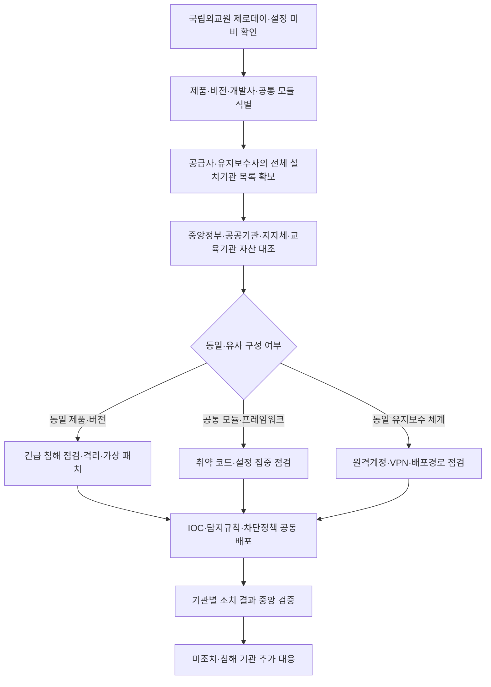
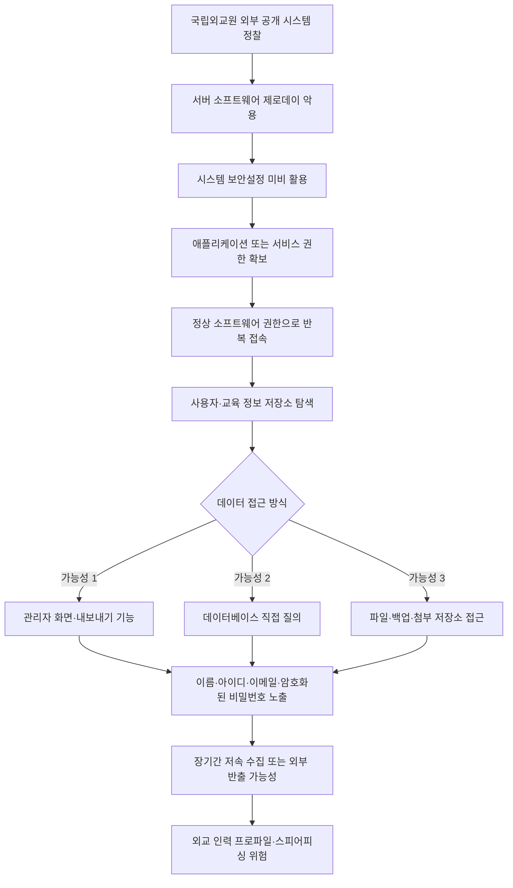

2026년 7월 20일, 외교부는 산하 기관인 **국립외교원 온라인교육시스템**이 장기간 사이버 공격을 받았으며, 전·현직 외교부 본부와 재외공관 근무자 등의 개인정보가 유출됐을 정황이 있다고 공개했습니다.

공격자는 **2025년 4~5월경 서버 소프트웨어의 제로데이 취약점과 시스템 보안설정 미비를 이용해 시스템을 장악**했고, 이후 **2026년 2월까지 약 9~10개월 동안 접속**한 것으로 조사됐습니다.

외교부가 사건을 인지한 계기는 자체 탐지가 아니라, 2026년 2월 초 관계기관으로부터 전달받은 이상 접속 통보였습니다.

유출 정황이 확인된 정보는 다음과 같습니다.

- 사용자 아이디
- 이름
- 이메일 주소
- 암호화된 비밀번호
- 보도상 일부 직위·소속 정보
- 온라인 교육 운영과 관련된 정보

초기 보도에서는 약 **6000명**의 개인정보가 유출됐다고 알려졌습니다.

그러나 외교부의 후속 설명은 조금 다릅니다.

온라인교육시스템에 보관된 자료는 약 **1만 건**이며 중복 자료가 포함됐을 수 있고, 실제로 공격자가 어느 자료를 얼마나 반출했는지는 아직 특정하기 어렵다는 입장입니다.

따라서 현재 공개자료를 기준으로 다음 표현은 정확하지 않습니다.

```text
국립외교원에서 외교관 1만 명의 개인정보가 유출됐다.
```

현재 가장 신중한 표현은 다음과 같습니다.

```text
국립외교원 온라인교육시스템에 보관된 최대 약 1만 건의 개인정보가
공격자에게 노출됐을 가능성이 있으며,
실제 반출 건수와 고유 피해 인원은 아직 확인되지 않았다.
```

이 사건은 단순한 교육 사이트 개인정보 유출로만 볼 수 없습니다.

피해 대상에는 외교부 본부와 재외공관의 전·현직 직원, 행정직원, 다른 기관에서 파견된 인력 등이 포함됐습니다.

이름·이메일·소속·직위·근무 이력을 조합하면 공격자는 외교 업무 종사자의 관계망을 파악하고, 특정 인물을 사칭하거나 표적형 피싱 공격을 준비할 수 있습니다.

그리고 이번 사건을 **국립외교원 한 곳의 문제로만 조사해서는 안 됩니다.**

제로데이가 존재한 대상이 특정 기관만을 위해 새로 만든 코드가 아니라 여러 고객에게 공급되는 서버 소프트웨어·웹 플랫폼·공통 모듈이라면, 같은 취약점은 다른 정부기관·공공기관·지방자치단체 시스템에도 복제돼 있을 수 있습니다.

```text
국립외교원에서 취약점 확인
→ 취약 제품·버전·개발사·공통 모듈 식별
→ 동일하거나 유사한 플랫폼의 전체 설치기관 확인
→ 인터넷 노출·침해 여부·보안설정 일괄 점검
→ 즉시 격리·가상 패치·업데이트·탐지규칙 공동 배포
```

사고가 발생한 서버만 교체하거나 차단하면 눈앞의 한 시스템은 멈출 수 있습니다.

하지만 동일 개발사, 동일 제품, 동일 버전, 동일 프레임워크, 동일 관리자 모듈, 동일 유지보수 업체 또는 동일 배포 이미지를 사용하는 다른 기관을 그대로 두면 공격자는 이미 알고 있는 취약점을 다른 기관에 반복 사용할 수 있습니다.

따라서 이번 조사의 핵심 결과물에는 단순한 피해 규모뿐 아니라 **영향받을 수 있는 다른 설치기관 목록과 전수 점검 결과**가 반드시 포함돼야 합니다.

다만 매우 중요한 한계가 있습니다.

외교부는 제로데이와 보안설정 미비를 공격 원인으로 밝혔지만 다음 내용은 아직 공개하지 않았습니다.

- 취약한 서버 소프트웨어의 제품명과 공급사
- 취약점 번호와 정확한 기술 원리
- 최초 공격 요청과 악성 페이로드
- 공격자가 확보한 계정·권한
- 장기 접속을 유지한 방법
- 명령제어 서버와 외부 전송 경로
- 실제 열람·다운로드·반출된 파일과 데이터베이스 행
- 다른 외교부 시스템으로의 확산 여부를 입증하는 상세 포렌식 결과
- 북한·중국 등 특정 국가 또는 공격조직의 최종 귀속

따라서 이 글은 다음 세 가지를 엄격히 구분합니다.

1. 외교부와 관계기관이 **공식 확인한 사실**
2. 언론 보도와 공개자료로 재구성한 **가능성이 높은 공격 흐름**
3. 상세 포렌식 보고서가 없어 **단정할 수 없는 내용**

<!--more-->

---

## 핵심 요약

- **공격 대상:** 외교부 산하 국립외교원 온라인교육시스템입니다.
- **최초 장악 시점:** 외교부 조사상 2025년 4~5월경입니다.
- **접속 지속 기간:** 2026년 2월까지 약 9~10개월입니다.
- **인지 경위:** 2026년 2월 초 관계기관이 이상 접속 사실을 외교부에 통보하면서 확인됐습니다.
- **초기 침투 원인:** 서버 소프트웨어의 제로데이 취약점과 시스템 보안설정 미비입니다.
- **공격 특징:** 공격자는 제로데이 악용 이후 소프트웨어가 가진 정상 권한을 사용해 접근한 것으로 설명됐습니다.
- **피해 대상:** 전·현직 외교부 본부와 재외공관 직원, 행정인력, 파견인력 등입니다.
- **유출 정황 정보:** 아이디, 이름, 이메일, 암호화된 비밀번호 등입니다.
- **포함되지 않았다고 공지한 정보:** 고유식별정보, 민감정보, 휴대전화번호, 자택 주소, 사진입니다.
- **피해 규모:** 초기에는 약 6000명으로 보도됐으나, 외교부는 시스템에 약 1만 건의 자료가 저장돼 있었다고 설명했습니다. 중복 여부와 실제 반출 건수는 확인되지 않았습니다.
- **현재 상태:** 온라인교육시스템은 차단된 상태이며 보안 조치가 진행됐습니다.
- **공격자:** 북한·중국 등 국가 배후 가능성이 거론되지만 최종 귀속은 공개되지 않았습니다.
- **반복 사고의 경고:** IITP는 직원 개인정보 유출 사고 이후 약 7개월 만에 개인정보접속기록관리 시스템이 다시 해킹된 것으로 보도됐습니다. 한 시스템의 응급조치만으로 기관 전체의 구조적 위험이 해소되지 않는다는 사례입니다.
- **유사 시스템 선제 점검:** 전북대학교와 이화여자대학교 사건에서도 같은 성격의 학사·통합행정 시스템에 구축 당시부터 존재한 웹 취약점과 야간·주말 관제 공백이 확인됐습니다. 정확히 동일한 제품·개발사였는지는 공개자료로 확인되지 않지만, 공통 플랫폼 위험은 사고기관을 넘어 수평적으로 조사해야 합니다.
- **전수 점검 범위:** 동일 개발사·제품·버전·프레임워크·공통 모듈·유지보수사·클라우드 배포 템플릿을 사용하는 정부기관·공공기관·지자체를 즉시 식별하고, 현재 침해 여부부터 확인해야 합니다.
- **핵심 문제:** 제로데이는 최초 침투를 설명할 수 있지만, 약 9~10개월 동안 정상 권한을 이용한 접근을 내부에서 탐지하지 못한 이유까지 설명하지는 못합니다.
- **핵심 교훈:** 패치가 없는 제로데이라도 웹 요청·서버 프로세스·계정·데이터베이스·외부 통신을 함께 분석하면 침해 이후의 비정상 행위를 탐지할 수 있어야 합니다. 동시에 취약점이 확인된 순간 같은 플랫폼을 사용하는 전체 기관에 탐지·차단 조치를 수평 확산해야 합니다.

---

## 사실 관계 정리

### ✅ 외교부가 공식적으로 확인한 내용

- 2026년 2월 초 관계기관이 국립외교원 온라인교육시스템의 이상 접속 사실을 외교부에 통보했습니다.
- 외교부는 시스템을 긴급 차단하고 관계기관과 합동 조사를 진행했습니다.
- 공격자는 서버 소프트웨어의 제로데이 취약점과 시스템 보안설정 미비를 이용했습니다.
- 시스템 장악 시점은 2025년 4~5월경으로 조사됐습니다.
- 공격자의 접속은 2026년 2월까지 이어졌습니다.
- 공격자는 취약점 악용 이후 해당 소프트웨어의 정상 권한을 이용해 접근했습니다.
- 공격 당시 해당 제로데이 취약점의 보안 패치는 존재하지 않았습니다.
- 시스템에는 교육 영상, 교육 대상자의 이름·아이디와 운영 관련 정보가 저장돼 있었습니다.
- 전·현직 외교부 본부와 재외공관 근무 직원 및 그 밖의 인력의 개인정보 유출 정황이 확인됐습니다.
- 유출 정황 항목은 아이디, 이름, 이메일, 암호화된 비밀번호 등입니다.
- 고유식별정보, 민감정보, 휴대전화번호, 자택 주소, 사진은 포함되지 않았다고 공지했습니다.
- 외교부는 온라인교육시스템을 전면 차단하고 보안을 강화했다고 밝혔습니다.
- 실제 유출 내역은 현재 공개자료만으로 특정하기 어렵다는 입장입니다.

### 🟦 언론 보도로 알려졌지만 범위를 구분해야 하는 내용

- 동아일보는 약 6000명의 개인정보가 유출됐을 가능성을 보도했습니다.
- 외교부 후속 브리핑에서는 시스템에 약 1만 건의 자료가 있었으며, 이는 최대 노출 가능 규모이고 중복이 포함될 수 있다고 설명했습니다.
- 보도에 따르면 자료에는 직위와 소속 정보도 포함됐을 가능성이 있습니다.
- 보도에 따르면 시스템 이용자는 외교관뿐 아니라 행정직원과 다른 기관 파견인력 등을 포함합니다.
- 동아일보는 일부 파견인력에 국방무관 등이 포함될 수 있다고 보도했습니다.
- 동아일보는 해당 서버가 다른 외교부 시스템과 분리돼 있었으며, 다른 서버로의 확산은 확인되지 않았다고 보도했습니다.
- 동아일보는 해당 시스템이 정기 보안점검에서 빠졌다고 보도했습니다.
- 반면 외교부는 후속 설명에서 시스템을 주기적으로 점검했다고 밝혔습니다.
- 공격 기법과 대상의 특성 때문에 북한 또는 다른 국가 배후 공격 가능성이 거론되고 있습니다.

위 내용 중 일부는 외교부의 상세 기술 조사 보고서가 아니라 취재원 설명과 언론 보도에 근거합니다.

### 🟨 아직 공개되지 않은 내용

- 취약한 서버 소프트웨어의 제품명과 버전
- 해당 소프트웨어가 보안 제품인지 일반 서버 애플리케이션인지
- 제로데이 취약점의 CVE 등록 여부
- 취약점이 원격 코드 실행, 인증 우회, 파일 업로드, 경로 조작 중 어떤 유형인지
- 공격자가 최초로 사용한 IP·도메인·악성 파일·명령어
- 공격자가 확보한 운영체제·애플리케이션·서비스 계정
- 정상 권한을 어떤 방식으로 이용했는지
- 공격자가 웹셸이나 백도어를 설치했는지
- 취약점 외 별도의 계정 탈취나 악성코드 감염이 있었는지
- 장기 지속성을 유지한 방법
- 데이터베이스에 실행한 구체적인 질의
- 실제로 열람·다운로드·반출된 데이터
- 외부로 전송한 데이터의 크기와 경로
- 로그 삭제·변조 여부
- 다른 외교부 시스템으로의 측면 이동 여부
- 암호화된 비밀번호의 알고리즘·솔트·반복 횟수
- 비밀번호가 실제로 복호화 또는 크래킹됐는지
- 공격자가 수집 정보를 2차 피싱에 사용했는지
- 북한·중국 또는 다른 국가 조직의 최종 귀속
- 피해자별 통지와 비밀번호 초기화 범위
- 독립적인 침해사고 분석 보고서 공개 여부

---

## 공개자료에서 서로 다르게 설명된 부분

이 사건은 보도 시점과 출처에 따라 숫자와 표현이 다릅니다.

| 쟁점 | 보도·설명 1 | 보도·설명 2 | 현재 해석 |
|---|---|---|---|
| 피해 규모 | 동아일보 초기 보도 약 6000명 | 외교부 후속 설명 약 1만 건 저장, 중복 가능 | 실제 반출 건수와 고유 피해 인원 미확정 |
| 침투 기간 | 약 10개월 | 2025년 4~5월부터 2026년 2월 | 시작일에 따라 약 9~10개월 |
| 취약 소프트웨어 | 일부 보도는 보안 소프트웨어로 표현 | 외교부 공식 발표는 서버 소프트웨어 | 보안 제품 침해로 단정하면 안 됨 |
| 정기 보안점검 | 동아일보는 점검 대상에서 누락됐다고 보도 | 외교부는 주기적으로 점검했다고 설명 | 점검 범위·방식·결과 공개 전까지 미해결 |
| 다른 시스템 확산 | 분리된 서버로 다른 외교부 서버 확산은 없었다는 보도 | 상세 포렌식 범위는 미공개 | 확산 없음은 공식 기술 보고서로 재확인 필요 |
| 유출 데이터 | 이름·아이디·이메일·암호화된 비밀번호 등 | 정확한 반출 목록은 특정하기 어렵다는 외교부 입장 | 저장·노출 가능 데이터와 실제 반출 데이터 구분 필요 |

이 차이를 정리하지 않으면 다음 두 가지 오류가 발생할 수 있습니다.

```text
저장돼 있던 자료 전체를 실제 유출 자료로 단정하는 오류
```

```text
초기 보도 인원을 최종 피해 인원으로 확정하는 오류
```

---

## 🗓️ 타임라인

| 일시 | 내용 | 확인 수준 |
|---|---|---|
| **2022년경** | 국립외교원 온라인교육시스템 구축·운영 시작으로 보도 | 언론 보도 |
| **2025년 4~5월경** | 공격자가 서버 소프트웨어 제로데이와 보안설정 미비를 이용해 시스템 장악 | 외교부 공식 확인 |
| **2025년 4~5월~2026년 2월** | 공격자가 소프트웨어의 정상 권한을 이용해 장기간 접속 | 외교부 공식 확인 |
| **2026년 2월 초** | 관계기관이 이상 접속 사실을 외교부에 통보 | 외교부 공식 확인 |
| **2026년 2월 초** | 외교부가 온라인교육시스템 긴급 차단, 관계기관과 합동 조사 착수 | 외교부 공식 확인 |
| **2026년 2~7월** | 침해 범위와 개인정보 유출 정황 조사 | 외교부 설명 |
| **2026년 7월 20일** | 외교부가 사이버 공격 관련 보도자료와 개인정보 유출 정황 공지 | 외교부 공식 발표 |
| **2026년 7월 21일** | 외교부 후속 설명: 시스템 내 약 1만 건 자료, 중복 가능, 실제 반출 규모 미확정 | 언론 브리핑 보도 |
| **2026년 7월 22일 현재** | 공격자 귀속, 취약점 상세, 실제 반출 자료, 독립 기술 보고서 미공개 | 공개자료 기준 |

---

## 1. 사고 개요

### 국립외교원 온라인교육시스템은 단순한 교육 사이트가 아니다

국립외교원 온라인교육시스템은 외교부와 재외공관 근무자가 직무교육을 받기 위해 사용하는 업무 시스템입니다.

일반적인 대학 강의 사이트와 달리 다음 정보를 결합할 수 있습니다.

- 외교부 본부와 재외공관 근무 여부
- 이름과 업무용 이메일
- 사용자 아이디
- 소속·직위·근무 이력
- 교육 이수 대상과 과정
- 특정 시기 활동 여부
- 다른 기관에서 외교부로 파견된 인력

각 항목만 보면 고도 기밀이 아닐 수 있습니다.

그러나 공격자가 이를 대량으로 결합하면 외교 업무 종사자의 **인적 관계망과 조직 구조**를 구성할 수 있습니다.

```text
이름
+ 이메일
+ 소속
+ 직위
+ 재외공관 근무 이력
+ 교육 과정
= 표적형 공격을 위한 외교 인력 프로파일
```

따라서 이번 사건은 개인정보 유출인 동시에 국가를 상대로 한 정보수집 작전의 가능성을 검토해야 하는 사이버보안 사건입니다.

다만 공개자료만으로 공격자가 실제로 외교 기밀이나 비밀문서에 접근했다고 단정할 수는 없습니다.

침해 대상은 온라인교육시스템이며, 외교문서 시스템이나 외교전문망 침해는 공개적으로 확인되지 않았습니다.

---

## 2. 피해 규모는 6000명인가, 1만 명인가

### 2-1. 초기 보도: 약 6000명

동아일보는 전·현직 외교부와 재외공관 인력 등 약 6000명의 개인정보가 유출됐을 가능성을 보도했습니다.

이 숫자는 사건을 처음 이해하는 데 중요한 단서지만, 외교부가 최종 확정한 고유 피해 인원은 아닙니다.

### 2-2. 외교부 후속 설명: 시스템 내 약 1만 건

외교부 관계자는 온라인교육시스템에 보관된 자료가 약 1만 건이라고 설명했습니다.

다만 다음과 같은 제한이 있습니다.

- 같은 사람이 여러 교육 과정에 등록돼 중복됐을 수 있습니다.
- 전직자와 재교육 대상자의 과거 자료가 함께 있을 수 있습니다.
- 시스템에 저장된 자료와 공격자가 실제 반출한 자료는 다릅니다.
- 계정 수와 개인정보 행 수가 같지 않을 수 있습니다.

따라서 약 1만 건은 **최대 노출 가능 범위**에 가깝습니다.

### 2-3. 정확한 결론

현재 공개자료상 확정 가능한 것은 다음입니다.

```text
시스템 내 약 1만 건의 개인정보 자료가 존재했다.
공격자가 장기간 시스템에 접근했다.
개인정보 유출 정황이 확인됐다.
실제 반출 건수와 고유 피해 인원은 특정되지 않았다.
```

이 사건의 피해 규모를 정확히 산정하려면 다음이 필요합니다.

- 공격자의 데이터베이스 질의 로그
- 다운로드·내보내기 기능 사용 기록
- 파일 접근 감사 로그
- 웹 응답 전송량
- 외부 통신 세션과 업로드 크기
- 백업 파일·압축 파일 생성 기록
- 공격자 계정별 접근 대상
- 피해자별 실제 노출 항목

---

## 3. 유출 정황이 있는 개인정보

외교부가 공식 공지한 항목은 다음과 같습니다.

| 구분 | 항목 | 공개 상태 |
|---|---|---|
| 계정 | 사용자 아이디 | 유출 정황 |
| 기본정보 | 이름 | 유출 정황 |
| 연락·업무 | 이메일 주소 | 유출 정황 |
| 인증정보 | 암호화된 비밀번호 | 유출 정황 |
| 조직정보 | 소속·직위 | 보도상 포함 가능성 |
| 운영정보 | 교육 대상·운영 관련 정보 | 외교부 발표상 저장 |
| 고유식별정보 | 주민등록번호 등 | 포함되지 않았다고 공지 |
| 민감정보 | 법률상 민감정보 | 포함되지 않았다고 공지 |
| 연락정보 | 휴대전화번호 | 포함되지 않았다고 공지 |
| 주소 | 자택 주소 | 포함되지 않았다고 공지 |
| 이미지 | 사진 | 포함되지 않았다고 공지 |

### 개인정보의 위험은 항목 수보다 결합 가능성에 있다

이름과 이메일만으로도 공격자는 실제 외교부 구성원을 사칭할 수 있습니다.

직위와 소속이 추가되면 다음 공격이 더 정교해집니다.

- 상급자 또는 동료 사칭
- 재외공관 업무 메일 위장
- 교육 이수·인사·출장 안내 위장
- 비밀번호 초기화 안내 위장
- 외교부 내부 공지 위장
- 특정 국가·지역 담당자 표적화
- 파견기관과 외교부 사이의 신뢰관계 악용

개인정보 유출 이후 실제 2차 공격이 확인됐다는 공개자료는 없습니다.

그러나 피해 대상의 업무 특성을 고려하면 일반적인 광고성 스팸보다 **정교한 스피어피싱과 정보수집** 위험을 우선 검토해야 합니다.

---

## 4. “암호화된 비밀번호”는 안전한가

외교부 공지는 유출 정황 항목에 **암호화된 비밀번호**를 포함했습니다.

이 표현만으로 안전 여부를 판단할 수는 없습니다.

### 4-1. 암호화와 해시는 다르다

비밀번호 저장에는 일반적으로 복호화가 불가능한 단방향 해시가 사용돼야 합니다.

```text
비밀번호
→ 고유 솔트 추가
→ 느린 비밀번호 해시 함수 적용
→ 해시값 저장
```

반면 복호화 가능한 대칭키 암호화로 저장했다면 암호화 키가 노출될 때 원문 비밀번호가 복원될 수 있습니다.

외교부는 다음을 공개하지 않았습니다.

- 단방향 해시인지 복호화 가능한 암호화인지
- 알고리즘이 bcrypt·scrypt·Argon2·PBKDF2 등인지
- 사용자별 솔트를 적용했는지
- 반복 횟수와 비용값이 충분한지
- 동일한 비밀번호가 동일한 값으로 저장되는지
- 비밀번호 저장 키가 같은 시스템에 있었는지

### 4-2. 해시여도 위험할 수 있다

공격자는 해시값을 확보하면 시스템 밖에서 반복적으로 비밀번호 후보를 시험할 수 있습니다.

특히 다음 사용자는 위험합니다.

- 짧거나 사전에 있는 비밀번호 사용
- 다른 서비스와 같은 비밀번호 재사용
- 이름·생년·기관명과 관련된 비밀번호 사용
- 오래전에 생성한 계정을 계속 유지
- 다중인증 없이 아이디와 비밀번호만 사용

따라서 비밀번호가 평문으로 유출되지 않았더라도 다음 조치가 필요합니다.

1. 영향 계정의 비밀번호 강제 초기화
2. 동일 비밀번호를 사용하는 다른 업무시스템 변경
3. 다중인증 적용
4. 세션·토큰·API 키 무효화
5. 비정상 로그인 이력 재검토
6. 유출 해시의 강도와 크래킹 가능성 독립 검증

### 4-3. 단정하면 안 되는 표현

다음 표현은 공개자료가 뒷받침하지 않습니다.

```text
외교관의 비밀번호 원문이 유출됐다.
```

다음 표현은 가능합니다.

```text
암호화된 비밀번호 값이 유출됐을 정황이 있으며,
저장 방식과 알고리즘이 공개되지 않아 실제 계정 탈취 위험을 평가하기 어렵다.
```

---

## 5. 외교부가 밝힌 공격 원인

외교부는 공격자가 다음 두 가지를 함께 이용했다고 밝혔습니다.

```text
서버 소프트웨어 제로데이 취약점
+
시스템 보안설정 미비
```

### 5-1. 제로데이 취약점

제로데이는 공급사나 운영기관이 아직 알지 못하거나, 보안 패치가 준비되지 않은 취약점입니다.

이번 사건에서 공격 시점에는 패치가 존재하지 않았다고 외교부는 설명했습니다.

이는 최초 침투를 어렵게 막았던 이유가 될 수 있습니다.

그러나 제로데이였다는 사실이 장기간 탐지 실패까지 면책하지는 않습니다.

```text
패치가 없어 최초 요청을 막지 못할 수 있다.
≠
침투 이후 9~10개월의 비정상 행위도 탐지할 수 없다.
```

### 5-2. 시스템 보안설정 미비

외교부는 제로데이뿐 아니라 시스템 보안설정 미비도 함께 언급했습니다.

이는 중요한 내용입니다.

제로데이가 최초 진입점이었다고 하더라도, 보안설정이 적절했다면 공격자의 권한과 접근 범위를 줄일 수 있었기 때문입니다.

가능한 보안설정 문제의 예시는 다음과 같습니다.

- 서비스 계정에 과도한 데이터베이스 권한 부여
- 인터넷 공개가 불필요한 관리 기능 노출
- 관리자 페이지 접근통제 부족
- 파일·디렉터리 권한 과다
- 애플리케이션과 데이터베이스의 네트워크 분리 미흡
- 외부 통신 목적지 제한 부재
- 기본 계정과 장기 미사용 계정 유지
- 로그 수집·보존 설정 부족
- 교육 종료자의 개인정보 장기 보관

다만 위 항목은 일반적인 가능성입니다.

외교부가 구체적으로 어떤 설정이 잘못됐는지는 공개하지 않았습니다.

### 5-3. 정상 소프트웨어 권한 악용

외교부는 공격자가 취약점을 악용한 뒤 **정상적인 소프트웨어 권한**으로 접근했다고 설명했습니다.

이 의미는 다음과 같습니다.

- 악성 요청이 최초 한 번만 필요했을 수 있습니다.
- 이후 행위는 애플리케이션 또는 서비스 계정의 정상 권한으로 실행됐을 수 있습니다.
- 네트워크와 데이터베이스 입장에서는 정상 계정의 정상 요청처럼 보였을 수 있습니다.
- 알려진 악성코드 해시나 공격 서명만으로는 구분하기 어려웠을 수 있습니다.

따라서 이 사건은 “취약점 탐지”와 “권한 사용 행위 탐지”를 분리해 봐야 합니다.

---

## 6. 공급망 공격으로 볼 수 있는가

현재 공개자료만으로는 이번 사건을 **공급망 공격으로 확정**할 수 없습니다.

공급망 공격은 일반적으로 다음 중 하나를 의미합니다.

- 소프트웨어 공급사의 개발망 침해
- 정상 업데이트 파일에 악성코드 삽입
- 빌드·배포 시스템 변조
- 코드서명 인증서 탈취
- 오픈소스 패키지 또는 의존성 오염
- 유지보수·관리서비스 계정을 통한 다수 고객 침해

이번 사건에서 공식적으로 확인된 것은 다음입니다.

```text
외교부가 운영한 서버 소프트웨어에 제로데이 취약점이 있었고,
공격자가 이를 국립외교원 온라인교육시스템에 악용했다.
```

현재까지 다음은 확인되지 않았습니다.

- 소프트웨어 공급사 자체가 해킹됐는지
- 악성 업데이트가 배포됐는지
- 빌드·배포 과정에서 코드가 변조됐는지
- 유지보수 계정 하나로 여러 기관이 동시에 침해됐는지
- 동일 제품의 다른 고객이 이미 공격받았는지

따라서 현재 가장 정확한 표현은 **서버 소프트웨어 제로데이 악용 사건**입니다.

그러나 공급망 공격으로 확정되지 않았다고 해서 공급망·공통 플랫폼 관점의 조사가 불필요한 것은 아닙니다.

오히려 제로데이가 제품 또는 공통 모듈에 존재했다면, 동일한 코드를 사용하는 다른 기관에 같은 위험이 존재할 가능성을 가장 먼저 확인해야 합니다.

---

## 📢 별도 핵심 쟁점: 사고 기관 하나만 조사해서는 안 된다

### 동일 개발사·동일 플랫폼의 취약점은 여러 기관에 복제될 수 있다

공공 웹 시스템은 기관마다 화면과 이름이 달라도 내부적으로는 같은 개발사·제품·프레임워크·공통 모듈을 사용하는 경우가 많습니다.

예를 들어 다음 구성요소가 여러 고객사에 반복 배포될 수 있습니다.

- 로그인·회원관리 모듈
- 비밀번호 찾기 기능
- 관리자 페이지
- 사용자 검색·내보내기 기능
- 파일 업로드·다운로드 모듈
- 온라인교육·학사관리 패키지
- 전자정부 표준프레임워크 기반 공통 코드
- 동일한 WAS·미들웨어 플러그인
- 동일한 컨테이너·가상머신 배포 이미지
- 유지보수사가 재사용한 보안설정과 방화벽 정책

이 가운데 하나에 제로데이나 설계 결함이 존재하면 기관별 도메인과 IP가 달라도 공격 방법은 거의 그대로 재사용될 수 있습니다.

```text
한 기관에서 성공한 공격 코드
+ 같은 제품·버전·공통 모듈
= 다른 기관에서도 반복될 수 있는 공격 경로
```

공격자는 새로운 취약점을 매번 개발할 필요가 없습니다.

인터넷 검색과 자산 식별을 통해 같은 제품 흔적을 가진 서버를 찾고, 이미 검증한 공격 코드를 순차적으로 적용하면 됩니다.

### IITP의 반복 사고가 보여주는 문제

정보통신기획평가원(IITP)은 2025년 12월 직원 개인정보 일부가 유출된 사고 이후 약 7개월 만인 2026년 7월 개인정보접속기록관리 시스템이 다시 해킹된 것으로 보도됐습니다.

두 사고가 같은 취약점이나 같은 시스템에서 발생했다고 단정할 수는 없습니다.

그러나 짧은 기간에 다른 중요 시스템이 다시 침해됐다는 사실은 다음을 보여줍니다.

```text
사고가 난 서버 하나를 복구하는 것
≠
기관 전체의 웹 시스템·계정·설정·유지보수 구조를 개선하는 것
```

첫 사고 이후 같은 기관의 외부 공개 자산, 공통 계정, 방화벽 정책, 유지보수 절차, 개인정보 처리 시스템 전체를 함께 점검하지 않으면 다음 취약한 시스템이 다시 공격받을 수 있습니다.

### 전북대학교와 이화여자대학교 사례가 보여주는 수평 점검의 필요성

전북대학교와 이화여자대학교는 2024년 같은 해에 학사·통합행정 시스템의 웹 취약점을 악용한 공격으로 대규모 개인정보 유출을 겪었습니다.

개인정보보호위원회 조사에서는 두 대학 모두 **시스템 구축 당시부터 취약점이 존재**했고, 야간·주말의 비정상 접근 탐지와 차단이 충분하지 않았다는 공통점이 확인됐습니다.

공개자료만으로 두 대학이 정확히 동일한 제품이나 동일 개발사를 사용했다고 확정할 수는 없습니다.

다만 두 사고는 화면과 기관이 달라도 같은 성격의 통합정보시스템, 비슷한 개발 구조, 장기간 방치된 웹 취약점과 관제 공백이 반복될 수 있음을 보여줍니다.

개인정보보호위원회가 교육부에 전국 대학 학사정보관리시스템의 개인정보 관리 강화를 전파하도록 요청한 것도, 개별 대학의 처분만으로는 동일 유형의 위험을 막을 수 없기 때문입니다.

이 원칙은 국립외교원 사건에도 동일하게 적용돼야 합니다.

### 국립외교원 사건에서 반드시 확인해야 할 수평 확산 범위

외교부와 관계기관은 국립외교원 서버만 포렌식할 것이 아니라 다음 범위를 즉시 확인해야 합니다.

| 점검 기준 | 확인 대상 |
|---|---|
| 개발사 | 같은 업체가 구축·유지보수한 정부·공공기관·지자체 시스템 |
| 제품 | 같은 온라인교육·회원관리·업무지원 패키지를 사용하는 시스템 |
| 버전 | 동일 버전과 패치 수준을 사용하는 설치 인스턴스 |
| 공통 모듈 | 로그인·비밀번호 찾기·관리자·파일·검색·내보내기 모듈 |
| 프레임워크 | 동일 프레임워크·라이브러리·미들웨어 조합 |
| 배포 구조 | 같은 컨테이너 이미지·가상머신 템플릿·설정 파일 |
| 유지보수 | 같은 원격관리 계정·VPN·점검 도구·협력업체 |
| 보안설정 | 동일한 방화벽 허용정책·서비스 계정 권한·관리자 노출 설정 |
| 침해지표 | 같은 공격 IP·도메인·웹셸·파일 해시·요청 패턴 |

특히 중앙정부뿐 아니라 다음 기관까지 범위에 포함해야 합니다.

- 부처와 산하기관
- 공공기관과 출연연구기관
- 지방자치단체와 지방공기업
- 교육기관과 연수기관
- 재외공관·지역사무소가 사용하는 외부 웹 시스템
- 같은 업체가 구축한 민간 위탁 시스템

### 제품명을 공개하지 못하더라도 내부 전수 점검은 즉시 가능하다

제로데이 제품명과 공격 코드를 곧바로 공개하면 패치 전 공격이 확산될 수 있습니다.

그러나 대외 공개를 제한하는 것과 관계기관 내부의 긴급 전파를 하지 않는 것은 전혀 다른 문제입니다.

공급사와 관계기관은 최소한 다음 정보를 비공개 보안채널로 즉시 공유해야 합니다.

- 영향 제품·버전·모듈
- 인터넷 노출 여부 확인 방법
- 침해 여부를 확인할 IOC와 로그 패턴
- 임시 차단·가상 패치 방법
- 안전한 설정 기준
- 업데이트·교체 일정
- 고객기관 설치 목록
- 공격 흔적이 발견된 기관의 추가 증거

### 가장 먼저 해야 할 것은 현재 침해 여부 확인이다

전수 점검을 단순 자산조사나 문서 제출로 끝내면 안 됩니다.

우선순위는 다음과 같아야 합니다.

```text
1. 동일 제품·버전의 인터넷 노출 인스턴스 즉시 식별
2. 현재 공격 세션·웹셸·비정상 계정·외부 통신 확인
3. 침해 의심 시스템 격리와 서명·세션·계정 폐기
4. WAF 가상 패치와 서버 외부 통신 제한
5. 안전한 버전 업데이트 또는 시스템 교체
6. 전체 설치기관의 조치 완료 여부 중앙 확인
```

과거 로그 분석도 필요하지만, 제로데이 확산 상황에서는 **지금 공격자가 들어와 있는지 확인하고 즉시 차단하는 것**이 먼저입니다.

### 중앙 통제 없이 기관별 자율점검에 맡기면 누락된다

각 기관에 “유사 시스템을 알아서 점검하라”고 공문만 보내면 다음 문제가 발생할 수 있습니다.

- 기관이 제품명과 내부 모듈을 정확히 모름
- 개발사와 유지보수사가 설치 목록을 완전하게 관리하지 않음
- 폐기 예정·비정규·소규모 시스템이 자산목록에서 누락
- 패치 여부만 확인하고 이미 침해됐는지는 확인하지 않음
- 조치 결과를 자체 점검표로만 제출
- 같은 취약한 기본설정을 그대로 유지

따라서 국가정보원·행정안전부·한국인터넷진흥원·소관 부처 등 관계기관이 역할을 나눠 **제품-개발사-설치기관 단위의 중앙 점검표**를 운영해야 합니다.

### 필요한 국가 차원의 대응 흐름



### 이 사건에서 가장 위험한 결론

다음과 같이 결론 내리면 안 됩니다.

```text
국립외교원 서버를 차단하고 새로 구축했으므로 사고는 종료됐다.
```

더 정확한 결론은 다음과 같아야 합니다.

```text
국립외교원에서 발견된 취약점과 보안설정이
다른 정부·공공기관·지자체 시스템에도 존재하지 않는다는 사실이
전수 점검으로 확인될 때까지 사건은 끝난 것이 아니다.
```

---

## 7. 공개자료로 재구성한 공격 방법

아래 공격 흐름은 외교부 발표와 공개 보도를 결합해 재구성한 것입니다.

각 단계의 확실성을 함께 표시합니다.

### 1단계. 외부 공개 온라인교육시스템 식별

**확실성: 높음**

공격자는 국립외교원 온라인교육시스템의 도메인, 서버 응답, 로그인 화면, 소프트웨어 특성을 확인했을 가능성이 높습니다.

인터넷에 공개된 시스템은 다음 정보가 정찰에 사용될 수 있습니다.

- 도메인과 IP 주소
- TLS 인증서
- HTTP 응답 헤더
- 로그인·회원가입·비밀번호 초기화 경로
- 정적 파일과 자바스크립트
- 오류 페이지
- 제품명과 버전 흔적
- robots.txt와 공개 디렉터리
- 검색엔진과 인터넷 자산 검색 결과

온라인교육시스템이 외부에서 접근 가능한 구조였다는 점은 공격 표면이 존재했음을 의미합니다.

### 2단계. 서버 소프트웨어 제로데이 악용

**확실성: 외교부 공식 확인**

공격자는 당시 패치가 없던 서버 소프트웨어의 취약점을 악용했습니다.

MITRE ATT&CK 관점에서는 외부 공개 애플리케이션 취약점 악용인 **T1190 Exploit Public-Facing Application**에 해당할 가능성이 높습니다.

정확한 취약점 유형은 공개되지 않았지만 다음과 같은 형태일 수 있습니다.

- 원격 코드 실행
- 인증 우회
- 임의 파일 업로드
- 경로 탐색
- 역직렬화
- 템플릿 인젝션
- 서버 측 요청 위조
- 관리자 기능 접근

위 유형은 가능한 예시이며 실제 취약점으로 확인된 것은 아닙니다.

### 3단계. 보안설정 미비를 이용한 권한 확대

**확실성: 외교부 공식 확인, 구체적 방식 미공개**

공격자는 제로데이만 이용한 것이 아니라 시스템 보안설정 미비도 활용했습니다.

가능한 결과는 다음과 같습니다.

- 애플리케이션 서비스 계정 권한 확보
- 데이터베이스 읽기 권한 확보
- 교육 자료 저장소 접근
- 사용자 목록 조회
- 시스템 내부 기능 호출
- 관리자 기능 사용

정확한 계정명과 권한 범위는 공개되지 않았습니다.

### 4단계. 시스템 장악

**확실성: 외교부 공식 확인**

외교부 조사상 공격자는 2025년 4~5월경 시스템을 장악했습니다.

여기서 “장악”이 의미하는 기술 수준은 공개되지 않았습니다.

다음 중 어느 수준인지 구분해야 합니다.

```text
애플리케이션 관리자 권한
운영체제 사용자 권한
운영체제 루트·SYSTEM 권한
데이터베이스 계정 권한
웹셸 또는 백도어 설치
서비스 계정 세션 탈취
```

### 5단계. 정상 소프트웨어 권한을 이용한 반복 접근

**확실성: 외교부 공식 확인**

공격자는 제로데이 악용 후 정상 소프트웨어 권한을 이용해 접속했습니다.

이 단계는 장기 침투의 핵심입니다.

```text
외부의 명백한 공격 요청
→ 정상 애플리케이션 권한 확보
→ 정상 기능과 계정으로 시스템 접근
→ 보안장비에는 정상 업무처럼 보일 가능성
```

다만 장기간 접근을 위해 다음 중 무엇을 사용했는지는 공개되지 않았습니다.

- 탈취한 세션 또는 토큰
- 서비스 계정
- 관리자 계정
- 웹셸
- 예약 작업
- 악성 서비스
- SSH 키
- API 키
- 취약점을 반복 호출하는 자동화 도구

### 6단계. 사용자·교육 정보 저장소 탐색

**확실성: 중간~높음**

개인정보 유출 정황이 확인된 만큼 공격자가 사용자 데이터베이스 또는 관련 저장소에 접근했을 가능성이 높습니다.

MITRE ATT&CK 관점에서는 정보 저장소에서 데이터를 수집하는 **T1213 Data from Information Repositories**, 데이터베이스를 대상으로 했다면 **T1213.006 Databases**와 연결될 수 있습니다.

가능한 수집 대상은 다음과 같습니다.

- 사용자 계정 테이블
- 이름·이메일·소속·직위
- 비밀번호 해시 또는 암호문
- 교육 대상자 명단
- 수강·이수 이력
- 시스템 운영자 계정
- 첨부파일과 교육 자료
- 과거 사용자와 퇴직자 정보

구체적인 질의문과 다운로드 범위는 공개되지 않았습니다.

### 7단계. 데이터 열람 또는 반출

**확실성: 유출 정황은 공식 확인, 실제 반출 범위 미확정**

외교부는 개인정보 유출 정황을 공지했지만 실제 반출 내역을 특정하기 어렵다고 밝혔습니다.

가능한 경로는 다음과 같습니다.

- 웹 화면을 통한 사용자 목록 조회
- 관리자 내보내기 기능 사용
- 데이터베이스 직접 질의
- CSV·엑셀 파일 생성
- 백업 파일 다운로드
- 웹 응답을 통한 분할 반출
- 압축 파일 생성 후 외부 업로드
- 정상 HTTPS 세션을 통한 전송

어느 경로가 사용됐는지는 공개되지 않았습니다.

### 8단계. 약 9~10개월 장기 체류

**확실성: 외교부 공식 확인**

공격자는 2025년 4~5월부터 2026년 2월까지 접속했습니다.

장기 체류 기간에는 다음 활동이 있었을 가능성이 있습니다.

- 신규 사용자와 인사 변동 수집
- 재외공관 인력 변화 추적
- 교육 대상자 명단 주기적 수집
- 특정 인물의 계정 사용 여부 확인
- 추가 계정·권한 탐색
- 탐지되지 않는 저속 데이터 수집

그러나 공격자가 매일 접속했는지, 간헐적으로 접속했는지, 어느 시점에 데이터를 반출했는지는 공개되지 않았습니다.

### 9단계. 2차 정보활동 준비 가능성

**확실성: 위험 시나리오, 실제 사용 미확인**

공격자는 수집한 이름·이메일·소속·직위를 활용해 다음 공격을 준비할 수 있습니다.

- 외교부 인사·교육 담당자 사칭
- 재외공관 업무 협조 메일 위장
- 외교 일정·회의 자료 위장
- 비밀번호 변경 안내 위장
- 파견기관 담당자 사칭
- 첨부문서형 악성코드 배포
- 계정정보 재사용 공격
- 특정 국가 담당자에 대한 장기 표적 공격

현재 공개자료는 실제 2차 공격이 발생했다고 확인하지 않았습니다.

---

## 8. 공격 흐름 전체 구성도



이 구성도에서 B·C·D·E는 외교부가 밝힌 공격 개요에 근거합니다.

F 이후의 구체적인 데이터 접근·반출 방법은 상세 포렌식 결과가 공개되지 않아 가능한 시나리오로 표시했습니다.

---

## 9. 왜 9~10개월 동안 탐지하지 못했는가

이 사건의 가장 중요한 질문입니다.

> 패치가 없던 제로데이를 처음 막지 못한 것과, 공격자가 약 9~10개월 동안 접속한 사실을 내부에서 발견하지 못한 것은 서로 다른 문제입니다.

### 9-1. 외부기관 통보로 인지

외교부 발표에 따르면 사건은 내부 보안시스템의 자체 경보가 아니라 관계기관의 이상 접속 통보로 확인됐습니다.

이는 최소한 공개자료상 다음을 의미합니다.

```text
국립외교원 내부 또는 외교부 자체 관제만으로는
장기간 진행된 비정상 접근을 먼저 식별하지 못했다.
```

### 9-2. 정상 권한으로 보인 활동

공격자가 정상 소프트웨어 권한을 사용했다면 다음과 같이 보였을 수 있습니다.

- 정상 계정 로그인
- 정상 관리자 기능 호출
- 정상 데이터베이스 연결
- 정상 HTTPS 통신
- 정상 파일 읽기
- 정상 서버 프로세스 실행

그러나 정상 권한이라고 해서 정상 행위는 아닙니다.

다음은 탐지 가능한 비정상성입니다.

- 평소와 다른 국가·IP·시간대 접속
- 사용하지 않던 관리자 기능 호출
- 사용자 목록 대량 조회
- 짧은 시간 대량 응답
- 오래된 계정의 재활성화
- 서비스 계정의 대화형 로그인
- 웹 서버에서 압축·DB 도구 실행
- 외부 목적지로 지속적인 업로드
- 교육 운영시간과 무관한 대량 접근
- 신규 도메인과의 HTTPS 통신

### 9-3. 제로데이에 대한 잘못된 인식

제로데이는 패치와 공격 서명이 없을 수 있습니다.

하지만 제로데이 공격의 전체 과정이 보이지 않는 것은 아닙니다.

```text
비정상 웹 요청
→ 웹 서버 프로세스 변화
→ 파일 생성
→ 계정·권한 사용
→ 데이터베이스 대량 조회
→ 압축 파일 생성
→ 외부 통신
```

최초 요청의 취약점 이름을 몰라도, 침투 이후 발생한 행위는 여러 원본 로그에 흔적을 남깁니다.

### 9-4. 점검과 상시 탐지는 다르다

외교부는 시스템을 주기적으로 점검했다고 설명한 것으로 보도됐습니다.

반면 동아일보는 정기 보안점검 대상에서 빠졌다고 보도했습니다.

두 설명이 정확히 무엇을 의미하는지는 공개되지 않았습니다.

가능한 차이는 다음과 같습니다.

- 구축 시 취약점 점검은 했지만 운영 중 상시 관제는 없었을 수 있음
- 인프라 점검은 했지만 애플리케이션과 계정 행위는 확인하지 않았을 수 있음
- 일부 점검은 했지만 정기 통합점검 범위에는 포함되지 않았을 수 있음
- 점검 결과 취약점이 발견되지 않았지만 제로데이와 설정 문제는 남아 있었을 수 있음
- 보안장비 설치 여부와 실제 로그 분석 여부가 달랐을 수 있음

“점검했다”는 사실만으로 탐지체계가 작동했다고 볼 수 없습니다.

다음이 공개돼야 합니다.

- 점검 주기와 범위
- 점검 수행기관
- 애플리케이션·서버·DB·계정 포함 여부
- 발견된 취약점과 미조치 항목
- 로그 수집·관제 대상 여부
- 경보 발생 여부와 처리 이력
- 자산 소유자와 보안 책임자

---

## 10. 실제 유출 내역을 왜 특정하기 어려운가

외교부는 현재로서는 유출 내역을 특정하기 어렵다고 밝혔습니다.

이 표현은 매우 중요합니다.

시스템이 침해됐다는 사실과 실제 데이터 반출 내역을 입증하는 것은 별개의 작업입니다.

### 10-1. 필요한 흔적이 남지 않았을 가능성

정확한 반출 범위를 확인하려면 다음 로그가 있어야 합니다.

- 사용자별 화면 조회 기록
- 관리자 내보내기 기록
- 데이터베이스 SELECT 질의 감사 로그
- 파일 다운로드 기록
- HTTP 응답 바이트 수
- 프록시·방화벽 외부 전송량
- 압축 파일 생성 기록
- 클라우드·외부 저장소 업로드 기록
- 시스템 계정별 명령 기록

이 로그가 수집되지 않았거나 보존기간이 짧다면 9~10개월 전 행위를 재구성하기 어렵습니다.

다만 외교부가 어떤 로그를 보유했는지는 공개하지 않았으므로 **로그가 없었다고 단정할 수는 없습니다.**

### 10-2. 정상 기능을 통한 반출

공격자가 관리자 화면이나 정상 API를 이용했다면 악성 파일이나 명령 없이 데이터를 가져갔을 수 있습니다.

이 경우 다음을 연결해야 합니다.

```text
로그인 세션
+ 사용자·계정
+ 조회 화면
+ 응답 데이터
+ 전송량
+ 접속 IP
```

단순 웹서버 접근로그만으로는 응답 본문에 어떤 개인정보가 포함됐는지 알기 어렵습니다.

### 10-3. 저속·분할 접근

공격자는 장기간에 걸쳐 소량씩 자료를 열람했을 수 있습니다.

대량 다운로드 한 번보다 다음 방식이 경보를 피하기 쉽습니다.

- 하루 몇 명씩 조회
- 특정 부서만 선별
- 일반 운영시간에 접속
- 정상 관리자 요청과 비슷한 속도 유지
- HTTPS로 소량 전송

따라서 단순 임계치보다 사용자와 업무 맥락을 포함한 행위 분석이 필요합니다.

---

## 11. 사건 인지 후 공개까지 약 5개월

외교부는 2026년 2월 초 관계기관 통보로 이상 접속을 인지했지만, 사이버 공격과 개인정보 유출 정황을 외부에 공개한 시점은 2026년 7월 20일입니다.

공개 시점만 보면 사건 인지 후 약 5개월이 지난 뒤입니다.

외교부는 국가안보와 관련된 전례가 드문 사건인 만큼 침해 범위와 내용을 신중하게 조사했다는 취지로 설명한 것으로 보도됐습니다.

현재 공개자료만으로 다음을 단정할 수는 없습니다.

```text
외교부가 사건을 의도적으로 은폐했다.
```

그러나 다음 질문은 필요합니다.

- 2월 초 최초 인지 당시 개인정보 유출 가능성을 언제 확인했는가
- 피해 가능 대상자에게 개별 통지한 시점은 언제인가
- 비밀번호 초기화와 세션 폐기는 언제 시행했는가
- 외부 공개를 늦춘 구체적인 조사·안보상 이유는 무엇인가
- 공개 전 5개월 동안 2차 피싱 위험을 어떻게 관리했는가
- 관계기관과 개인정보 보호 담당부서에 어떤 단계로 보고했는가

### 원인 확정 전에도 단계적 안내가 필요하다

공격 원인과 피해 범위를 모두 확정하는 데는 시간이 걸릴 수 있습니다.

그렇더라도 피해 가능 대상자에게는 다음과 같이 단계적으로 안내할 수 있습니다.

```text
1차: 이상 접속 확인과 시스템 차단
2차: 영향을 받을 수 있는 사용자 범위
3차: 비밀번호 변경·피싱 주의·세션 폐기
4차: 잠정 유출 항목과 조사 진행 상황
5차: 최종 원인·피해 범위·재발 방지
```

특히 암호화된 비밀번호가 노출됐을 가능성이 있다면 정확한 크래킹 여부가 확인되기 전이라도 비밀번호 재사용 방지와 다중인증 조치가 우선돼야 합니다.

공개 지연이 정당했는지 판단하려면 침해 인지, 개인정보 유출 가능성 확인, 피해자 통지, 비밀번호 초기화, 대외 발표의 실제 시점을 분리해 공개해야 합니다.

---

## 12. 국가안보 관점에서 왜 중요한가

외교부는 이번 사건이 국가안보와 무관하지 않다는 취지로 설명했습니다.

### 11-1. 외교 인력 식별

공격자는 이름과 이메일을 통해 실제 외교부 인력을 식별할 수 있습니다.

재외공관·소속·직위가 결합되면 특정 국가와 분야를 담당하는 인력을 구분할 수 있습니다.

### 11-2. 파견인력과 관계기관 연결

외교부 시스템에는 다른 정부기관에서 파견된 인력이 포함될 수 있습니다.

공격자는 이를 통해 기관 간 협업 관계와 인적 연결을 추정할 수 있습니다.

동아일보는 일부 파견인력에 국방무관 등이 포함될 수 있다고 보도했습니다.

다만 특정 정보기관 인력이나 비밀 신분이 실제 유출됐다는 공식 확인은 없습니다.

### 11-3. 정교한 사칭 공격

일반적인 피싱은 “외교부 직원”처럼 광범위한 대상을 노립니다.

이번 정보가 사용되면 다음과 같이 구체화할 수 있습니다.

```text
실제 이름
+ 실제 소속
+ 실제 교육 시스템
+ 실제 업무용 이메일 형식
+ 비밀번호 변경 시점
= 신뢰도 높은 맞춤형 피싱
```

### 11-4. 장기적인 조직 변화 추적

공격자가 9~10개월 동안 반복 접근했다면 단일 시점의 명단이 아니라 인사 이동과 신규 사용자 등록을 추적했을 가능성도 있습니다.

이는 가능한 정보활동 시나리오이며, 실제로 수행됐다는 증거는 공개되지 않았습니다.

---

## 13. 북한 또는 중국의 소행인가

현재 공개자료만으로 특정 국가나 조직을 확정할 수 없습니다.

외교부는 공격자 귀속에 필요한 기술 분석이 충분하지 않다는 취지로 설명했습니다.

북한·중국 등이 거론되는 이유는 다음과 같습니다.

- 외교 인력 정보가 국가정보 수집에 가치가 있음
- 장기간 조용히 접근한 공격 방식
- 알려지지 않은 제로데이를 사용할 역량
- 정부기관과 외교 분야를 겨냥한 기존 공격 전력
- 스피어피싱과 계정 탈취에 활용 가능한 정보 수집

그러나 이러한 특징은 여러 국가 배후 조직과 고도화된 범죄조직이 공유할 수 있습니다.

### 공격자 귀속에 필요한 증거

- 최초 공격 IP와 중계 인프라
- 악성코드·웹셸 코드
- 명령제어 도메인
- 컴파일 시간과 개발 흔적
- 암호화 방식과 프로토콜
- 공격 명령과 운영 시간대
- 기존 캠페인과의 도구 재사용
- 탈취 계정과 이메일 인프라
- 해외 수사·정보기관 자료
- 서버 메모리·디스크 포렌식

따라서 정확한 표현은 다음입니다.

```text
국가 배후 공격 가능성이 검토되고 있으나,
북한·중국 또는 특정 조직의 소행으로 최종 확인되지는 않았다.
```

---

## 14. 공개자료상 단정하면 안 되는 내용

### ❌ “외교관 1만 명의 개인정보가 확정 유출됐다”

아닙니다.

약 1만 건은 시스템에 보관된 최대 가능 자료 규모이며 중복이 있을 수 있습니다.

실제 반출 건수와 고유 피해 인원은 공개되지 않았습니다.

### ❌ “피해자는 정확히 6000명이다”

아닙니다.

6000명은 초기 보도 수치입니다.

외교부의 최종 피해자 확정 통계가 아닙니다.

### ❌ “북한 해커가 공격한 것으로 확인됐다”

아닙니다.

국가 배후 가능성이 검토되지만 최종 귀속 결과는 없습니다.

### ❌ “중국이 외교관 명단을 탈취했다”

아닙니다.

중국 배후 가능성도 배제되지 않았다는 수준이며 확인되지 않았습니다.

### ❌ “보안 소프트웨어 공급망이 해킹됐다”

아닙니다.

외교부 공식 발표는 서버 소프트웨어 제로데이를 언급했습니다.

공급사 개발망·업데이트·빌드 시스템 침해는 확인되지 않았습니다.

### ❌ “비밀번호 원문이 유출됐다”

아닙니다.

외교부는 암호화된 비밀번호라고 공지했습니다.

저장 알고리즘과 실제 크래킹 여부는 공개되지 않았습니다.

### ❌ “외교 기밀문서가 유출됐다”

아닙니다.

현재 확인된 대상은 온라인교육시스템의 개인정보와 운영정보입니다.

외교전문이나 기밀문서 시스템 침해는 공개적으로 확인되지 않았습니다.

### ❌ “다른 외교부 시스템에는 피해가 전혀 없다”

일부 보도는 별도 서버로 확산이 없었다고 전했습니다.

그러나 상세 포렌식 범위와 검증 결과가 공개되지 않았으므로 절대적으로 단정하기 어렵습니다.

### ❌ “제로데이였으므로 탐지할 방법이 없었다”

아닙니다.

최초 취약점 요청을 시그니처로 막기 어려웠더라도, 침투 이후의 비정상 프로세스·계정 사용·데이터 조회·외부 통신은 탐지 대상입니다.

---

## 15. 조사에서 반드시 확인해야 할 원본 로그

정확한 사고 원인을 설명하려면 기사와 인터뷰만으로는 부족합니다.

다음 원본 로그가 필요합니다.

### 14-1. 웹·WAF 원본 로그

- 최초 공격 요청 원문
- 요청 URL·메서드·헤더·쿠키
- POST 요청 본문
- 파일 업로드 내용과 해시
- 서버 응답 상태·본문·크기
- 로그인·관리자 기능 호출
- 비정상 파라미터와 인코딩
- 공격자 IP와 X-Forwarded-For 원본
- 동일 세션의 전후 요청
- 대량 조회·내보내기 요청
- 알려지지 않은 경로·웹셸 접근

단순히 “공격 IP가 접속했다”는 정보만으로는 제로데이의 작동 방식을 설명할 수 없습니다.

요청과 응답의 전체 맥락이 필요합니다.

### 14-2. 애플리케이션 로그

- 사용자·관리자 로그인
- 세션 생성·갱신·종료
- 비밀번호 초기화
- 사용자 목록 조회
- 교육 대상자 검색
- 파일 다운로드
- 데이터 내보내기
- 관리자 권한 변경
- 서비스 계정 API 호출
- 오류 스택과 예외
- 비정상적으로 긴 요청
- 호출자 IP·사용자·세션 매핑

### 14-3. 서버 EDR·운영체제 감사 로그

- 웹 서버 프로세스 트리
- 웹 프로세스가 실행한 셸·스크립트
- 명령행과 작업 디렉터리
- 신규 파일·변조 파일
- 웹 루트와 임시 디렉터리 변화
- 계정·그룹·권한 변경
- 예약 작업·서비스·자동실행 등록
- SSH 키·인증서·토큰 생성
- 메모리 덤프와 디버거 실행
- 압축·아카이브 도구 실행
- 데이터베이스 클라이언트 실행
- 로그 삭제·변조
- 비정상 외부 연결

### 14-4. 데이터베이스 감사 로그

- 접속 계정·호스트·시간
- SELECT 질의 원문
- 조회된 테이블과 행 수
- 대량 조회와 전체 테이블 스캔
- 사용자·교육·계정 테이블 접근
- CSV·파일 내보내기
- 백업 생성과 복제
- 권한 변경
- 새 계정 생성
- 실패·성공 로그인
- 애플리케이션 정상 패턴과의 차이

### 14-5. IAM·인증 로그

- 관리자 계정 로그인
- 서비스 계정 토큰 발급
- 비정상 IP·국가·장치
- 다중인증 우회·실패
- 장기 미사용 계정 재활성화
- 권한 상승
- API 키 생성·사용
- 세션 지속시간
- 비밀번호 변경
- 퇴직자·전직자 계정 상태

### 14-6. 네트워크·DNS·프록시 로그

- 서버의 외부 통신 목적지
- DNS 질의
- TLS SNI와 인증서
- 프록시 업로드·다운로드 용량
- 일정한 주기의 비콘 통신
- 신규 국가·호스팅 사업자 연결
- 대용량·저속 장기 전송
- 관리망·DB망 접근
- 다른 외교부 서버로의 내부 연결
- 차단·허용 정책 변경

### 14-7. 파일·백업·저장소 로그

- 교육영상과 첨부파일 접근
- 사용자 명단 파일 생성
- 백업 파일 다운로드
- 압축 파일 생성·삭제
- 공유 디렉터리 접근
- 클라우드 저장소 업로드
- 임시파일과 삭제파일 복구
- 파일 해시와 메타데이터

### 14-8. 소프트웨어·취약점·구성 관리 자료

- 제품명·버전·공급사
- 설치 일자와 업데이트 이력
- SBOM과 의존성 목록
- 취약점 점검 결과
- 보안설정 기준선
- 예외 승인 내역
- 관리자 기능 공개 범위
- 서비스 계정 권한
- 네트워크 분리 구성
- 패치 불가 시 보완통제
- 공급사 보안 공지

### 14-9. 개인정보 수명주기 자료

- 이용 목적과 보유기간
- 교육 종료자·퇴직자 삭제 정책
- 실제 파기 이력
- 중복 계정·중복 자료
- 장기 미사용 계정
- 데이터 최소화 검토
- 피해자별 보유 항목

### 14-10. 침해대응 원본 기록

- 관계기관 최초 통보 내용
- 통보 시각과 IOC
- 시스템 차단 명령
- 메모리·디스크 이미지 확보 시각
- 포렌식 체인 오브 커스터디
- 조사기관과 역할
- 공격자 인프라 차단
- 피해자 통지 기준
- 비밀번호·세션 초기화 조치
- 다른 시스템 점검 결과

---

## 16. AI에게 IP·시간·트래픽 방향만 주면 공격을 설명할 수 있는가

불가능합니다.

IP 주소와 접속 시간은 다음을 설명할 수 있습니다.

- 어느 주소가 접속했는가
- 언제 접속했는가
- 통신량이 얼마나 됐는가
- 어느 방향으로 연결됐는가

그러나 이것만으로는 다음을 알 수 없습니다.

- 어떤 제로데이를 사용했는가
- 어떤 요청 본문이 취약점을 작동시켰는가
- 어느 계정을 확보했는가
- 어떤 명령을 실행했는가
- 어떤 테이블과 파일을 열람했는가
- 어떤 개인정보를 외부로 반출했는가
- 다른 서버로 이동했는가
- 장기 접근을 어떻게 유지했는가

AI에게 패킷 크기·방향·순서만 제공하고 공격의 전체 맥락을 설명하라고 요구하는 것은 분석이 아니라 마술을 기대하는 것과 같습니다.

AI에게는 최상의 원본 데이터를 제공해야 합니다.

```text
웹 요청·응답 원문
+ 애플리케이션 세션 로그
+ 서버 프로세스·명령행
+ 데이터베이스 질의
+ 계정·권한 사용
+ DNS·프록시·외부 통신
+ 파일 접근·다운로드
= 설명 가능한 공격 맥락
```

모호한 데이터는 AI에게 사실을 알려주지 않습니다.

오히려 확인되지 않은 공격 방법과 유출 범위를 그럴듯하게 만들어내는 **환각(Hallucination)** 을 유발할 수 있습니다.

이번 사건에서 “북한이 제로데이로 외교관 1만 명의 비밀번호를 탈취했다”는 문장을 AI가 생성하더라도, 공개자료는 그 문장 전체를 뒷받침하지 않습니다.

AI 분석에는 다음 원칙이 필요합니다.

1. 확인된 사실과 가설을 분리합니다.
2. 원본 로그가 없는 구간은 미확정으로 표시합니다.
3. 서로 다른 출처의 숫자를 자동으로 합치지 않습니다.
4. 저장된 데이터와 실제 반출 데이터를 구분합니다.
5. 공격자 귀속은 기술·정보기관 증거가 있을 때만 확정합니다.

---

# PLURA 관점 정리

## 17. PLURA-WAF 관점: 제로데이의 이름을 몰라도 요청과 행위를 봐야 한다

패치와 탐지 시그니처가 없는 제로데이라면 전통적인 룰 기반 웹방화벽이 최초 요청을 즉시 차단하지 못할 수 있습니다.

따라서 다음과 같이 표현하면 안 됩니다.

```text
WAF만 설치했으면 국립외교원 해킹을 완전히 막을 수 있었다.
```

그러나 다음과 같이 볼 수 있습니다.

```text
제로데이 시그니처가 없더라도
비정상 요청·응답과 침해 이후의 웹 행위를 전체 로그로 분석하면
공격을 더 빠르게 탐지하고 차단할 가능성을 높일 수 있다.
```

### 확인해야 할 웹 행위

- 알려지지 않은 엔드포인트 접근
- 비정상적으로 긴 파라미터
- 역직렬화·템플릿·명령 문자열
- 실행파일·스크립트 업로드
- 경로 탐색과 민감 파일 요청
- 오류 응답 후 관리자 기능 접근
- 동일 세션의 권한 변화
- 대량 사용자 검색
- 사용자 목록·CSV 내보내기
- 평소보다 큰 응답 크기
- 비정상 국가·호스팅 IP
- 장기간 반복되는 저속 요청

### 요청과 응답 본문이 중요한 이유

웹 접근로그에 다음만 남아 있다면 공격을 설명하기 어렵습니다.

```text
시간 / IP / URL / 상태코드 / 바이트 수
```

제로데이 분석에는 다음이 필요합니다.

```text
원본 요청 헤더와 본문
+ 서버 응답 본문
+ 사용자·세션
+ 이후 서버 행위
```

POST 본문, 업로드 파일, API 요청과 응답을 확인할 수 있어야 어떤 입력이 취약점을 작동시켰는지 재현할 수 있습니다.

### WAF의 역할을 정확히 구분해야 한다

- 최초 공격 요청 탐지·차단
- 의심 요청과 세션 보존
- 대량 조회·내보내기 행위 탐지
- 공격 IP·세션 자동 차단
- EDR·DB 로그와 연결할 이벤트 제공

WAF는 서버 내부의 모든 행위를 볼 수 없습니다.

따라서 WAF 단독이 아니라 EDR과 XDR 연계가 필요합니다.

---

## 18. PLURA-EDR 관점: 정상 권한으로 실행된 비정상 행위를 찾아야 한다

외교부 설명처럼 공격자가 정상 소프트웨어 권한을 사용했다면 서버에서 실행된 행위가 핵심 증거가 됩니다.

### 탐지 대상

- 웹 서버 프로세스가 셸을 실행
- 웹 서버가 curl·wget·PowerShell·Python·bash 실행
- 웹 루트에 새로운 스크립트 생성
- 임시 디렉터리에 실행파일 저장
- 데이터베이스 클라이언트 실행
- 사용자 목록을 파일로 내보내기
- tar·zip·7z 등 압축 도구 실행
- 외부 IP로 장기 연결
- 예약 작업·서비스·자동실행 등록
- 계정·권한 변경
- 로그 파일 삭제
- 보안 에이전트 중지
- 메모리 덤프
- 인증서·토큰·설정 파일 접근

### 정상 프로세스도 공격 도구가 될 수 있다

공격자가 별도 악성코드를 설치하지 않고 정상 기능만 이용할 수 있습니다.

예를 들어 다음 행위는 실행파일 자체만 보면 정상입니다.

```text
웹 서버
→ 데이터베이스 연결
→ 사용자 조회
→ CSV 생성
→ HTTPS 업로드
```

하지만 교육 운영 업무와 연결되지 않은 시각·계정·목적지라면 비정상입니다.

따라서 EDR은 악성 파일 해시만 찾는 것이 아니라 다음을 기록해야 합니다.

```text
누가
어느 프로세스로
어떤 명령을 실행하고
어떤 파일과 데이터에 접근했으며
어디로 연결했는가
```

---

## 19. PLURA-XDR 관점: 하나의 사건 타임라인으로 연결해야 한다

단일 로그만 보면 각 행위가 정상처럼 보일 수 있습니다.

- 웹 요청은 정상 HTTPS 통신입니다.
- 애플리케이션 로그인은 정상 계정입니다.
- 데이터베이스 연결은 정상 서비스 계정입니다.
- 파일 압축은 정상 운영도구입니다.
- 외부 연결은 정상 TLS입니다.

그러나 같은 시간대에 연결하면 의미가 달라집니다.

```text
비정상 외부 요청
→ 웹 서버 프로세스에서 셸 실행
→ 서비스 계정으로 DB 접속
→ 사용자 테이블 대량 조회
→ CSV·압축 파일 생성
→ 신규 외부 목적지로 HTTPS 업로드
```

### 연결해야 할 데이터

| 영역 | 필요한 데이터 |
|---|---|
| 웹 | 요청·응답 원문, 세션, 사용자, IP |
| 애플리케이션 | 로그인, 관리자 기능, 내보내기, 교육 운영 기록 |
| 호스트 | 프로세스, 명령행, 파일, 계정, 네트워크 |
| 데이터베이스 | 질의, 테이블, 행 수, 내보내기 |
| 인증 | 계정·토큰·MFA·권한 변경 |
| 네트워크 | DNS, 프록시, 목적지, 전송량 |
| 개인정보 | 사용자·소속·보유기간·퇴직 여부 |
| 위협정보 | 공격 IP·도메인·도구·캠페인 |

### 핵심 상관분석 규칙 예시

```text
외부 공개 시스템에 비정상 요청
AND 웹 서버 프로세스의 셸 실행
= 제로데이 또는 웹 침해 의심
```

```text
서비스 계정의 평소보다 큰 사용자 테이블 조회
AND 관리자 내보내기 업무 기록 없음
= 개인정보 대량 수집 의심
```

```text
사용자 데이터 조회 급증
AND 압축 파일 생성
AND 신규 외부 목적지 업로드
= 개인정보 반출 의심, 즉시 차단
```

```text
장기 미사용 계정 로그인
AND 비정상 국가 IP
AND 다중인증 없음
= 계정 탈취 의심
```

```text
웹 서버에서 데이터베이스 직접 접속
AND 운영시간 외 전체 테이블 조회
AND 외부 전송량 증가
= 침해사고 고위험
```

### 제로데이 시대의 탐지 원칙

제로데이의 정확한 이름을 사전에 알 수 없더라도 공격 행위의 결과는 관찰할 수 있습니다.

```text
알려진 취약점 이름 탐지
+
알려지지 않은 행위 이상 탐지
+
원본 로그 기반 사후 재구성
```

다만 과거 로그를 무조건 다시 분석하는 것이 핵심은 아닙니다.

더 중요한 것은 공격이 진행되는 현재 시점에 웹·호스트·DB·인증·네트워크의 이상을 연결해 **실시간으로 차단하는 것**입니다.

---

## 20. 국립외교원과 정부기관이 갖춰야 할 방어 체계

### 19-1. 모든 외부 공개 자산의 책임자와 관제 범위 지정

- 도메인·IP·서버·애플리케이션 자산 목록
- 시스템 소유부서와 보안 책임자
- 정기 점검 대상 포함 여부
- 24시간 관제 대상 여부
- 로그 수집 상태
- 중요도와 개인정보 보유 수준
- 폐기·전환 예정 시스템 관리

자산 목록에 없는 시스템은 패치·점검·관제에서 빠질 수 있습니다.

### 19-2. 제로데이에 대비한 보완통제

- 인터넷 공개 기능 최소화
- 관리자 페이지 별도망·VPN 제한
- 서비스 계정 최소 권한
- 애플리케이션과 DB 분리
- 서버 외부 통신 화이트리스트
- WAF 가상 패치
- EDR 행위 탐지
- 파일 무결성 감시
- 비정상 프로세스 즉시 격리
- 대량 조회·다운로드 차단

### 19-3. 보안설정 기준선과 자동 검증

- 운영체제·웹서버·DB 보안설정 기준
- 기본 계정 비활성화
- 디렉터리·파일 권한 제한
- 불필요 서비스 제거
- 관리자 인터페이스 차단
- 보안설정 변경 이력
- 예외 승인과 만료일
- 설정 드리프트 자동 탐지

### 19-4. 개인정보 최소 보유와 자동 파기

보도대로 전직자와 과거 이용자의 정보가 장기간 남아 있었다면 피해 범위가 불필요하게 확대됐을 수 있습니다.

- 교육 종료 후 보유기간 정의
- 퇴직·전출 시 계정 비활성화
- 목적이 끝난 개인정보 자동 삭제
- 중복 사용자 정리
- 장기 미사용 계정 삭제
- 과거 백업의 파기 정책
- 파기 결과 감사

침해를 완전히 막기 어렵더라도 보유 데이터를 줄이면 피해를 줄일 수 있습니다.

### 19-5. 비밀번호와 인증체계 개선

- Argon2id·bcrypt·scrypt 등 강한 비밀번호 해시
- 사용자별 고유 솔트
- 충분한 비용값
- 비밀번호 강제 초기화
- 다중인증 의무화
- 세션·토큰 짧은 수명
- 재외공관·외부망 로그인 위험기반 인증
- 비정상 국가·장치 차단

### 19-6. 데이터베이스 행위 통제

- 사용자·개인정보 테이블 감사
- 전체 테이블 조회 경보
- 대량 내보내기 승인
- 관리자 기능과 업무 티켓 연결
- 서비스 계정 대화형 로그인 금지
- 조회 행 수·응답 크기 제한
- 개인정보 마스킹
- DB 접근망 분리

### 19-7. 외부 통신과 데이터 반출 통제

- 서버의 인터넷 직접 통신 제한
- 프록시 경유 강제
- DNS·SNI·목적지 기록
- 신규 도메인 자동 차단
- 업로드 크기·빈도 분석
- 압축 파일 외부 전송 차단
- 비정상 클라우드 저장소 접근 차단
- 관리망에서 파일 반출 승인

### 19-8. 동일 개발사·공통 플랫폼 전수 점검 체계

- 정부·공공기관·지자체의 외부 공개 웹 시스템 제품·개발사·버전 목록화
- 공급사별 전체 고객기관과 설치 버전 관리
- 공통 로그인·관리자·파일·검색·내보내기 모듈 식별
- 제로데이 발생 시 영향 인스턴스 자동 검색
- WAF 가상 패치와 EDR·XDR 탐지규칙 일괄 배포
- 동일 유지보수 계정·VPN·배포 도구의 공동 위험 점검
- 패치 여부뿐 아니라 현재 침해·백도어·비정상 계정 여부 확인
- 기관 자체점검 결과에 대한 중앙 교차 검증
- 미조치 기관의 인터넷 노출 차단과 재개 승인 절차
- 공급사의 고객 통지·SBOM·기술지원 책임 명확화

### 19-9. 장기 침투 대응 훈련

- 외부기관 이상통보 수신 절차
- 즉시 서버 격리
- 메모리·디스크 증거 보존
- 계정·토큰·키 일괄 폐기
- 유사 시스템 전수점검
- 피해자 단계별 통지
- 공격 인프라 공유
- 독립 포렌식 검증
- 30일·90일 재발 방지 점검

---

## 21. 외교부가 공개한 조치

외교부는 다음 조치를 공개했습니다.

- 관계기관 통보 후 온라인교육시스템 긴급 차단
- 관계기관과 합동 조사
- 개인정보 유출 정황 공지
- 시스템 전면 차단과 보안 강화
- 피해 가능 대상자에게 의심 메일 주의 안내
- 내부 사이버보안과 관리체계 강화 방침

이 조치는 필요합니다.

그러나 기술적 투명성과 재발 방지 검증을 위해 다음 내용이 추가로 필요합니다.

- 정확한 제품명·버전·취약점 유형
- 제로데이 악용 재현 결과
- 보안설정 미비의 구체적인 항목
- 최초 침해일과 공격 세션
- 침해 계정·권한·지속성 방법
- 실제 열람·반출된 데이터
- 고유 피해 인원
- 비밀번호 저장 알고리즘
- 비밀번호 초기화와 MFA 적용 범위
- 다른 시스템 측면 이동 조사 결과
- 동일 개발사·제품·버전·공통 모듈을 사용하는 전체 기관 목록
- 다른 정부·공공기관·지자체의 긴급 점검 결과와 추가 침해 여부
- 공급사가 제공한 임시조치·패치·IOC·고객 통지 내역
- 정기 보안점검 범위 논란에 대한 설명
- 퇴직자·과거 사용자 개인정보 보유 근거
- 독립 전문기관 검증 결과
- 재개 조건과 보안성 확인 결과

---

## 22. 이 사건에서 조사기관이 답해야 할 핵심 질문

### 침투

1. 취약한 서버 소프트웨어의 제품명과 버전은 무엇인가?
2. 제로데이의 기술 유형과 최초 악용 요청은 무엇인가?
3. 공격자는 언제 처음 시스템에 접근했는가?
4. 보안설정 미비는 구체적으로 어떤 설정인가?
5. 제로데이와 설정 미비가 각각 어떤 권한을 제공했는가?

### 장기 체류

6. 공격자는 어떻게 9~10개월 동안 접근을 유지했는가?
7. 정상 소프트웨어 권한이란 어느 계정과 역할을 의미하는가?
8. 웹셸·백도어·예약 작업·토큰이 존재했는가?
9. 공격 주기와 활동 시간대는 어떠했는가?
10. 내부 관제에서 경보가 발생한 적은 없는가?

### 데이터

11. 어떤 테이블·파일·화면에 접근했는가?
12. 실제 조회된 행과 반출된 파일은 무엇인가?
13. 약 1만 건 중 중복을 제거한 고유 인원은 몇 명인가?
14. 6000명이라는 초기 수치의 산정 근거는 무엇인가?
15. 암호화된 비밀번호는 어떤 알고리즘으로 저장됐는가?
16. 공격자가 비밀번호 값을 크래킹했는가?
17. 교육영상과 운영자료도 반출됐는가?

### 범위

18. 다른 외교부 서버·계정·망으로 이동했는가?
19. 재외공관 또는 파견기관 계정이 2차로 침해됐는가?
20. 유출 정보를 이용한 피싱이 확인됐는가?
21. 다른 기관의 같은 소프트웨어도 조사했는가?

### 동일 개발사·플랫폼 확산 범위

22. 취약한 제품·버전·개발사·공통 모듈은 무엇인가?
23. 같은 제품과 버전을 사용하는 정부·공공기관·지자체는 몇 곳인가?
24. 공급사와 유지보수사는 전체 설치기관 목록을 제출했는가?
25. 동일한 로그인·관리자·파일·내보내기 모듈이 다른 시스템에도 배포됐는가?
26. 다른 기관에서 같은 공격 요청·웹셸·계정·외부 통신이 발견됐는가?
27. 패치 전 인터넷 노출 시스템에 가상 패치와 긴급 차단을 적용했는가?
28. 기관별 자체점검이 아니라 중앙에서 조치 완료를 검증했는가?

### 관리 책임

29. 시스템은 정기 보안점검 대상이었는가?
30. 점검이 있었다면 어떤 항목과 로그를 확인했는가?
31. 왜 과거 사용자와 전직자 정보가 남아 있었는가?
32. 누가 자산·패치·관제·개인정보 파기를 책임졌는가?
33. 관계기관 통보 전 자체 탐지가 없었던 이유는 무엇인가?

### 공격자 귀속

34. 공격 IP·도메인·악성코드·도구는 무엇인가?
35. 기존 국가 배후 캠페인과 겹치는 인프라가 있는가?
36. 북한·중국 또는 다른 조직을 특정할 수 있는 증거가 있는가?
37. 최종 기술보고서를 어느 범위까지 공개할 것인가?

---

## 23. 이번 사건의 핵심 교훈

### 1. 교육시스템도 국가 핵심 공격 표면이다

외교문서가 없더라도 외교 인력의 신원과 조직관계는 정보기관에 가치가 있습니다.

시스템의 명칭이 “교육”이라는 이유로 낮은 중요도로 분류하면 안 됩니다.

### 2. 같은 플랫폼은 하나의 공동 공격 표면이다

기관 이름과 도메인이 달라도 같은 개발사·제품·버전·공통 모듈을 사용하면 사실상 하나의 취약점 집단이 됩니다.

한 기관에서 취약점이 확인되면 사고기관 복구와 동시에 전체 설치기관을 찾아 현재 침해 여부를 점검해야 합니다.

국립외교원만 안전하게 만들고 다른 정부·공공기관·지자체의 같은 시스템을 남겨두면 공격은 다음 기관으로 이동할 뿐입니다.

### 3. 제로데이는 최초 침투만 설명한다

패치가 없었다는 사실은 첫 공격을 막기 어려웠던 이유입니다.

약 9~10개월 동안의 장기 접속과 데이터 접근을 탐지하지 못한 이유는 별도로 설명돼야 합니다.

### 4. 정상 권한은 안전의 증거가 아니다

공격자는 정상 계정·정상 API·정상 DB 연결을 이용할 수 있습니다.

보안은 권한의 유효성뿐 아니라 행위의 목적·시간·범위·대상을 확인해야 합니다.

### 5. 개인정보 최소화가 피해 규모를 결정한다

사용 목적이 끝난 전직자·과거 이용자 정보를 보관하면 침해 시 피해가 커집니다.

삭제된 데이터는 공격자도 훔칠 수 없습니다.

### 6. 저장 데이터와 유출 데이터를 구분해야 한다

시스템에 1만 건이 있었다는 사실과 1만 건이 반출됐다는 주장은 다릅니다.

피해 규모는 원본 로그와 포렌식 증거로 산정해야 합니다.

### 7. 보안점검과 실시간 탐지는 다르다

연 1회 또는 분기별 취약점 점검만으로 장기 침투를 막을 수 없습니다.

웹·호스트·계정·DB·네트워크를 상시 연결해야 합니다.

### 8. 외부기관 통보 이전에 내부가 먼저 발견해야 한다

외부 정보기관이나 관계기관의 통보는 중요한 방어선입니다.

그러나 핵심 업무시스템은 내부 원본 로그와 행위 탐지로 더 먼저 침해를 식별할 수 있어야 합니다.

### 9. AI에는 최상의 원본 데이터가 필요하다

데이터 없이 IP·크기·방향만으로 공격 맥락을 설명하라는 요구는 정확한 분석을 만들지 못합니다.

모호한 데이터는 AI 환각을 키울 뿐입니다.

### 10. 공격자 귀속은 신중해야 한다

국가 배후 가능성이 높아 보여도 IP·악성코드·인프라·운영 패턴과 정보기관 자료가 결합되기 전에는 확정할 수 없습니다.

### 11. 사고 보고는 기술적 투명성까지 포함해야 한다

“제로데이였다”는 한 문장만으로는 재발 방지를 검증할 수 없습니다.

제품·취약점·권한·로그·반출 범위·개선 통제를 가능한 범위에서 공개해야 다른 정부기관도 같은 위험을 줄일 수 있습니다.

---

## 24. 정리

국립외교원 해킹 사건은 외교부 산하 온라인교육시스템이 서버 소프트웨어의 제로데이 취약점과 보안설정 미비로 장기간 장악된 사건입니다.

공격자는 2025년 4~5월경 시스템을 장악한 뒤 2026년 2월까지 약 9~10개월 동안 정상 소프트웨어 권한을 이용해 접근했습니다.

사건은 내부 자체 탐지보다 관계기관의 이상 접속 통보를 통해 확인됐습니다.

시스템에는 전·현직 외교부 본부와 재외공관 직원, 행정인력, 파견인력 등의 이름·아이디·이메일·암호화된 비밀번호와 교육 운영정보가 저장돼 있었습니다.

초기 보도는 약 6000명을 언급했지만, 외교부 후속 설명은 시스템 내 자료가 약 1만 건이며 중복될 수 있고 실제 반출 규모는 특정하기 어렵다는 입장입니다.

따라서 현재 가장 정확한 사건 흐름은 다음과 같습니다.

```text
국립외교원 외부 공개 시스템 정찰
→ 서버 소프트웨어 제로데이 악용
→ 보안설정 미비를 이용한 권한 확보
→ 정상 소프트웨어 권한으로 장기간 반복 접속
→ 사용자·교육 정보 저장소 접근
→ 개인정보 유출 정황
→ 관계기관 이상 접속 탐지·통보
→ 외교부 시스템 차단과 합동 조사
→ 실제 반출 범위·공격자 귀속은 미확정
```

이번 사건의 본질을 “패치가 없던 제로데이 때문에 어쩔 수 없었다”로 끝내면 안 됩니다.

제로데이는 최초 진입을 설명합니다.

그러나 다음 질문은 여전히 남습니다.

**왜 공격자의 정상 권한 사용을 약 9~10개월 동안 식별하지 못했는가.  
왜 관계기관이 먼저 이상 접속을 통보했는가.  
실제 어떤 데이터를 얼마나 조회·반출했는지 왜 특정하기 어려운가.  
정기 보안점검과 상시 관제 범위는 어떻게 운영됐는가.  
전직자와 과거 이용자의 정보는 왜 남아 있었는가.  
취약한 제품·개발사·버전·공통 모듈은 무엇인가.  
같은 소프트웨어와 설정을 사용하는 다른 정부·공공기관·지자체는 모두 점검했는가.  
다른 기관에서 이미 같은 공격 흔적이 발견된 것은 아닌가.**

이 질문에 답하려면 기사와 IP 목록만으로는 부족합니다.

웹 요청·응답, 서버 프로세스·명령행, 계정·권한, 데이터베이스 질의, 파일 접근, DNS·프록시·외부 전송을 하나의 타임라인으로 연결해야 합니다.

이번 사건을 설명하는 가장 정확한 문장은 다음입니다.

> 국립외교원 해킹의 본질은 서버 소프트웨어 제로데이 하나에만 있지 않다.  
> 제로데이와 보안설정 미비로 확보된 정상 권한을 공격자가 약 9~10개월 동안 사용했음에도 이를 내부에서 조기에 탐지하지 못했고, 실제 개인정보 접근·반출 범위를 명확히 재구성하기 어려운 장기 침투 탐지와 증거체계의 복합 실패다.  
> 또한 동일 개발사·제품·버전·공통 모듈을 사용하는 다른 정부·공공기관·지자체까지 즉시 점검하지 않는다면, 국립외교원에서 확인된 취약점은 다음 기관을 공격하는 재사용 가능한 경로로 남는다.

국립외교원 시스템의 복구만으로는 사건이 종료되지 않습니다.

**같은 취약점이 설치된 다른 시스템이 없다는 사실과, 이미 침해된 다른 기관이 없다는 사실이 중앙 전수 점검으로 확인돼야 비로소 재발 방지 조치가 완성됩니다.**

---

## 🆙 업데이트 예정

이 글은 **2026년 7월 22일**까지 공개된 외교부 발표와 언론 보도를 기준으로 작성했습니다.

향후 다음 내용이 확인되면 업데이트가 필요합니다.

- 취약한 서버 소프트웨어의 제품명·공급사·버전
- CVE 또는 취약점 기술 보고서
- 실제 제로데이 악용 요청과 재현 결과
- 보안설정 미비의 구체적 항목
- 최초 침해와 마지막 접속의 정확한 시각
- 공격자 계정·권한·지속성 방법
- 웹셸·백도어·악성코드 사용 여부
- 실제 열람·다운로드·반출 데이터
- 중복을 제거한 고유 피해 인원
- 암호화된 비밀번호의 저장 알고리즘
- 비밀번호 크래킹·계정 악용 여부
- 다른 외교부 시스템으로의 확산 조사
- 취약 제품·개발사·버전·공통 모듈의 정확한 식별
- 동일 플랫폼을 사용하는 정부·공공기관·지자체 목록
- 유사 시스템 전수 점검 결과와 추가 침해기관 존재 여부
- 공급사의 패치·가상 패치·IOC·고객 통지 내역
- 유출 정보를 이용한 2차 피싱 사례
- 정기 보안점검 범위 논란에 대한 공식 설명
- 공격자 국가·조직 최종 귀속
- 독립 포렌식 보고서와 재발 방지 검증 결과
- 온라인교육시스템 재개 여부와 보안성 검증 결과

---

### 📖 함께 읽기

- [웹의 전체 로그 분석은 왜 중요한가?](https://blog.plura.io/ko/respond/very_important_analyze_web_logs/)

### 📖 해킹 사고 분석

- [CJ올리브네트웍스 인증서 유출 사건: 김수키의 공급망 공격](https://blog.plura.io/ko/threats/case-cjolivenetworks_digitalsignature_mitre/)
- [현대엘리베이터 해킹 사건: 에베레스트 랜섬웨어의 1.1TB 유출 주장](https://blog.plura.io/ko/threats/case-hyundaielevator/)
- [티빙 개인정보 유출 사고: GitHub 자격증명 노출과 AWS 액세스 키 관리 논란](https://blog.plura.io/ko/threats/case-cj-tving/)
- [CU편의점택배(CUPOST) 개인정보 유출 사고: 웹 취약점 침해와 CI 유출의 위험](https://blog.plura.io/ko/threats/case-cu-cupost-bgfnetworks/)
- [업비트 445억 원 해킹 전말: 솔라나 핫월렛 개인키 추정 취약점과 온체인 자금세탁](https://blog.plura.io/ko/threats/case-upbit-hack-2025/)
- [듀오 개인정보 유출 사고: 직원 PC 악성코드 감염과 DB 계정 탈취가 만든 42만 명 프로필 유출](https://blog.plura.io/ko/threats/case-duo-personal-info-leak/)

---

## 참고 자료(출처)

### 외교부 공식 발표

- 외교부, `국립외교원 온라인교육시스템 사이버 공격 관련`, 2026-07-20: https://www.mofa.go.kr/www/brd/m_4080/view.do?page=1&pitem=10&seq=377429
- 외교부, `전‧현직 외교부 본부 및 재외공관 근무 직원과 그 밖의 인력의 개인정보 유출 정황 안내 공지`, 2026-07-20: https://www.mofa.go.kr/www/brd/m_4075/view.do?page=1&pitem=10&seq=369430

### 사건 보도와 후속 설명

- 동아일보, `北추정 해커, 외교관 6000명 개인정보 털었다`, 2026-07-21: https://www.donga.com/news/Politics/article/all/20260721/134332677/2
- 동아일보, 국립외교원 온라인교육시스템 장기 침투 관련 분석 기사, 2026-07-21: https://www.donga.com/news/Politics/article/all/20260721/134332319/2
- 연합뉴스, 국립외교원 온라인교육시스템 개인정보 유출 정황 보도, 2026-07-20: https://www.yna.co.kr/view/AKR20260720084000504
- 연합뉴스, 외교부 후속 설명과 최대 약 1만 건 자료·공격자 귀속 미확정 보도, 2026-07-21: https://www.yna.co.kr/view/AKR20260721100700504

### 공통 플랫폼·반복 사고 참고

- 개인정보보호위원회 제13회 전체회의 결과, 전북대학교·이화여자대학교 학사정보시스템 구축 당시 취약점과 야간·주말 모니터링 미흡 확인, 2025-06-12: https://www.korea.kr/news/policyNewsView.do?newsId=156721566
- 머니투데이, `정보통신기획평가원, 개인정보접속기록관리 시스템 해킹`, 2026-07-15: https://www.mt.co.kr/tech/2026/07/15/2026071519300161690
- 조선비즈, `정보통신기획평가원서 올해 7월 해킹 사고 발생…연구자 개인정보 유출 여부 파악 중`, 2026-07-15: https://biz.chosun.com/it-science/ict/2026/07/15/NIK3HKUI7FDFFAOH7CE36B5JHI/

### 기술 기준

- MITRE ATT&CK, T1190 Exploit Public-Facing Application: https://attack.mitre.org/techniques/T1190/
- MITRE ATT&CK, T1213 Data from Information Repositories: https://attack.mitre.org/techniques/T1213/
- MITRE ATT&CK, T1213.006 Databases: https://attack.mitre.org/techniques/T1213/006/

---

> **자료 해석 원칙**  
> 외교부가 공식 발표한 제로데이·보안설정 미비·장기 접속·개인정보 유출 정황은 확인된 사실로 기술했습니다.  
> 약 6000명은 초기 언론 보도, 약 1만 건은 시스템 내 최대 저장 자료에 대한 후속 설명으로 구분했으며 실제 반출 건수와 고유 피해 인원으로 단정하지 않았습니다.  
> 취약점 제품명, 구체적인 공격 코드, 지속성 방법, 데이터 반출 경로, 다른 시스템 확산, 북한·중국 등 공격자 귀속은 상세 포렌식 결과가 공개되지 않았으므로 미확정 사항으로 표시했습니다.  
> 전북대학교와 이화여자대학교는 같은 성격의 학사·통합행정 시스템에서 구축 당시부터 존재한 취약점과 관제 공백이 확인됐지만, 공개자료만으로 정확히 동일한 제품·개발사였다고 확정하지 않았습니다. 두 사례는 공통 플랫폼과 유사 개발 구조를 사용하는 기관을 수평 점검해야 한다는 정책적 선례로 활용했습니다.  
> 동일 개발사·제품·버전·공통 모듈을 사용하는 다른 기관의 전수 점검 필요성은 공개된 사고 사실에 기반한 위험관리 제안이며, 현재 다른 기관도 실제 침해됐다는 의미는 아닙니다.  
> PLURA-WAF·EDR·XDR 관점은 공개된 공격 개요를 기반으로 한 탐지·대응 설계 제안이며, 해당 제품이 이번 사고 현장에 실제 설치됐거나 사고를 탐지했다는 의미가 아닙니다.
