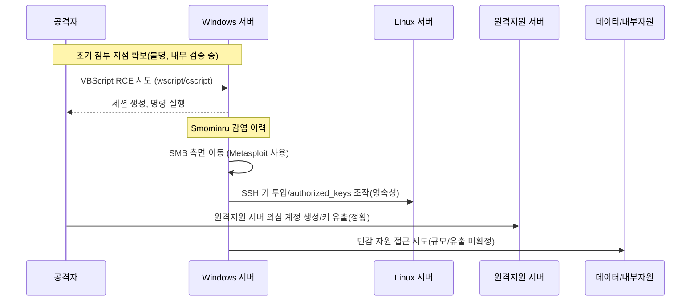

**요약 한 줄:** KT는 **2025년 9월 18일 23:57** 한국인터넷진흥원(KISA)에 **서버 침해 흔적 4건, 의심 정황 2건**을 신고했습니다. 공개된 항목에는 **Windows 서버 침투·SMB 측면 이동, VBScript 기반 RCE, ‘Smominru’ 봇 감염, Linux 계정·SSH 키 조작, 원격지원(알서포트) 서버 의심 계정 및 비밀키 유출** 등이 포함됩니다. 데이터 유출 여부는 아직 확정되지 않았습니다. ([한국경제][1])

> **핵심 질문:**  
> (1) 초기 침투는 어디서 시작됐고,  
> (2) 왜 EDR·관제에서 조기 탐지·차단하지 못했으며,  
> (3) 지금 당장 무엇을 바꿔야 하는가?  

<!--more-->

---

## 🕒 타임라인(확정 사실 위주)

* **9월 15일(월)**: 외부 보안업체 전수 점검 결과 보고서를 수령 → 내부 검증 착수. ([Daum][2])
* **9월 18일(목) 23:57**: KISA에 **침해 흔적 4건 + 의심 정황 2건** 신고. ([한국경제][1])
* **9월 19일(금)**: 정부·KISA 합동 브리핑—**어느 서버인지, 유출 여부**는 정밀 분석 필요 입장. ([Daum][3])
* **9월 21일(일)**: 추가 보도—**Windows·Linux·원격지원 서버까지 아우르는 침해 항목** 상세 공개. ([Daum][4])
* **9월 24일(수) 예정)**: 국회 과방위 **해킹 사태 청문회**(KT·롯데카드 등 증인 채택). ([Hani][5])

> *신고 지연 논란*: KT가 **15일 인지 → 18일 신고**로 “24시간 이내 신고” 의무 위반 논란이 제기됨(법 해석은 당국 판단 사안). ([Digital Times][6])

---

## 🧪 공개된 **침해 4건·의심 2건** 기술 분석 (MITRE ATT\&CK 매핑)

### 🔹 침해 흔적(Confirmed)

1. **Windows 서버 침투 후 측면 이동 시도**

* **MITRE**: *Lateral Movement* — **T1021.002 (SMB/Windows Admin Shares)**, **TA0008**
* **의미**: 초기 침투 지점 확보 후 Windows 도메인/서버로 **SMB 기반 이동** 시도 정황. **어드민 공유(C\$, ADMIN\$)** 접근, 세션 재사용, 로컬 관리자 계정 남용 가능성. ([Daum][4])

2. **‘Smominru’ 봇 감염**

* **MITRE**: *Resource Hijacking* — **T1496**, *Exploitation of Remote Services* — **T1210** *(일반적 전파 특성)*
* **의미**: **모네로 채굴**로 유명한 봇넷. 과거 **MS17-010(EternalBlue)** 악용 사례가 널리 보고됨. *KT 건에서 동일 취약점 악용이 확인된 것은 아님(미확정).* ([Daum][4])

3. **VBScript 기반 원격 코드 실행 및 민감정보 탈취**

* **MITRE**: *Execution* — **T1059.005 (Visual Basic)**, *Collection/Exfiltration* — **TA0009/TA0010**
* **의미**: **wscript/cscript** 실행, **AMSI 우회/스크립트 난독화** 가능. 이벤트 로그 4688/4104, Sysmon(1/7/11)로 흔적 추적 필요. *‘민감정보 탈취’는 정황 보고 수준—규모/대상은 미확정.* ([Daum][4])

4. **Metasploit 통한 SMB 인증 시도 및 측면 이동 성공**

* **MITRE**: *Lateral Movement* — **T1021.002**, *Credential Access* — **T1110/T1550** *(인증·재사용 추정)*
* **의미**: 툴·프레임워크 **아티팩트(UA, Pipe, Named Service 등)** 기반 식별 가능. EDR/넷플로우로 **동시간대 인증 실패→성공 전환** 패턴 확인 필요. ([Daum][4])

### 🔹 의심 정황(Suspected)

A) **Linux ‘sync’ 계정 조작 & `~/.ssh/authorized_keys` 생성**

* **MITRE**: *Persistence* — **T1098 (Account Manipulation)**, **T1098.004 (SSH Authorized Keys)**
* **의미**: **패스워드 없는 키 로그인** 기반 **영속성** 확보 시나리오. `PermitRootLogin no`, `PasswordAuthentication no` 등 점검 필수. ([Daum][2])

B) **원격지원(알서포트) 서버 의심 계정 생성 & 비밀키 유출**

* **MITRE**: *Valid Accounts* — **T1078**, *Exfiltration* — **TA0010**
* **의미**: **원격지원 게이트웨이** 장악 시 **전사 원격접속 경로**로 악용 가능. **서버 측 키/토큰 전면 교체·회수** 필요. *(벤더 취약성 단정 아님: 계정·키 관리 이슈일 수도 있음)* ([Daum][2])

> **데이터 유출 여부**: 정부·KISA는 **침해 서버·유출 확인에 추가 분석 필요** 입장. KT도 “어떤 정보가 유출됐는지 미확인”으로 선 그음. ([Daum][3])

---

## 🔍 **조기 탐지 실패** 가설 6가지 (운영 관점)

1. **EDR/MDR 가시성 단절**: Windows 스크립트 실행( **VBScript/wscript** ), **AMSI 경고**, **SMB 세션 이상**을 **SIEM 상관 규칙**으로 묶지 못함. ([Daum][4])
2. **계정·키 수명 주기 미흡**: **Linux `authorized_keys`** 변경, **원격지원 서버 계정·키** 생성 이벤트에 대한 **실시간 알림 부재**. ([Daum][2])
3. **내부 이동 탐지 미흡**: **SMB/WinRM/LDAP** 플레인 내부 트래픽에 대한 **동작기반(behavioral) 탐지** 부재. ([Daum][4])
4. **취약 자산 잔존**: Smominru 감염 이력은 **낙후 Windows 서버/서비스** 존재 가능성을 시사(일반론). *KT 건에서 구체 취약점은 미확정.* ([Daum][4])
5. **원격지원 경로 과신**: Jump/Remote 게이트웨이에서 **MFA·키 회전·세션 레코딩·IP 승인제**가 느슨했을 가능성. ([Daum][2])
6. **신고·대응 거버넌스 지연**: **24시간 내 신고** 규정이 논란이 될 만큼 **사고 인지→보고** 체계가 느슨. ([Digital Times][6])

---

## 🧭 공격 개념도 (정황 기반)

*(도식은 공개 정황을 바탕으로 한 개념도이며, 실제 네트워크 토폴로지와 다를 수 있습니다.)* ([Daum][4])

---

## 🛠 **즉시 이행** 체크리스트(우선순위)

**A. Windows 내부 이동 차단**

* **SMB Sign/Encrypt** 강제, **Admin Shares(C\$, ADMIN\$)** 접근 관리, **LAPS/Entra LAPS**로 로컬 관리자 랜덤화·주기 회전.
* **wscript/cscript 차단(앱제어)**, **AMSI 강제**, **PowerShell Constrained Language** 적용, **WDAC/SR**로 스크립트 실행 통제.
* **이상 인증(SMB/WinRM)** 탐지 룰: *동시간대 실패→성공 전환, 관리자 계정 교차로그인, 비업무시간 루트 이동 경보.*

**B. Linux 영속성 제거**

* `~/.ssh/authorized_keys` 전수 검증·**서명키 회수**, `PermitRootLogin no`, `PubkeyAuthentication yes` 최소화, **U2F/FIDO2** 우선.
* **`sync` 등 시스템 계정** 로그인 금지/쉘 제거, `PasswordAuthentication no`, `UsePAM yes` 정책 점검.

**C. 원격지원/게이트웨이**

* **모든 원격지원 서버의 계정·키 전면 교체**, **MFA 필수**, **허용 IP/디바이스 등록제**, **세션 레코딩·감사**.
* 관리자 콘솔 접근은 **Bastion(프록시형)** 뒤로 집약, **비정상 계정·키 생성 이벤트 실시간 알림**.

**D. 탐지·관측 강화**

* **스크립트 엔진 이벤트(4688, 4104, Sysmon 1/7/11)**, **SMB/WinRM 인증 텔레메트리**를 **세션 단위**로 상관 분석.
* **키/토큰/비밀정보** 조회·다운로드 이벤트에 **UEBA 규칙** 적용(시간·행위 기반 편차 경보).
* **전사 취약 자산 스냅샷**: EoL/미패치 Windows, 인터넷 노출 원격서비스(RDP/SSH/VNC) 즉시 차단·격리.

**E. 거버넌스·신고**

* 사고 인지 기준·증빙(타임스탬프·담당자) 표준화, **24시간 내 보고** SLA/런북 재정의, 프레스라인과 기술 라인 분리. ([Digital Times][6])

---

## ⚖️ 사실관계 주의(불확실/미확정)

* **초기 침투 기법·루트서버**: 정부·KISA 정밀 분석 대기. **유출 규모/범위**도 미확정. ([Daum][3])
* **Smominru 관련 취약점**: 일반적으로 EternalBlue 악용 보고가 많지만, **KT 건 동일 여부는 확인되지 않음**. 본 문서에서는 **가능성**만 언급. ([Daum][4])

---

## 🌟 PLURA‑XDR 관점 대응

* **스크립트형 실행·웹셸/봇 행위 실시간 차단**: VBScript/PowerShell/명령해석기 기반 행위 + 파일리스 지표를 상관 분석해 **차단/격리**. *(MITRE: T1059.005, T1505/T1546)*
* **내부 이동 탐지**: **SMB/WinRM/LDAP** 인증·세션 메트릭과 EDR 이벤트를 결합해 **동작 기반 Lateral Movement** 탐지. *(T1021, TA0008)*
* **키·계정 거버넌스**: **Authorized\_keys 변경·신규 계정·권한상승** 이벤트를 실시간 규칙으로 **튜닝 없이 식별**. *(T1098, T1078)*
* **대응 오케스트레이션**: IOC 감지 시 **계정 잠금·키 회수·네트워크 분리·원격지원 게이트웨이 세션 종료** 자동화.

---

## 📑 참고·교차검증 출처

* **KT, 9/18 23:57 KISA 신고(침해 4·의심 2)** — 한국경제, 동아일보. ([한국경제][1])
* **기술 항목 상세(Windows/Smominru/VBScript/Metasploit, Linux·원격지원 정황)** — 디지털타임스(다음 포털). ([Daum][4])
* **동일 내용의 원문(디지털타임스)** — dt.co.kr. ([Digital Times][7])
* **KISA: 침해 서버·유출 ‘추가 분석 필요’** — 다음 뉴스(연합/경향 보도 라인). ([Daum][3])
* **신고 지연(인지 9/15→신고 9/18) 논란·24시간 규정 언급** — 디지털타임스. ([Digital Times][6])
* **국회 과방위 청문회(9/24) 증인 채택** — 한겨레·연합뉴스TV. ([Hani][5])

---

### 마지막으로

이번 건은 \*\*웹(WAF) 중심의 ‘요청(Request) 관점’\*\*만으로는 **서버 내부 이동·계정·키 조작·원격지원 경로 악용**을 막기 어렵다는 사실을 재확인시켰습니다. **실행(Execution)·인증(Authentication)·키(Key)·세션(Session)·이동(Movement)** 5축을 한 화면에 올려 **상관·차단 자동화**를 설계하는 것이 재발 방지의 출발점입니다.

[1]: https://www.hankyung.com/article/2025091960441?utm_source=chatgpt.com "소액결제 뚫린 KT, 서버도 해킹 당했다"
[2]: https://v.daum.net/v/20250919155155660?utm_source=chatgpt.com "KT, 서버 침해 3일 뒤 신고…“내부 검증 거치느라 시간 걸려”"
[3]: https://v.daum.net/v/20250919173115119?utm_source=chatgpt.com "KT 서버 해킹·소액결제 어떤 관련 있나…“100% 무관 단정 못 ..."
[4]: https://v.daum.net/v/20250921161646480 "[기획] 소액결제는 빙산의 일각, 서버도 뚫려… KT 해킹 ‘끝이없다’"
[5]: https://www.hani.co.kr/arti/politics/assembly/1219669.html?utm_source=chatgpt.com "국회 과방위, 24일 KT·롯데카드 해킹사태 청문회"
[6]: https://www.dt.co.kr/article/12018938?utm_source=chatgpt.com "KT '늑장 신고' 논란…서버 침해 알고도 3일 후 당국에 보고"
[7]: https://www.dt.co.kr/article/12019146?utm_source=chatgpt.com "[기획] 소액결제는 빙산의 일각, 서버도 뚫려… KT 해킹 '끝이없다'"
