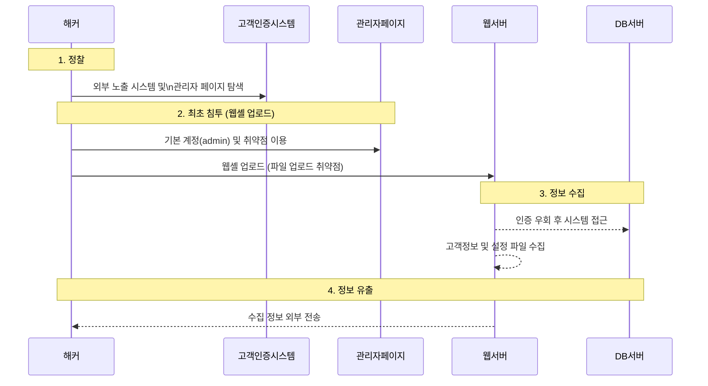

LG유플러스 고객인증 시스템이 외부에 노출되어 공격자에게 **취약한 관리자 페이지**가 식별되었습니다.  
공격자는 기본 계정과 파일 업로드 취약점을 악용해 **웹셸**(WebShell)을 설치하였고, 이를 통해 **약 29만 7천여 명**의 고객 정보가 유출되었습니다.  
유출 시점은 **DB 갱신일인 2018년 6월 15일 전후**로 추정됩니다.

<!--more-->
---

### 1. **정찰 (Reconnaissance)**
#### 🔍 **취약점 파악 및 관리자 페이지 식별**
- **외부 노출된 고객인증 시스템**을 대상으로 스캐닝을 수행.
- 기본 계정명·비밀번호가 설정된 **취약한 관리자 페이지**를 확인.

---

### 2. **최초 침투 (웹셸 업로드)**
#### 🚨 **파일 업로드 취약점 악용**
- 관리자 페이지에 **기본 설정 계정(admin)**을 사용하여 로그인.
- **파일 업로드 기능**을 통해 악성 스크립트(웹셸) 업로드에 성공.

---

### 3. **정보 수집**
#### 🗄️ **시스템 접근 및 데이터 확보**
- 업로드된 웹셸을 통해 **인증을 우회**하고 내부 리소스에 접근.
- **고객 정보, DB 설정 파일, 시스템 설정 정보** 등을 획득.

---

### 4. **정보 유출**
#### 📤 **DB 직접 조회 및 파일 전송**
- 웹셸로 **DB에서 직접 쿼리**를 실행해 고객 정보를 추출하거나,  
- **서버 내 저장된 파일**을 외부로 전송하여 유출을 시도.

