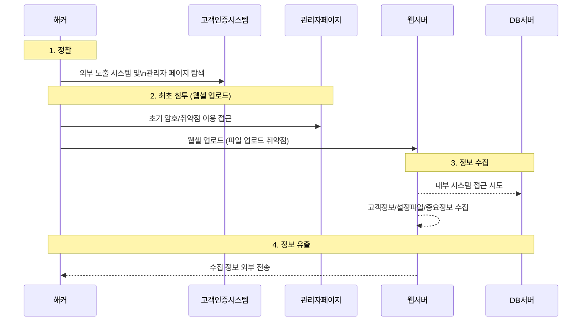

### 🔍 LG유플러스 고객인증 시스템 유출 시나리오 요약

#### 1. 정찰 (Reconnaissance)

* 공격자는 **외부에서 접근 가능한 고객인증 시스템**과
  **취약한 관리자 페이지** 존재 여부를 탐지.

#### 2. 최초 침투 (웹셸 업로드)

* **초기암호 미변경 등 설정 미비**를 악용해 관리자 페이지에 접근.
* **파일 업로드 취약점**을 이용해 \*\*웹셸(WebShell)\*\*을 서버에 설치.

#### 3. 정보 수집

* 웹셸을 통해 인증체계 우회 후 내부 시스템 접근.
* **고객 정보, DB 설정 파일, 중요 시스템 정보** 등을 수집.

#### 4. 정보 유출

* 웹셸을 이용해 **DB에서 직접 정보 추출**하거나
  **서버 내 저장된 고객정보 파일**을 외부로 유출.

---

📎 출처: 과학기술정보통신부 / The JoongAng

참고 자료
https://www.joongang.co.kr/article/25158501
