### 🔍 LG유플러스 고객인증 시스템 유출 시나리오 요약

#### 1. 정찰 (Reconnaissance)

* 공격자는 **외부에서 접근 가능한 고객인증 시스템**과
  **취약한 관리자 페이지** 존재 여부를 탐지.

#### 2. 최초 침투 (웹셸 업로드)

* **초기암호 미변경 등 설정 미비**를 악용해 관리자 페이지에 접근.
* **파일 업로드 취약점**을 이용해 \*\*웹셸(WebShell)\*\*을 서버에 설치.

#### 3. 정보 수집

* 웹셸을 통해 인증체계 우회 후 내부 시스템 접근.
* **고객 정보, DB 설정 파일, 중요 시스템 정보** 등을 수집.

#### 4. 정보 유출

* 웹셸을 이용해 **DB에서 직접 정보 추출**하거나
  **서버 내 저장된 고객정보 파일**을 외부로 유출.

```mermaid
sequenceDiagram
    participant 해커
    participant 고객인증시스템
    participant 관리자페이지
    participant 웹서버
    participant DB서버

    Note over 해커: 1. 정찰
    해커->>고객인증시스템: 외부 노출 시스템 및\n관리자 페이지 탐색

    Note over 해커, 관리자페이지: 2. 최초 침투 (웹셸 업로드)
    해커->>관리자페이지: 초기 암호/취약점 이용 접근
    해커->>웹서버: 웹셸 업로드 (파일 업로드 취약점)

    Note over 웹서버, DB서버: 3. 정보 수집
    웹서버-->>DB서버: 내부 시스템 접근 시도
    웹서버-->>웹서버: 고객정보/설정파일/중요정보 수집

    Note over 해커, DB서버: 4. 정보 유출
    웹서버-->>해커: 수집 정보 외부 전송
```

---

📎 출처: 과학기술정보통신부 / The JoongAng

