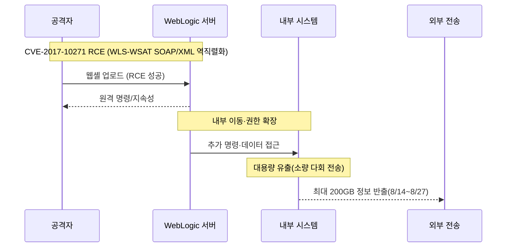

2025년 **8월 14일 19:21** 첫 침해가 시작되어 15일까지 활동이 이어졌고, 조사 과정에서 **웹셸(WebShell) 설치가 확인**되었습니다. 이후 금융당국 합동조사 결과 **총 유출량은 초기 보고(1.7GB)를 크게 상회하는 최대 200GB**로 정정되었으며, **297만 명 규모의 고객 정보 포함**이 공식화되었습니다. ([금융위원회][1])

> **핵심:** 공격자는 2017년에 공개·패치된 **Oracle WebLogic 취약점**(CVE-2017-10271)을 악용해 **웹셸을 설치**하고 장기간 내부에서 활동했습니다. 롯데카드는 **8월 26일**에야 악성코드 감염을 인지했고, **9월 1일** 금융당국에 신고했습니다. ([다음][2])

<!--more-->

---

### 1) 초기 침투 (Initial Access)

#### 🔓 WebLogic RCE(CVE-2017-10271) 악용 *(MITRE: T1190)*

* 취약한 **WLS-WSAT SOAP/XML 역직렬화** 경로를 통해 **원격 코드 실행(RCE)** 및 **웹셸 업로드**가 이뤄졌습니다. 패치는 **2017년 10월 Oracle CPU**에서 제공됐으나, 해당 업데이트가 누락된 상태였습니다. ([다음][2])

---

### 2) 내부 장악·지속성 (Persistence & Lateral Movement)

#### 🚨 웹셸 기반 권한 유지·확장 *(MITRE: T1505.003, TA0003/TA0005)*

* 웹셸 설치 후 **지속성 확보**와 내부 탐색·확장이 진행되었습니다. 실시간 감시 미흡으로 **2주 이상 인지 실패**가 보도되었습니다. ([다음][2])

---

### 3) 데이터 유출 (Exfiltration)

#### 📂 최대 **200GB** 유출, **297만 명** 정보 포함

* 당초 **1.7GB**로 신고됐으나, 합동조사에서 **8.14\~8.27 기간 중 총 200GB** 유출로 확인. 개인정보 포함 규모는 **297만 명**으로 집계되었습니다. 일부 고객군(약 28만 명)은 결제정보 관련 추가 조치 대상입니다. ([금융위원회][1])

> 롯데카드는 유출 방식에 대해 “**짧고 작은 전송을 반복해 야금야금 빼갔다**”고 설명했습니다. 대용량 단일 전송이 아닌 **소량 다회 전송** 패턴이었음을 시사합니다. ([경향신문][3])

---

### 4) 인지·보고 및 후속 조치

* **8월 26일** 악성코드(웹셸) 감염 최초 인지 → **8월 31일** 유출 정황 파악 → **9월 1일** 금융당국 신고. ([다음][2])
* 금융위원회/금감원은 **현장검사**와 함께 소비자 보호 대책(전용 센터, 재발급, 전액 보상 등)을 지시·점검했습니다. ([금융위원회][1])

---

### 5) 공격 개념도

---

## 🔎 왜 **WAF**가 막지 못했나 — 핵심 요약

**WAF가 “CVE-2017-10271 (WLS-WSAT SOAP/XML 역직렬화)”를 막지 못하는 흔한 이유**는  

(1) **본문(POST body) 심층 검사 미적용/제한**,   
(2) **SOAP/XML 파싱·정규화 부재**,  
(3) **시그니처 미탑재/비활성**,  
(4) **TLS 종단 위치/우회 경로 문제**,  
(5) **운영상 화이트리스트·예외**,  
(6) **WAS 미패치**가 겹치기 때문입니다.  

이 취약점은 `WLS-WSAT`의 **`CoordinatorPortType`** 등 엔드포인트에서 **`java.beans.XMLDecoder` 기반 역직렬화**가 트리거되며, **URL/헤더 룰만으로는 놓치기 쉬운** 유형입니다. ([금융위원회][1])

### ❓ 왜 200GB 대용량 유출을 몰랐을까 — “응답 본문/사이즈” 관점

많은 조직이 **요청(Request) 중심** 모니터링(WAF, API-GW, LB)만 단독 운영합니다. 그 결과 **응답(Response) 본문/사이즈/엔트로피/패턴**에 대한 **DLP형 관측**이 비어 있어 **소량 다회 전송**을 놓치기 쉽습니다.

* **응답 본문 미분석**: 민감 데이터(주민등록번호, CI, CVC 등) **키워드/정규식/엔트로피** 탐지가 없으면 유출을 눈치채기 어렵습니다.
* **응답 사이즈/레이트 미계측**: **세션·URI·사용자 단위**의 **응답 바이트 누적, 분당 전송량, 장기 이동평균 편차** 같은 지표가 없으면 **“작게, 자주”** 전략을 탐지하기 어렵습니다.
* **출구(Egress) 결합 부족**: **프록시/방화벽/DNS**와 **웹 응답 메트릭**을 **상호상관**하지 않으면 이상 전송의 “그림”이 보이지 않습니다.
* **TLS 내부 종단**: WAF 앞에서 TLS가 종단되지 않으면 응답 내용이 **가시화되지 않음**(복호화 위치 설계 이슈).

> PLURA는 응답 본문(DLP)·응답 사이즈(행동지표)를 함께 보는 방식을 권장합니다.  
> 👉 [웹을 통한 데이터유출 해킹 대응 개론](https://blog.plura.io/ko/column/dlp/)

---

## ❗ 왜 매번 반복될까 — 구조적 원인 5가지

1. **패치 거버넌스 실패**: EoL/레거시 WAS가 잔존하고, CPU 적용이 **업무 리스크**를 핑계로 지연. ([다음][2])
2. **WAF 신뢰 과잉**: **정규화/파싱/본문검사** 없이 “기본 룰”에 의존, **모니터링 모드** 장기 유지.
3. **아키텍처 단절**: TLS 종단·LB·iPlanet/OHS 배치로 **가시성 단절**, 일부 **직결 경로**로 WAF 우회.
4. **관측 지표 부족**: **응답 본문/사이즈·세션 누적 바이트** 등 **출구형 DLP 지표** 미정의.
5. **관제 연계 미흡**: 탐지 신호가 **SIEM/알림**으로 연결되지 않아 **초동 대응 실패**.

---

## 🛠 10271 특화 “차단 강화” 빠른 대책 (우선순위)

1. **엔드포인트 자체 차단/내부화** — **`/wls-wsat/*` 전면 차단**(특히 `CoordinatorPortType`, `RegistrationPortType`), 가능하면 내부 전용.
2. **패치·버전 확인** — **2017-10 CPU 이상** 적용(10.3.6 / 12.1.3 / 12.2.1.x 등 영향). **패치가 정답**.
3. **WAF 본문 검사 풀옵션** — Request Body Inspection **활성**, 검사 바이트 한도 **상향(≥8–16MB)**, **gzip/deflate·chunked 해제 검사**, `Content-Type: text/xml, application/soap+xml` **강제 파싱**.
4. **커스텀 룰(가상패치)** — 정규화 후 **핵심 패턴 탐지**: `java.beans.XMLDecoder`, `WorkContextXmlInputAdapter`, 비정상 SOAP Action/네임스페이스 조합.
5. **화이트리스트는 양의 보안 모델** — **정상 스키마/메서드**만 허용, 그 외 거부.
6. **TLS 종단을 WAF로 이동** — 복호화 후 검사, LB/iPlanet/OHS는 **WAF 뒤**에 배치.
7. **탐지 전용 → 차단 모드** — 튜닝 후 **Blocking** 전환, **오탐 핸들링 절차** 수립.
8. **모니터링 지표 추가** — **응답 본문 DLP 룰**, **세션/사용자별 응답 누적 바이트**, **분당 전송량 스파이크**, **장기 평균 대비 편차**, **`/wls-wsat/*` 접근 카운트** 등.

---

## 🌟 PLURA-XDR의 보안 대응 방안

* **웹셸 업로드/실행 실시간 탐지·자동 차단** — 공개 웹서비스 취약점 악용·웹셸 업로드/명령 실행을 포착하면 WAF/EDR 연동으로 즉시 차단·격리 *(MITRE: T1190, T1505.003)*
* **권한 상승·비업무시간/이상 로그인·내부 이동 정밀 분석** — 관리자 탈취 징후를 조기 탐지하고 계정·세션·호스트를 자동 방어 *(MITRE: TA0004/TA0005/TA0008, 예: T1055, T1021)*
* **응답 본문(DLP)·응답 사이즈 기반 유출 조기 탐지** — 개인정보 키워드/엔트로피·파일 지표와 **세션 누적 바이트/레이트 편차**를 결합, **소량 다회 전송**도 조기 적발
* **랜섬웨어 조기 탐지·자동 차단으로 피해 최소화** — 대량 암호화/복구 방해 행위를 식별해 프로세스 종료·격리·확산 차단·증거 보존까지 일괄 처리 *(MITRE: T1486, T1490)*

👉 **참고:** PLURA DLP 접근법 — [https://blog.plura.io/ko/column/dlp/](https://blog.plura.io/ko/column/dlp/)

---

### 📑 참고 자료(최신)

* **금융위원회 브리핑:** “8.14\~8.27 총 200GB 유출, 웹셸 설치 확인” (보도자료/파일) ([금융위원회][1])
* **경향신문:** “297만 명·200GB 확인, 28만 명 고위험” / “소량 다회 전송 설명” ([경향신문][4])
* **동아일보·디지털데일리 등:** “초기 신고의 100배” “웹셸 설치” 후속 보도 ([동아일보][5])

---

필요하시면 위 **응답 본문/사이즈 모니터링 지표**를 **대시보드·알람 조건**으로 바로 쓸 수 있게 **체크리스트 1장/커스텀 룰 스니펫**으로도 정리해 드릴게요.

[1]: https://www.fsc.go.kr/no010101/85319?utm_source=chatgpt.com "롯데카드 정보유출 관련 긴급 대책회의 개최"
[2]: https://v.daum.net/v/20250918190600587?utm_source=chatgpt.com "뚫렸는데도 모르고, 얼마나 털렸는지도 깜깜…롯데카드 해킹 ..."
[3]: https://www.khan.co.kr/article/202509181845001?utm_source=chatgpt.com "보안투자 늘렸다더니 해킹 인지조차 못한 롯데카드…“피해액 ..."
[4]: https://www.khan.co.kr/article/202509182221005?utm_source=chatgpt.com "롯데카드 297만명 정보 털렸다"
[5]: https://www.donga.com/news/Economy/article/all/20250918/132411983/2?utm_source=chatgpt.com "[단독]롯데카드 해킹 데이터, 첫 신고의 100배 유출"
