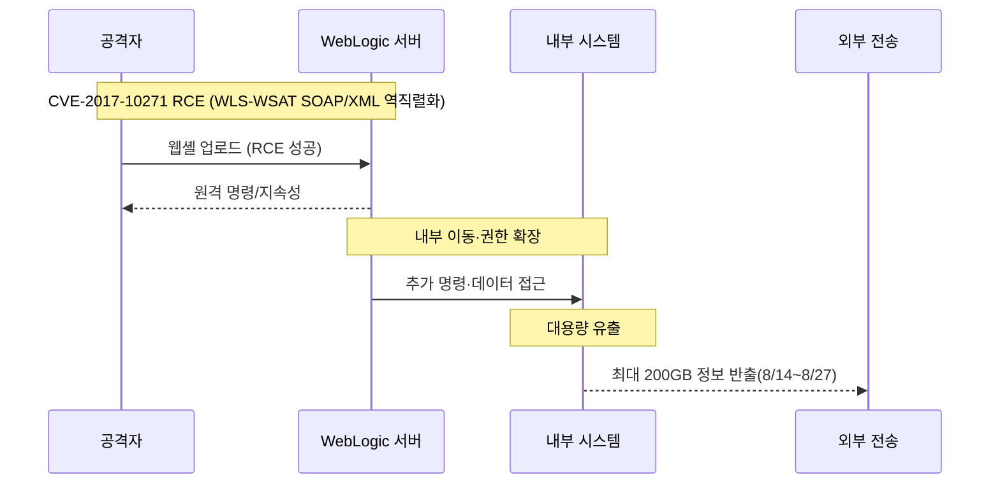

2025년 **8월 14일 19:21** 첫 침해가 시작되어 15일까지 활동이 이어졌고, 조사 과정에서 **웹셸(WebShell) 설치가 확인**되었습니다. 이후 금융당국 합동조사 결과 **총 유출량은 초기 보고(1.7GB)를 크게 상회하는 최대 200GB**로 정정되었으며, **297만 명 규모의 고객 정보 포함**이 공식화되었습니다. ([다음][1])

> **핵심:** 공격자는 2017년에 공개·패치된 **Oracle WebLogic 취약점**(CVE-2017-10271)을 악용해 **웹셸을 설치**하고 장기간 내부에서 활동했습니다. 롯데카드는 **8월 26일**에야 악성코드 감염을 인지했고, **9월 1일** 금융당국에 신고했습니다. ([경향신문][2])

<!--more-->

---

### 1) 초기 침투 (Initial Access)

#### 🔓 WebLogic RCE(CVE-2017-10271) 악용 *(MITRE: T1190)*

* 취약한 **WLS-WSAT SOAP/XML 역직렬화** 경로를 통해 **원격 코드 실행(RCE)** 및 **웹셸 업로드**가 이뤄졌습니다. 패치는 **2017년 10월 Oracle CPU**에서 제공됐으나, 해당 업데이트가 누락된 상태였습니다. ([경향신문][2])

---

### 2) 내부 장악·지속성 (Persistence & Lateral Movement)

#### 🚨 웹셸 기반 권한 유지·확장 *(MITRE: T1505.003, TA0003/TA0005)*

* 웹셸 설치 후 **지속성 확보**와 내부 탐색·확장이 진행되었습니다. 실시간 감시 미흡으로 **2주 이상 인지 실패**가 보도되었습니다. ([다음][1])

---

### 3) 데이터 유출(Exfiltration)

#### 📂 최대 **200GB** 유출, **297만 명** 정보 포함

* 당초 **1.7GB**로 신고됐으나, 합동조사에서 **8.14\~8.27 기간 중 총 200GB** 유출로 확인. 개인정보 포함 규모는 **297만 명**으로 집계되었습니다. 일부 고객군(약 28만 명)은 결제 정보 관련 추가 조치가 진행되었습니다. ([금융위원회][3])

---

### 4) 인지·보고 및 후속 조치

* **8월 26일** 악성코드(웹셸) 감염 최초 인지 → **8월 31일** 유출 정황 파악 → **9월 1일** 금융당국 신고. ([경향신문][2])
* 금융위원회/금감원은 **현장검사**와 함께 소비자 보호 대책(전용 센터, 재발급, 전액 보상 등)을 지시·점검했습니다. ([금융위원회][3])

---

### 5) 공격 개념도

---

## 🔎 왜 **WAF**가 막지 못했나 — 핵심 요약

**WAF가 “CVE-2017-10271 (WLS-WSAT SOAP/XML 역직렬화)”를 막지 못하는 흔한 이유**는  

(1) **본문(POST body) 심층 검사 미적용/제한**,   
(2) **SOAP/XML 파싱·정규화 부재**,   
(3) **시그니처 미탑재/비활성**,  
(4) **TLS 종단 위치/우회 경로 문제**,  
(5) **운영상 화이트리스트·예외**,  
(6) **WAS 미패치**가 겹치기 때문입니다.  

이 취약점은 `WLS-WSAT`의 **`CoordinatorPortType`** 등 엔드포인트에서 **`java.beans.XMLDecoder` 기반 역직렬화**가 트리거되며, **URL/헤더 룰만으로는 놓치기 쉬운** 유형입니다. ([금융위원회][3])

### ❓ 왜 못 막았을까 — 원인 체크리스트

1. **본문 검사 미흡**

   * 일부 WAF는 **URI/헤더 중심 기본 룰**이며, **POST 본문 전체**를 보지 않거나 **검사 바이트 한도**(수십 KB 제한)로 **SOAP XML 전체**를 읽지 못함. **gzip/deflate, chunked** 미해제 시 페이로드 누락. ([Zikida][4])
2. **SOAP/XML 파싱 부재·오탐 우려로 비활성**

   * 10271은 **XML 역직렬화**가 핵심 → **정규화(canonicalization)**, **엔티티/CDATA/주석 난독화 해제**를 해야 패턴이 보임. 탐지 전용(Detect-only) 운용 시 우회 쉬움. ([Zikida][4])
3. **시그니처/가상패치 부재**

   * 일부 제품/시점에는 내장 시그니처 미제공 또는 **커스텀 룰 필요**. (예: NetScaler 가이드) 이를 미반영 시 통과. ([동아일보][5])
4. **TLS 종단/우회**

   * **TLS가 WAF 뒤에서 종단**(iPlanet/OHS/LB)되면 WAF는 암호화 트래픽을 못 봄. **직접 내부 경로(직결 IP, VPN, 관리망)** 존재 시 WAF 우회.
5. **운영상 예외/화이트리스트**

   * “업무상 필요” 명목으로 **`/wls-wsat/*`** 등 SOAP 엔드포인트 예외 허용 → 룰 무력화.
6. **WAS 패치 미적용**

   * **2017-10 Oracle CPU** 미적용 시 **난독·이중 인코딩** 등 변형 페이로드가 **서버 측에서 그대로 RCE**로 이어짐.

> **요약:** \*\*“WAF 경유 보장 + 차단 모드 + 본문 파싱·정규화 + 최신 룰”\*\*이 충족됐다면 공개 PoC 수준은 차단 가능성이 높습니다. 본 건은 **패치 거버넌스**와 **WAF 운영 관리(인재) 부실**이 결합했을 개연성이 큽니다. ([다음][1])

---

## 🛠 10271 특화 “차단 강화” 빠른 대책 (우선순위)

1. **엔드포인트 자체 차단/내부화** — **`/wls-wsat/*` 전면 차단**(특히 `CoordinatorPortType`, `RegistrationPortType`), 가능하면 내부망 전용으로 격리.
2. **패치·버전 확인** — **2017-10 CPU 이상** 적용(10.3.6 / 12.1.3 / 12.2.1.x 등 영향). **패치가 정답**.
3. **WAF 본문 검사 풀옵션** — Request Body Inspection **활성**, 검사 바이트 한도 **상향(≥8–16MB)**, **gzip/deflate·chunked 해제 검사**, `Content-Type: text/xml, application/soap+xml` **강제 파싱**. ([Zikida][4])
4. **커스텀 룰(가상패치)** — 정규화 후 **핵심 패턴 탐지**: `java.beans.XMLDecoder`, `WorkContextXmlInputAdapter`, 비정상 SOAP Action/NS 조합 등. (벤더 제공 시그니처를 자사 문법으로 이식) ([동아일보][5])
5. \*\*화이트리스트는 “양의 보안 모델(허용 목록)”\*\*로 재정의 — **정상 스키마/메서드**만 허용, 나머지 거부.
6. **TLS 종단을 WAF로 이동** — 복호화 후 검사, LB/iPlanet/OHS는 **WAF 뒤**에 배치.
7. **탐지 전용 → 차단 모드 전환** — 튜닝 기간 후 **Blocking**으로 전환, **오탐 처리 절차** 마련.
8. **모니터링 지표** — **`/wls-wsat/*` 접근, SOAP XML 이상 패턴, 4xx/5xx 스파이크** 별도 대시보드/알림.

---

## 📎 덧붙여(정황·근거)

* 10271은 **WLS-WSAT의 불안전한 XML 역직렬화**가 근원. PoC/모듈이 공개되어 변형 우회도 다수. **WAF만 믿고 미패치**였다면 위험.
* 금융위 공식 브리핑 문서에 **웹셸 설치 및 200GB 유출**이 명시되어 있습니다. ([금융위원회][3])

---

## 🌟 PLURA-XDR의 보안 대응 방안

* **웹셸 업로드/실행 실시간 탐지·자동 차단** — 공개 웹서비스 취약점 악용·웹셸 업로드/명령 실행을 포착하면 WAF/EDR 연동으로 즉시 차단·격리 *(MITRE: T1190, T1505.003)*
* **권한 상승·비업무시간/이상 로그인·내부 이동 정밀 분석** — 관리자 탈취 징후를 조기 탐지하고 계정·세션·호스트를 자동 방어 *(MITRE: TA0004/TA0005/TA0008, 예: T1055, T1021)*
* **랜섬웨어 조기 탐지·자동 차단으로 피해 최소화** — 대량 암호화/복구 방해 행위를 식별해 프로세스 종료·격리·확산 차단·증거 보존까지 일괄 처리 *(MITRE: T1486, T1490)*

👉 [PLURA-XDR 침해사고 대응 서비스 자세히 보기](https://www.plura.io/underattack)

---

### 📑 참고 자료(최신)

* **금융위원회 공식 브리핑:** “8.14\~8.27 총 200GB 유출, 웹쉘 설치 확인” ([금융위원회][3])
* **KBS/다음뉴스:** “2017년 버전 악성코드에 뚫렸다…웹셸 설치·장기간 인지 실패” ([다음][1])
* **경향신문:** “297만 명 정보 유출, 초기 1.7GB→200GB로 정정” ([경향신문][6])
* **동아일보:** “첫 신고의 **100배** 유출” ([동아일보][5])
* **데일리시큐:** “297만 명·200GB 공식 확인” ([데일리시큐][7])

---

[1]: https://v.daum.net/v/20250918213439718 "2017년 버전 악성코드에 뚫렸다…“보안 허술 선 넘어”"
[2]: https://www.khan.co.kr/article/202509181845001?utm_source=chatgpt.com "보안투자 늘렸다더니 해킹 인지조차 못한 롯데카드…“피해액 ..."
[3]: https://www.fsc.go.kr/no010101/85319?curPage=&srchBeginDt=&srchCtgry=&srchEndDt=&srchKey=&srchText=&utm_source=chatgpt.com "롯데카드 정보유출 관련 긴급 대책회의 개최"
[4]: https://www.zikida.com/news/286?utm_source=chatgpt.com "이 대통령 “보안사고 반복 기업에 징벌적 과징금 등 강력 대처 ..."
[5]: https://www.donga.com/news/Economy/article/all/20250918/132411983/2?utm_source=chatgpt.com "[단독]롯데카드 해킹 데이터, 첫 신고의 100배 유출"
[6]: https://www.khan.co.kr/article/202509182221005?utm_source=chatgpt.com "롯데카드 297만명 정보 털렸다"
[7]: https://www.dailysecu.com/news/articleView.html?idxno=200591&utm_source=chatgpt.com "롯데카드 297만 명 정보유출…평문 카드정보까지 유출"
