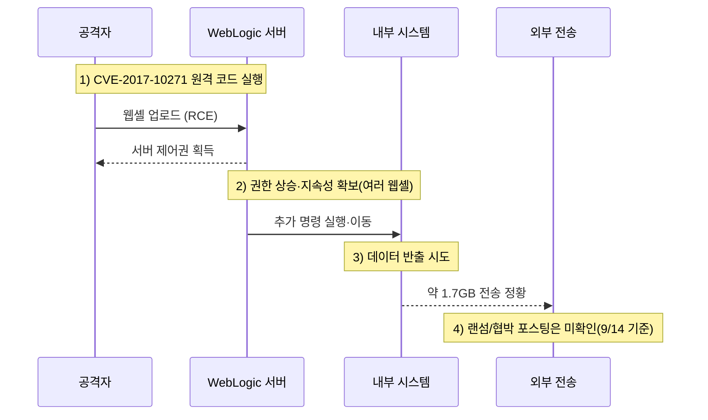

---

title: "롯데카드 해킹 사고 분석 – 오래된 취약점 방치와 유출 시도, 다크웹 정황 점검"
date: 2025-09-14
draft: false
description: "2025년 8월 롯데카드 온라인 결제 서버 해킹 사건을 타임라인과 기술적 세부, 다크웹 유출 여부, 금융당국 후속 조치까지 종합 정리합니다."
featured_image: "cdn/threats/case-lottecard\_weblogic.png"
tags: ["롯데카드", "해킹", "데이터 유출", "웹셸", "Oracle WebLogic", "CVE-2017-10271", "금융보안", "침해사고"]
---

2025년 **8월 14일 19:21** 최초 침해가 발생했고, 8월 15일까지 활동이 이어지며 **내부 파일 유출(약 1.7GB)** 정황이 확인되었습니다. 8월 16일 추가 시도는 있었으나 추가 유출은 없던 것으로 전해졌습니다. **8월 26일** 서버 점검 중 악성코드를 발견했고, **8월 31일 정오** 온라인 결제 서버에서 외부 유출 시도가 공식 확인, **9월 1일** 금융감독원에 보고되었습니다. 금융당국은 현장검사와 소비자 보호 조치를 즉시 지시했습니다. ([KBS World][1])

> **핵심:** 공격자는 2017년에 공개·패치된 Oracle WebLogic 취약점(CVE-2017-10271)을 악용해 웹셸(WebShell)을 심고 내부 서버 권한을 획득했습니다. 조사 과정에서 **3개 서버**에서 **2종의 악성코드와 5종의 웹셸**이 발견되어 제거되었습니다. ([보안뉴스][2])

<!--more-->

---

### 1. **초기 침투 (Initial Access)**

#### 🔓 **오래된 WebLogic 취약점(CVE-2017-10271) 악용**

* 공격자는 WebLogic의 **RCE 취약점**을 통해 원격 명령을 실행하고 웹셸을 업로드, 서버 제어권을 확보했습니다. 해당 취약점은 **2017년 10월 공개 및 패치**가 제공되었으나, 미적용으로 인해 낮은 난이도의 침투가 가능했습니다. ([보안뉴스][2])

---

### 2. **내부 이동 및 장악 (Lateral Movement)**

#### 🚨 **웹셸 기반 권한 유지·확장**

* 정밀 점검에서 **3개 서버**에 **2종 악성코드 + 5종 웹셸**이 확인되었으며, 이는 다중 백도어를 통한 **지속성(Persistence)** 확보 시도로 해석됩니다. ([전자부품 전문 미디어 디일렉][3])

---

### 3. **데이터 유출 시도 (Exfiltration Attempt)**

#### 📂 **약 1.7GB 전송 정황·핵심 개인정보 유출은 ‘미확인’**

* **1.7GB 규모**의 데이터 반출 정황이 확인되었고, 당국은 **온라인 거래 요청 정보** 등 민감 데이터 포함 가능성을 조사 중입니다. 다만 **고객의 핵심 개인정보 직접 유출은 현재까지 확인되지 않았다**는 입장이 유지되고 있습니다. ([KBS World][1])

---

### 4. **사고 인지 및 금융당국·회사 후속 조치**

* **9월 1일** 보고 접수 → **9월 2일** 금감원 **현장검사**. 금감원은 **전용 콜센터 운영**, **이상 거래 모니터링 강화**, **부정사용 전액 보상 절차 마련**, **카드 해지·재발급 안내 고지** 등을 지시했습니다. ([Korea Joongang Daily][4])
* **9월 3일** 롯데카드는 **24시간 상담 ARS** 신설·운영, 앱/웹에 **비밀번호 변경·해외거래 차단·재발급 링크**를 제공하는 등 고객 보호 조치를 발표했습니다. ([TV조선][5])
* **9월 4일** 대표이사 **대국민 사과** 및 **피해 시 전액 보상 약속**. ([Businesskorea][6])
* 회사 홈페이지에는 **개인정보 유출 가능성 안내**와 **사칭 스미싱 주의** 공지가 올라와 있습니다. ([롯데카드][7])

---

### 5. **다크웹 유출 정황 (2025-09-14 KST 기준)**

* **주요 다크웹 유출 사이트/랜섬웨어 유출 블로그에 ‘롯데카드’ 명의의 검증된 게시물은 확인되지 않았습니다.** 또한 롯데카드 측은 “최근 사례와 같은 **다크웹 해커 집단의 소행은 아닌 것으로 보인다**”는 입장을 밝힌 바 있습니다. (지속 모니터링 권고) ([서울경제][8])
* 다만, **사칭 스미싱** 등 2차 피해 시도는 발생할 수 있어, 회사 공지에 따라 **비밀번호 변경·해외거래 차단·재발급** 등 선제 조치를 권합니다. ([롯데카드][7])

---

### 6. **공격 개념도**

---

### 🛡️ 보안 시사점

| 점검 항목           | 설명                                                                              |
| --------------- | ------------------------------------------------------------------------------- |
| **패치 거버넌스**     | 수년 전 공개 취약점 악용 → **WAS/미들웨어 정기 패치·EoL 관리·취약점 SLAs** 필수. ([보안뉴스][2])             |
| **웹셸 탐지/제거**    | **파일 무결성·명령 패턴·비정상 프로세스** 탐지와 **다중 웹셸 일괄 제거 절차** 필요. ([전자부품 전문 미디어 디일렉][3])     |
| **Egress 모니터링** | **대용량 전송/비정상 외부 목적지** 탐지, **프록시·FW DLP 룰**로 반출 차단. (유출 1.7GB 정황) ([경향신문][9])    |
| **사고 커뮤니케이션**   | **현장검사 대응, 전용 콜센터, 전액 보상 프로세스** 등 고객 불안을 낮추는 즉시 조치. ([Korea Joongang Daily][4]) |
| **사칭 스미싱 대응**   | 공식 채널 고지 + **앱/웹 원클릭 보호 메뉴** 제공으로 2차 피해 예방. ([TV조선][5])                         |

---

### 📑 참고 자료

* KBS WORLD: **“2주 넘게 몰랐다…8/14\~15 유출, 8/16 재시도”** ([KBS World][1])
* Korea JoongAng Daily: **현장검사·전액 보상 절차 지시 / 악성코드·유출 시도 브리핑** ([Korea Joongang Daily][4])
* 보안뉴스: **WebLogic CVE-2017-10271 악용 보도** ([보안뉴스][2])
* The Elec: **3개 서버 2종 악성코드·5종 웹셸 확인** ([전자부품 전문 미디어 디일렉][3])
* 서울경제: **“다크웹 해커 집단 소행은 아닌 듯”** ([서울경제][8])
* 롯데카드 공지: **스미싱 주의 / 개인정보 유출 가능성 안내** ([롯데카드][7])

---

### 🌟 PLURA-XDR의 보안 대응 방안

* **패치 누락·EoL 자산 자동 식별** 및 **취약점 우선순위화 알림**
* **웹셸/권한상승/외부 전송 이상행위 실시간 탐지·자동 차단**, **증거 보존·리포트 자동화**
  👉 [PLURA-XDR 침해사고 대응 서비스 자세히 보기](https://www.plura.io/underattack)

---

[1]: https://world.kbs.co.kr/service/news_view.htm?Seq_Code=195733&lang=e "Lotte Card Had Been Unaware of Hacking Incident for Over Two Weeks l KBS WORLD"
[2]: https://m.boannews.com/html/detail.html?idx=139047&tab_type=1&utm_source=chatgpt.com "롯데카드, 2017년 공개된 취약점에 당했다...“제2금융권 전반 ..."
[3]: https://www.thelec.kr/news/articleView.html?idxno=40144&utm_source=chatgpt.com "롯데카드, 서버 악성코드 감염…\"고객 정보 유출 없는 듯\""
[4]: https://koreajoongangdaily.joins.com/news/2025-09-02/business/industry/Watchdog-orders-Lotte-Card-to-compensate-victims-of-hack/2389681?utm_source=chatgpt.com "Watchdog orders Lotte Card to compensate victims of hack"
[5]: https://news.tvchosun.com/site/data/html_dir/2025/09/03/2025090390165.html?utm_source=chatgpt.com "해킹 공격 받은 롯데카드, 고객보호 조치 강화…\"피해 발생 시 선 ..."
[6]: https://www.businesskorea.co.kr/news/articleView.html?idxno=251136&utm_source=chatgpt.com "Lotte Card CEO Promises Full Compensation for Hacking ..."
[7]: https://www.lottecard.co.kr/app/LPEVNCA_V100.lc?newsSeq=3502 "롯데카드 개인 - 공지사항"
[8]: https://www.sedaily.com/NewsView/2GXQFL6KS6 "'회원 수 970만' 롯데카드 해킹 공격…고객정보 유출 여부 확인 중 | 서울경제"
[9]: https://www.khan.co.kr/article/202509012125001?utm_source=chatgpt.com "롯데카드도 '해킹 사고' 데이터 1.7GB 유출···“서버 악성코드 ..."
