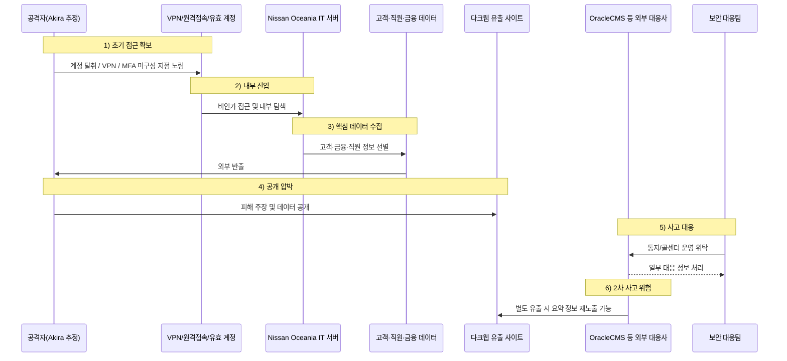

자동차 제조업을 겨냥한 사이버 공격은 이제 더 이상  
생산 설비나 설계 문서에만 머물지 않습니다.

이번 **닛산 오세아니아(Nissan Oceania) 해킹 사건**은  
자동차 제조사 본체와 함께, 그 계열 금융 서비스까지 동시에 타격할 경우  
어떤 규모의 개인정보·금융정보 침해가 발생할 수 있는지를 보여준 대표 사례입니다.

2023년 12월 5일, 닛산은 호주·뉴질랜드 IT 서버에 대한 무단 접근 사고를 확인했고,  
이후 조사 결과 일부 고객·직원·딜러·기타 이해관계자의 개인정보가 탈취되어  
다크웹에 게시된 사실을 공지했습니다.  
닛산은 2024년 3월부터 약 **10만 명** 규모의 영향권 대상자에게 통지를 시작했습니다.

이 사건이 특히 중요한 이유는,  
자동차 산업이 더 이상 단순 제조업이 아니라  
**판매·금융·보험·고객지원이 결합된 데이터 산업**이라는 점을 적나라하게 보여주기 때문입니다.

<!--more-->

---

## 핵심 요약

- **사건 발생일:** 닛산은 **2023년 12월 5일** 호주·뉴질랜드 IT 서버에 대한 무단 접근 사고를 확인했습니다.
- **피해 기업:** 닛산 오세아니아로, **Nissan Australia, Nissan New Zealand, Nissan Financial Services Australia, Nissan Financial Services New Zealand** 등이 포함됐습니다.
- **공격 주체:** 공식 공지에서는 공격자를 특정하지 않았지만, 보안 언론과 업계에서는 **Akira 랜섬웨어**의 소행으로 널리 보도됐습니다.
- **피해 규모:** 닛산은 약 **10만 명**이 영향을 받았다고 통지했고, NSW 정부도 같은 규모로 안내했습니다.
- **핵심 유출 데이터:** 이름, 연락처, 생년월일, 신분증 사본과 번호, 세금식별번호, 금융정보, 자동차 대출 정보, 고용정보 등 폭넓은 개인정보가 포함됐습니다.
- **중요 포인트:** 이 사건은 단순 제조업 침해가 아니라, **자동차 판매·정비·금융·보험 업무가 결합된 데이터 구조**가 한 번에 노출될 수 있다는 점에서 특히 위험합니다.
- **핵심 메시지:** 제조업 해킹이 이제는 생산 차질만의 문제가 아니라, **신원 도용·금융 사기·표적형 사회공학**으로 직결되는 시대가 되었다는 점을 보여줍니다.

---

## 사실 관계 정리

### ✅ 공개적으로 확인된 내용

- 닛산은 **2023년 12월 5일**, 악성 제3자가 닛산의 호주·뉴질랜드 IT 서버에 **무단 접근**한 사이버 사고가 발생했다고 공식 공지했습니다.
- 닛산은 조사 결과, 일부 고객·직원·기타 이해관계자의 개인정보가 **탈취되어 다크웹에 게시**됐다고 밝혔습니다.
- 공지 대상은 닛산 브랜드만이 아니라, **Nissan Financial Services, Mitsubishi Motors Financial Services, Renault Financial Services, Infiniti Financial Services, Skyline Car Finance/Insurance** 등 관련 금융·보험 브랜드 이용자까지 포함될 수 있다고 안내했습니다.
- 닛산은 호주 및 뉴질랜드의 영향권 대상자에게 개별 통지를 시작했고, 일부는 연락처 부재 등으로 공지문을 통해 알렸습니다.

### 🟨 외부 보도 및 기관 안내로 확인되는 내용

- NSW 정부는 이번 사건 영향 규모를 약 **10만 명**으로 안내했습니다.
- NSW 정부 안내에 따르면 유출 데이터셋에는 약 **운전면허증 7,500건**, **메디케어 카드 4,000건**, **여권 220건**, **세금파일번호(TFN) 1,300건**이 포함됐고, 약 10%는 핵심 신분증 정보가 포함된 것으로 정리됐습니다.
- 보안 언론은 닛산 사건을 **Akira 랜섬웨어**와 연결해 보도했고, 공격자는 약 **100GB** 데이터 탈취를 주장한 것으로 알려졌습니다. 다만 이 수치는 해커 측 주장으로 봐야 합니다.

### 🗓️ 타임라인

- **2023-12-05:** 닛산 오세아니아 IT 서버 무단 접근 사고 발생 및 대응 개시
- **2023-12월 중순:** 외부 보도 기준으로 Akira가 다크웹 유출 사이트에서 닛산 사건을 주장하고 공개 압박 시작
- **2024-03-13:** 닛산이 조사 결과를 바탕으로 영향권 대상자 통지 개시
- **2024-03-15 전후:** 호주 정부 기관과 언론이 약 10만 명 영향 사실을 공개 안내
- **2024-04-15:** 닛산 대응 콜센터 운영사 OracleCMS에서 별도 데이터 유출이 발생해 일부 피해자 정보가 다시 노출되는 2차 사고가 발생

---

## 1. 사건 개요

### 🚗 자동차 제조업 해킹이 금융 피해로 확대되는 구조

이 사건이 특히 중요한 이유는  
닛산이 단순 자동차 제조사만이 아니라,  
차량 판매·할부·보험·고객지원·딜러 네트워크를 함께 운영하는 구조를 갖고 있기 때문입니다.

즉, 한 번의 침해로 다음 데이터가 함께 엮여 노출될 수 있습니다.

- 차량 구매 및 금융 계약 정보
- 고객 신원확인 문서
- 대출·상환 이력
- 직원 고용 및 급여 정보
- 딜러 및 파트너 관련 자료
- 각종 지원·보험·계약 문서

이 때문에 자동차 제조업 대상 공격은  
단순 생산 차질이 아니라  
**금융사 수준의 개인정보 유출 사고**로 번질 수 있습니다.

---

## 2. 공격 방식

### 🚨 내부 서버 무단 접근 + 데이터 탈취 + 공개 협박

닛산 공식 공지는 “무단 접근”과 “정보 탈취 및 다크웹 게시”를 명확히 언급합니다.  
즉, 이번 사건도 전형적인 **이중 협박(Double Extortion)** 구조로 해석할 수 있습니다.

공격 흐름은 다음처럼 볼 수 있습니다.

1. 호주·뉴질랜드 IT 서버에 비인가 접근  
2. 고객·직원·딜러·금융 관련 데이터 수집  
3. 데이터 외부 반출  
4. 협상 또는 압박 시도  
5. 몸값 미지급 또는 협상 실패 시 다크웹 공개

즉, 이 사건의 핵심은 단순 파일 암호화보다  
**개인정보와 금융정보를 빼낸 뒤 공개를 압박하는 갈취형 랜섬웨어 운영**에 있습니다.

---

## 3. 초기 침투는 어떻게 이뤄졌을까

### 🔓 이번 사건의 정확한 최초 침투 경로는 공식 발표되지 않았다

닛산은 공식 공지에서  
**어떤 취약점이나 계정이 최초 침투에 사용됐는지 공개하지 않았습니다.**

하지만 여기서 멈추면 실무적으로 얻는 것이 적습니다.  
중요한 것은 **Akira의 전형적인 접근 패턴을 닛산 사례에 어떻게 대입해 볼 것인가**입니다.

### Akira에서 반복적으로 관찰되는 초기 접근 방식

- **MFA가 없거나 약한 VPN 계정 악용**
- **브루트포스 및 패스워드 스프레이**
- **탈취되거나 구매된 유효한 계정(Valid Accounts) 사용**
- **원격접속 인프라 취약점 악용**
- 침투 후 **LSASS 덤프**, 자격증명 탈취, LOLBins/COTS 도구 활용

즉, Akira의 특징은  
정교한 제로데이보다도  
**외부 노출 접점과 약한 인증 체계, 그리고 유효한 계정 악용**에 무게가 있다는 점입니다.

### 닛산 사건에 대입해 볼 수 있는 현실적 추정

정확한 경로는 미확정이지만,  
닛산 오세아니아 사건도 다음과 같은 흐름이었을 가능성을 열어둘 수 있습니다.

1. **외부 노출 VPN 또는 원격접속 계정 확보**
2. **정상 계정처럼 내부 IT 서버 진입**
3. **금융 서비스·고객지원·직원 데이터 저장소 탐색**
4. **대량 수집 전 자격증명 확대 및 내부 이동**
5. **문서 압축 후 외부 반출**
6. **협상 실패 또는 지연 시 다크웹 공개**

즉, 이 사건은  
“어떤 악성코드가 실행됐는가”만이 아니라,  
**VPN 로그인 이상 징후, 비정상 시간대 접속, MFA 부재, 내부 서버 간 이동, 대량 문서 접근**을 함께 봐야 해석이 가능합니다.

### 이 구간에서 봐야 할 로그 패턴

실무 관점에서 특히 중요했던 포인트는 다음과 같습니다.

- 평소 사용하지 않던 국가·IP·시간대의 VPN 로그인
- 동일 계정의 연속 실패 후 성공 로그인
- 로그인 직후 다수 파일서버·문서저장소 열람
- 관리자 권한 상승 또는 서비스 생성
- LSASS 접근, 자격증명 덤프 정황
- ZIP/7z/RAR 대량 생성
- 정상 사용자처럼 보이지만 평소보다 훨씬 큰 다운로드/전송량

즉, 닛산 사건 같은 유형은  
최초 침투 자체보다  
**침투 후 계정 사용 패턴과 대량 데이터 접근 패턴**을 보면 훨씬 빨리 이상징후를 잡을 수 있습니다.

---

## 4. 어떤 데이터가 문제인가

### 🪪 이 사건은 ‘고객 정보 유출’이 아니라 ‘신원 도용 가능 정보 유출’ 사건이다

닛산 공지에 따르면 영향 데이터는 매우 광범위합니다.  
모든 피해자에게 동일하게 적용되지는 않지만, 다음과 같은 정보가 포함될 수 있습니다.

- 이름
- 주소, 전화번호, 이메일
- 생년월일
- 운전면허증, 메디케어 카드, 여권, 비자, 출생증명서 등 **신분증 사본 및 번호**
- 호주 TFN 또는 뉴질랜드 IRD 번호
- 건강·의료·경찰조회·종교·노조 관련 **민감정보**
- 신용 관련 정보
- 은행 계좌·카드 등 금융정보
- 차량 등록 정보
- 자동차 대출 거래 및 상환 이력
- 고용계약, 급여, 평가, 퇴직 관련 자료
- 보험 및 연금 관련 정보

즉, 단순 연락처 유출이 아니라  
**신원 도용, 금융사기, 세금 사기, 대출 사기, 표적 피싱**으로 직결될 수 있는 정보가 함께 노출된 사건입니다.

---

## 5. 실제로 어떤 피해가 가능한가

### 💥 신분증 + 금융정보가 결합되면 피해 강도가 완전히 달라진다

이번 사건이 위험한 이유는  
단순히 유출 항목이 많아서가 아닙니다.  
**서로 결합될 때 범죄 가치가 급격히 커지는 정보 조합**이 포함돼 있기 때문입니다.

### 가능한 실제 피해 시나리오

#### 1) 신원 도용 기반 금융 사기
운전면허증, 여권, TFN, 생년월일, 주소가 함께 있으면  
피해자 명의로 금융 계정 개설, 소액 대출 신청, 본인확인 우회 시도가 가능해질 수 있습니다.

#### 2) 자동차 금융 사칭 피싱
대출·상환 이력과 차량 관련 정보가 함께 있으면  
공격자는 실제 계약 문맥을 흉내 내며  
“연체 정리”, “추가 본인확인”, “계약 갱신”, “보험 변경” 같은 문구로  
정교한 피싱이나 보이스피싱을 할 수 있습니다.

#### 3) 직원·딜러 사칭을 통한 후속 침해
직원·딜러·고객 데이터가 한 번에 유출되면  
공격자는 내부 담당자나 파트너사인 것처럼 가장하여  
추가 계정 탈취, 송금 사기, 공급망 침해를 시도할 수 있습니다.

#### 4) 세금·복지·의료 관련 사기
TFN, 메디케어 카드, 신분증 정보는  
단순 광고 스팸 수준이 아니라  
세금환급 사기, 복지 사기, 민감정보 사칭 범죄로 이어질 가능성이 있습니다.

즉, 닛산 사건은  
연락처 유출 사건이 아니라  
**실제 금전 피해와 신원 도용 범죄로 이어질 수 있는 고위험 유출 사건**입니다.

---

## 6. 닛산 사건에서 특히 위험한 점

### 💳 자동차 제조사인데 왜 금융 보안 사고가 되었는가

이 사건은 제조사 침해가  
곧바로 **금융 서비스 침해**로 이어질 수 있음을 보여줍니다.

닛산은 공지문에서 다양한 금융·보험 브랜드를 직접 언급하며,  
닛산 브랜드 차량을 구매하지 않았더라도  
관련 금융·보험 서비스 이용 이력이 있다면 영향권일 수 있다고 설명했습니다.

이 구조에서 가장 큰 리스크는 다음과 같습니다.

- **신분증 + 금융정보 결합 유출**
  - 단순 피싱이 아니라 실제 금융 사기로 이어질 수 있음
- **대출 및 상환 정보 노출**
  - 표적형 사기, 사회공학, 신용 사기 가능성 증가
- **직원·딜러 정보 동시 노출**
  - 내부자 사칭, 공급망 사칭, 후속 침해 가능성 확대
- **차량·고객·금융 데이터의 상호 연결**
  - 단일 정보보다 훨씬 높은 가치의 공격 데이터셋 형성

즉, 이 사건은  
자동차 산업이 이미 **제조업 + 금융업 + 서비스업이 결합된 데이터 산업**이라는 점을 잘 보여줍니다.

---

## 7. 공격 주체: Akira란 누구인가

Akira는 2023년 3월경부터 관찰된 랜섬웨어 그룹으로,  
기업과 중요 인프라 조직을 상대로 활동해 왔습니다.

공개 자료 기준으로 Akira는 다음 특징을 보입니다.

- 초기 접근 후 **데이터 탈취 + 암호화** 병행
- **VPN 및 원격접속 환경** 노림
- **MFA 미구성 환경** 선호
- **유효한 계정 악용** 및 자격증명 탈취
- 협상 실패 시 **다크웹 유출 사이트 공개 압박**

따라서 닛산 사건도  
단발성 예외가 아니라,  
Akira가 제조·교육·중소기업·중요 인프라 등에서 반복해 온  
전형적 갈취형 랜섬웨어 운영 패턴의 일부로 볼 수 있습니다.

---

## 8. 이 사건에서 더 봐야 할 부분: 2차 피해

### 📞 사고 대응 과정 자체가 또 다른 공격면이 될 수 있다

닛산 사건은 여기서 끝나지 않았습니다.

닛산은 사고 대응을 위해 외부 콜센터 운영사 **OracleCMS** 를 활용했는데,  
이 운영사도 별도 데이터 유출 사고를 겪으면서  
닛산이 제공한 일부 요약 정보가 다시 다크웹에 게시됐다고 공지했습니다.

이 점은 매우 중요합니다.

보안 사고 이후에는 보통 다음과 같은 외부 협력사가 개입합니다.

- 콜센터
- 통지 대행사
- 신용 모니터링 업체
- 법률·포렌식 지원사
- 외부 대응 플랫폼

문제는 여기서부터입니다.

사고 대응이 커질수록  
원본 데이터를 직접 다루지 않더라도  
요약본, 피해자 목록, 통지 상태, 연락처, 분류 정보 같은  
**또 다른 민감 데이터셋**이 새로 생성됩니다.

즉, 사고 이후의 대응 체계가 복잡할수록  
**2차 유출, 2차 노출, 2차 사칭 공격** 가능성도 커집니다.

닛산 사건은  
“침해 대응은 곧 추가 공급망 보안 문제”라는 사실까지 보여준 드문 사례입니다.

---

## 9. 공격 흐름 개념도

---

# PLURA 관점 정리

## 10. PLURA-EDR 관점: 이 사건의 핵심은 ‘누가 어떤 문서와 계정을 다뤘는가’입니다

닛산 사건처럼 제조업과 금융 서비스가 결합된 환경에서는  
악성코드 이름만 알아서는 충분하지 않습니다.

핵심은 다음입니다.

1. **어떤 계정이**
2. **어느 서버에 들어갔고**
3. **어떤 고객·금융 파일에 접근했으며**
4. **무엇을 압축하고 외부로 내보냈는지**
5. **그 과정에서 권한 상승이나 원격 실행이 있었는지**

PLURA-EDR 관점에서는 다음 추적이 중요합니다.

* 대량 파일 접근 및 압축 흔적
* 신분증 사본·대출 관련 문서·고용 문서의 비정상 조회
* LSASS 덤프 및 자격증명 탈취 정황
* 원격접속 후 내부 확산 행위
* 딜러·직원·금융업무 서버 간 비정상 이동
* 외부 반출 직전의 파일 생성·이동·아카이브 흔적

즉, 이런 사건의 핵심은  
**“랜섬웨어가 왔다”가 아니라 “어떤 데이터가 어떻게 빠져나갔는가”를 증거로 남기는 것**입니다.

---

## 11. PLURA-WAF / XDR 관점: 자동차·금융 통합 서비스는 데이터 유출을 실시간으로 봐야 합니다

이 사건처럼 고객지원, 금융 조회, 대출 문서, 계약 자료가  
웹 기반 업무 시스템이나 내부 포털을 통해 오가는 구조에서는  
대량 유출이 “정상 다운로드”처럼 보일 수 있습니다.

따라서 대응 포인트는 분명합니다.

* 웹 응답 기반 **대량 문서 전달** 탐지
* **Resp-body / Resp-size** 기반 이상 탐지
* 정상 계정처럼 보이는 세션의 **행위량·빈도·패턴 변화** 분석
* 금융·고객·직원 데이터 접근의 **상관 분석**
* 단일 이벤트가 아니라 **로그인 → 조회 → 압축 → 반출** 전체 흐름 연결

결국 이런 사건은  
**로그를 남기고, 전수 분석하고, 유출 징후를 상관 분석하는 체계**가 없으면 늦게 알 수밖에 없습니다.

---

## 12. 탐지 포인트 비교: EDR vs WAF/XDR

| 구분                | 무엇을 보나                   | 이 사건에서의 핵심 포인트                |
| ----------------- | ------------------------ | ----------------------------- |
| **PLURA-EDR**     | 계정, 프로세스, 파일, 압축, 원격 실행  | 누가 어떤 고객·금융 문서를 열고 복사했는지 확인   |
| **PLURA-EDR**     | 자격증명 탈취, 권한 상승, 내부 이동    | VPN 진입 후 내부 확산 여부 추적          |
| **PLURA-EDR**     | ZIP/7z/RAR 생성 및 반출 직전 흔적 | 유출 준비 단계 포착                   |
| **PLURA-WAF/XDR** | 요청/응답 본문, 다운로드 패턴        | 고객·금융 데이터 대량 조회 탐지            |
| **PLURA-WAF/XDR** | 응답 크기, 세션 빈도, 행위량        | 정상 사용자처럼 보이는 대량 추출 식별         |
| **PLURA-WAF/XDR** | 로그인-조회-반출 상관 분석          | “정상 계정 + 비정상 유출” 구조를 실시간으로 파악 |

---

## 13. 유출 데이터 유형별 위험도 정리

| 유출 데이터 유형     | 대표 예시               | 주요 위험                         |
| ------------- | ------------------- | ----------------------------- |
| **신분증 정보**    | 운전면허증, 여권, 메디케어 카드  | 신원 도용, 본인확인 우회, 계정 개설 사기      |
| **세금·식별 정보**  | TFN, IRD 번호         | 세금 환급 사기, 공공서비스 사칭, 장기적 신원 악용 |
| **금융 정보**     | 대출 정보, 상환 이력, 계좌 정보 | 금융 사기, 대출 사기, 신용 악용           |
| **고객 계약 정보**  | 차량 금융 계약, 보험 문서     | 표적 피싱, 사칭 통화, 계약 위장 사기        |
| **직원 정보**     | 급여, 고용계약, 평가 자료     | 내부자 사칭, HR 피싱, 추가 침해 발판       |
| **딜러·파트너 정보** | 파트너 명단, 거래 정보       | 공급망 사칭, BEC, 후속 침해 확대         |

---

## 14. 기타 주요 닛산 보안 사고

### 🧩 2021년 북미 소스코드 노출 사고

닛산은 이번 오세아니아 사건 외에도  
2021년 북미 법인에서 **노출된 Git 서버** 때문에 약 **20GB 규모 소스코드**가 외부에 공개된 사고를 겪었습니다.

이때는 랜섬웨어가 아니라  
기본 관리자 계정(`admin/admin`)으로 보호된 Git 서버가 외부에 노출되면서  
모바일 앱, 내부 도구, 진단 시스템 관련 코드가 유출된 것으로 보도됐습니다.

이 사례는 닛산 관련 보안 이슈가  
단순 악성코드 감염이 아니라,

* 계정 관리
* 개발 인프라 노출
* 원격접속 보안
* 데이터 거버넌스

문제와도 연결돼 있음을 보여줍니다.

---

## 정리

닛산 오세아니아 사건은  
단순한 “자동차 회사 랜섬웨어 감염” 사건으로 보기 어렵습니다.

핵심은 다음 다섯 가지입니다.

1. **자동차 제조사 침해가 금융·보험·고객 데이터 침해로 직결될 수 있다는 점**
2. **신분증과 금융정보가 함께 노출되면 피해가 단순 개인정보 유출을 넘어선다는 점**
3. **Akira류 공격은 약한 인증과 원격접속 지점을 현실적으로 노린다는 점**
4. **실제 위험은 감염 자체보다 로그인, 내부 이동, 문서 수집, 압축, 반출 흐름에 있다는 점**
5. **사고 대응 과정의 외부 위탁 구조까지 2차 유출 위험이 될 수 있다는 점**

이제 자동차 산업 보안은  
생산망만 보는 수준으로는 부족합니다.

어떤 계정이 로그인했는지,  
어떤 문서가 열렸는지,  
어떤 신분증 파일이 복사됐는지,  
어떤 금융 데이터가 대량으로 나갔는지,  
그리고 사고 대응 과정에서 누가 어떤 데이터를 다시 다뤘는지,

그 전 과정을 **기록하고 분석하고 대응할 수 있어야** 합니다.

자동차 제조업은 이제  
공장 보안만의 문제가 아닙니다.  
**고객 데이터, 금융 데이터, 공급망 데이터, 대응 데이터까지 함께 보는 통합 보안 관점**이 필요합니다.

그것이 바로  
자동차 제조업과 금융 서비스가 결합된 시대의 현실적인 보안 기준입니다.

---

## 업데이트 예정

이 사건은 닛산의 공식 통지와 2024년 공개 자료를 기준으로 정리한 것입니다.  
향후 다음 내용이 추가로 확인되면 본 글도 업데이트할 필요가 있습니다.

* 정확한 최초 침투 경로
* Akira와의 공식 연계 여부
* 암호화 피해 범위 및 운영 영향
* 추가 유출 데이터 범위
* 제3자 대응사 연계 2차 피해 확정 내용

즉, 이 글은  
현재 시점의 가장 신중한 정리본이며,  
추가 사실이 공개되면 후속 업데이트가 필요합니다.

---

## 참고 자료(출처)

* Nissan Australia / Nissan Financial Services Australia, `Notice: Cyber security incident impacting Nissan Australia and New Zealand`
* ID Support NSW, `Nissan Motor Corporation and Nissan Financial Services data breach`
* The Register, `Nissan Oceania to alert 100K people affected by cyberattack`
* Dark Reading, `Nissan Oceania breached; 100K customers, employees, dealers affected`
* Cisco, `Akira Ransomware Targeting VPNs without Multi-Factor Authentication`
* FBI / CISA, `#StopRansomware: Akira Ransomware` 및 관련 공식 경고 목록
* BleepingComputer, `Nissan NA source code leaked due to default admin:admin credentials`

---
