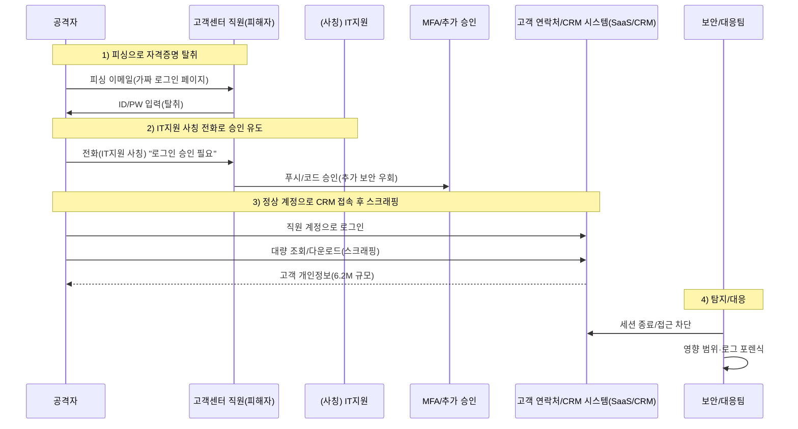

네덜란드 통신사 **Odido**에서 **약 620만 명(6.2M)** 규모의 고객 정보가 유출된 것으로 알려졌습니다.  
공격은 **소셜 엔지니어링(피싱 + IT지원 사칭 전화)**로 시작해, 직원 계정 탈취 후 **고객 연락처/CRM 시스템에서 대량 다운로드(스크래핑/수집)**로 이어졌습니다. ([Cybernews][4])

유출 가능 정보에는 고객의 **이름, 주소, 휴대전화번호, 이메일, 고객번호, IBAN(계좌번호), 생년월일, 여권/운전면허 등 신분증 식별정보 및 유효기간** 등이 포함될 수 있다고 안내되었습니다. 반면 **‘Mijn Odido’ 비밀번호, 통화내역, 위치정보, 청구/인보이스 정보, 신분증 스캔본** 등은 포함되지 않았다고 공지되었습니다. ([Odido][1])

<!--more-->
---

### 1. **정찰 (Reconnaissance)**
#### 🔍 **“사람”과 “업무 흐름”을 먼저 본다**
- 공격자는 고객센터/CS 조직을 노려 **직원 로그인 정보**를 얻는 전략을 선택합니다. (CS는 계정 접근 권한이 넓고, 업무상 외부 연락에 익숙해 표적이 되기 쉽습니다.) ([Cybernews][4])
- Odido는 고객 대응을 위한 **고객 연락처/CRM 시스템**을 운영하고 있었고, 공격자는 이 지점을 “대량 수집”의 최종 목표로 삼습니다. ([Odido][1])
- (보도에 따르면) 공격자는 Odido의 **Salesforce 환경(=CRM)**에 접근한 정황이 언급됩니다. ([Cybernews][4])

---

### 2. **최초 침투 (Initial Access)**
#### 🚨 **피싱 이메일 + IT지원 사칭 전화(vishing)로 추가 보안 단계를 우회**
- 공격자는 **직원에게 피싱 이메일**을 보내 로그인 정보를 입력하도록 유도합니다. ([Cybernews][4])
- 이후 다른 직원에게 **IT 부서 직원을 사칭해 전화**하고, “로그인 시도 승인”을 요청해 **추가 보안 단계(예: MFA 승인)**를 통과하도록 유도합니다. ([Cybernews][4])

> ✅ 포인트  
> 이 단계는 기술적 취약점보다 **사람(신뢰)과 절차(승인)**를 공격합니다. 따라서 “악성코드”가 없거나 최소화될 수 있어, 전통적 시그니처 기반 방어만으로는 놓치기 쉽습니다.

---

### 3. **권한 악용 및 내부 접근 (Valid Accounts / Access)**
#### 🔑 **“정상 계정”으로 CRM에 들어가면, 공격이 ‘정상 업무’처럼 보이기 시작**
- 공격자는 탈취한 직원 계정으로 **고객 연락처/CRM 시스템에 접속**합니다. ([Odido][1])
- 공격 경로는 ‘취약점 익스플로잇’이 아니라 **Valid Accounts(정상 계정 악용)** 형태로 보이며, 그 결과 조회/다운로드가 **정상 업무 트래픽처럼 위장**됩니다. ([Reuters][9])

#### 🧩 **Lapsus$(DEV-0537/Strawberry Tempest) 방식과의 관련성**
사용자가 언급하신 것처럼, 이 단계는 과거 **Lapsus$ 계열**이 큰 성공을 거뒀던 전형적인 흐름과 닮아 있습니다.  
(2022년 삼성전자·마이크로소프트 등에서 널리 알려진 공격 사례가 있었고, 2023년에는 CSRB 보고서로 전술이 체계적으로 정리되며 ‘아이덴티티/프로세스 기반 침투’가 재조명되었습니다.) ([MS-DEV0537][12], [CSRB][13])

##### 3-1) **공격 방식의 공통분모: “사람을 속여 계정을 얻고, 그 계정으로 SaaS/내부 시스템을 연다”**
- **소셜공학 중심(Phishing/Vishing) + 정상 계정 획득**
  - CSRB는 Lapsus$ 및 관련 그룹이 공격 사슬 전반에서 **피싱·비싱(vishing) 등 소셜공학을 폭넓게 활용**했고, ‘낮은 비용의 단순 기법’으로도 대형 피해가 가능함을 지적했습니다. ([CSRB][13])
  - Microsoft 역시 DEV-0537(Lapsus$로 널리 알려진 그룹)을 **소셜공학 기반으로 접근해 데이터 유출/파괴를 시도**하는 행위자로 설명했습니다. ([MS-DEV0537][12])

- **MFA를 ‘기술로’ 뚫기보다, ‘승인’을 받아내는 방식**
  - Odido 사건은 “IT지원 사칭 전화로 승인 유도”가 핵심인데, CSRB 보고서에서도 유사하게 **전화·메시지 기반 설득/압박을 통해 MFA를 무력화**하는 패턴이 반복적으로 언급됩니다. ([CSRB][13])
  - 즉, MFA가 있어도 “사용자 승인”이 공격 면이 되면, MFA는 ‘있는 것’만으로 충분하지 않습니다.

- **악성코드보다 ‘정상 접근’과 ‘데이터 탈취’에 초점**
  - Lapsus$는 전통적 랜섬웨어처럼 암호화보다 **데이터 절취와 공개 협박(Extortion)**에 무게를 두는 것으로 여러 보고서에서 설명됩니다. ([MS-DEV0537][12], [CSRB][13])
  - Odido도 서비스 장애보다 **CRM에서 정보가 다운로드(스크래핑)되어 유출**된 정황이 핵심입니다. ([Cybernews][4], [TechCrunch][10])

##### 3-2) **삼성전자·마이크로소프트 사례와의 “형태적” 유사성**
- **삼성전자(2022)**: Lapsus$가 내부 데이터(소스코드 등) 유출을 주장했고, 삼성은 내부 시스템에서 **Galaxy 관련 소스코드 등 데이터가 탈취**된 사실을 확인한 바 있습니다. ([TheVerge][14])
- **마이크로소프트(2022)**: Microsoft는 DEV-0537(=Lapsus$로 널리 알려짐)이 **제한적 접근을 얻어 소스코드 등을 유출**한 정황을 언급하며, 핵심 전술로 **소셜공학**을 강조했습니다. ([MS-DEV0537][12])

> ✅ 결론(관련성 요약)  
> Odido 사건의 “Valid Accounts로 CRM 접근 → 대량 다운로드”는  
> Lapsus$가 보여준 “Valid Accounts로 내부/클라우드 자산 접근 → 데이터 절취”와 **구조가 매우 유사**합니다.  
> 다만, Odido 사건의 공격 주체가 Lapsus$인지(또는 동일 계열인지)는 별개이며, 여기서는 **전술(TTP)의 유사성**만을 비교합니다.

---

### 4. **정보 수집 (Collection)**
#### 🗄️ **CRM에서 ‘필드 단위 개인정보’를 빠르게 긁어 모은다**
- 공격자는 CRM 내부의 고객 데이터를 **스크래핑/대량 조회·다운로드** 방식으로 수집한 것으로 알려졌습니다. ([Cybernews][4])
- 유출 가능 정보(안내 기준)
  - 이름, 주소/거주도시, 휴대전화번호, 이메일, 고객번호  
  - IBAN(계좌번호), 생년월일  
  - 여권/운전면허 등 신분증 식별정보 및 유효기간 ([Odido][1])

---

### 5. **정보 유출 (Exfiltration)**
#### 📤 **대량 유출인데도 ‘합법 트래픽’처럼 빠져나갈 수 있다**
- Odido는 사건이 **고객 연락처 시스템(Customer contact system)**과 관련되어 있고, 비인가 접근을 종료했다고 안내했습니다. ([Odido][1])
- TechCrunch는 공격자가 고객정보를 **은밀히(covertly) 대량 다운로드**한 것으로 전했습니다. ([TechCrunch][10])

---

### 6. **유출 방법 개념도 (시나리오)**

---

## 7. **Odido의 공개된 대응(요약)**
- Odido는 사고 인지 후 **비인가 접근을 종료**, **추가 보안 조치**, **이상 활동 모니터링 강화**, **직원 피싱 인식 제고**, **외부 전문가 투입**, **감독기구(AP) 신고** 등을 안내했습니다. ([Odido][1])

---

# PLURA 관점 정리

## 8. **PLURA-EDR 관점: 감사 정책 기반 이상 징후 탐지와 유출 파일 추적**
우리는 기존과 같이 **PLURA-EDR의 감사 정책으로 이상 징후를 탐지하고 다운로드 받은 고객 정보 파일을 확인할 수 있습니다.**

PLURA-EDR은:
1) **감사 정책 설정을 통해 로그를 생성**하고,  
2) **Windows 이벤트 로그 / Linux syslog·audit 로그를 수집**하며,  
3) 수집된 로그를 **분석하여 이상 징후를 탐지**하고,  
4) 정책에 따라 **차단**할 수 있도록 안내합니다. ([PLURA-EDR][2])

따라서 다음과 같은 “증거 기반 확인”이 가능합니다.
- **누가/언제/어떤 프로세스로** 고객정보 Export(또는 다운로드)를 수행했는지 단말 로그로 추적  
- 다운로드된 **CSV/XLSX/ZIP 등 고객정보 파일의 생성·이동·압축·외부 전송 시도**를 감사 로그로 확인  
- “정상 계정”이 악용될 때 특히 중요한, **업무 시간·사용 패턴과 다른 파일 접근/대량 생성** 징후 탐지

---

## 9. **PLURA-XDR 관점: 대용량 데이터 유출을 왜 놓치기 쉬운가, 그리고 어떻게 실시간 탐지할 수 있는가**
우리는 기존과 같이 **웹방화벽 데이터 유출 탐지로 대용량 데이터 유출을 실시간 탐지할 수 있습니다.**

이번 사건처럼 데이터가 “웹 응답(다운로드/Export)” 형태로 빠져나가는 경우,  
**PLURA-WAF의 응답 본문(Resp-body) 분석과 응답 크기 기반 이상 탐지**를 통해 데이터 유출을 탐지·차단하는 접근이 가능합니다. ([PLURA-WAF][3])

PLURA 문서에서도 데이터 유출 탐지를 다음과 같이 설명합니다.
- **웹 서버의 응답 본문을 분석**하여 기밀/개인정보/민감정보 유출을 탐지하고,  
- 유출이 감지되면 **즉각 차단** 기능을 제공 ([PLURA-Breach][5])

### 9-1) 왜 대량 유출을 ‘늦게’ 알아차리나
- **정상 계정 + 정상 기능(Export/조회)** 조합은 “업무”로 보이기 쉬움  
  - Odido 사례도 고객 연락처 시스템에서 정보가 다운로드된 정황이 핵심입니다. ([Reuters][9], [TechCrunch][10])
- **단일 로그만 보면 이상이 작아 보임**
  - 로그인 이벤트만 보면 “로그인 성공”으로 끝나고,  
  - 다운로드 이벤트만 보면 “고객센터 업무”로 오인될 수 있습니다.
- **상관분석 부재**
  - “피싱 → 승인 유도 → 특정 계정으로 CRM 접속 → 대량 다운로드” 흐름을 하나의 타임라인으로 묶지 않으면, 경보가 쪼개져 의미가 약해집니다.

### 9-2) PLURA-XDR에서의 핵심은 “상관분석 + 즉시 차단”
- **WAF(응답 본문/응답 크기) 기반 데이터 유출 탐지** +  
- **EDR(감사 정책 기반 단말·계정 행위) 기반 이상 탐지**를 결합해  
- “누가(계정) / 어디서(단말) / 무엇을(파일·데이터) / 얼마나(대용량) / 어떻게(웹 응답/다운로드)”를 한 번에 파악하고, 정책에 따라 차단까지 이어갈 수 있습니다. ([PLURA-WAF][3], [PLURA-EDR][2])

---

### 📑 참고 자료(출처)
- Odido 공식 안내(영문): 사고 개요, 포함/미포함 데이터 범위 ([Odido][1])
- Reuters: 600만+ 영향, 고객 통지 내용, 발견 시점 및 대응 개요 ([Reuters][9])
- TechCrunch: 6.2M 영향 및 고객정보를 ‘은밀히 다운로드’한 정황 ([TechCrunch][10])
- Cybernews: 피싱 + IT지원 사칭 전화, Salesforce 접근 정황, 스크래핑 유출 정황 ([Cybernews][4])
- Microsoft Security Blog: DEV-0537(=Strawberry Tempest) 전술(소셜공학 중심) ([MS-DEV0537][12])
- CISA/DHS CSRB Report(2023): Lapsus$ 및 관련 그룹의 소셜공학 중심 전술 정리 ([CSRB][13])
- PLURA-EDR 문서: 감사 정책 기반 로그 생성/수집/분석/차단 흐름 ([PLURA-EDR][2])
- PLURA-WAF / 데이터 유출 탐지 문서: Resp-body 분석 및 즉각 차단 ([PLURA-WAF][3], [PLURA-Breach][5])

---

[1]: https://www.odido.nl/veiligheid-eng "Information page cyber incident | Odido"
[2]: https://docs.plura.io/ko/agents/edr "호스트보안(EDR) | PLURA Docs"
[3]: https://www.plura.io/en/platform_waf.html "PLURA WAF"
[4]: https://cybernews.com/security/odido-hackers-phishing-attack/ "Odido hackers pretended to be an IT employee to breach corporate system | Cybernews"
[5]: https://docs.plura.io/ko/fn/comm/sdetection/breach "데이터 유출 | PLURA Docs"

[9]: https://www.reuters.com/business/media-telecom/dutch-telecom-odido-hacked-6-million-accounts-affected-2026-02-12/ "Dutch telecom Odido hacked, 6 million accounts affected | Reuters"
[10]: https://techcrunch.com/2026/02/13/dutch-phone-giant-odido-says-millions-of-customers-affected-by-data-breach/ "Dutch phone giant Odido says millions of customers affected by data breach | TechCrunch"

[12]: https://www.microsoft.com/en-us/security/blog/2022/03/22/dev-0537-criminal-actor-targeting-organizations-for-data-exfiltration-and-destruction/ "DEV-0537 criminal actor targeting organizations for data exfiltration and destruction | Microsoft Security Blog"
[13]: https://www.cisa.gov/sites/default/files/2023-08/CSRB_Lapsus%24_508c.pdf "Review of the Attacks Associated with LAPSUS$ and Related Threat Groups | CSRB"
[14]: https://www.theverge.com/2022/3/7/22965220/samsung-hack-lapsus-galaxy-source-code-confirmed-nvidia "Samsung confirms hackers stole Galaxy source code | The Verge"
