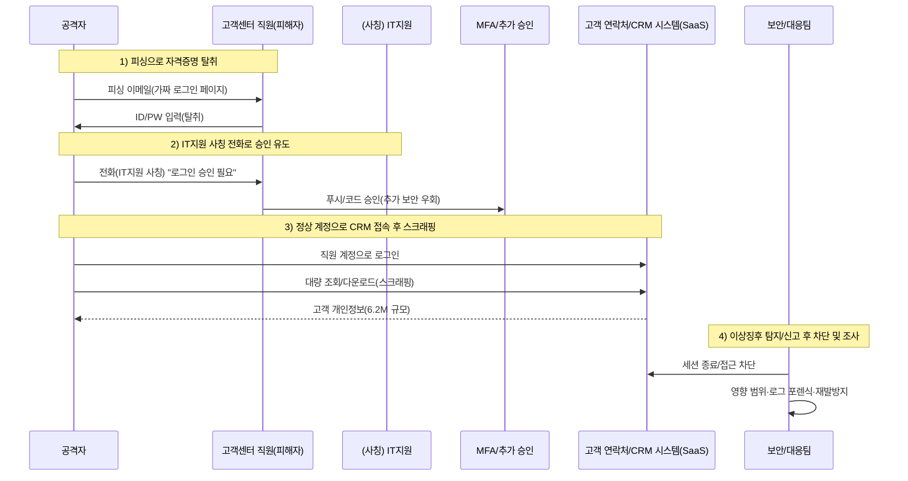

네덜란드 통신사 **Odido**에서 **약 620만 명(6.2M)** 규모의 고객 정보가 유출된 것으로 알려졌습니다.  
공격은 전형적인 **소셜 엔지니어링(피싱 + IT지원 사칭 전화)**로 시작해, 직원 계정 탈취 후 **고객 연락처/CRM 시스템에서 대량 다운로드(스크래핑/수집)**로 이어졌습니다. :contentReference[oaicite:1]{index=1}

유출 정보에는 고객의 **이름, 주소, 휴대전화번호, 이메일, 고객번호, IBAN(계좌번호), 생년월일, 여권/운전면허 등 신분증 식별정보 및 유효기간** 등이 포함될 수 있다고 안내되었습니다. 반면 **‘Mijn Odido’ 비밀번호, 통화내역, 위치정보, 청구/인보이스 정보, 신분증 스캔본** 등은 포함되지 않았다고 공지되었습니다. :contentReference[oaicite:2]{index=2}

<!--more-->
---

### 1. **정찰 (Reconnaissance)**
#### 🔍 **“사람”과 “업무 흐름”을 먼저 본다**
- 공격자는 고객센터/CS 조직을 노려 **직원 로그인 정보**를 얻는 전략을 선택합니다. (CS는 계정 접근 권한이 넓고, 업무상 외부 연락에 익숙해 표적이 되기 쉽습니다.) :contentReference[oaicite:3]{index=3}
- Odido는 고객 대응을 위한 **고객 연락처/CRM 시스템**을 운영하고 있었고, 공격자는 이 지점을 “대량 수집”의 최종 목표로 삼습니다. :contentReference[oaicite:4]{index=4}
- (보도에 따르면) 공격자는 Odido의 **Salesforce 환경**에 접근한 정황이 언급됩니다. :contentReference[oaicite:5]{index=5}

---

### 2. **최초 침투 (Initial Access)**
#### 🚨 **피싱 이메일 + IT지원 사칭 전화(vishing)로 MFA를 우회**
- 공격자는 **직원에게 피싱 이메일**을 보내 로그인 정보를 입력하도록 유도합니다. :contentReference[oaicite:6]{index=6}
- 이후 다른 직원에게 **IT 부서 직원을 사칭해 전화**하고, “로그인 시도 승인”을 요청해 **추가 보안 단계(예: MFA 승인)**를 통과합니다. :contentReference[oaicite:7]{index=7}
- 현지 보도에서는 이 방식으로 **복수 직원 계정이 침해**되었다는 정황이 언급됩니다. :contentReference[oaicite:8]{index=8}

> ✅ 포인트  
> 이 단계는 기술적 취약점보다 **사람(신뢰)과 절차(승인)**를 공격합니다. 따라서 “악성코드”가 없거나 최소화될 수 있어, 전통적 시그니처 기반 방어만으로는 놓치기 쉽습니다.

---

### 3. **권한 악용 및 내부 접근 (Valid Accounts / Access)**
#### 🔑 **“정상 계정”으로 CRM에 들어가면, 공격이 ‘정상 업무’처럼 보이기 시작**
- 공격자는 탈취한 직원 계정으로 **고객 연락처/CRM 시스템에 접속**합니다. :contentReference[oaicite:9]{index=9}
- 피해 범위는 **Odido 고객(및 일부 자회사 고객)**에 걸친 것으로 보도되며, 일부 보도에서는 **최근 2년 내 해지한 전 고객**도 영향 가능성이 언급됩니다. :contentReference[oaicite:10]{index=10}

---

### 4. **정보 수집 (Collection)**
#### 🗄️ **CRM에서 ‘필드 단위 개인정보’를 빠르게 긁어 모은다**
- 공격자는 CRM 내부의 고객 데이터를 **스크래핑/대량 조회·다운로드** 방식으로 수집한 것으로 알려졌습니다. :contentReference[oaicite:11]{index=11}
- 유출 가능 정보(안내 기준)
  - 이름, 주소/거주도시, 휴대전화번호, 이메일, 고객번호  
  - IBAN(계좌번호), 생년월일  
  - 여권/운전면허 등 신분증 식별정보 및 유효기간 :contentReference[oaicite:12]{index=12}

---

### 5. **정보 유출 (Exfiltration)**
#### 📤 **대량 유출인데도 ‘합법 트래픽’처럼 빠져나갈 수 있다**
- 이 사건은 랜섬웨어처럼 서비스 중단이 동반된 정황이 아니라, **고객 연락처 시스템에서 데이터가 다운로드**된 형태로 알려졌습니다. :contentReference[oaicite:13]{index=13}
- 일부 보도에서는 공격자가 **회사에 연락해 “수백만 건을 탈취했다”고 주장**했고, 그 뒤 대응이 진행된 정황이 언급됩니다. 즉 “내부에서 먼저 잡았다기보다, 이미 가져간 뒤에 확인된” 그림이 될 수 있습니다. :contentReference[oaicite:14]{index=14}

---

### 6. **유출 방법 개념도 (시나리오)**

---

## 7. **Odido의 공개된 대응(요약)**

* 사고 인지 후 **비인가 접근을 종료**하고, **추가 보안 조치 및 모니터링 강화**, **외부 사이버보안 전문가 투입**, **고객 및 감독기구(AP) 통지**를 진행했다고 공지했습니다. ([Odido][1])
* 고객에게는 피싱/사기 연락에 대한 주의를 당부했고, 보안 패키지 제공 등의 지원도 안내했습니다. ([Odido][1])

---

# PLURA 관점 정리

## 8. **PLURA-EDR 관점: 충분히 탐지·대응 가능한 사건**

초기 침투가 사람을 속이는 방식(피싱·vishing)이라 하더라도, 실제 사고 대응에서 중요한 건 **(1) 추가 확산 차단, (2) 단말/계정 오염 여부 확인, (3) 증거 확보**입니다. 이 영역은 EDR이 강합니다.

PLURA-EDR은 **Windows/macOS/Linux에서 감사정책과 텔레메트리(Sysmon 등)를 기반으로 로그를 생성·수집·분석**하고, **의심 프로세스 격리·차단·롤백** 같은 대응 자동화를 지원한다고 안내합니다. ([Plura][2])

### ✅ PLURA-EDR로 볼 수 있는 예시

* **피싱 이후 단말 흔적 점검**

  * 브라우저/프로세스 기반의 의심 행위(예: 비정상 자격증명 입력 유도, 의심 프로세스 실행, 토큰/쿠키 탈취 시도 등)
  * 단말에서 생성되는 Windows 이벤트 로그, Syslog/Audit 로그 기반의 이상 징후 분석 ([Plura][3])
* **계정 탈취 후 ‘추가 행동’ 차단**

  * 공격자가 내부로 확장하려는 시도(원격 셸, 역방향 연결, 측면이동 등)는 EDR 행위 기반 탐지 포인트가 됩니다. ([Plura][2])
* **사후 대응(Incident Response) 속도**

  * 의심 단말 격리/차단 → 로그 기반 근거 확보 → 영향 범위 식별 → 재발 방지(정책 연계) 흐름을 표준화할 수 있습니다. ([Plura][2])

> 정리하면: “피싱 자체”를 100% 기술로 막기 어렵더라도,
> **피싱 성공 이후 조직 내부에서 벌어지는 후속 행위(확산/침투/도구 실행/로그 흔적)**를 줄이고, **조사와 차단의 속도**를 올리는 것이 EDR의 실전 가치입니다.

---

## 9. **PLURA-XDR 관점: 왜 ‘620만 대량 유출’을 인지하지 못했나**

이번 사건 유형에서 대량 유출이 늦게 인지되는 이유는 보통 아래 3가지가 겹치기 때문입니다.

### 1) “정상 계정 + 정상 경로”로 접근하면, 보안장비가 ‘업무 트래픽’으로 오인

* 공격자는 취약점 익스플로잇보다 **탈취된 정상 계정(Valid Accounts)**을 악용합니다.
* CRM(SaaS)에서의 조회/다운로드는 겉으로 **정상 사용자 활동**처럼 보일 수 있습니다. (특히 CS 조직은 원래 조회량이 많습니다.) ([Cybernews][4])

### 2) SaaS(예: CRM) 내부 로그가 보안 관제에 “연동”되지 않으면, 대량 다운로드를 놓치기 쉬움

* 회사 내부 네트워크에서 빠져나가는 트래픽만 보는 방식으로는, **SaaS 내부에서 벌어지는 대량 Export/스크래핑**을 놓칠 수 있습니다.
* 일부 보도에서 공격자가 “탈취했다”고 먼저 연락한 정황이 언급되는 것도, 이런 **상시 탐지 공백의 비용**을 시사합니다. ([CPO Magazine][5])

### 3) 단일 이벤트가 아니라 “행위의 흐름”으로 상관 분석해야 한다

* 피싱(자격증명 탈취) → 낯선 로그인 시도 → MFA 승인 유도 → CRM 접속 → 대량 조회/다운로드
* 이 전체를 **한 줄의 타임라인으로 묶어** 경보를 만들어야 “대량 유출”이 초기에 잡힙니다.

PLURA-XDR은 **MITRE ATT&CK 기반 탐지 룰**과 **행위 흐름 상관 분석**, 그리고 **WAF–EDR 연계 기반 추적 대응**을 강조합니다. 또한 “데이터 유출 탐지”를 실시간 분석/대응 영역으로 제시하고 있습니다. ([Plura][6])

### ✅ PLURA-XDR로 정리하는 “놓치지 않는” 설계 포인트

* **로그 수집 범위 확장**: (사내) 사용자/호스트 로그 + (SaaS) 인증·접근·다운로드 로그까지 한곳에서 상관 분석 ([Plura][7])
* **이상행위 기준(UEBA) 적용**:

  * “평소와 다른 로그인 위치/디바이스/시간대” + “조회량/다운로드량 급증” 조합을 고위험으로 스코어링
* **즉시 대응(자동화) 옵션**:

  * 의심 세션 종료, 의심 계정 차단/격리, 차단 정책 자동 적용(운영 정책에 맞춰 단계화) ([Plura][6])

---

### 📑 참고 자료(출처)

* Cybernews: Odido 공격의 소셜공학(피싱+IT사칭 전화) 및 CRM 스크래핑 정황 ([Cybernews][4])
* Odido 공식 안내(영문): 사고 개요, 포함/미포함 데이터 범위 ([Odido][1])
* CPO Magazine: 고객 연락처 시스템 침해, 620만 영향, 대응 요약 ([CPO Magazine][5])
* BleepingComputer / TechCrunch / SecurityWeek / The Record / Reuters 보도 ([BleepingComputer][8])

---

[1]: https://www.odido.nl/veiligheid-eng "Information page cyber incident | Odido"
[2]: https://www.plura.io/ko/platform_edr.html "PLURA·AI-XDR Cloud SaaS Platform"
[3]: https://docs.plura.io/ko/agents/edr "호스트보안(EDR) | Korean"
[4]: https://cybernews.com/security/odido-hackers-phishing-attack/ "Odido hackers pretended to be an IT employee to breach corporate system | Cybernews"
[5]: https://www.cpomagazine.com/cyber-security/cyber-attack-on-dutch-telecom-giant-odido-exposes-customer-data-of-6-2-million/ "Cyber Attack on Dutch Telecom Giant Odido Exposes Customer Data of 6.2 Million - CPO Magazine"
[6]: https://blog.plura.io/ko/threats/case-jbnu_ewha_breach/ "대학 통합정보시스템 해킹과 PLURA-XDR의 대응 전략 | PLURA Blog"
[7]: https://blog.plura.io/ko/column/plura_xdr_case_insights/ "사이버 공격이 조직에 미치는 실질적 영향과 대응 전략 | PLURA Blog"
[8]: https://www.bleepingcomputer.com/news/security/odido-data-breach-exposes-personal-info-of-62-million-customers/ "Odido data breach exposes personal info of 6.2 million customers"
