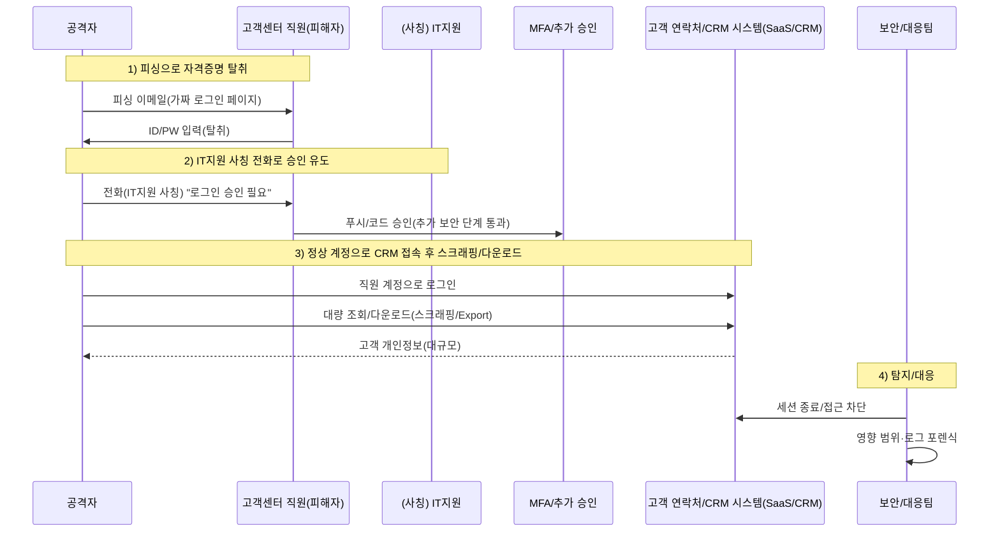

네덜란드 통신사 **Odido**가 고객 개인정보 유출 사고를 공지했습니다.  
사고는 **피싱 이메일 + IT지원 사칭 전화(vishing)** 등 **소셜 엔지니어링**으로 직원 계정이 탈취되고,  
이후 **고객 연락처/CRM 시스템에서 대량 조회·다운로드**(스크래핑/수집)가 발생한 것으로 보도되었습니다.  
(공격 주체는 공개적으로 확인되지 않았으며, 아래 비교는 **‘전술(TTP) 유사성’** 관점입니다.)

<!--more-->

---

## 핵심 요약 (가독성용)
- **공식 확인(ODIDO):** 고객 연락처 시스템(Customer contact system)에서 개인정보가 유출될 수 있음. ‘Mijn Odido’ 로그인 비밀번호는 포함되지 않음.
- **보도 정황(Cybernews 등):** 고객센터 직원 대상 피싱 → IT지원 사칭 전화로 승인 유도 → CRM(일부 매체는 Salesforce 언급) 접근 → 대량 다운로드.
- **왜 커 보이는데 늦게 알아차리나:** 정상 계정(Valid Accounts)로 “정상 기능(조회/Export)”을 수행하면, 로그가 **업무 행위처럼 보일 수 있음**.
- **PLURA 관점(요약):**
  - **PLURA-EDR:** 감사 정책 기반으로 이상 징후를 탐지하고, 단말에 내려받은 고객정보 파일(예: CSV/XLSX/ZIP 등)을 증거로 확인 가능.
  - **PLURA-WAF 데이터 유출 탐지:** 응답 본문(Resp-body)·응답 크기(Resp-size) 분석으로 대용량 데이터 유출을 **실시간 탐지·차단**.

---

## 사실 관계 정리

### ✅ Odido가 공개적으로 안내한 내용
- 사고는 **고객 연락처 시스템**과 관련됨.
- 유출 가능 정보 예시: 성명, 주소, 휴대전화번호, 이메일, 고객번호, IBAN, 생년월일, 신분증(여권/운전면허) 번호 및 유효기간 등.
- **유출에 포함되지 않은 것으로 안내된 항목:** ‘Mijn Odido’ 비밀번호, 통화내역, 위치정보, 청구/인보이스 정보, 신분증 스캔본 등.
- “password_c”라는 필드가 유출에 포함될 수 있으나, 이는 **로그인 비밀번호가 아니라** 과거 전화 문의 시 사용하던 **챌린지 워드/코드워드**(추가 질문 답)이며, 계정 접근과는 별개.

### 🟨 언론·보안매체 보도에 따른 정황(추정)
- 공격자가 고객센터/CS 직원을 표적으로 피싱을 보내 로그인 정보를 탈취.
- 이후 IT 부서 직원을 사칭해 전화를 걸고, “로그인 승인” 등을 유도해 추가 보안 단계를 통과.
- 해당 접근이 CRM 환경(일부 매체는 Salesforce라고 언급)으로 이어졌다는 정황.

> 포인트  
> 본 글은 “누가 했는가(Attribution)”보다,  
> **어떻게 했는가**(TTP)를 중심으로 정리합니다.

### 🗓️ 타임라인(공개된 정보 기준)
- **2026-02-07 ~ 2026-02-08(주말)**: 고객 연락처 시스템에서 비인가 접근이 발생한 것으로 공지/보도됨. (Odido 공지, SecurityWeek)
- **2026-02-07**: Odido가 침해 의심 징후를 확인하고 조사에 착수했다고 보도됨. (Reuters)
- **2026-02-12**: Odido가 고객 안내(웹 공지 및 이메일)와 규제기관(AP) 통지를 진행했다고 보도/공지됨. (Odido 공지, Reuters)

---

## 1. 정찰 (Reconnaissance)
### 🔍 “사람”과 “업무 흐름”을 먼저 본다
- 공격자는 고객센터/CS 조직을 노려 **직원 로그인 정보**를 얻는 전략을 선택합니다.  
  (CS는 계정 접근 권한이 넓고, 외부 문의·요청에 익숙해 소셜공학 표적이 되기 쉽습니다.)
- 목표는 기술 시스템 자체(통신망)가 아니라, 고객 응대를 위한 **고객 연락처/CRM 시스템**이었습니다.

---

## 2. 최초 침투 (Initial Access)
### 🚨 피싱 이메일 + IT지원 사칭 전화(vishing)
- **피싱 이메일**로 직원의 로그인 정보를 입력하도록 유도.
- 이어서 **IT지원 사칭 전화**(vishing)로 “로그인 시도 승인”을 유도해 추가 보안 단계를 통과.

> ✅ 포인트  
> 이 단계는 취약점(Exploit)보다 **신**뢰(사람)와 **절차**(승인)를 공격합니다.  
> 그래서 악성코드가 없거나 최소화될 수 있고, 단일 장비(방화벽/AV)만으로는 놓치기 쉽습니다.

---

## 3. 권한 악용 및 내부 접근 (Valid Accounts / Access)
### 🔑 정상 계정으로 들어가면, 공격이 ‘업무’처럼 보이기 시작한다
- 탈취된 직원 계정으로 **고객 연락처/CRM 시스템에 정상 로그인**하면,
  - 접근 자체가 “정상 사용자 활동” 형태로 기록될 수 있고,
  - 조회/Export/다운로드가 “고객 응대 업무”처럼 보일 수 있습니다.

MITRE ATT&CK에서도 이를 **Valid Accounts**(T1078)로 정리합니다.  
즉, “해킹은 로그인 순간에 끝났고”, 이후는 “권한으로 실행되는 데이터 접근”이 되는 구조입니다.

---

## 3-1. Lapsus$ 방식과의 구조적 유사성 (TTP 비교)
Odido 사건의 이 구간은, 과거 **Lapsus$**(Microsoft: DEV-0537 → Strawberry Tempest)에서 반복 관찰된 공격 흐름과 **구조가 닮아** 있습니다.

### 공통분모 1) “사람을 속여 계정을 얻고(소셜공학), 그 계정으로 내부/클라우드를 연다”
- CSRB 보고서는 Lapsus$ 및 연계 위협그룹이 공격 사슬 전반에서 **피싱·비싱(vishing) 등 소셜공학을 광범위하게 활용**했다고 설명합니다.
- MITRE는 Lapsus$가 **헬프데스크에 전화해 합법 사용자로 가장**(impersonation)하는 패턴도 정리합니다.

### 공통분모 2) MFA를 ‘기술로’ 뚫기보다, ‘승인’을 받아내는 방식이 반복된다
- Odido는 “IT지원 사칭 전화로 승인 유도”가 핵심 정황입니다.
- CSRB 보고서에서도 “소셜공학으로 인증 절차(승인)를 무력화”하는 흐름이 반복적으로 언급됩니다.

### 공통분모 3) 취약점 익스플로잇보다 “정상 접근 + 데이터 절취(Extortion)”에 초점
- Microsoft는 DEV-0537/Strawberry Tempest를 “데이터 유출 및 파괴를 노리는 행위자”로 설명했고,
  ‘일부 소스코드 탈취 주장’과 ‘단일 계정 침해’ 같은 특성을 공개했습니다.
- Lapsus$는 전통적 랜섬웨어처럼 “암호화”보다, **데이터 절취 후 협박(Extortion)** 비중이 큰 것으로 여러 보고서에서 설명됩니다.

> ✅ 결론(중요)  
> Odido 사건이 Lapsus$의 소행이라는 증거는 공개되지 않았습니다.  
> 다만, “**Valid Accounts 기반 접근 + 소셜공학 중심 + 데이터 절취**”라는 구조가 과거 Lapsus$ TTP와 유사합니다.

---

## 3-2. (참고) Lapsus$에서 ‘유사한 패턴’이 언급된 대표 사례
아래 사례는 “동일 그룹”을 단정하기 위한 것이 아니라, **왜 이런 전술이 현실에서 반복되는지**를 보여주는 참고입니다.

- **NVIDIA (2022년 2~3월)**
  - NVIDIA는 자사 시스템 침해 이후 **직원 자격증명과 일부 기업 내부 정보가 유출**된 사실을 언급한 바 있습니다.
  - 여러 매체에서 Lapsus$가 책임을 주장하며 데이터를 유출·협박한 정황이 보도되었습니다.

- **Samsung (2022년 3월)**
  - 삼성전자는 Galaxy 기기 관련 **내부 데이터/소스코드 탈취** 사실을 확인했습니다.

- **Microsoft (2022년 3월)**
  - Microsoft는 “단일 계정이 침해되어 제한적 접근이 발생했고, 일부 소스코드가 탈취되었다는 주장”에 대해 조사·대응 내용을 공개했습니다.

---

## 4. 정보 수집 (Collection)
### 🗄️ CRM에서 ‘필드 단위 개인정보’를 빠르게 긁어 모은다
- 고객 연락처/CRM 시스템에서 **대량 조회·다운로드(스크래핑/Export)** 형태로 정보 수집이 이뤄진 것으로 보도됩니다.

### 유출 가능 항목(공식 안내 기준)
| 구분 | 항목(예시) |
|---|---|
| 개인정보 | 성명, 주소/거주도시, 휴대전화번호, 이메일, 고객번호 |
| 금융/식별 | IBAN(계좌번호), 생년월일 |
| 신분증 | 여권/운전면허 번호 및 유효기간 |

### 유출에 포함되지 않았다고 안내된 항목(공식)
| 구분 | 항목(예시) |
|---|---|
| 계정 | Mijn Odido 로그인 비밀번호 |
| 통신/민감 | 통화내역, 위치정보 |
| 결제 | 청구/인보이스 정보 |
| 문서 | 신분증 스캔본 |

---

## 5. 정보 유출 (Exfiltration)
### 📤 대량 유출인데도 ‘업무 다운로드’처럼 빠져나갈 수 있다
- 데이터가 외부로 나간 경로가 “내부망에서 대용량 전송”이 아니라,
  **업무 시스템(고객 연락처/CRM)에서의 다운로드/Export**로 이뤄졌다면,
  네트워크 관점에서는 “정상 HTTPS 트래픽”으로 보일 수 있습니다.
- 결과적으로 “대량”이라는 사실은 **사후 로그 분석** 또는 **외부 제보/정황**으로 늦게 확인될 수 있습니다.

---

## 6. 유출 방법 개념도 (시나리오)

---

## 7. Odido의 공개된 대응(요약)
- 비인가 접근을 종료하고, 조사(내·외부 전문가) 및 관계기관 통지(AP)를 진행했다고 안내했습니다.
- 고객에게는 피싱/사기 연락(스미싱·보이스피싱) 주의를 당부했습니다.

---

# PLURA 관점 정리

## 8. PLURA-EDR 관점: 감사 정책 기반 이상 징후 탐지와 유출 파일 확인
**PLURA-EDR의 감사 정책으로 이상 징후를 탐지하고, 다운로드 받은 고객 정보 파일을 확인할 수 있습니다.**

PLURA-EDR은 다음 흐름을 제공합니다.
1) **감사 정책 설정을 통해 로그를 생성**  
2) **Windows 이벤트 로그 / Linux syslog·audit 로그를 수집**  
3) 수집된 로그를 **분석하여 이상 징후를 탐지**  
4) 탐지 정책에 따라 **차단 수행**

따라서 다음과 같은 “증거 기반 확인”이 가능합니다.
- 특정 계정/단말에서 **대량 Export/다운로드가 발생한 시점**의 행위를 감사 로그로 추적  
- 단말에 내려받은 **고객정보 파일**(CSV/XLSX/ZIP 등)의 생성·이동·압축 흔적을 로그로 확인  
- 사건 대응 과정에서 해당 파일을 **조사 대상으로 확보하여 내용 확인(포렌식 증거)**

---

## 9. PLURA-XDR 관점: ‘대량 유출’을 왜 놓치기 쉬운가, 그리고 실시간 탐지는 어떻게 가능한가
**웹방화벽 데이터 유출 탐지로 대용량 데이터 유출을 실시간 탐지할 수 있습니다.**

### 9-1) 왜 놓치기 쉬운가
- **정상 계정 + 정상 기능**(조회/Export)은 “업무”로 오인되기 쉽습니다.  
- 다운로드가 웹 응답(HTTPS) 형태라면, 네트워크만 보는 체계에서는 “정상 트래픽”으로 보일 수 있습니다.
- 로그인 이벤트와 다운로드 이벤트가 분리되어 있으면, 단일 이벤트로는 위험도가 과소평가될 수 있습니다.

### 9-2) PLURA-WAF 데이터 유출 탐지로 “실시간” 잡는 방식
PLURA-WAF(문서 기준)는 다음을 제시합니다.
- **응답 본문(Resp-body) 분석 기반 데이터 유출 탐지**
- **요청/응답 바디 사이즈 기반 이상 탐지(Resp-size)**
- 유출 감지 시 **즉각 차단**

즉, “CRM에서 고객 정보가 대량으로 내려오는 응답”처럼  
**‘다운로드 자체가 웹 응답’인 순간**을 실시간으로 탐지·차단하는 접근입니다.

---

## 참고 자료(출처)
- Odido 공식 안내: https://www.odido.nl/veiligheid-eng
- Reuters(2026-02-12): https://www.reuters.com/business/media-telecom/dutch-telecom-odido-hacked-6-million-accounts-affected-2026-02-12/
- Cybernews: https://cybernews.com/security/odido-hackers-phishing-attack/
- CPO Magazine: https://www.cpomagazine.com/cyber-security/cyber-attack-on-dutch-telecom-giant-odido-exposes-customer-data-of-6-2-million/
- SecurityWeek: https://www.securityweek.com/dutch-carrier-odido-discloses-data-breach-impacting-6-million/
- Microsoft Security Blog(DEV-0537 / Strawberry Tempest): https://www.microsoft.com/en-us/security/blog/2022/03/22/dev-0537-criminal-actor-targeting-organizations-for-data-exfiltration-and-destruction/
- CSRB LAPSUS$ Report(2023): https://www.cisa.gov/sites/default/files/2023-08/CSRB_Lapsus%24_508c.pdf
- MITRE ATT&CK (LAPSUS$ Group G1004): https://attack.mitre.org/groups/G1004/
- MITRE ATT&CK (Valid Accounts T1078): https://attack.mitre.org/techniques/T1078/
- NVIDIA 관련(참고): Reuters(2022-03-01) https://www.reuters.com/technology/nvidia-says-employee-company-information-leaked-online-after-cyber-attack-2022-03-01/ / The Verge(2022-03-01) https://www.theverge.com/2022/3/1/22957212/nvidia-confirms-hack-proprietary-information-lapsus
- Samsung 관련(참고): The Verge(2022-03-07) https://www.theverge.com/2022/3/7/22965220/samsung-hack-lapsus-galaxy-source-code-confirmed-nvidia
- PLURA-EDR 문서: https://docs.plura.io/ko/agents/edr
- PLURA-WAF 소개: https://www.plura.io/en/platform_waf.html
- PLURA 데이터 유출 탐지 문서: https://docs.plura.io/ko/fn/comm/sdetection/breach
