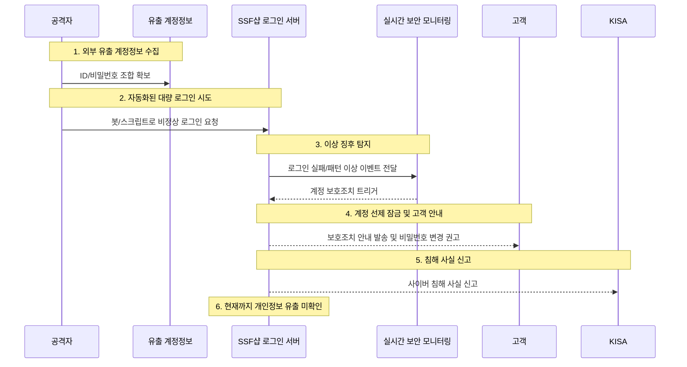

2026년 **3월 11일 오후 5시경**, 삼성물산 패션부문이 운영하는 온라인숍 **SSF샵**에서 **외부 비정상 로그인 시도**가 실시간 모니터링을 통해 포착되었습니다. 삼성물산은 **계정을 선제적으로 잠금 처리**했고, 다음 날인 **3월 12일 오후 4시 21분경** 고객들에게 '고객 계정 보호조치 안내'를 발송하며 관련 사실을 알렸습니다.

회사 측은 이번 공격을 **다크웹 등에서 확보된 계정정보를 활용한 크리덴셜 스터핑(Credential Stuffing)** 으로 설명했으며, **현재까지 개인정보 유출 사실은 확인되지 않았다**고 밝혔습니다. 또 고객 고지와 동시에 **한국인터넷진흥원(KISA)** 에도 사이버 침해 사실을 신고했습니다.

기사에 따르면 전체 회원 **800만명 중 약 5% 수준**이 공격 대상이 된 것으로 파악됐습니다. 다만 현재까지 공개된 정보만으로는 **실제 계정 탈취 및 정보 반출이 확인된 사건**이라기보다, **대규모 로그인 시도를 조기에 탐지하고 보호조치를 시행한 사례**로 보는 것이 더 정확합니다.

<!--more-->
---

### 1. **정찰 (Reconnaissance)**
#### 🔍 **외부 유출 계정정보 수집**
- 공격자는 다크웹 또는 기존 유출 DB에서 확보한 **ID/비밀번호 조합**을 수집합니다.
- 크리덴셜 스터핑은 다른 서비스에서 이미 유출된 계정 조합을 **여러 사이트 로그인 창에 자동 대입**하는 공격 방식입니다.
- SSF샵 사례에서도 삼성물산은 **외부에서 취득한 개인정보를 이용한 공격**이라고 설명했습니다.

---

### 2. **최초 침투 시도 (Initial Access Attempt)**
#### 🚨 **자동화된 비정상 로그인 시도**
- 2026년 **3월 11일 오후 5시경**, SSF샵은 **실시간 모니터링** 과정에서 외부의 비정상 로그인 시도를 포착했습니다.
- 이는 일반적인 사용자 행동과 다른 대량·반복 로그인 패턴을 가진 **봇 또는 스크립트 기반 공격**으로 해석할 수 있습니다.
- 삼성물산은 관련 계정들을 **선제적으로 잠금 처리**해 추가적인 로그인 악용 가능성을 낮췄습니다.

---

### 3. **계정 보호조치 및 잠재 위험**
#### 🛡️ **선제 잠금과 고객 안내**
- 삼성물산은 **공격 노출 회원 대상 개별 안내**를 통해 계정보호 조치 사실을 통지했습니다.
- 보도에 따르면 SSF샵은 홈페이지 전체 공지보다 **개별 문자 안내 중심**으로 대응했습니다.
- SSF샵 서비스는 회원가입 및 구매 과정에서 **성명, CI, 주소, 연락처, 이메일, 결제 관련 정보** 등을 처리합니다. 따라서 계정 탈취가 실제로 발생할 경우 마이페이지, 주문·배송 정보, 포인트, 결제 관련 정보 일부가 노출될 위험이 있습니다.
- 다만 **현재까지는 개인정보 유출이 확인되지 않았습니다.**

---

### 4. **신고 및 후속 대응**
#### 📢 **KISA 신고와 2차 피해 예방 권고**
- 삼성물산은 고객 고지와 동시에 **KISA에 침해 사실을 신고**했습니다.
- 고객에게는 **안전한 비밀번호 설정과 주기적 변경** 등 계정 보안 강화를 권고했습니다.
- KISA 역시 크리덴셜 스터핑 2차 피해를 줄이기 위해 **브라우저 자동 로그인 비활성화**, **비밀번호 주기적 변경**, **OTP 등 2차 인증 설정**을 권고하고 있습니다.
- 기업 측에서는 **이상 로그인 탐지**, **계정 잠금 정책**, **IP/User-Agent 기반 탐지**, **CAPTCHA·Rate Limiting**, **MFA** 적용이 핵심 방어 수단입니다.

---

### 5. **공격 방법 개념도**

### 📑 참고 자료
- 헤럴드경제, 「회원 수 800만명 삼성물산 SSF샵, 사이버 공격 받았다…개인정보 유출은 없어」
- 삼성물산 뉴스룸, 「삼성물산 패션, 업계 최초 ISMS-P 재인증」
- OWASP, Credential Stuffing / Credential Stuffing Prevention Cheat Sheet
- KISA 보호나라, 「사이버 위협 증가에 따른 보안강화 권고」
- KISA, 「브라우저 자동 로그인 사용주의 권고」

### 🌟 PLURA-XDR 관점의 시사점
- **로그인 이벤트 기반 탐지**: 짧은 시간 동안 다수 계정에 대한 인증 시도 탐지
- **행위 기반 이상징후 분석**: IP, User-Agent, 지역, 성공/실패율 패턴 분석
- **자동 대응**: 계정 잠금, 추가 인증 요구, IP 차단, 관리자 알림 자동화
- **2차 피해 예방**: 사용자 비밀번호 재설정 캠페인과 유출 계정 재사용 탐지 연계
