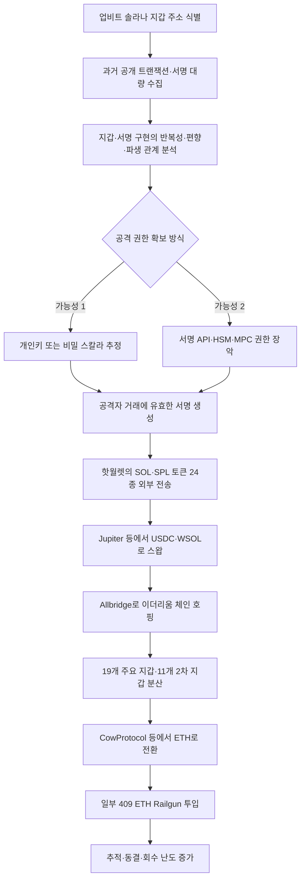

2025년 11월 27일 새벽, 국내 최대 가상자산 거래소 **업비트(Upbit)** 의 솔라나 네트워크 계열 핫월렛에서 대규모 비정상 출금이 발생했습니다.

약 54분 동안 솔라나(SOL)와 솔라나 기반 토큰 24종이 업비트가 지정하지 않은 외부 지갑으로 전송됐습니다.  
최종 피해액은 사고 시점 가격 기준 약 **445억 원**으로 집계됐습니다.

처음에는 관리자 계정 탈취, 직원 PC 악성코드 감염, 지갑 서버 침해 등이 원인으로 거론됐습니다.

그러나 사고 다음 날 두나무는 더 중대한 사실을 공개했습니다.

> 블록체인에 공개되어 있는 다수의 업비트 지갑 트랜잭션을 분석하면  
> 개인키를 추정할 수 있는 업비트의 보안 취약점을 발견해 조치했다.

이 설명이 사실이라면 이번 사고는 단순히 서버 비밀번호나 관리자 계정을 탈취한 사건이 아닐 수 있습니다.

정상적으로 공개된 과거 거래의 **디지털 서명 데이터**가 공격자에게 개인키 또는 서명 권한을 재구성할 단서를 제공했고, 공격자가 이를 이용해 블록체인이 정상 거래로 받아들이는 유효한 출금 서명을 만들어냈을 가능성까지 조사해야 합니다.

다만 매우 중요한 한계가 있습니다.

업비트는 공개 거래로 개인키를 추정할 수 있는 취약점을 발견했다고 밝혔지만,  
**그 취약점이 실제 침해에 사용됐다는 최종 기술 보고서와 재현 결과는 공개하지 않았습니다.**

따라서 이 글은 다음 세 가지를 엄격히 구분합니다.

1. 업비트·당국·온체인 자료로 **확인된 사실**
2. 공개자료를 토대로 재구성한 **가능성이 높은 공격 시나리오**
3. 아직 포렌식 결과가 공개되지 않아 **단정할 수 없는 내용**

<!--more-->

---

## 핵심 요약

- **사고 발생:** 2025년 11월 27일 오전 4시 42분부터 오전 5시 36분까지 약 54분 동안 비정상 출금이 이어졌습니다.
- **피해 대상:** 업비트가 운영하던 솔라나 네트워크 계열 핫월렛입니다. 콜드월렛 침해는 확인되지 않았습니다.
- **피해 규모:** 솔라나 계열 가상자산 24종, 사고 시점 가격 기준 약 445억 원입니다.
- **회원 피해:** 약 386억 원이며 업비트 보유 자산으로 전액 보전됐습니다.
- **업비트 자체 피해:** 약 59억 원으로 공개됐습니다.
- **동결 규모:** 2025년 12월 8일 기준 약 26억 원을 동결해 회수 절차를 진행했습니다.
- **핵심 취약점:** 업비트는 공개된 다수의 지갑 트랜잭션을 분석하면 개인키를 추정할 수 있는 자사 지갑 시스템 취약점을 발견했다고 밝혔습니다.
- **공격 원인 확정 여부:** 취약점의 정확한 코드, 서명 구현, 키 생성 방식과 실제 공격 재현 결과는 공개되지 않았습니다.
- **기술적 유력 가설:** 표준 Ed25519 자체의 문제가 아니라, 업비트의 지갑·서명·키 파생 구현에서 반복되거나 상관관계가 있는 서명값, 약한 키 생성, 잘못된 자체 구현 등이 발생했을 가능성이 거론됩니다.
- **출금 공격:** 공격자는 유효한 서명 권한을 확보한 뒤 핫월렛에 접근 가능한 24종 자산을 빠르게 외부 지갑으로 이동시킨 것으로 보입니다.
- **자금세탁:** 공개 온체인 분석에서는 솔라나 DEX에서 토큰을 USDC·WSOL 등으로 교환한 뒤 Allbridge로 이더리움에 넘기고, 여러 지갑으로 분산한 다음 ETH로 바꾸고 일부를 Railgun에 투입한 흐름이 확인됐습니다.
- **라자루스 배후설:** 북한 정찰총국 산하 라자루스 그룹이 유력하게 의심됐지만, 2026년 7월 20일 현재 공개된 경찰의 최종 귀속 결과는 없습니다.
- **최신 당국 조치:** 금융감독원은 약 7개월간의 검사를 거쳐 2026년 7월 두나무에 검사의견서를 송부하고 제재 절차에 착수했습니다. 최종 제재는 아직 확정되지 않았습니다.
- **핵심 교훈:** 개인키 보호만으로는 부족합니다. 유효한 키로 서명된 거래라도 금액·속도·목적지·자산 수·지갑 잔액 변화가 비정상이면 자동 중지되어야 합니다.

---

## 사실 관계 정리

### ✅ 공개적으로 확인된 내용

- 업비트는 2025년 11월 27일 오전 4시 42분경 솔라나 네트워크 계열 자산이 내부에서 지정하지 않은 외부 지갑으로 전송된 정황을 확인했다고 밝혔습니다.
- 비정상 출금은 오전 5시 36분까지 약 54분간 이어졌습니다.
- 유출 자산은 솔라나 네트워크 계열 24종입니다.
- 사고 시점 가격 기준 피해액은 약 445억 원입니다.
- 비정상 출금은 업비트가 운영하던 핫월렛에서 발생했습니다.
- 콜드월렛에서는 침해나 탈취가 확인되지 않았습니다.
- 업비트는 추가 출금을 막기 위해 자산을 콜드월렛으로 이전했습니다.
- 회원 피해 자산 약 386억 원은 업비트 보유 자산으로 전액 보전됐습니다.
- 업비트 자체 피해 자산은 약 59억 원입니다.
- 2025년 12월 8일 기준 약 26억 원의 피해 자산이 동결됐습니다.
- 모든 디지털 자산 지갑을 교체한 뒤 2025년 12월 6일부터 입출금 서비스를 재개했습니다.
- 업비트는 공개된 다수의 자사 지갑 거래를 분석하면 개인키를 추정할 수 있는 보안 취약점을 발견해 조치했다고 밝혔습니다.
- 경찰은 2025년 12월 사건을 정식 수사로 전환했습니다.
- 금융감독원은 2026년 7월 두나무에 검사의견서를 송부해 제재 절차를 시작했습니다.

### 🟦 공개 온체인 분석에서 확인된 흐름

민간 온체인 분석 보고서에서는 다음 흐름이 제시됐습니다.

- 24종 토큰 탈취
- Jupiter 등 솔라나 DEX·애그리게이터를 통한 대량 교환
- 총 7,646건의 스왑 거래
- 토큰을 USDC·WSOL 등 유동성이 높은 자산으로 통합
- Allbridge를 이용해 약 2,213만 달러 상당을 이더리움 네트워크로 이동
- 이더리움에서 19개 주요 수신 지갑과 11개 2차 지갑으로 분산
- USDC·USDT를 ETH로 교환
- 약 409 ETH를 Railgun 프라이버시 프로토콜로 전송

이 수치는 업비트나 수사기관의 최종 조사 결과가 아니라,  
공개 블록체인 데이터를 분석한 민간 보고서에 근거합니다.

### 🟨 아직 공개되지 않은 내용

- 개인키 추정 취약점이 실제 공격에 사용됐는지
- 취약점이 존재한 정확한 소스코드와 라이브러리
- 표준 Ed25519 구현을 변경했는지
- 반복·편향·상관관계가 있는 서명값이 실제로 생성됐는지
- 개인키 생성 과정의 난수 품질에 문제가 있었는지
- 지갑 키 파생 방식에 결함이 있었는지
- 공격자가 개인키를 직접 계산했는지
- 공격자가 지갑 서명 서버나 HSM·MPC 인프라를 장악했는지
- 관리자 계정, 직원 PC 또는 배포 시스템이 함께 침해됐는지
- 취약점이 언제부터 존재했는지
- 공격자가 몇 건의 과거 트랜잭션을 수집했는지
- 최초 침투 또는 사전 정보 수집 시점
- 내부 협력자나 공급망 침해 여부
- 라자루스 또는 다른 위협 행위자의 최종 귀속
- 동결된 26억 원 외 추가 회수 여부
- 금융감독원의 최종 제재 내용

---

## 🗓️ 타임라인

| 일시 | 내용 |
|---|---|
| **2025-11-27 04:42** | 솔라나 계열 핫월렛에서 비정상 출금 시작·인지 |
| **2025-11-27 05:00** | 업비트 내부 긴급회의 |
| **2025-11-27 05:27** | 솔라나 네트워크 계열 디지털 자산 입출금 중단 |
| **2025-11-27 05:36** | 마지막 비정상 출금 확인, 총 54분간 공격 지속 |
| **2025-11-27 08:55** | 모든 디지털 자산 입출금 중단 |
| **2025-11-27 10:58** | 금융감독원 최초 보고 |
| **2025-11-27 11:57** | 한국인터넷진흥원(KISA) 신고 |
| **2025-11-27 12:33** | 이용자 대상 비정상 출금 사실 공지 |
| **2025-11-27 13:16** | 경찰 신고 |
| **2025-11-27 15:00** | 금융위원회 보고 |
| **2025-11-27 오후** | 피해 규모를 최초 약 540억 원에서 사고 시점 가격 기준 약 445억 원으로 정정 |
| **2025-11-28** | 두나무 대표 사과문 발표, 공개 거래로 개인키 추정이 가능한 취약점 발견 사실 공개 |
| **2025-12-05** | 경찰, 입건 전 조사에서 정식 수사로 전환 |
| **2025-12-06** | 지갑 교체 후 전체 디지털 자산 입출금 재개 |
| **2025-12-08** | 피해액 중 약 26억 원 동결 및 회수 절차 공개 |
| **2026-07-19** | 금융감독원, 두나무에 검사의견서 송부…제재 절차 착수 |
| **2026-07-20 현재** | 최종 공격 원인 보고서·공격자 귀속·제재 결과는 공개되지 않음 |

---

## 1. 사고 개요

### 가상자산 거래소 해킹은 데이터 유출 사고와 다르다

일반적인 개인정보 침해 사고에서는 공격자가 데이터베이스를 열람하거나 파일을 외부로 반출합니다.

가상자산 거래소 해킹은 다릅니다.

개인키 또는 서명 권한이 공격자에게 넘어가면 공격자는 거래소 내부 장부만 변경하는 것이 아니라, 블록체인 네트워크에 직접 유효한 거래를 제출할 수 있습니다.

네트워크 관점에서는 해당 거래가 공격인지 정상 출금인지 알기 어렵습니다.

```text
유효한 개인키 또는 서명 권한 확보
→ 정상 형식의 블록체인 트랜잭션 생성
→ 유효한 디지털 서명 첨부
→ 네트워크 검증 통과
→ 자산 소유권이 공격자 주소로 이동
→ 블록 확정 이후 사실상 취소 불가
```

은행 송금은 중앙기관이 취소하거나 지급정지할 수 있습니다.

그러나 블록체인에서 유효하게 확정된 자산 이동은 원칙적으로 되돌리기 어렵습니다.  
따라서 공격 이후에는 발행재단, 스테이블코인 운영사, 브리지, 거래소와 협력해 자산을 동결하거나 출구를 막아야 합니다.

이번 사고에서 업비트가 즉시 온체인 추적과 동결 요청에 나선 이유입니다.

---

## 2. 핫월렛과 콜드월렛

### 🔥 핫월렛

핫월렛은 인터넷과 연결되거나 온라인 출금 시스템과 연동된 지갑입니다.

거래소가 회원 출금을 빠르게 처리하려면 일정량의 자산을 핫월렛에 보관해야 합니다.

장점은 빠른 처리입니다.  
단점은 지갑 키 또는 서명 인프라가 공격 표면에 노출된다는 점입니다.

### ❄️ 콜드월렛

콜드월렛은 인터넷에서 분리된 환경에 개인키를 보관합니다.

대규모 자산을 장기 보관하는 데 적합하지만, 출금을 처리하려면 별도의 승인·이관 절차가 필요합니다.

| 구분 | 핫월렛 | 콜드월렛 |
|---|---|---|
| 네트워크 연결 | 온라인 또는 온라인 시스템과 연계 | 오프라인 또는 강하게 격리 |
| 출금 속도 | 빠름 | 느림 |
| 운영 편의성 | 높음 | 낮음 |
| 공격 표면 | 큼 | 상대적으로 작음 |
| 주요 용도 | 일상적인 회원 출금 | 대규모 자산 보관 |
| 이번 사고 | 침해·유출 발생 | 직접 침해 확인 없음 |

이번 사고는 콜드월렛의 자산까지 탈취된 사건은 아닙니다.

그러나 핫월렛에 약 445억 원 상당의 자산이 노출돼 있었고,  
서명 권한이 무너지자 54분 동안 다수 자산이 빠져나갔습니다.

따라서 단순히 “콜드월렛은 안전했다”는 평가로 끝낼 수 없습니다.

핫월렛에 얼마를 보관했는지,  
자산별 출금 한도가 있었는지,  
신규 목적지 주소에 대한 지연 정책이 있었는지,  
대량 출금 시 자동 서명 중단 기능이 있었는지를 함께 봐야 합니다.

---

## 3. 피해 자산 24종

업비트가 공개한 대상 자산은 다음과 같습니다.

| No. | 자산 | 심볼 |
|---:|---|---|
| 1 | 더블제로 | 2Z |
| 2 | 액세스프로토콜 | ACS |
| 3 | 봉크 | BONK |
| 4 | 두들즈 | DOOD |
| 5 | 드리프트 | DRIFT |
| 6 | 후마파이낸스 | HUMA |
| 7 | 아이오넷 | IO |
| 8 | 지토 | JTO |
| 9 | 주피터 | JUP |
| 10 | 솔레이어 | LAYER |
| 11 | 매직에덴 | ME |
| 12 | 캣인어독스월드 | MEW |
| 13 | 무뎅 | MOODENG |
| 14 | 오르카 | ORCA |
| 15 | 펏지펭귄 | PENGU |
| 16 | 피스네트워크 | PYTH |
| 17 | 레이디움 | RAY |
| 18 | 렌더토큰 | RENDER |
| 19 | 솔라나 | SOL |
| 20 | 소닉SVM | SONIC |
| 21 | 쑨 | SOON |
| 22 | 오피셜트럼프 | TRUMP |
| 23 | 유에스디코인 | USDC |
| 24 | 웜홀 | W |

국회에 제출된 자료를 인용한 보도에 따르면, 54분 동안 이동한 토큰의 명목 수량은 약 **1,040억 6,470만 개**입니다.

그러나 토큰마다 발행량과 단가가 전혀 다르므로  
“코인 개수”만으로 피해를 평가하면 안 됩니다.

- 수량 기준으로는 BONK가 대부분을 차지했습니다.
- 금액 기준으로는 SOL이 약 189억 8,822만 원으로 가장 컸습니다.
- PENGU 약 38억 5,162만 원
- TRUMP 약 29억 1,763만 원이 뒤를 이었습니다.

핵심은 공격자가 특정 고가 자산만 골라 가져간 것이 아니라,  
**해당 서명 권한으로 접근 가능한 여러 토큰 계정을 광범위하게 비운 정황**입니다.

이는 공격자가 사전에 업비트의 솔라나 지갑 구조와 보유 토큰을 파악했거나,  
자동화된 스크립트로 접근 가능한 자산을 순회했을 가능성을 보여줍니다.

---

## 4. 업비트가 인정한 핵심 취약점

업비트는 사고 다음 날 다음 취지로 설명했습니다.

```text
블록체인에 공개된 다수의 업비트 지갑 트랜잭션을 분석하면
개인키를 추정할 수 있는 당사의 보안 취약점을 발견해 조치했다.
```

이 문장은 매우 중요합니다.

블록체인 거래는 원래 공개됩니다.

- 송신 주소
- 수신 주소
- 전송 자산
- 수량
- 트랜잭션 메시지
- 공개키
- 디지털 서명

이 정보는 누구나 볼 수 있습니다.

그러나 정상적인 암호 구현이라면 수백만 건의 거래와 서명을 모아도 개인키를 계산할 수 없어야 합니다.

따라서 공개 트랜잭션이 문제가 아니라,  
**업비트의 지갑 또는 서명 시스템이 공개 데이터에 개인키와 연관된 반복성·편향·상관관계를 남겼을 가능성**이 핵심입니다.

### 잘못된 해석

```text
솔라나 블록체인의 거래가 공개돼서 개인키가 털렸다.
```

이 표현은 틀립니다.

### 더 정확한 해석

```text
솔라나 거래와 서명은 원래 공개되지만,
업비트의 지갑·서명 구현에 결함이 있어
공개된 여러 서명으로부터 개인키를 추정할 가능성이 생겼다.
```

즉, 솔라나 네트워크 전체의 암호체계가 무너진 사건으로 볼 수 없습니다.

공개된 범위에서 문제의 중심은  
**업비트가 사용한 지갑·키 생성·서명 인프라의 구현**입니다.

---

## 5. 솔라나의 Ed25519 서명은 어떻게 작동하는가

솔라나 트랜잭션은 일반적으로 **Ed25519** 디지털 서명을 사용합니다.

서명자는 개인키로 트랜잭션 메시지에 서명하고,  
검증자는 공개키와 서명, 메시지만으로 서명이 유효한지 확인합니다.

```text
개인키 + 트랜잭션 메시지
→ Ed25519 서명 생성
→ 서명 + 공개키 + 메시지를 블록체인에 제출
→ 검증자가 서명 유효성 확인
```

표준 Ed25519에서는 서명에 사용되는 일회성 값이 단순한 외부 난수 생성기에만 의존하지 않습니다.

RFC 8032는 개인키에서 파생한 비밀 prefix와 메시지를 해시해  
메시지별 서명 스칼라를 결정론적으로 계산합니다.

단순화하면 다음과 같습니다.

```text
개인키 seed
→ SHA-512 해시
→ 비밀 스칼라와 비밀 prefix 생성

비밀 prefix + 메시지
→ 메시지별 서명값 r 생성

r과 개인키 스칼라
→ 최종 서명 R, S 생성
```

표준 구현에서는 같은 개인키와 같은 메시지는 같은 서명을 만들 수 있지만,  
서로 다른 메시지에 대해서는 개인키를 역산할 수 있는 관계가 노출되지 않아야 합니다.

### 중요한 기술적 주의

언론과 전문가 분석에서는 이번 공격을 **편향 논스 공격**으로 설명하기도 했습니다.

그러나 Ed25519는 일반적인 ECDSA처럼 매 서명마다 외부 난수 논스를 뽑는 구조와 다릅니다.

따라서 정확한 표현은 다음과 같습니다.

> 업비트가 표준 Ed25519를 그대로 안전하게 사용했다면 공개 서명으로 개인키를 추정하기 어렵다.  
> 개인키 추정이 가능했다면 자체 서명 로직, 키 파생, 메시지 처리, 비밀 prefix 관리, HSM·MPC 연동 또는 다른 구현 계층에서 표준의 보안 가정을 깨는 결함이 있었을 가능성을 조사해야 한다.

“편향 논스”는 가능한 설명 중 하나일 뿐,  
업비트가 공개한 확정 원인은 아닙니다.

---

## 6. 어떤 구현 결함이 개인키 추정을 가능하게 할 수 있는가

업비트가 정확한 취약점 코드를 공개하지 않았기 때문에 아래 내용은 **가능한 기술 시나리오**입니다.

| 가능 시나리오 | 설명 | 공개 확인 여부 |
|---|---|---|
| **서명값 반복** | 서로 다른 거래에 동일하거나 재사용된 메시지별 서명값이 사용됨 | 미공개 |
| **서명값 상관관계** | 서명값이 좁은 범위·일정 패턴·선형 관계를 가짐 | 전문가 가설 |
| **잘못된 자체 Ed25519 구현** | 표준 라이브러리 대신 수정된 서명 코드 사용 | 미공개 |
| **약한 개인키 생성** | 키 생성 seed의 엔트로피가 부족하거나 예측 가능 | 미공개 |
| **취약한 지갑 키 파생** | 여러 지갑 키를 잘못된 결정론적 방식으로 파생 | 미공개 |
| **비밀 prefix 재사용·노출** | Ed25519 내부 비밀값이 여러 키·서명 간 잘못 공유됨 | 미공개 |
| **메시지 직렬화 오류** | 실제 서명한 메시지와 검증·기록 구조 사이에 위험한 불일치 발생 | 미공개 |
| **HSM·MPC 구현 결함** | 서명 분산 과정이나 하드웨어 연동에서 비밀 정보가 노출 | 미공개 |
| **오류 주입·사이드채널** | 서명 서버의 시간·오류·메모리·전력 특성으로 비밀값 일부 노출 | 미공개 |
| **서명 인프라 장악** | 개인키를 계산하지 않고 서명 서버 자체를 공격자가 사용 | 배제되지 않음 |

### 6-1. 동일한 서명값이 재사용되는 경우

서로 다른 두 메시지에 같은 내부 서명값이 사용되면,  
공개된 두 서명의 차이를 이용해 개인키와 관련된 비밀 스칼라를 계산할 수 있는 경우가 있습니다.

이는 디지털 서명 구현에서 가장 잘 알려진 치명적 오류 중 하나입니다.

### 6-2. 완전히 같지는 않지만 일정한 편향이 있는 경우

내부 서명값이 반복되지는 않더라도 다음과 같은 문제가 있으면 위험할 수 있습니다.

- 상위 또는 하위 비트가 반복
- 특정 범위에 값이 집중
- 시간값이나 카운터와 상관관계
- 여러 서명 사이에 선형 관계
- 여러 키에서 비밀 prefix를 잘못 공유

이 경우 공격자는 많은 서명을 수집해 통계·격자 기반 수학 기법으로 비밀값을 추정할 수 있습니다.

다만 이 설명은 일반적인 디지털 서명 취약점과 전문가 가설을 적용한 것입니다.  
업비트 사고에서 실제로 어떤 관계가 발견됐는지는 공개되지 않았습니다.

### 6-3. 개인키 생성 자체가 약한 경우

개인키 seed가 충분히 무작위가 아니면 공격자는 공개키와 거래 패턴을 이용해 후보 키를 줄일 수 있습니다.

예를 들어 다음과 같은 구현은 위험합니다.

- 시간값에 의존한 키 생성
- 짧은 seed
- 예측 가능한 서버 식별자 사용
- 여러 지갑에서 seed 일부 재사용
- 개발·테스트용 고정값이 운영에 포함
- 취약한 난수 생성기 사용

이 경우 공개 서명을 분석했다기보다  
공개키와 지갑 생성 패턴을 분석해 개인키 후보를 좁혔을 가능성도 있습니다.

### 6-4. 서명 서버를 장악한 경우

공격자가 개인키를 직접 계산하지 않아도 결과는 같을 수 있습니다.

```text
서명 API 인증 우회
→ 지갑 서버에 악성 출금 메시지 제출
→ 정상 HSM·MPC가 공격자 거래에 서명
→ 블록체인에서 유효한 정상 서명으로 처리
```

이 경우 개인키는 HSM 밖으로 나오지 않았더라도  
공격자가 서명 권한을 사실상 탈취한 것입니다.

그래서 포렌식에서는 다음 두 질문을 분리해야 합니다.

1. 개인키가 실제로 복원·유출됐는가?
2. 개인키는 안전했지만 서명 인프라가 공격자 요청에 서명했는가?

업비트는 공개 거래로 개인키를 추정할 수 있는 취약점을 발견했다고 밝혔지만,  
실제 사고가 어느 경로로 실행됐는지는 공개하지 않았습니다.

---

## 7. 공개자료로 재구성한 공격 방법

아래는 업비트의 취약점 설명과 온체인 흐름을 결합해 재구성한 **가장 유력한 기술 시나리오**입니다.

각 단계의 확실성을 함께 표시합니다.

### 1단계. 업비트 솔라나 지갑 식별

**확실성: 높음**

공격자는 블록체인 탐색기와 온체인 데이터로 업비트가 사용하는 솔라나 지갑 주소를 식별할 수 있습니다.

거래소 지갑은 다음 특징으로 군집화할 수 있습니다.

- 다수 회원 입금 주소와 반복적으로 연결
- 일정한 시간대에 자산 통합
- 특정 대형 핫월렛으로 자산 집중
- 거래소 출금 패턴
- 알려진 업비트 지갑 라벨
- 동일한 수수료·서명·토큰 계정 패턴

이 단계는 별도의 침입 없이 공개 데이터만으로 가능합니다.

### 2단계. 과거 트랜잭션과 서명 대량 수집

**확실성: 중간~높음**

공격자는 식별한 지갑들의 과거 트랜잭션을 수집했을 가능성이 있습니다.

수집 대상은 다음과 같습니다.

- 공개키
- 트랜잭션 메시지
- Ed25519 서명값
- 서명 시각
- 최근 블록해시
- 자산 종류
- 토큰 계정
- 수수료 지불 계정
- 반복되는 지갑 운영 패턴

업비트가 “다수의 트랜잭션을 분석하면 개인키를 추정할 수 있었다”고 밝힌 만큼,  
대량 거래 수집 단계는 취약점 악용 시나리오와 직접 연결됩니다.

### 3단계. 서명·키 생성 패턴 분석

**확실성: 중간**

공격자는 서명값 사이에 정상적인 Ed25519에서는 나타나지 않아야 할 관계가 있는지 검사했을 수 있습니다.

```text
동일한 R 값이 반복되는가
서명값 일부 비트가 반복되는가
지갑별 서명값 분포가 비정상적으로 좁은가
여러 공개키 사이에 파생 관계가 있는가
특정 시간·서버·지갑군에서 같은 패턴이 나타나는가
```

이 단계는 고도의 암호 분석 능력과 대량 계산 자원을 필요로 할 수 있습니다.

다만 실제로 어떤 패턴이 발견됐는지는 공개되지 않았습니다.

### 4단계. 개인키 또는 서명 권한 재구성

**확실성: 미확정**

취약점이 충분히 심각했다면 공격자는 다음 중 하나를 달성했을 수 있습니다.

- 핫월렛 개인키 seed 복원
- 개인키와 동등한 비밀 스칼라 복원
- 일부 지갑의 키 파생 규칙 복원
- 지갑 서명 API 인증값 획득
- 서명 인프라가 공격자 거래에 서명하도록 조작

공격자는 복원한 키에서 공개키를 다시 계산해  
업비트 지갑 주소와 일치하는지 오프라인에서 검증할 수 있습니다.

이 검증에 성공하면 실제 자산 이동 전에 공격 성공 가능성을 확인할 수 있습니다.

### 5단계. 핫월렛 보유 자산과 토큰 계정 조사

**확실성: 높음**

솔라나에서는 지갑이 보유한 SOL과 SPL 토큰 계정을 공개적으로 확인할 수 있습니다.

공격자는 다음을 사전에 파악할 수 있습니다.

- 탈취 가능한 SOL 잔액
- 24종 토큰별 잔액
- 토큰 계정 주소
- 유동성이 높은 자산
- 발행재단이 동결할 수 있는 토큰
- DEX에서 교환 가능한 경로
- 브리지 지원 여부

공격이 시작된 뒤 자산 종류를 하나씩 파악한 것이 아니라,  
사전에 자동 출금 목록과 세탁 경로를 준비했을 가능성이 높습니다.

### 6단계. 공격자 지갑과 자동화 스크립트 준비

**확실성: 중간~높음**

54분 동안 24종 자산을 이동하려면 수동 조작만으로는 비효율적입니다.

공격자는 다음을 준비했을 가능성이 큽니다.

- 솔라나 공격자 지갑 여러 개
- 토큰별 전송 명령 생성
- 수수료용 SOL
- 실패 거래 재시도
- 토큰 계정 생성
- 분할 전송
- 자산별 DEX 스왑 경로
- 브리지 수신용 이더리움 지갑
- 추적 회피용 다단계 분산

### 7단계. 유효한 서명으로 비정상 출금 실행

**확실성: 높음**

공격자가 개인키 또는 서명 권한을 확보했다면 블록체인에는 정상 서명 거래로 보입니다.

```text
업비트 핫월렛
→ 공격자 지정 솔라나 지갑
→ 24종 자산 전송
```

이 단계에서는 WAF의 SQL 인젝션 탐지나 로그인 실패 탐지만으로는 막기 어렵습니다.

블록체인이 확인하는 것은 다음입니다.

```text
서명이 유효한가?
수수료를 낼 수 있는가?
보유 잔액이 충분한가?
트랜잭션 형식이 올바른가?
```

서명이 유효하면 “이 거래는 공격자가 만든 것”이라는 사실을 블록체인이 알 수 없습니다.

### 8단계. 접근 가능한 자산을 광범위하게 이동

**확실성: 높음**

공격자는 54분 동안 솔라나 계열 24종 자산을 외부로 이동시켰습니다.

이는 특정 코인 하나의 스마트컨트랙트 취약점이 아니라,  
**지갑 서명 권한 전체가 영향을 받았을 가능성**을 보여줍니다.

스마트컨트랙트 하나의 오류라면 보통 특정 자산이나 프로토콜에 피해가 집중됩니다.

반면 이번 사고는 동일 네트워크의 다양한 자산이 함께 빠져나갔습니다.

### 9단계. 솔라나 DEX에서 자산 통합

**확실성: 공개 온체인 분석 기준 높음**

공격자는 유동성이 낮고 동결 위험이 있는 토큰을 그대로 보유하지 않았습니다.

Jupiter 등 DEX와 애그리게이터를 이용해 다음과 같이 바꿨습니다.

```text
각종 SPL 토큰
→ WSOL
→ USDC
```

또는

```text
각종 SPL 토큰
→ USDC
```

민간 보고서에서는 총 7,646건의 스왑이 확인됐습니다.

Jupiter는 여러 DEX의 유동성을 비교해 거래 경로를 나누므로  
대량 토큰을 빠르게 처분하면서 가격 충격을 줄이는 데 유리합니다.

### 10단계. Allbridge를 통한 체인 호핑

**확실성: 공개 온체인 분석 기준 높음**

공격자는 솔라나에 남아 있는 자산을 이더리움으로 이동시키기 위해 Allbridge를 사용했습니다.

민간 보고서에 따르면 약 2,213만 달러 상당의 USDC·USDT가 이더리움으로 넘어갔습니다.

브리지는 사고 당일 오후 7시 10분경 시작돼 다음 날 오전 5시 48분경까지 약 10시간 38분 동안 분할 진행됐습니다.

한꺼번에 이동하지 않은 이유는 다음과 같이 해석할 수 있습니다.

- 브리지 유동성 부족 회피
- 실패율과 슬리피지 감소
- 대규모 이동 경보 회피
- 여러 지갑으로 분산
- 추적팀의 대응 시간 증가

### 11단계. 이더리움에서 다단계 분산

**확실성: 공개 온체인 분석 기준 높음**

브리지를 통과한 자산은 19개 주요 지갑으로 분산됐고,  
일부는 다시 11개 2차 지갑으로 이동했습니다.

```text
Allbridge
→ 19개 주요 지갑
→ 11개 2차 지갑
→ 추가 교환·보관·프라이버시 프로토콜
```

이렇게 분산하면 단순한 주소 블랙리스트만으로 전체 자금 흐름을 막기 어려워집니다.

### 12단계. 동결 가능한 스테이블코인을 ETH로 전환

**확실성: 공개 온체인 분석 기준 높음**

USDC와 USDT는 발행사가 특정 주소의 자산을 동결할 수 있습니다.

공격자는 이를 장기간 보유할수록 동결 위험이 커집니다.

따라서 이더리움에서 USDC·USDT를 ETH로 교환했습니다.

민간 분석에서는 CowProtocol 사용 비중이 높게 나타났습니다.

CowProtocol은 오프체인 주문 집계와 배치 방식으로  
대량 스왑의 슬리피지와 MEV 공격 위험을 줄이는 데 유리할 수 있습니다.

### 13단계. Railgun을 통한 추적 차단 시도

**확실성: 공개 온체인 분석 기준 높음**

약 409 ETH가 Railgun 프라이버시 프로토콜로 이동한 것으로 분석됐습니다.

Railgun은 영지식증명 기반의 비공개 잔액과 전송을 지원합니다.

자산이 Shielded Balance로 들어가면 일반적인 온체인 분석만으로는  
이후 수신자와 이동량을 연결하기 어려워집니다.

이는 공격자가 단순 절도만 준비한 것이 아니라  
**탈취 이후 세탁·추적 회피 단계까지 계획했다는 정황**입니다.

---

## 8. 공격 흐름 전체 구성도



이 구성도에서 A·B는 공개 정보 수집 단계입니다.

C·D의 정확한 기술은 아직 공개되지 않았습니다.

G 이후는 블록체인에 기록된 유효한 거래와 공개 온체인 분석을 통해 상당 부분 재구성할 수 있습니다.

---

## 9. 54분 동안 왜 멈추지 못했는가

업비트는 오전 4시 42분 이상 출금을 인지했고,  
18분 뒤인 오전 5시 긴급회의를 열었습니다.

솔라나 계열 입출금을 중단한 시각은 오전 5시 27분입니다.

그러나 비정상 출금은 오전 5시 36분까지 이어졌습니다.

```text
04:42 이상 출금 시작·인지
→ 05:00 긴급회의
→ 05:27 솔라나 계열 입출금 중단
→ 05:36 마지막 비정상 출금
```

### 입출금 화면 중단과 지갑 서명 중단은 다르다

거래소의 회원 입출금 서비스를 중단해도  
이미 공격자가 개인키를 확보했다면 외부에서 직접 트랜잭션을 만들 수 있습니다.

또는 서명 서버가 이미 공격자에게 장악된 상태라면  
프론트엔드 입출금 중단만으로는 서명을 멈출 수 없습니다.

따라서 비상 대응은 다음 계층을 동시에 차단해야 합니다.

1. 회원 출금 API 중단
2. 지갑 오케스트레이터 중단
3. 서명 API 중단
4. HSM·MPC 승인 정책 중단
5. 핫월렛 키 폐기 또는 격리
6. 잔여 자산의 신규 콜드월렛 이동
7. 공격자 주소와 관련 토큰 계정 차단
8. 발행재단·브리지·거래소에 동결 요청

이번 사고의 상세 내부 대응 순서는 공개되지 않았습니다.

하지만 54분간 출금이 이어졌다는 사실은  
**이상 거래 인지와 실제 서명 권한 차단 사이에 간극이 있었는지**를 조사해야 한다는 의미입니다.

---

## 10. 정상 서명이라도 차단했어야 한다

이번 사고에서 가장 중요한 방어 원칙입니다.

> 개인키가 맞다고 해서 거래 행위까지 정상인 것은 아니다.

공격자가 올바른 개인키로 서명하면 블록체인은 정상 거래로 처리합니다.

그러나 거래소 내부 정책은 다음을 별도로 판단할 수 있어야 합니다.

- 평소보다 큰 출금인가
- 새로운 목적지 주소인가
- 짧은 시간에 여러 토큰을 비우는가
- 핫월렛 잔액이 급격히 감소하는가
- 회원 출금 요청과 대응되는 거래인가
- 승인 티켓·업무 요청이 존재하는가
- 운영 시간과 다른가
- 동일 서명자에서 비정상적으로 많은 거래가 발생하는가
- 발행재단이 다른 24종 토큰을 동시에 이동하는가
- 브리지·DEX·프라이버시 도구로 즉시 이동하는가

### 필요한 자동 차단 정책

```text
등록되지 않은 목적지 주소
+ 일정 금액 초과
+ 여러 자산 동시 이동
+ 짧은 시간 반복
= 서명 즉시 중지 및 다중 승인 전환
```

추가로 다음 정책이 필요합니다.

- 핫월렛 총잔액 기준 회로 차단기
- 자산별 시간당 출금 한도
- 신규 주소 30분 지연
- 대량 출금 시 오프라인 승인
- 회원 출금 원장과 온체인 거래의 1:1 대조
- 서명 요청과 출금 요청의 고유 ID 결합
- 비상 시 HSM 정책을 즉시 폐쇄하는 Kill Switch
- 운영자 한 명이 해제할 수 없는 다중 통제
- 핫월렛 키의 짧은 수명과 주기적 회전
- 네트워크별 독립 키와 독립 승인 정책

---

## 11. 늑장 신고·공지 논란

국회에 제출된 자료를 인용한 보도에 따르면 업비트의 보고 시점은 다음과 같습니다.

| 대상 | 시각 | 최초 인지 후 |
|---|---:|---:|
| 내부 긴급회의 | 05:00 | 약 18분 |
| 솔라나 계열 입출금 중단 | 05:27 | 약 45분 |
| 전체 입출금 중단 | 08:55 | 약 4시간 13분 |
| 금융감독원 | 10:58 | 약 6시간 16분 |
| KISA | 11:57 | 약 7시간 15분 |
| 이용자 공지 | 12:33 | 약 7시간 51분 |
| 경찰 | 13:16 | 약 8시간 34분 |
| 금융위원회 | 15:00 | 약 10시간 18분 |

같은 날 오전에는 두나무와 네이버파이낸셜의 합병 관련 행사가 열렸습니다.

모든 외부 보고와 이용자 공지가 행사 종료 후 이뤄지면서  
의도적으로 발표를 늦춘 것 아니냐는 의혹이 제기됐습니다.

두나무는 사고 상황과 피해 규모를 파악하느라 공지가 늦어졌으며  
행사를 고려한 것은 아니라고 설명했습니다.

현재 공개자료만으로는 합병 행사를 위해 신고를 고의로 지연했다고 단정할 수 없습니다.

다만 다음 문제는 별개입니다.

> 대규모 가상자산이 이미 외부로 이동한 사고에서  
> 이용자와 관계기관에 언제, 어느 수준까지 알려야 하는가?

정확한 원인과 피해액이 확정될 때까지 기다리기보다  
다음처럼 단계적으로 공지하는 체계가 필요합니다.

```text
1차: 비정상 출금 탐지 및 입출금 중단
2차: 영향 네트워크·자산 범위
3차: 잠정 피해 규모와 회원 보전
4차: 확인된 원인과 재발 방지
5차: 회수·수사·제재 진행 상황
```

---

## 12. 자금세탁 방식이 보여주는 공격자의 준비 수준

이번 공격자는 탈취한 24종 자산을 한 주소에 그대로 두지 않았습니다.

### 12-1. 자산 통합

유동성이 낮은 토큰은 추적과 동결이 쉽고,  
대량 매도 시 가격이 급락합니다.

공격자는 여러 DEX를 이용해 이를 USDC·WSOL로 바꿨습니다.

### 12-2. 체인 호핑

솔라나에서 이더리움으로 자산을 옮기면  
추적팀은 서로 다른 네트워크와 브리지 이벤트를 연결해야 합니다.

### 12-3. 지갑 분산

한 주소에 자산을 모으면 동결·감시가 쉽습니다.

19개 주요 지갑과 11개 2차 지갑으로 나누면 분석 그래프가 복잡해집니다.

### 12-4. 동결 가능한 자산 제거

USDC·USDT는 발행사가 동결할 수 있습니다.

이를 ETH로 바꾸면 중앙 발행사의 동결 수단이 줄어듭니다.

### 12-5. 프라이버시 프로토콜 투입

Railgun에 들어간 자산은 일반 블록체인 탐색만으로 이후 흐름을 연결하기 어렵습니다.

이 흐름은 다음을 보여줍니다.

> 공격자는 개인키 또는 서명 권한 확보뿐 아니라  
> 탈취 자산의 환전·분산·체인 이동·동결 회피·추적 차단까지 사전에 준비했을 가능성이 높다.

---

## 13. 라자루스 소행인가

사고 직후 정부와 보안업계에서는 북한 정찰총국 산하 **라자루스 그룹**을 유력하게 검토했습니다.

거론된 근거는 다음과 같습니다.

- 가상자산 거래소를 집중적으로 공격해 온 전력
- 2019년 업비트 해킹에도 라자루스·안다리엘이 관여한 것으로 경찰이 발표
- 여러 지갑으로 빠르게 분산
- 체인 호핑과 프라이버시 도구 사용
- 대규모 온체인 세탁을 준비한 정황
- 2019년 사고와 같은 11월 27일에 공격이 발생
- 고도의 암호 분석과 운영 능력이 필요한 공격 가능성

하지만 공격 기법이 비슷하다는 이유만으로 특정 조직을 확정할 수는 없습니다.

다른 범죄조직도 알려진 라자루스의 세탁 방식을 모방할 수 있습니다.

경찰은 2025년 12월 정식 수사로 전환하면서도  
수사 초기 단계이며 피의자를 특정하지 않았다고 밝혔습니다.

2026년 7월 20일 현재 공개된 최종 귀속 결과는 없습니다.

따라서 정확한 표현은 다음입니다.

```text
라자루스 그룹의 소행일 가능성이 유력하게 검토되고 있다.
```

다음 표현은 아직 부정확합니다.

```text
라자루스가 업비트를 해킹한 것으로 확인됐다.
```

2019년 업비트 사고도 북한 소행이라는 경찰 발표까지 약 5년이 걸렸습니다.

공격자 귀속에는 다음 증거가 필요합니다.

- 공격 인프라 IP와 도메인
- 악성코드 코드 유사성
- 서명·키 공격 도구의 특성
- 서버 접속 기록
- 공격자 지갑의 가스비 출처
- 거래소 KYC 계정
- 자금세탁 인프라 재사용
- 시간대와 운영 패턴
- 해외 수사기관·정보기관 자료
- 압수된 시스템과 계정 자료

---

## 14. 공개자료상 단정하면 안 되는 내용

### ❌ “편향 논스 공격으로 확정됐다”

아닙니다.

편향되거나 상관관계가 있는 서명값은 전문가가 제시한 유력 가설입니다.

업비트는 정확한 취약점 코드를 공개하지 않았습니다.

### ❌ “솔라나의 Ed25519가 깨졌다”

아닙니다.

표준 Ed25519와 솔라나 네트워크 전체가 깨졌다는 증거는 없습니다.

업비트가 사용한 지갑·서명 구현의 취약점으로 봐야 합니다.

### ❌ “개인키를 수학적으로 복원한 것이 확정됐다”

아닙니다.

업비트는 개인키를 추정할 수 있는 취약점을 발견했다고 했지만  
실제 공격자가 그 취약점으로 키를 복원했다고 직접 연결하지 않았습니다.

### ❌ “직원 PC 악성코드 감염이 원인이다”

사고 초기 보안업계 추정 중 하나였지만 확인되지 않았습니다.

### ❌ “관리자 계정 탈취가 원인이다”

정부·업계의 초기 가능성 검토였으며 최종 결과가 아닙니다.

### ❌ “라자루스의 소행으로 확정됐다”

아직 경찰의 최종 수사 발표가 없습니다.

### ❌ “회원은 손실이 없었으므로 피해가 없다”

업비트가 자산을 보전했기 때문에 회원 잔액 손실은 보전됐습니다.

그러나 입출금 중단, 시장 가격 왜곡, 이용 불편, 거래소 신뢰 저하와 시스템 리스크는 별개의 피해입니다.

### ❌ “26억 원을 동결했으므로 회수됐다”

동결과 최종 회수는 다릅니다.

법적·기술적 절차를 거쳐 실제 반환돼야 회수가 완료됩니다.

---

## 15. 조사에서 반드시 확인해야 할 원본 로그

온체인 데이터는 자산이 어디로 이동했는지 보여줍니다.

하지만 온체인 데이터만으로는 다음을 알 수 없습니다.

- 공격자가 개인키를 어떻게 얻었는가
- 누가 서명 요청을 만들었는가
- 어느 서버가 서명했는가
- HSM·MPC가 어떤 정책으로 승인했는가
- 지갑 소프트웨어가 언제 변경됐는가
- 내부 계정이 침해됐는가

따라서 다음 원본 로그가 필요합니다.

### 15-1. 지갑·서명 로그

- 서명 요청 시간
- 서명 요청 고유 ID
- 요청한 서비스·계정·호스트
- 서명 대상 트랜잭션 원문
- 승인자와 승인 단계
- HSM 슬롯·키 ID
- MPC 참여 노드
- 서명 성공·실패
- 정책 우회·긴급 승인
- 서명 요청과 회원 출금 요청의 매핑

### 15-2. HSM·MPC 감사 로그

- 키 생성
- 키 가져오기·내보내기 시도
- 키 사용 횟수
- 정책 변경
- 관리자 로그인
- 펌웨어·클라이언트 버전
- 키 백업
- 쿼럼 변경
- 비정상 노드 참여
- 서명 지연·오류 패턴

### 15-3. 지갑 서버 EDR 로그

- 실행 프로세스
- 명령행
- 로드된 라이브러리
- 파일 생성·변경
- 메모리 덤프 시도
- 디버거 연결
- 비정상 네트워크 연결
- 배포 파일 해시 변경
- 권한 상승
- 계정·서비스 생성
- 원격 접속

### 15-4. 소스코드·빌드·배포 로그

- 취약 지갑 코드의 커밋
- 암호 라이브러리 버전
- 자체 수정 내역
- 코드 리뷰 기록
- CI/CD 실행자
- 빌드 아티팩트 해시
- 운영 배포 시각
- 개발·테스트 키 포함 여부
- 서명 관련 설정값
- 롤백·핫픽스 이력

### 15-5. 네트워크·IAM 로그

- 관리자 VPN 접속
- 클라우드 API 호출
- 비정상 국가·IP
- 서비스 계정 토큰 사용
- 방화벽 정책 변경
- HSM 접근 네트워크
- 서명 API 호출량
- 인증 실패·성공
- 신규 장치 등록

### 15-6. 온체인 원본 데이터

- 모든 공격 트랜잭션
- 공격자 최초 수수료 자금 출처
- 토큰별 이동 순서
- DEX·브리지 호출
- 실패 트랜잭션
- 공격 전 테스트 송금
- 공격자 주소 군집
- CEX 입금 주소
- 프라이버시 프로토콜 유입·유출

---

## 16. AI에게 온체인 데이터만 주면 공격 원인을 설명할 수 있는가

불가능합니다.

블록체인 데이터는 다음을 설명하는 데 매우 유용합니다.

- 어떤 지갑에서 자산이 빠져나갔는가
- 어느 주소로 이동했는가
- 어떤 DEX와 브리지를 사용했는가
- 어디에서 분산됐는가
- 어느 자산이 동결 가능한가

그러나 블록체인 데이터만으로는 다음을 설명할 수 없습니다.

- 개인키가 어떻게 노출됐는가
- 서명 서버가 침해됐는가
- 관리자 계정이 탈취됐는가
- HSM·MPC 정책이 우회됐는가
- 취약한 코드가 언제 배포됐는가
- 내부자가 개입했는가

AI에게 주소, 금액, 거래 방향, 순서만 제공하고  
최초 침투 방법과 내부 공격 경로를 설명하라고 요구하면  
AI는 확인할 수 없는 부분을 추정할 수밖에 없습니다.

모호한 데이터는 AI에게 맥락을 제공하지 못합니다.

오히려 사실이 아닌 내용을 그럴듯하게 설명하는  
**환각(Hallucination)** 을 발생시킬 수 있습니다.

AI가 정확한 공격 맥락을 설명하려면 다음 데이터가 함께 제공돼야 합니다.

```text
온체인 트랜잭션
+ 지갑 서명 요청 로그
+ HSM·MPC 감사 로그
+ 서버 EDR 로그
+ IAM·네트워크 로그
+ 소스코드·빌드·배포 이력
= 공격 원인과 실행 흐름에 대한 설명 가능한 분석
```

AI에게는 최상의 원본 데이터를 제공해야 합니다.

데이터 없이 공격 맥락을 설명하라는 요구는 분석이 아니라 추측입니다.

---

# PLURA 관점 정리

## 17. PLURA-WAF 관점: 이번 공격의 중심 방어선은 아니다

이번 사고가 공개 거래의 서명값을 분석해 개인키를 추정한 공격이라면  
전통적인 웹방화벽은 최초 공격을 직접 막기 어렵습니다.

다음 공격이 아니기 때문입니다.

- SQL 인젝션
- 웹셸 업로드
- 인증 우회 API 공격
- 관리자 웹페이지 취약점
- 악성 HTTP 요청

따라서 “WAF가 있었으면 업비트 해킹을 막았다”고 표현하면 안 됩니다.

다만 지갑 서명 API나 운영자 관리 API가 웹 프로토콜로 노출돼 있었다면  
PLURA-WAF 관점에서 다음을 확인할 수 있습니다.

- 비정상 서명 API 호출
- 승인되지 않은 출금 요청
- 신규 IP·User-Agent
- 대량 요청
- 인증 토큰 재사용
- 관리자 API 접근
- 요청·응답 본문에 포함된 지갑·금액·목적지
- 정상 회원 출금 요청과 다른 호출 패턴

핵심은 WAF의 역할을 과장하지 않고  
실제 웹/API 공격 경로가 존재했는지를 로그로 확인하는 것입니다.

---

## 18. PLURA-EDR 관점: 지갑·서명 서버의 실행 행위를 봐야 한다

이번 사고에서 EDR이 가장 중요하게 볼 대상은  
지갑 서버, 서명 서버, HSM·MPC 클라이언트와 배포 서버입니다.

### 탐지 대상

- 서명 프로세스에 대한 디버거 연결
- 개인키 또는 seed 파일 접근
- 메모리 덤프
- 암호 라이브러리 교체
- 서명 바이너리 변조
- 개발 도구의 운영 서버 실행
- 비정상 Python·Node.js·Shell 스크립트
- HSM 관리 명령 실행
- 키 백업·내보내기 시도
- 신규 서비스 계정
- 원격 접속 도구
- 대량 서명 요청 생성
- 클라우드 CLI 사용
- 로그 삭제
- 패키지·라이브러리 긴급 교체

### 중요한 점

개인키가 HSM 밖으로 나오지 않았더라도  
공격자가 서명 서버를 장악하면 악성 거래에 서명시킬 수 있습니다.

따라서 EDR은 “키 파일 탈취”만 찾으면 안 됩니다.

```text
누가
어느 프로세스로
어떤 트랜잭션을 만들고
어느 서명 서비스를 호출했는가
```

를 추적해야 합니다.

---

## 19. PLURA-XDR 관점: 서명과 온체인 거래를 하나의 사건으로 연결해야 한다

단일 로그만 보면 모든 행위가 정상처럼 보일 수 있습니다.

- 지갑 서버의 서명 요청은 정상 업무처럼 보입니다.
- HSM의 서명 성공은 정상 암호 처리처럼 보입니다.
- 솔라나 트랜잭션은 유효한 서명입니다.
- DEX 스왑은 정상 DeFi 거래입니다.
- 브리지 이동도 정상 기능입니다.

그러나 다음 사건이 같은 시간대에 연결되면 의미가 달라집니다.

```text
비정상 운영자 로그인
→ 지갑 서버에서 대량 트랜잭션 생성
→ HSM 서명 요청 급증
→ 회원 출금 원장과 불일치
→ 신규 외부 주소로 24종 자산 이동
→ 핫월렛 잔액 급감
→ DEX·브리지·프라이버시 프로토콜 이동
```

PLURA-XDR 관점에서는 다음 데이터가 하나의 타임라인으로 연결돼야 합니다.

| 영역 | 필요한 데이터 |
|---|---|
| 웹/API | 서명·출금 API 요청과 응답 |
| 인증 | 운영자·서비스 계정 로그인 |
| 호스트 | 프로세스·명령행·파일·네트워크 |
| 클라우드 | IAM·KMS·HSM API |
| 지갑 | 트랜잭션 생성·승인·서명 |
| 업무 원장 | 실제 회원 출금 요청 |
| 온체인 | 제출·확정된 블록체인 거래 |
| CTI | 공격자 주소·브리지·믹서·거래소 정보 |

### 핵심 탐지 규칙

```text
온체인 출금 거래 존재
AND 회원 출금 원장에 대응 요청 없음
= 즉시 비정상 출금
```

```text
신규 목적지 주소
AND 단시간 다자산 출금
AND 핫월렛 잔액 급감
= 서명 중단 및 비상 대응
```

```text
HSM 서명 요청 급증
AND 운영자 로그인 이상
AND 지갑 서버 프로세스 변경
= 서명 인프라 침해 의심
```

---

## 20. 거래소가 갖춰야 할 방어 체계

### 20-1. 표준 암호 구현 사용

- 검증된 Ed25519 라이브러리 사용
- 자체 암호 알고리즘 금지
- 자체 난수·키 파생 구현 최소화
- RFC 테스트 벡터 검증
- 라이브러리 버전 고정과 공급망 검증
- 독립 암호 전문가 감사

### 20-2. 서명 데이터의 지속적 통계 검증

- 반복 R 값 탐지
- 서명값 분포 이상 탐지
- 키별 상관관계 분석
- 공개키 파생 패턴 검사
- 다수 지갑의 동일 seed·prefix 사용 여부
- 서명 실패·오류의 편향 분석

중요한 점은 사고 후에만 공개 거래를 검사하면 안 된다는 것입니다.

공격자가 보는 동일한 공개 데이터를  
거래소도 상시 분석해야 합니다.

### 20-3. HSM·MPC 통제

- 키 추출 불가 정책
- 서명 목적·금액·주소 정책을 HSM 계층에 적용
- 다중 승인
- 관리자 권한 분리
- 키 회전
- 긴급 폐쇄 기능
- 독립 감사 로그
- MPC 노드의 서로 다른 보안 영역 배치

### 20-4. 핫월렛 최소 잔액

- 일상 출금에 필요한 최소 자산만 유지
- 자산별 위험도에 따라 한도 차등
- 잔액 상한 초과 시 자동 콜드월렛 이동
- 한도 초과 출금은 콜드월렛 승인 절차 사용

### 20-5. 거래 행위 기반 차단

- 신규 주소 지연
- 시간당 출금 한도
- 자산 수 기준 차단
- 목적지 위험도
- 회원 출금 요청과 온체인 거래 대조
- DEX·브리지·프라이버시 주소 위험 평가
- 대규모 Sweep 패턴 탐지

### 20-6. 전사 비상 대응

- 네트워크별 서명 Kill Switch
- 회원 출금과 지갑 서명을 동시에 중단
- 신규 안전 지갑 자동 생성
- 잔여 자산 긴급 이관
- 발행재단·브리지·거래소 연락망
- 공격자 주소 자동 배포
- 수사기관 증적 패키지
- 단계별 이용자 공지

---

## 21. 사고 이후 업비트의 조치

업비트는 다음 조치를 공개했습니다.

- 모든 자산을 콜드월렛으로 이동
- 디지털 자산 입출금 전면 중단
- 솔라나뿐 아니라 전체 지갑·입출금 시스템 점검
- 개인키 추정 가능 취약점 조치
- 지갑 시스템 전면 개편
- 모든 디지털 자산 지갑 교체
- 회원 피해 자산 약 386억 원 전액 보전
- 온체인 자동 추적 시스템을 통한 이동 경로 추적
- 발행재단·거래소·기관과 자산 동결 협력
- 약 26억 원 동결
- 최종 회수 자산의 10%를 추적 기여자에게 지급하는 보상 제도
- 2025년 12월 6일부터 전체 입출금 재개

이 조치는 사고 수습에 필요합니다.

하지만 기술적 투명성 측면에서는 다음이 여전히 부족합니다.

- 정확한 취약점 유형
- 영향받은 지갑 범위
- 취약점 존재 기간
- 실제 악용 여부
- 공격 재현 결과
- 서명 라이브러리와 구현 방식
- HSM·MPC 사용 여부
- 54분간 차단 지연 원인
- 재발 방지 정책의 구체적 변경
- 독립 보안 감사 결과

회원 자산 보전은 중요한 조치이지만  
보전만으로 기술적 원인이 해소되는 것은 아닙니다.

---

## 22. 금융당국 검사와 규제 공백

금융감독원은 사고 이후 가상자산이용자보호법 위반 여부 등을 검사했습니다.

2026년 7월 19일 보도에 따르면 금감원은 약 7개월 만에 두나무에 검사의견서를 송부하고 제재 절차에 착수했습니다.

앞으로 다음 절차가 예상됩니다.

```text
검사의견서
→ 두나무 소명
→ 제재의견 사전 통지
→ 금감원 제재심의위원회
→ 증권선물위원회
→ 금융위원회 의결
```

다만 현행 가상자산이용자보호법은 이용자 자산 보호와 불공정거래 규율이 중심이며,  
해킹·전산 사고 자체에 대한 직접적인 제재와 배상 규정이 충분하지 않다는 지적이 제기됐습니다.

따라서 최종 제재 수위는 아직 확정되지 않았습니다.

가상자산 2단계 입법에서는 다음 사항이 논의될 필요가 있습니다.

- 지갑·키 관리 의무
- 핫월렛 잔액 상한
- HSM·MPC 보안 기준
- 침해사고 신고 시간
- 이용자 공지 기준
- 보안 로그 보존
- 독립 보안 감사
- 해킹 피해 배상 책임
- 반복 사고에 대한 제재
- 사고 원인 공개 범위

---

## 23. 2019년 업비트 해킹과 비교

| 구분 | 2019년 사고 | 2025년 사고 |
|---|---|---|
| 발생일 | 2019-11-27 | 2025-11-27 |
| 피해 자산 | ETH 약 34만 개 | 솔라나 계열 24종 |
| 당시 피해액 | 약 580억 원 | 약 445억 원 |
| 지갑 | 핫월렛 | 핫월렛 |
| 공격 원인 공개 | 장기간 수사 후 북한 조직 귀속 | 정확한 기술 원인 미공개 |
| 공격자 귀속 | 경찰이 라자루스·안다리엘 관여 발표 | 라자루스 의심, 최종 미확정 |
| 특징 | 이더리움 대량 단일 유출 | 다자산 Sweep·DEX·브리지·프라이버시 도구 |
| 수사 기간 | 북한 귀속 발표까지 약 5년 | 진행 중 |

같은 날짜에 두 번의 대규모 사고가 발생한 점은 매우 이례적입니다.

그러나 날짜가 같다는 사실만으로 동일 공격자라고 단정할 수는 없습니다.

더 중요한 것은 6년 전과 동일하게 핫월렛 서명 권한이 무너졌다는 결과입니다.

---

## 24. 이번 사건의 핵심 교훈

### 1. 공개 데이터는 공격자의 정찰 자산이다

블록체인의 투명성은 감사와 추적에 유리합니다.

동시에 공격자는 거래소의 지갑 구조, 잔액, 서명 패턴과 운영 방식을 장기간 관찰할 수 있습니다.

### 2. 암호 구현의 작은 오류는 모든 보안 통제를 무력화한다

개인키 추정이 가능하다면 방화벽·로그인 인증·관리자 권한과 관계없이 자산을 직접 이동시킬 수 있습니다.

### 3. 표준 알고리즘보다 구현이 더 중요하다

Ed25519가 안전하더라도 자체 구현, 키 파생, HSM 연동, 빌드·배포 과정이 잘못되면 개인키가 노출될 수 있습니다.

### 4. 개인키 보호와 거래 행위 통제는 별개다

키가 유효해도 거래가 비정상이면 중지해야 합니다.

### 5. 온체인 추적은 사고 원인 분석이 아니다

온체인 데이터는 돈의 이동을 보여줍니다.

최초 침투와 서명 권한 탈취는 내부 로그로 규명해야 합니다.

### 6. 탐지보다 자동 중지가 중요하다

경보가 울렸는데도 54분 동안 자산이 빠져나갔다면  
탐지 시스템과 서명 차단 시스템이 제대로 연결돼 있었는지 확인해야 합니다.

### 7. 보상은 재발 방지의 대체물이 아니다

회원 자산을 전액 보전한 것은 필요하지만  
정확한 원인 공개와 독립 검증이 없으면 신뢰는 회복되기 어렵습니다.

---

## 25. 정리

2025년 11월 27일 업비트 해킹은  
단순히 인터넷에 연결된 핫월렛의 키 파일 하나가 탈취된 사건으로 설명하기 어렵습니다.

업비트는 사고 조사 과정에서  
**블록체인에 공개된 다수의 자사 지갑 트랜잭션을 분석하면 개인키를 추정할 수 있는 취약점**을 발견했다고 스스로 밝혔습니다.

이 설명은 업비트의 지갑·서명 구현이 공개 서명에 비밀정보와 연결된 패턴을 남겼을 가능성을 의미합니다.

다만 정확한 구현 결함과 실제 악용 여부는 아직 공개되지 않았습니다.

따라서 현재 가장 정확한 사고 전말은 다음과 같습니다.

```text
공격자가 업비트 솔라나 지갑과 공개 거래를 장기간 분석했을 가능성
→ 업비트 지갑·서명 시스템의 개인키 추정 가능 취약점 발견 또는 서명 인프라 장악
→ 유효한 서명 권한 확보
→ 54분 동안 핫월렛의 솔라나 계열 24종 자산을 외부 지갑으로 이동
→ DEX에서 USDC·WSOL 등으로 통합
→ Allbridge를 통해 이더리움으로 체인 호핑
→ 여러 지갑으로 분산
→ ETH로 전환
→ 일부를 Railgun에 투입해 추적 차단 시도
```

이번 사고에서 가장 중요한 질문은 다음입니다.

**어떤 수학적·구현상 결함으로 개인키 추정이 가능했는가.  
그 취약점이 실제 공격에 사용됐는가.  
개인키가 복원된 것인가, 서명 서버가 장악된 것인가.  
이상 출금을 인지하고도 왜 54분 동안 서명이 계속됐는가.  
같은 취약점이 다른 네트워크와 과거 지갑에도 존재했는가.  
재발 방지 조치가 독립적으로 검증됐는가.**

이 질문에 답하려면 온체인 주소 목록만으로는 부족합니다.

지갑·서명·HSM·MPC·서버·IAM·배포·승인 로그가 함께 있어야 합니다.

이번 사건을 설명하는 가장 정확한 문장은 다음입니다.

> 업비트 해킹의 본질은 솔라나 블록체인이 깨진 것이 아니다.  
> 공개 거래를 안전하게 서명해야 할 업비트의 지갑·서명 구현에서 개인키 추정 가능 취약점이 발견됐고, 유효한 서명 권한으로 생성된 대량 비정상 출금을 실시간으로 중단하지 못한 지갑 보안과 행위 통제의 복합 실패다.

---

## 🆙 업데이트 예정

이 글은 2026년 7월 20일까지 공개된 자료를 기준으로 작성했습니다.

향후 다음 내용이 확인되면 업데이트가 필요합니다.

- 업비트의 상세 기술 사고 보고서
- 개인키 추정 취약점의 정확한 유형
- 취약 소스코드·라이브러리·지갑 버전
- 표준 Ed25519 변경 여부
- 실제 취약점 악용 재현 결과
- 개인키 복원과 서명 서버 장악 여부
- HSM·MPC 구성과 영향 범위
- 공격자의 최초 정찰·침투 시점
- 직원 PC·관리자 계정·공급망 침해 여부
- 라자루스 등 공격자 최종 귀속
- 동결 자산의 실제 회수 결과
- 금융감독원 제재심의 결과
- 가상자산 2단계 입법 내용
- 독립 보안 감사와 재발 방지 검증 결과

---

### 📖 함께 읽기

- [웹의 전체 로그 분석은 왜 중요한가?](https://blog.plura.io/ko/respond/very_important_analyze_web_logs/)
- [CJ올리브네트웍스 인증서 유출 사건: 김수키의 공급망 공격](https://blog.plura.io/ko/threats/case-cjolivenetworks_digitalsignature_mitre/)
- [현대엘리베이터 해킹 사건: 에베레스트 랜섬웨어의 1.1TB 유출 주장](https://blog.plura.io/ko/threats/case-hyundaielevator/)
- [티빙 개인정보 유출 사고: GitHub 자격증명 노출과 AWS 액세스 키 관리 논란](https://blog.plura.io/ko/threats/case-cj-tving/)

---

## 참고 자료(출처)

### 업비트 사고·대응

- 업비트 최초 공지 전문 인용, Bloomingbit: https://en.bloomingbit.io/feed/news/101494
- 업비트 대표 사과문 인용, Bloomingbit: https://bloomingbit.io/feed/news/101563
- 연합뉴스, `두나무-네이버파이낸셜 합병 회견날, 업비트서 445억 규모 해킹 사고`: https://www.yna.co.kr/view/AKR20251127100552002
- 연합뉴스, `두나무 업비트 해킹 회원 386억원 피해…전액 보전`: https://www.yna.co.kr/view/AKR20251128146800002
- 연합뉴스, `업비트 54분 만에 코인 1천억개 털렸는데…해킹 제재 피하나`: https://www.yna.co.kr/view/AKR20251206043500002
- 연합뉴스, `두나무 해킹 피해 자산 26억원 동결…회수 절차 진행`: https://www.yna.co.kr/view/AKR20251208028400002
- 연합뉴스, `경찰, 445억원 해킹사고 업비트 정식 수사 전환`: https://www.yna.co.kr/view/AKR20251205153400004
- 연합뉴스, `445억원 해킹 두나무에 금감원 검사의견서 송부…제재 본격화`: https://www.yna.co.kr/view/AKR20260718039600002

### 기술 분석

- RFC 8032, Edwards-Curve Digital Signature Algorithm: https://www.rfc-editor.org/info/rfc8032/
- Solana 공식 문서, 트랜잭션: https://solana.com/ko/docs/core/transactions
- Solana 공식 문서, 트랜잭션 파이프라인: https://solana.com/ko/docs/core/transactions/transaction-pipeline
- The Block, `Upbit says emergency audit uncovered internal wallet flaw that could let attackers derive private keys`: https://www.theblock.co/post/380764/upbit-says-emergency-audit-of-30m-hack-uncovered-flaw-that-could-expose-private-keys
- 블록미디어, `조재우 교수 “편향 논스 노린 수학적 공격으로 개인키 탈취 가능”`: https://www.blockmedia.co.kr/archives/1012794
- Halborn, `Explained: The Upbit Hack (November 2025)`: https://www.halborn.com/blog/post/explained-the-upbit-hack-november-2025

### 온체인 자금 흐름

- ChainBounty/BountyXBT, `Crypto Intelligence Report on the November 27, 2025 Upbit Security Breach`: https://community.chainbounty.io/posts/019ae027-70c7-731a-b0a2-084986935471

---

> **자료 해석 원칙**  
> 업비트가 공개한 취약점 발견 사실, 공식 피해 규모와 대응 조치는 확인된 사실로 기술했습니다.  
> 편향된 서명값, 키 생성 오류, HSM·MPC 결함 등 구체적인 공격 원리는 공개되지 않았으므로 가능한 기술 가설로 구분했습니다.  
> DEX·브리지·Railgun 이동량은 민간 온체인 분석 결과이며 수사기관의 최종 포렌식 결과와 다를 수 있습니다.
